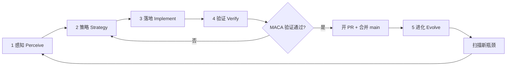

# AGENTS.md

## YiRage 无限优化闭环（Infinite Optimization Loop）— **MetaX MACA GPU**

> **当前主后端**：`YIRAGE_BACKEND=maca`（MetaX C500 等 MACA GPU）。CPU 闭环历史见文末 [历史归档：CPU 无限优化闭环](#历史归档cpu-无限优化闭环)。

> **优化北极星（2026-07-08）**：MACA 算子支持、搜索空间、融合模式与执行路径须**逐项对标 CUDA 后端**（`YIRAGE_BACKEND=cuda` / transpiler+nvcc 正式路径），而非仅与 mcPytorch 孤立算子对齐。每项能力在 MetaX **真实 GPU** 上须有对应 smoke / pytest / bench 证据；Cloud CPU VM 或 torch 回退**不能**作为该能力的合并依据。详见 [CUDA 对标：优化目标与能力矩阵](#cuda-对标优化目标与能力矩阵)。

本仓库的持续改进**没有终止条件**。每一轮闭环的目标不是「做完就停」，而是：**感知现状 → 选定瓶颈 → 最小落地 → 用证据验证 → 把结论写回文档与契约 → 进入下一轮**。Cloud Agent 与人类协作者都应把 `AGENTS.md` 当作活文档，每轮验证通过后更新本节或下方 Gotchas。

**不要**为此闭环新增独立编排脚本（例如一键跑完全部阶段的 orchestrator），除非用户明确要求。闭环由 Agent 按层执行现有脚本与测试，并把经验沉淀进文档。

### 核心原则

| 原则 | 含义 |
|------|------|
| **先测后优** | 没有基准与正确性证据，不改 kernel / `get_maca_search_config()` / 搜索空间 |
| **同后端评估** | Search、profile、cache、execute 必须在同一 `backend=maca` 上完成（见 [docs/HARDWARE_OPTIMIZATION.md](docs/HARDWARE_OPTIMIZATION.md)） |
| **瓶颈驱动** | 优先修「mxcc 编译失败 / fingerprint 不一致 / 搜索探索了但 MACA kernel 不支持」类问题，再追求微基准 |
| **最小改动** | 每轮只解决本轮策略选定的 1～2 个瓶颈，避免无关重构 |
| **验证通过再沉淀** | bench 与 superoptimize smoke 通过后再更新 `AGENTS.md`、`docs/maca_*.md`、kernel 契约 |
| **框架对齐** | **CUDA 路径为能力参照系**：原语/图级/搜索/执行分层与 CUDA 后端一致；差异项（64-warp、smem 64KB、mxcc）单独标注；YiRage 价值在**图级融合**（µGraph search、TB customized），而非孤立 beat cuBLAS/mcPytorch |
| **CUDA 对标** | 每轮须对照 [CUDA 能力矩阵](#cuda-对标优化目标与能力矩阵) 选 gap；新增 MACA 能力时同步补齐真卡验证项；禁止「CUDA 有、MACA 无」且无 backlog 记录 |
| **执行前价值闸门** | 每轮进入「策略 → 落地」前，必须对照框架目标判断本轮改动是否值得做（见下节）；性能向改动需有 `benchmark/maca_vs_pytorch.py` 或 e2e bench 证据 |
| **行为性价比** | **每一步**行动前须过 [Agent 行为性价比审查](#agent-行为性价比审查每步必做)；禁止用回退/workaround 冒充正式实现 |

### Agent 行为性价比审查（每步必做）

Cloud Agent 在**每一步**行动前（读文件、改代码、跑命令、开 PR、引入 env 开关）须自问并写入 PR / 本轮笔记（可 1 句话）：

| 维度 | 问题 |
|------|------|
| **目标对齐** | 本步是否直接闭合当前策略卡片的主瓶颈？ |
| **正式 vs 回退** | 是否在绕开根因（stub 占位、torch 回退、skip 编译/评测假装通过）？**禁止**用回退代替 mxcc / transpiler / fingerprint 正式路径，除非用户**显式**要求临时烟雾 |
| **证据** | 本步产出是否有可复现证据（MetaX VM 日志、pytest、bench JSON）？ |
| **机会成本** | 同时间是否更应修编译失败、ABI 缺口、契约不一致？ |

**结论为「性价比不足」或「属于回退」时**：停止落地，回到策略层重选 backlog；不得为凑 Loop 合并 PR。

### 执行前闸门：框架目标与优化价值（每轮必做）

**在勾选检查清单第 2 步「策略」、写代码之前**，Agent 必须先完成本闸门；若结论为「价值不足」，改选 backlog 中更高优先级项，**不得**为凑 Loop 而做低价值微优化。

#### YiRage MACA 框架目标（对齐 CUDA / mcPytorch 分工）

| 层级 | CUDA 参考 | mcPytorch / MACA 参考 | YiRage MACA 对应 |
|------|-----------|------------------------|------------------|
| **原语** | cuBLAS/cuDNN GEMM | mcPytorch `torch.matmul` on `device=cuda` | P0：`.maca` matmul / elementwise kernel；**不**重造孤立 GEMM 微内核 |
| **图级** | TorchInductor / CUDA Graph 融合 | 算子融合减少 HBM 流量 | µGraph search：`superoptimize(backend="maca")`、TB customized、forloop epilogue |
| **执行** | CUDA stream + warp=32 | mcruntime + **warp=64** | `get_maca_search_config()`、`block_dims` 须为 64 倍数、`mxcc` 编译 |
| **验证** | 数值 vs torch | fingerprint kernel vs reference | `ProbabilisticVerifier`（MACA GPU fingerprint）+ runtime vs mcPytorch |

**借鉴要点（非照搬实现）**：

- **原语下沉、融合上浮**：与 CUDA 路径一样，孤立 matmul 以 mcPytorch 为基线；YiRage 搜索价值在**融合图**（rms_norm+matmul、MLP、attention tile）。
- **同机同后端评判**：只在 MetaX C500（或目标 MACA 卡）上与 mcPytorch 比较；**禁止**用 CPU MKL 或 NVIDIA CUDA 作为主指标。
- **64-thread warp**：`MACA_WARP_SIZE=64`（NVIDIA 为 32）；block size、shuffle、TB tiling 必须对齐，见 `python/yirage/backends/maca/config.py`。
- **正确性优先于速度**：先 fingerprint / superoptimize smoke 通过，再谈 fusion speedup。

#### 四轮自问（策略卡片必填）

在 PR 描述或本轮笔记中**用 1～2 句话**回答：

1. **层级**：本轮改的是 `.maca` 原语层还是图级/搜索层？若原语层，是否因 mxcc 编译失败/静默错误（必须修）？若仅为 beat mcPytorch 孤立 GEMM → **拒绝或降级**。
2. **CUDA 对标**：闭合 [能力矩阵](#cuda-对标优化目标与能力矩阵) 哪一行？CUDA 参照行为/文件路径是什么？MACA 差异是否属于「刻意不对齐」表？
3. **路径**：block/grid 是否满足 64-thread warp 约束？`get_maca_search_config()` 与 `GeneratorConfig` MACA 分支是否与 CUDA 搜索宏一致（除 warp/smem 常量）？
4. **收益**：预期收益类型 — 能力 parity / 语义 parity / 融合加速 / persistent kernel？性能向须写明对照基线（`maca_vs_pytorch` JSON）。
5. **真卡验证**：本轮触及能力域的「真卡验证入口」是否已在 MetaX VM 跑通？若无 VM，是否仅文档/CPU 契约（不得合并 parity 项）？
6. **机会成本**：同一轮是否还有更高优先级 backlog（CUDA 有而 MACA 编译失败、superoptimize abort、无真卡测试）？

**性能向轮次**在感知阶段额外跑：

```bash
export MACA_PATH=/opt/maca
export LD_LIBRARY_PATH=${MACA_PATH}/lib:${MACA_PATH}/mxgpu_llvm/lib:$LD_LIBRARY_PATH
export YIRAGE_BACKEND=maca
PYTHONPATH=. /opt/conda/bin/python3 benchmark/maca_vs_pytorch.py
PYTHONPATH=. /opt/conda/bin/python3 benchmark/maca_native_benchmark.py
```

若融合已不慢于 mcPytorch、且本轮仅微调无关热点，**暂停该性能项**，转向编译/契约 gap。

### CUDA 对标：优化目标与能力矩阵

MACA 无限闭环的**首要优化目标**是：在 MetaX 真卡上，使 YiRage MACA 后端在**能力边界**与**用户可感知行为**上对齐 CUDA 后端；性能基线为**同机 mcPytorch**（MACA）/ **同机 PyTorch CUDA**（NVIDIA 对照机），但**功能完备性**以 CUDA 代码路径为金标准。

#### 三层对齐（优化目标）

| 对齐层 | 含义 | 通过标准 |
|--------|------|----------|
| **能力 parity** | CUDA 已支持的算子、TB epilogue、搜索 explore、transpiler 产物在 MACA 上可构图、可搜索、可 mxcc 编译、可执行 | 矩阵 tier ≠ `unsupported`；真卡 smoke exit 0 |
| **语义 parity** | 同 seed 图在 MACA/CUDA 上数值一致（允许 fp16/bf16 tol） | fingerprint 或 runtime vs reference 通过 |
| **融合 parity** | CUDA 上已验证的融合模式（rms+matmul、MLP、attention tile、forloop accum 等）MACA 可 superoptimize 且不慢于 mcPytorch 基线 | `maca_vs_pytorch` / e2e bench JSON `speedup ≥ 1.0`（同后端） |

**刻意不对齐（须文档化，不得当 bug 凑 parity）**：

| CUDA / NVIDIA 假设 | MACA / MetaX 现实 | 闭环处理 |
|--------------------|-------------------|----------|
| warp = 32 | **warp = 64** | block 为 64 倍数；shuffle 6 步；见 `MACA_WARP_SIZE` |
| smem 96KB（Volta 档） | **smem 64KB/block** | `maca::MAX_SMEM_SIZE`、搜索 smem 上限 |
| nvcc + PTX `mma.sync` | **mxcc + xcore1000** | 软件 MMA shadow（`YIRAGE_MACA_SOFTWARE_MMA`）等 |
| `torch.cuda` → cudart | mcPytorch → mcruntime | API 兼容，**评判仍用 YiRage backend=maca** |

#### 能力矩阵（对标 CUDA 路径）

维护原则：**CUDA 列**以 `YIRAGE_BACKEND=cuda` 正式 transpiler 路径为准；**MACA 列**以 mxcc 编译 + 真卡执行为准；**验证**列须在 MetaX VM 有对应命令（不可仅 CPU pytest）。

| 能力域 | CUDA 参照（金标准） | MACA 落点 | 真卡验证入口 |
|--------|---------------------|-----------|--------------|
| **构建 / transpiler** | `generate_cuda_program` + nvcc | `generate_cuda_program` + **mxcc**（`get_mxcc_cc_cmd`） | `demo/maca_superopt_test.py`；`tests/python/test_maca_config.py` |
| **搜索配置** | `get_cuda_search_config()` / CUDA `GeneratorConfig` | `get_maca_search_config()`、`maca_strategy.cc` | `demo/demo_maca_optimization.py`；`pytest -k maca` |
| **KN 原语 kernel** | `src/kernel/cuda/*.cu` | `src/kernel/maca/*.maca`（matmul、elementwise、reduction…） | `benchmark/maca_native_benchmark.py` |
| **TB customized / 融合** | customized CUDA kernel | `customized_kernel.maca` + TB interpreter 回退 | `maca_superopt_test.py`；`maca_vs_pytorch.py` |
| **RMSNorm + matmul 融合** | CUDA fused µGraph | 同构图 `backend=maca` superoptimize | `maca_vs_pytorch.py`（rms  workload） |
| **Attention / softmax tile** | CUDA attention kernel 路径 | `attention_kernel.maca`、`softmax_kernel.maca` | `demo/maca/attention_smoke.py --inspect-only`（Cloud）；MetaX `--quick` superoptimize |
| **Persistent kernel** | CUDA PK backend | `maca_pk_backend.cc` + `demo/maca/qwen3_persistent_kernel_demo.py` | `--compile-plan`/`--compile-inspect`（Cloud）；MetaX `--compile-only` minimal embed + `--quick` |
| **Verifier** | CUDA fingerprint | MACA GPU fingerprint | `superoptimize(backend="maca")` 无 abort |
| **融合 vs 库基线** | fused vs `torch` CUDA | fused vs **mcPytorch** on MACA | `benchmark/maca_vs_pytorch.py --quick` |
| **Ray 分布式搜索** | `superoptimize(use_ray=True)` + `DistributedSearchCoordinator` | 同 API；MACA demo 暂 `use_ray=False` | `tests/integration/test_ray_maca_e2e.py`（MetaX VM）；CPU 镜像 `test_ray_cpu_e2e.py` |
| **RL 分层搜索** | `ConstrainedGraphEnv` + AccelForge prescreen + walkthrough | RL 编码含 `maca`；CPU walkthrough + **MACA walkthrough** | `tests/python/test_maca_rl_ray_capability.py`；**MetaX** `scripts/maca_capability_walkthrough.py` |
| **Qwen 全链路推理** | `demo/qwen2.5/demo.py`（HF load → superoptimize → decode） | `demo/maca/qwen_inference_demo.py`（合成权重 smoke）；`demo/maca/qwen_from_pretrained_demo.py`（HF 全权重） | **MetaX VM** `qwen_inference_demo.py --quick`；`qwen_from_pretrained_demo.py --max-layers 1 --quick` |

矩阵扩展时：在「当前轮次笔记」或 PR 中增一行 **CUDA 参照 PR/commit + MACA 验证命令**；禁止只改文档不补真卡测试。

#### RL / Ray 搜索优化：CUDA 对标（能力匹配）

搜索优化工具链须与 CUDA 路径 **同 API、同阶段、同 backend 语义**；MACA 上 Ray/RL 不得仅 CPU 单测绿而宣称对齐。

| 能力 | CUDA 参照 | MACA 现状 | 契约 / 真卡验证 |
|------|-----------|-----------|-----------------|
| **`superoptimize(..., use_ray=True)`** | 多 `griddims` 分区 + C++ search | 代码传 `backend=maca`；**烟雾默认 `use_ray=False`** | `tests/python/test_maca_rl_ray_capability.py`；MetaX Ray maca e2e（backlog） |
| **`DistributedSearchCoordinator.parallel_search`** | `backend=cuda` | 接受 `backend=maca` | `tests/integration/test_ray_maca_e2e.py` |
| **`RayDistributedEngine`** | GPU bundle via `torch.cuda` | 无 MACA 专用 placement；mcPytorch 或 CPU fallback | MetaX `gpus_per_worker` smoke（backlog） |
| **`scripts/bench_ray_search.py`** | CPU 公平 seq vs Ray | `--backend maca` + `--quick` | `scripts/bench_ray_search.py --backend maca --quick` |
| **`business_capability_walkthrough`** | YiRage×Ray×AccelForge×RL | CPU 版 `backend=cpu`；**MACA 版** `scripts/maca_capability_walkthrough.py` | MetaX VM `--quick` |
| **`ConstrainedGraphEnv` / FINISH** | `accelforge_metrics` + verify | `config_space` 含 maca warp=64；**无 maca env e2e** | `test_accelforge` + maca FINISH（backlog） |
| **`VerifierPool` / GPU verify** | `backend=cuda` | `VerifierPool(backend=maca)` + env default | `tests/python/test_rl/test_maca_verifier_pool.py`；MetaX Ray smoke |

**RL/Ray 对齐策略**：

1. **感知**：`PYTHONPATH=. pytest tests/python/test_maca_rl_ray_capability.py -v` + 对照上表 tier=`gap`/`partial` 项。
2. **策略**：每轮闭合 1 项（优先 Ray maca e2e 或 walkthrough maca，高于微基准）。
3. **落地**：复用 CUDA Ray 分区逻辑；MACA 差异仅 warp=64 / smem / mxcc；**禁止**永久 `use_ray=False` 而不记 backlog。
4. **验证**：契约 pytest 绿 + **MetaX VM** 上对应 Ray/RL smoke exit 0。

权威清单（与文档同步）：`tests/python/test_maca_rl_ray_capability.py` → `maca_rl_ray_capability_matrix()`。

#### Qwen 全链路推理：CUDA 对标

| | CUDA | MACA |
|---|------|------|
| **参照 demo** | `demo/qwen2.5/demo.py`（`Qwen/Qwen3-8B`、chat template、CUDA Graph decode） | `demo/maca/qwen_inference_demo.py`（合成）；`demo/maca/qwen_from_pretrained_demo.py`（HF 全权重） |
| **融合内核** | `modeling_qwen2.superoptimize_kernels()` → 默认 cuda transpiler | `modeling_qwen2_maca.superoptimize_kernels()` → `backend=maca` via `qwen_kernel_utils` |
| **Decode 路径** | `q_len==1` → YiRage MLP + attn kernels；CUDA Graph decode | 同语义；`qwen_decode_loop.py` 默认 CUDA Graph（`--no-cuda-graph` 回退 eager） |
| **e2e bench** | CI `tests/ci-tests/qwen2.5/demo.py` | `benchmark/end-to-end/maca/qwen_maca.py` |
| **Qwen3 PK** | `demo/qwen3/demo.py --use-yirage` | `demo/maca/qwen3_persistent_kernel_demo.py`（PK runtime smoke；`PersistentKernel.compile()` mxcc when `YIRAGE_BACKEND=maca`） |
| **真卡验证** | NVIDIA GPU | **MetaX VM** `--quick` smoke；`tests/integration/test_maca_qwen_inference_demo.py` |

**尚未对标（backlog）**：`demo/qwen3/demo.py --use-yirage` 全量多 layer task-graph e2e on MetaX（R17 已闭合 minimal embed `ypk.compile()`；完整 transformer 层栈待 R18）。


#### 对齐策略（每轮策略层）

1. **感知**：列出「CUDA supported ∧ MACA unsupported / 编译失败 / 无真卡测试」的 gap 清单（优先级高于微基准）。
2. **策略**：每轮只闭合 **1 个能力域** 的 parity（例如 R3=mxcc MMA；R4=smem 64KB 全链路）。
3. **落地**：优先复用 CUDA 侧图结构与搜索宏，仅改 MACA 执行层（`.maca`、mxcc flags、warp/smem 常量）；**禁止**用 `YIRAGE_MACA_TORCH_MATMUL` 等回退冒充 parity。
4. **验证**：该能力域对应的「真卡验证入口」**全部** exit 0 后方可合并。
5. **进化**：更新本矩阵行状态 + `docs/maca_complete_guide.md` / `HARDWARE_OPTIMIZATION.md` 的 MACA 评估表。

#### 效果检查手段（证据链）

| 检查类型 | 手段 | 适用场景 | 运行环境 |
|----------|------|----------|----------|
| **配置契约** | `pytest tests/python/test_maca_config.py`、`test_backends.py -k maca` | mxcc 命令、smem 上限、search quick | 可无卡；**合并前仍须真卡 smoke** |
| **编译 + 搜索 smoke** | `demo/maca_superopt_test.py` | transpiler→mxcc、µGraph 编译/profile | **MetaX 真卡 VM** |
| **设备 + search 感知** | `demo/demo_maca_optimization.py` | SDK、GPU 名、grid/block 约束 | **MetaX 真卡 VM** |
| **融合性能** | `benchmark/maca_vs_pytorch.py`（`--quick` 日常 / 全量 nightly） | 融合 vs mcPytorch；JSON speedup | **MetaX 真卡 VM** |
| **原语 kernel** | `benchmark/maca_native_benchmark.py` | `.maca` 孤立 kernel | **MetaX 真卡 VM** |
| **C500 专项 shape** | `benchmark/maca_c500_benchmark.py` | 104 SM / 64KB smem 边界 | **MetaX C500** |
| **LLM / LoRA e2e** | `benchmark/end-to-end/maca/*.py` | 图级 parity 回归 | **MetaX 真卡 VM** |
| **Qwen 全链路推理** | `demo/maca/qwen_inference_demo.py --quick` | 对齐 `demo/qwen2.5/demo.py` decode 路径 | **MetaX 真卡 VM** |
| **RL/Ray 契约** | `pytest tests/python/test_maca_rl_ray_capability.py` | API/矩阵与 CUDA 对齐检查 | 可无卡；Ray/RL 真卡 smoke 另需 MetaX |
| **CUDA 对照（可选）** | 同 seed 图 `backend=cuda` on NVIDIA 机 | 语义/reference 对照 | NVIDIA GPU（**非**合并硬门槛） |

**合并闸门（MACA + CUDA 对标）**：

- 触及 `.maca` / transpiler / search / fusion 的 PR：**MetaX VM 上表「真卡验证入口」相关项全绿**。
- 仅文档 / 纯 CPU pytest：**不得**宣称已完成 CUDA parity；须在笔记中标「待真卡 R{n}」。

### 五层结构



---

#### 第 1 层：感知（Perceive）— 我们在哪？

**目标**：弄清 MACA 后端的能力边界、**相对 CUDA 路径的 parity gap**、mxcc 编译覆盖、融合相对 mcPytorch 基线的位置，以及搜索空间与 kernel 执行的不一致。

**典型动作**：

- 读文档：[docs/maca_quick_start.md](docs/maca_quick_start.md)、[docs/maca_complete_guide.md](docs/maca_complete_guide.md)、[docs/HARDWARE_OPTIMIZATION.md](docs/HARDWARE_OPTIMIZATION.md)
- 确认硬件与 SDK：
  ```bash
  export MACA_PATH=/opt/maca
  export LD_LIBRARY_PATH=${MACA_PATH}/lib:${MACA_PATH}/mxgpu_llvm/lib:$LD_LIBRARY_PATH
  mx-smi
  /opt/conda/bin/python3 -c "import torch; print(torch.__version__, torch.cuda.get_device_name(0))"
  which mxcc
  ```
- 跑 MACA 烟雾与 bench：
  ```bash
  export YIRAGE_BACKEND=maca
  export PYTHONPATH=.
  /opt/conda/bin/python3 demo/demo_maca_optimization.py
  /opt/conda/bin/python3 benchmark/maca_vs_pytorch.py
  /opt/conda/bin/python3 benchmark/maca_c500_benchmark.py
  ```
- 对照搜索配置：`python/yirage/backends/maca/config.py` → `get_maca_search_config()`、`MACA_WARP_SIZE`
- **CUDA 对标 gap 扫描**（与 CUDA 金标准 diff，记入 backlog）：
  - CUDA kernel 清单：`src/kernel/cuda/` vs `src/kernel/maca/*.maca`
  - CUDA search：`get_cuda_search_config()` / CUDA `GeneratorConfig` vs MACA 分支
  - 融合 smoke：CUDA 已有 e2e/bench 而 MACA 无对应脚本的项
  - transpiler：nvcc 可编译而 mxcc 失败的 µGraph 模式

**产出**：一份简短「现状快照」— **CUDA↔MACA parity gap 列表**、mxcc 编译失败列表、superoptimize 无 valid µGraph、融合 vs mcPytorch 倍率、block dim 非 64 倍数警告。

---

#### 第 2 层：策略（Strategy）— 下一步改什么？

**目标**：根据感知结果排序，选定**单一**主攻方向（例如：补齐 `reduction_kernel.maca`、对齐 `get_maca_search_config()` grid、扩展 RMSNorm+matmul 融合 smoke）。

**前置条件**：已完成上文 [执行前闸门](#执行前闸门框架目标与优化价值每轮必做) 的四轮自问。

**决策参考**：

| 信号 | 优先策略 |
|------|----------|
| **CUDA 有、MACA 无**（算子/融合/搜索 explore） | 按 [能力矩阵](#cuda-对标优化目标与能力矩阵) 补 `.maca` / config / smoke；**须真卡验证** |
| `mxcc` 编译 / link 失败 | 修 `.maca` kernel、`cmake/backends/maca.cmake`、`MACA_PATH`、mxcc compat shims |
| superoptimize abort / 0 valid µGraph | 对齐 CUDA 搜索 tractability；检查 `get_maca_search_config()`、verifier、abstract_expr |
| 正确但慢于 mcPytorch | 图级融合、TB customized、调 grid/block（保持 64 倍数）；对照 CUDA 同模式 fused 结构 |
| fingerprint 不一致 | 修 `customized_kernel.maca` / `device_memory_manager.maca`；对照 CUDA fingerprint 路径 |
| 仅有 CPU pytest 绿、无真卡 smoke | **阻塞 parity 合并**；补 MetaX VM 验证项 |
| 跨后端对比诱人 | **禁止**用 NVIDIA CUDA 速度作主指标；功能 parity 可对照 CUDA **语义**，性能只在 MACA 上对 mcPytorch |

**文档锚点**：`docs/maca_complete_guide.md` §8 MACA 技术特性；`include/kernel/maca/` kernel 清单。

**产出**：本轮「策略卡片」— 1 句话目标、触及文件、预期验证命令。

---

#### 第 3 层：落地（Implement）— 最小正确实现

**目标**：按策略做**最小**代码/配置改动，遵循仓库既有风格。

**常见落地点**（MACA 闭环）：

- 执行：`src/kernel/maca/*.maca`、`src/backend/maca_backend.cc`、`include/kernel/maca/`
- 搜索：`python/yirage/backends/maca/config.py`、`src/search/backend_strategies/maca_strategy.cc`
- 构图：`python/yirage/_cython/`、`KNGraph` / TB API（`backend="maca"`）
- Persistent kernel：`src/persistent_kernel/maca_pk_backend.cc`、`include/persistent_kernel/backends/maca_pk_*.h`

**禁止**：新建独立 orchestrator；用现有 demo/benchmark 脚本串联。

**产出**：可 `mxcc` 编译、可 `superoptimize(backend="maca")` 的增量 patch；Cython 变更后需：

```bash
export MACA_PATH=/opt/maca
export LD_LIBRARY_PATH=${MACA_PATH}/lib:${MACA_PATH}/mxgpu_llvm/lib:$LD_LIBRARY_PATH
YIRAGE_BACKEND=maca /opt/conda/bin/python3 -m pip install -e . --no-build-isolation
```

---

#### 第 4 层：验证（Verify）— 证据链

**目标**：正确性先于速度；**能力/语义 parity 先于融合 speedup**；速度在同 MACA 卡上与 mcPytorch 比较。

| 层 | 机制 | 入口 |
|----|------|------|
| Search | `ProbabilisticVerifier`（MACA fingerprint）或 `YIRAGE_FORMAL_VERIFY=1` | `superoptimize(backend="maca")` |
| Runtime | optimized graph vs mcPytorch | `benchmark/maca_vs_pytorch.py`、`demo/maca_superopt_test.py` |

**MACA 推荐最小验证集**（在 MetaX GPU VM 上）：

```bash
export MACA_PATH=/opt/maca
export LD_LIBRARY_PATH=${MACA_PATH}/lib:${MACA_PATH}/mxgpu_llvm/lib:${LD_LIBRARY_PATH:-}
export LD_LIBRARY_PATH=build/abstract_subexpr/release:build/formal_verifier/release:${LD_LIBRARY_PATH}
export YIRAGE_BACKEND=maca
export PYTHONPATH=.

# 配置与后端契约（可无卡跑部分单测）
pytest tests/python/test_backends.py -k maca -v
pytest tests/python/test_comet_search.py -k maca -v

# MACA GPU 烟雾（须在 MetaX VM）
/opt/conda/bin/python3 demo/demo_maca_optimization.py
/opt/conda/bin/python3 demo/maca_superopt_test.py
/opt/conda/bin/python3 demo/maca/qwen_inference_demo.py --quick
/opt/conda/bin/python3 benchmark/maca_vs_pytorch.py

# RL/Ray 契约（可无卡）
pytest tests/python/test_maca_rl_ray_capability.py -v

# e2e（可选，较慢）
/opt/conda/bin/python3 benchmark/end-to-end/maca/llama_maca.py
```

**合并闸门（Merge gate）**：MACA 相关改动须在 **MetaX GPU VM** 上跑通上述烟雾 + 相关 pytest + **本轮触及能力域在 [能力矩阵](#cuda-对标优化目标与能力矩阵) 中的真卡验证入口**；不得以 Cloud CPU VM 绿作为 MACA 或 CUDA parity 合并依据。

---

### MACA Demo 与 Benchmark 烟雾层

Demo/benchmark 是 MACA 闭环的**用户可复现烟雾层**，证明 Agent 能在真卡上构图、搜索、执行；同时是 [CUDA 能力矩阵](#cuda-对标优化目标与能力矩阵) 的**真卡验证入口**。

| 闭环层 | 作用 | 典型命令 |
|--------|------|----------|
| **感知** | 确认 SDK、mcPytorch、mxcc、GPU 可见 | `mx-smi`；`demo/demo_maca_optimization.py`（device info） |
| **验证** | 改 kernel/search 后融合仍可跑 | `demo/maca_superopt_test.py`；`benchmark/maca_vs_pytorch.py` |
| **进化** | 新融合模式 e2e | `benchmark/end-to-end/maca/*.py` |

**推荐清单**：

| id | 脚本 | 层级 | 说明 |
|----|------|------|------|
| `demo_maca_optimization` | `demo/demo_maca_optimization.py` | 感知 | MACA 设备检测 + search config |
| `maca_superopt_test` | `demo/maca_superopt_test.py` | 验证 | superoptimize smoke |
| `maca_vs_pytorch` | `benchmark/maca_vs_pytorch.py` | 验证 | 融合 vs mcPytorch 基线 |
| `qwen_inference_maca` | `demo/maca/qwen_inference_demo.py` | 验证 | **Qwen 全链路**（对齐 `demo/qwen2.5/demo.py`） |
| `qwen_maca_bench` | `benchmark/end-to-end/maca/qwen_maca.py` | 验证 | Qwen e2e 入口 |
| `maca_native_benchmark` | `benchmark/maca_native_benchmark.py` | 验证 | 原生 kernel bench |
| `maca_c500_benchmark` | `benchmark/maca_c500_benchmark.py` | 进化 | C500 专项 shape |
| `llama_maca` | `benchmark/end-to-end/maca/llama_maca.py` | 进化 | LLM 片段 e2e |
| `lora_maca` | `benchmark/end-to-end/maca/lora_maca.py` | 进化 | LoRA blocked GEMM |

#### 推荐命令（MetaX GPU VM）

```bash
export MACA_PATH=/opt/maca
export LD_LIBRARY_PATH=${MACA_PATH}/lib:${MACA_PATH}/mxgpu_llvm/lib:build/abstract_subexpr/release:build/formal_verifier/release:${LD_LIBRARY_PATH:-}
export YIRAGE_BACKEND=maca
export PYTHONPATH=.
PY=/opt/conda/bin/python3   # mcPytorch，勿用系统 /usr/bin/python3

$PY -m pip install z3-solver graphviz
YIRAGE_BACKEND=maca $PY -m pip install -e . --no-build-isolation

$PY demo/demo_maca_optimization.py
$PY demo/maca_superopt_test.py
$PY demo/maca/qwen_inference_demo.py --quick
$PY benchmark/maca_vs_pytorch.py
pytest tests/python/test_maca_rl_ray_capability.py -v
```

---

#### 第 5 层：进化（Evolve）— 写回知识，开启下一轮

**必须更新的位置**：

1. **`AGENTS.md`** — 「当前轮次笔记」、**[CUDA 能力矩阵](#cuda-对标优化目标与能力矩阵) 行状态** 或 **Gotchas**
2. **`docs/maca_quick_start.md` / `docs/maca_complete_guide.md`** — 环境/bench 基线、CUDA 差异表变更
3. **`docs/HARDWARE_OPTIMIZATION.md`** — MACA 评估标准、与 CUDA 分层对照变更
4. **集成测试 / benchmark** — 新融合或新 `.maca` 原语须补 **MetaX 真卡** smoke（可同步加 `test_maca_config` 契约）

---

### Cloud Agent 自主连续迭代协议（MACA）

用户未明确喊停时，Cloud Agent **默认连续跑多轮 Loop**。每一轮：**感知 → 策略 → 落地 → 验证 → 自动合并 → 进化 → 扫描 backlog → 回到感知**。

#### MetaX GPU 开发机（SSH）

Agent 须在 **MetaX C500 VM** 上验证 MACA 改动（Cloud 默认 Linux CPU VM **不能**替代）：

```bash
# 用户名格式为 root+<vm-id>，非裸 root
ssh -p 32222 'root+<vm-id>@<host>'

export MACA_PATH=/opt/maca
export LD_LIBRARY_PATH=${MACA_PATH}/lib:${MACA_PATH}/mxgpu_llvm/lib:$LD_LIBRARY_PATH
export YIRAGE_BACKEND=maca
cd /workspace   # 或 YiRage clone 路径
/opt/conda/bin/python3 -m pip install -e . --no-build-isolation
```

> **凭据**：SSH 主机/端口/密码由团队密钥管理，**不得**写入仓库。当前开发机：`140.207.205.81:32222`（MetaX C500，`mx-smi` / mcPytorch `2.8.0+metax*`）。

#### 验证通过后的自动合并

| 条件 | 要求 |
|------|------|
| 本地验证 | 第 4 层「MACA 推荐最小验证集」在 **MetaX VM** exit 0 |
| 分支规范 | `cursor/<descriptive-name>-ffec`，已 push，`base_branch=main` |
| PR 状态 | `mergeable`；若 draft，先 `gh pr ready` |
| 合并方式 | `gh pr merge <n> --merge --delete-branch` |
| 合并后 | `git checkout main && git pull origin main` |

**不以远端 CI 绿作为 MACA 硬门槛**（CI 多在 CPU 上跑）；以 **MetaX VM 烟雾** 为准。

#### 合并后感知扫描

```bash
export MACA_PATH=/opt/maca YIRAGE_BACKEND=maca PYTHONPATH=.
PY=/opt/conda/bin/python3

$PY demo/demo_maca_optimization.py
$PY demo/maca_superopt_test.py
$PY demo/maca/qwen_inference_demo.py --quick
$PY benchmark/maca_vs_pytorch.py --quick
pytest tests/python/test_maca_config.py tests/python/test_maca_rl_ray_capability.py -v
pytest tests/python/test_backends.py -k maca -v

# CUDA 对标：记录 src/kernel/cuda vs maca 文件名 diff、mxcc 失败模式、矩阵中「待补真卡测」项
```

**backlog 优先级**：**CUDA 有而 MACA 无/无真卡测** → mxcc 编译失败 → superoptimize abort → fingerprint 不一致 → 融合慢于 mcPytorch → 文档/配置漂移。

#### 连续迭代终止条件

- 用户明确停止
- MetaX VM 不可用且无法修复
- 本轮纯文档且用户未要求继续

---

### Cloud Agent 单轮检查清单（MACA）

```
[ ] 0. 闸门：策略卡片（含 CUDA 对标 + 真卡验证）+ [行为性价比审查](#agent-行为性价比审查每步必做)；性能向已跑 maca_vs_pytorch / maca_native_benchmark
[ ] 1. 感知：mx-smi、mcPytorch、CUDA↔MACA gap 清单、RL/Ray capability matrix、demo_maca_optimization、qwen_inference_demo、bench JSON
[ ] 2. 策略：只选 1 个能力域 parity；对齐 CUDA 参照 + 64-warp + get_maca_search_config；拒绝回退/workaround 冒充正式实现
[ ] 3. 落地：最小 patch；触及 transpiler/mxcc / .maca / maca config / search；每步过行为性价比
[ ] 4. 验证：MetaX VM 正式路径（transpiler+mxcc 编译+执行）+ 能力矩阵对应入口 + pytest -k maca；Cython 则 pip install -e
[ ] 5. 开 PR：push 分支 cursor/...-ffec，base=main；PR 描述含 CUDA 参照 + 真卡命令输出摘要
[ ] 6. 自动合并：MetaX VM 验证全绿 → gh pr merge
[ ] 7. 同步 main：git checkout main && git pull
[ ] 8. 进化：更新 AGENTS.md 能力矩阵行状态 + maca docs
[ ] 9. 扫描 backlog：CUDA gap、bench speedup、mxcc errors、search abort
[ ] 10. 下一轮：新分支继续 Loop R{n+1}
```

### 现有工具索引（MACA）

| 层 | 工具 / 路径 |
|----|-------------|
| 感知 | [CUDA 能力矩阵](#cuda-对标优化目标与能力矩阵)、`docs/maca_quick_start.md`, `docs/maca_complete_guide.md`, `src/kernel/cuda/` vs `src/kernel/maca/`, `mx-smi`, `python/yirage/backends/maca/config.py` |
| 策略 | CUDA `get_cuda_search_config()` 对照、`get_maca_search_config()`, `src/search/backend_strategies/maca_strategy.cc`, `MACA_WARP_SIZE=64` |
| 落地 | `src/kernel/maca/*.maca`, `src/backend/maca_backend.cc`, `cmake/backends/maca.cmake`, `include/transpiler/runtime/maca_compat/` |
| 验证 | [效果检查手段](#效果检查手段证据链) 表内脚本；`tests/python/test_maca_config.py`；`tests/python/test_maca_rl_ray_capability.py`；`tests/integration/test_maca_qwen_inference_demo.py`；`tests/integration/test_ray_maca_e2e.py` |
| 进化 | **`AGENTS.md`（能力矩阵 + 轮次笔记）**, `docs/maca_*.md`, `docs/HARDWARE_OPTIMIZATION.md` |

### 当前轮次笔记（MACA，由 Agent 持续追加）

> **维护说明**：每合并一轮 MACA 优化 PR，在此追加 3～5 行。CPU 历史见 [归档](#历史归档cpu-无限优化闭环)。

- **MACA 后端基线（2026-07-07）**：主优化目标从 CPU 切换为 MetaX MACA；开发机 MetaX C500（`mx-smi` 2.2.12，mcPytorch `2.8.0+metax3.5.3.9`）；构建 `YIRAGE_BACKEND=maca pip install -e .`；文档锚点 `docs/maca_quick_start.md`。
- **Loop R0（2026-07-07，目标切换）**：闸门：文档/协议层。`AGENTS.md` 主闭环改为 MACA；Cloud Agent 须在 MetaX SSH VM 验证；CPU Loop R1–R137 迁入归档。验证：MetaX VM `mx-smi` + mcPytorch OK；下一轮：**R1 感知** — 跑 `demo_maca_optimization` + `maca_vs_pytorch`，建立 fusion vs mcPytorch 基线 JSON。
- **Loop R1（2026-07-07，demo/kernel 性能路径，PR #152）**：闸门：执行层 + 感知/工具层。根因：`yirage.maca_config` 缺失、`maca_call` 走 ascend 解释器、`compile()` 仅 nvcc、demo/bench 用 `backend=cpu` 与占位计时；**正式路径阻塞**：`USE_MACA` 链 `transpiler_stub` 致 `generate_cuda_program` segfault。修复：`maca_config.py` shim、`get_maca_search_config_quick`/`resolve_maca_search_config`、`maca_call→cuda_call`（mcPytorch）、`mxcc` JIT、`CMakeLists` MACA 启用 CUDA transpiler（`YIRAGE_BACKEND_CUDA_ENABLED`）、**撤销** `YIRAGE_MACA_SKIP_PROFILE`/`YIRAGE_MACA_TORCH_MATMUL` 回退、`demo/_maca_utils.py` + demo/bench 真实 `superoptimize(backend=maca)`；mxcc `maca_compat/` shims + resilient MACA profiling。验证：`pytest tests/python/test_maca_config.py`；MetaX VM：`demo_maca_optimization` + `maca_superopt_test` exit 0（search ~31–49s，部分 µGraph smem/mma 跳过）。
- **Loop R2（2026-07-08，smem 64KB 对齐，PR #152）**：闸门：执行/契约层（C500 65536 B/block vs Volta 98304 误判）。`maca::MAX_SMEM_SIZE`→64KB；`get_shared_memory_capacity()` MACA/mxcc 返回 `MACA_SHARED_MEM_PER_BLOCK`；`test_maca_config` smem 闸门。MetaX VM：`get_shared_memory_capacity(70)=65536`；`demo_maca_optimization`/`maca_superopt_test`/`test_maca_config` PASS；C++ `plan_stensor_memory` 仍报 98304 直至 VM 重编 `yirage.core`。下一轮：**R3** — mxcc 软件 MMA（`mma.sync` invalid on xcore1000）、VM 重编闭合 smem 警告、`maca_vs_pytorch`/`maca_native_benchmark` 全量 bench。
- **Loop R3（2026-07-08，mxcc 软件 MMA + bench quick，PR #152）**：闸门：执行/原语层（闭合 R2 mxcc `mma.sync` invalid on xcore1000）。`maca_compat/cute/arch/mma_sm70.hpp` warp-shuffle 软件 m8n8k4；`get_mxcc_cc_cmd()` 改 `YIRAGE_MACA_SOFTWARE_MMA=1`、移除 `CUTE_ARCH_MMA_SM70_ENABLED`/`LDSM_SM75`；`maca_vs_pytorch.py --quick`。MetaX VM：`maca_superopt_test` µGraph **14–15 编译+profile 成功**（原 mma 失败）；`maca_vs_pytorch --quick` **~154s PASS**；`demo_maca_optimization`/`test_maca_config` PASS。C++ `MAX_SMEM_SIZE(98304)` 警告仍在（VM 未重编 `yirage.core`）。下一轮：**R4** — VM 重编闭合 smem 警告、搜索 smem 超限 µGraph 收窄、`maca_native_benchmark --quick`。
- **Loop R4（2026-07-08，CUDA 对标协议文档，PR #152）**：闸门：文档/契约层（用户要求 MACA **对标 CUDA** 优化目标写入闭环）。`AGENTS.md` 增 [CUDA 对标：优化目标与能力矩阵](#cuda-对标优化目标与能力矩阵)（三层 parity、能力表、对齐策略、真卡效果检查、合并闸门）；核心原则/感知/策略/验证/检查清单/backlog 改为 **CUDA 路径为金标准 + MetaX 真卡必验**。下一轮：**R5** — VM 重编 `yirage.core` 闭合 smem；按能力矩阵补 attention/PK 真卡 smoke backlog。
- **Loop R5（2026-07-08，RL/Ray parity + Qwen 全链路 demo，PR #152）**：闸门：图级/正确性 + 工具契约层。`AGENTS.md` 增 RL/Ray CUDA 对标表 + Qwen 推理对标表；`demo/maca/qwen_inference_demo.py`（对齐 `demo/qwen2.5/demo.py`：maca superoptimize → prefill+decode）；`benchmark/end-to-end/maca/qwen_maca.py`；`tests/python/test_maca_rl_ray_capability.py`；`tests/integration/test_maca_qwen_inference_demo.py`。验证：pytest RL/Ray 契约（可无卡）；MetaX VM `qwen_inference_demo --quick`。下一轮：**R6** — `test_ray_maca_e2e`、`maca_capability_walkthrough`、HF Qwen `from_pretrained` MACA 路径。
- **Loop R6（2026-07-08，Ray MACA e2e + walkthrough，PR #152）**：闸门：图级/工具契约层（闭合 R5 Ray/walkthrough backlog）。`tests/integration/test_ray_maca_e2e.py`（镜像 CPU Ray e2e，`backend=maca`，block=256 warp 对齐）；`scripts/maca_capability_walkthrough.py`（YiRage×Ray×AccelForge×RL on MACA）；`test_maca_rl_ray_capability.py` 契约更新。验证：pytest 契约层（可无卡）；MetaX VM `test_ray_maca_e2e` + `maca_capability_walkthrough --quick`。下一轮：**R7** — VM 重编 `yirage.core` 闭合 smem 98304；`VerifierPool(backend=maca)`；HF Qwen `from_pretrained`。
- **Loop R7（2026-07-08，VerifierPool backend=maca，PR #152）**：闸门：RL/工具契约层（闭合 R6 `VerifierPool` gap）。`VerifierPool` 增 `backend` 参数（默认 `YIRAGE_BACKEND`）；Ray/local verifier 传递 `backend=maca`；`tests/python/test_rl/test_maca_verifier_pool.py`。验证：pytest 契约（可无卡）；MetaX VM Ray verifier smoke。下一轮：**R8** — VM 重编 `yirage.core` 闭合 smem 98304；`bench_ray_search.py backend=maca`；HF Qwen `from_pretrained`。
- **Loop R8（2026-07-08，bench_ray_search backend=maca，PR #152）**：闸门：感知/工具层（闭合 R7 `bench_ray_search` gap）。`scripts/bench_ray_search.py` 增 `--backend maca|cpu`、`--quick`、`--json`；MACA griddim 套件 + 64-warp blockdims；`tests/python/test_bench_ray_search_maca.py`。验证：pytest 契约（可无卡）；MetaX VM `bench_ray_search.py --backend maca --quick`。下一轮：**R9** — VM 重编 `yirage.core` 闭合 smem 98304；HF Qwen `from_pretrained`；`demo/_maca_utils` Ray opt-in。
- **Loop R9（2026-07-08，MACA Ray opt-in + smem 源码契约，PR #152）**：闸门：图级/工具契约层（闭合 R8 `use_ray` 硬编码 gap）。`demo/_maca_utils.py` 增 `resolve_maca_use_ray()` / `maca_superoptimize_ray_kwargs()`（`YIRAGE_MACA_USE_RAY=1` opt-in）；`maca_superopt_test`/`demo_maca_optimization`/`qwen_inference_demo` 统一调用；`test_maca_config` 增 `config.h` MACA smem 64KB 断言。验证：pytest `test_maca_config` + `test_maca_rl_ray_capability`（可无卡）；MetaX VM `YIRAGE_MACA_USE_RAY=1 maca_superopt_test.py`。下一轮：**R10** — VM 重编 `yirage.core` 闭合 smem 98304；HF Qwen `from_pretrained`；`RayDistributedEngine` MACA placement。
- **Loop R10（2026-07-08，RayDistributedEngine MACA placement，PR #152）**：闸门：图级/工具契约层（闭合 R9 `RayDistributedEngine` placement gap）。`maca/config.py` 增 `is_maca_torch_device_available` / `resolve_maca_gpus_per_worker` / `maca_ray_gpu_placement_kwargs`；`RayDistributedEngine._effective_gpus_per_worker` + `create_engine(backend=maca)` 接入；`test_ray_maca_e2e` 改用 placement helper。验证：pytest `test_maca_config` + `test_maca_rl_ray_capability`（可无卡）；MetaX VM `test_ray_maca_e2e::test_ray_distributed_engine_maca`。下一轮：**R11** — VM 重编 `yirage.core` 闭合 smem 98304；HF Qwen `from_pretrained`。
- **Loop R11（2026-07-08，HF Qwen config scaffold + smem rebuild script，PR #152）**：闸门：图级/工具契约层（闭合 R10 HF/smem backlog 的可 Cloud 落地部分）。`demo/maca/qwen_hf_utils.py`（Hub `config.json` 形状 + `--model`/`--config-only`）；`qwen_inference_demo.py` HF flags；`scripts/maca_rebuild_core.sh`（MetaX VM `YIRAGE_BACKEND=maca pip install -e .` + smem 65536 断言）；`test_maca_qwen_hf_contract.py`。验证：pytest 契约（可无卡）；MetaX VM `bash scripts/maca_rebuild_core.sh` + `qwen_inference_demo --model Qwen/Qwen3-8B --config-only --quick`。下一轮：**R12** — MetaX 全权重 `from_pretrained` + `modeling_qwen2.superoptimize_kernels` on MACA；PersistentKernel qwen3 路径。
- **Loop R12（2026-07-08，HF from_pretrained + modeling_qwen2_maca，PR #152）**：闸门：图级/正确性（闭合 R11 HF 全权重 backlog）。`demo/maca/qwen_kernel_utils.py`（共享 MACA superoptimize）；`demo/maca/models/modeling_qwen2_maca.py`（无 flashinfer，`superoptimize_kernels` → `backend=maca`）；`demo/maca/qwen_from_pretrained_demo.py`（对齐 `demo/qwen2.5/demo.py`）；`qwen_inference_demo` 复用 kernel utils；`test_maca_qwen_hf_contract` 扩展。验证：pytest 契约（可无卡）；MetaX VM `qwen_from_pretrained_demo.py --model Qwen/Qwen3-8B --max-layers 1 --quick`。下一轮：**R13** — CUDA Graph decode on MACA；`demo/qwen3` PersistentKernel 路径；VM `maca_rebuild_core.sh` smem 闭合。
- **Loop R13（2026-07-08，CUDA Graph decode on MACA，PR #152）**：闸门：图级/正确性（闭合 R12 CUDA Graph backlog）。`demo/maca/qwen_decode_loop.py`（prefill eager + decode CUDA Graph capture/replay，对齐 `demo/qwen2.5/demo.py`）；`qwen_from_pretrained_demo.py` 默认 CUDA Graph + `--no-cuda-graph`；`test_maca_qwen_from_pretrained_demo.py`。验证：pytest 契约（可无卡）；MetaX VM `qwen_from_pretrained_demo.py --max-layers 1 --quick --max-tokens 16`。下一轮：**R14** — `demo/qwen3` PersistentKernel MACA 路径；VM `maca_rebuild_core.sh` smem 闭合。
- **Loop R14（2026-07-08，Qwen3 PersistentKernel MACA scaffold，PR #152）**：闸门：图级/契约层（闭合 R13 qwen3 PK backlog 的可 Cloud 落地部分）。`demo/maca/qwen3_pk_utils.py` + `qwen3_persistent_kernel_demo.py`（对齐 `demo/qwen3/demo.py --use-yirage`；`--inspect-only` Cloud 契约 + MetaX `--quick` PKRuntime offline smoke）；`get_available_backends()` MetaX 检测；`BACKEND_CAPABILITIES` MACA smem 64KB；`test_maca_qwen3_persistent_kernel_demo.py`。验证：pytest 契约（可无卡）；MetaX VM `qwen3_persistent_kernel_demo.py --quick` + `maca_rebuild_core.sh`。下一轮：**R15** — 全量 `ypk.compile()` mxcc task-graph；VM smem 98304 警告闭合。
- **Loop R15（2026-07-08，PK smem 64KB + mxcc compile path，PR #152）**：闸门：执行/图级层（闭合 R14 mxcc compile + smem 98304 backlog）。`maca_pk_backend.cc` `get_shared_memory_size`→`maca::MAX_SMEM_SIZE`；`PersistentKernel.compile()` 增 `get_maca_pk_compile_command` + `_resolve_persistent_kernel_compiler`；`maca_rebuild_core.sh` PK smem 源码闸门；`test_maca_pk_smem_contract.py`。验证：pytest 契约（可无卡）；MetaX VM `bash scripts/maca_rebuild_core.sh` + qwen3 PK e2e smoke。下一轮：**R16** — attention smoke + qwen3 PK compile-inspect。
- **Loop R16（2026-07-08，attention smoke + PK compile-inspect，PR #152）**：闸门：图级/契约层（闭合 attention matrix backlog 与 R15 qwen3 PK e2e 前置）。`demo/maca/attention_utils.py` + `attention_smoke.py`（chameleon attention superoptimize；`--inspect-only` Cloud + MetaX `--quick`）；`inspect_maca_pk_compile_contract()` + `qwen3_persistent_kernel_demo.py --compile-inspect`；`test_maca_attention_contract.py` + `test_maca_attention_smoke.py`。验证：pytest 契约（可无卡）；MetaX VM `attention_smoke.py --quick` + `qwen3_persistent_kernel_demo.py --compile-inspect`。下一轮：**R17** — minimal qwen3 PK `ypk.compile()` e2e。
- **Loop R17（2026-07-08，minimal PK embed compile e2e，PR #152）**：闸门：执行/图级层（闭合 R16 全量 qwen3 e2e 前置）。`build_qwen3_pk_meta_tensors()` + `maca_pk_minimal_compile_smoke()`（embed-only task-graph + mxcc `ypk.compile()`）；`--compile-plan` Cloud + MetaX `--compile-only`；契约/集成测试扩展。验证：pytest 契约（可无卡）；MetaX VM `qwen3_persistent_kernel_demo.py --compile-only` + `maca_rebuild_core.sh`。下一轮：**R18** — 单层 Qwen3 PK task-graph（embed+attn+mlp）mxcc compile。
- **Loop R18（2026-07-08，one-layer Qwen3 PK compile e2e，PR #152）**：闸门：图级/执行层（闭合 R17 全量多 layer 前置）。`_build_maca_pk_one_layer_graph()`（对齐 `demo/qwen3/demo.py` layer[0]：embed+rmsnorm/linear QKV+paged_attention+o_proj residual+MLP silu_mul+down_proj residual）；`maca_pk_one_layer_compile_smoke()` + `inspect_maca_pk_compile_plan(variant=one_layer)`；`--compile-plan-variant one_layer` Cloud + MetaX `--compile-one-layer`。验证：pytest 契约（可无卡）；MetaX VM `qwen3_persistent_kernel_demo.py --compile-one-layer` + `maca_rebuild_core.sh`。下一轮：**R19** — N-layer stack + lm_head/argmax mxcc compile。
- **Loop R19（2026-07-08，stack PK compile + lm_head/argmax，PR #152）**：闸门：图级/执行层（闭合 R18 全量 `demo/qwen3/demo.py --use-yirage` 前置）。重构 `_append_maca_pk_decoder_layer` + `_append_maca_pk_lm_head_argmax`；`maca_pk_stack_compile_smoke()`（默认 2 layers + lm_head/argmax）；`--compile-plan-variant stack` Cloud + MetaX `--compile-stack`。验证：pytest 契约（可无卡）；MetaX VM `qwen3_persistent_kernel_demo.py --compile-stack --pk-compile-layers 2`。下一轮：**R20** — HF 全权重 multi-layer PK runtime e2e；attention native kernel bench。
- **Loop R20（2026-07-08，PK stack runtime + attention bench，PR #152）**：闸门：图级/执行层（闭合 R19 compile-only gap）。`prepare_maca_pk_runtime_meta` + `maca_pk_stack_runtime_smoke`（1 layer 默认 compile + `ypk()` launch）；`inspect_maca_pk_runtime_plan` / `inspect_maca_pk_hf_runtime_plan` Cloud 契约；`maca_attention_native_bench_quick`（mugraph vs mcPytorch reference）；demo `--runtime-stack` / `--bench`。验证：pytest 契约（可无卡）；MetaX VM `qwen3_persistent_kernel_demo.py --runtime-stack --pk-compile-layers 1` + `attention_smoke.py --bench --quick`。下一轮：**R21** — HF 权重注入 PK stack graph + 全 layer runtime e2e。
- **Loop R21（2026-07-08，HF 权重注入 PK stack runtime，PR #152）**：闸门：图级/正确性（闭合 R20 HF backlog）。`qwen3_pk_hf_utils.py`（`load_maca_pk_hf_weight_bundle` + attach_map）；`_build_maca_pk_stack_graph(hf_bundle=)` embed/layer/lm_head HF 路径；`maca_pk_hf_stack_runtime_smoke`；demo `--hf-weight-plan` / `--hf-runtime-stack`；修复 `_append_maca_pk_decoder_layer` 重复 attach_input。验证：pytest 契约（可无卡）；MetaX VM `qwen3_persistent_kernel_demo.py --hf-runtime-stack --pk-compile-layers 1`。下一轮：**R22** — 全 layer HF runtime、 padded lm_head (153600) argmax、对标 CUDA `demo/qwen3/demo.py` generation loop。
- **Loop R22（2026-07-08，padded lm_head + multi-layer + generation scaffold，PR #152）**：闸门：图级/正确性（闭合 R21 next_steps）。`use_padded_lm_head`（153600）贯穿 HF loader/stack runtime；`inspect_maca_pk_hf_padded_lm_head_plan` / `inspect_maca_pk_hf_generation_plan`；`maca_pk_hf_generation_smoke`（单步 launch + output_token）；demo `--hf-padded-plan` / `--hf-generation-plan` / `--hf-padded-lm-head`。验证：pytest 契约（可无卡）；MetaX VM `--hf-runtime-stack --pk-compile-layers 2` + `--hf-padded-lm-head`。下一轮：**R23** — multi-step decode generation loop + tokenizer vs CUDA demo。

- **协议（2026-07-07）**：MACA 改动须在 MetaX GPU VM 验证通过后合并；禁止用 CPU cert/loop-close 替代。
- **协议（2026-07-08，CUDA 对标）**：MACA 算子/融合/搜索须逐项对齐 CUDA 后端能力；每项能力须有 MetaX **真卡**验证入口；性能同后端对 mcPytorch，**功能**以 CUDA 正式路径为参照。
- **协议（框架对齐）**：每轮策略前必过执行前闸门 — 融合上浮、原语对齐 mcPytorch/cuBLAS 类库，64-thread warp 约束。

---

## 历史归档：CPU 无限优化闭环

> 以下内容为 2026-06 至 2026-07 间 CPU 后端无限优化闭环笔记，**不再作为默认 Agent 主目标**。CPU 命令与 matrix 仍有效，见 `docs/cpu_support_matrix.yaml`、`make test-cpu-cert`。
- **CPU 后端基线（main）**：同后端 superoptimize 价值评估、`bench_fused_vs_mkl_baseline.py`、`eval_optimization_value.py`、P0 host BLAS + TB interpreter 路径已文档化于 `HARDWARE_OPTIMIZATION.md`。
- **Loop R1（2026-06-09，CPU 认证落地）**：合并 `cpu_support_matrix.yaml`、`make test-cpu-cert` / `test-cpu-value-verify`（47→49 项）、`get_cpu_search_config()` 搜索对齐、`search_explore_gaps=[]`。感知：`make test-cpu-cert` 26 passed，`bench_fused_vs_mkl_baseline --quick` rms_norm_matmul speedup≈1.01。
- **Loop R2（2026-06-09，forloop accum）**：瓶颈 `tb_forloop_accum_red_ld_sum_op` 解释器误用逐元素 `+=`（应为 last-dim reduce-sum）；补齐 value verify builders；`red_ld_sum` 从 experimental 升为 supported。验证：`make test-cpu-value-verify` **49 passed**，`make test-cpu-cert` 26 passed。
- **Loop R3（2026-06-09，`tb_forloop_accum_red_ld_mean_op`）**：CPU 解释器补齐 mean epilogue（与 CUDA reduce-sum + 末轮 `/n` 一致）；matrix 升为 supported 并加入 search explore；value verify **50 passed**。验证：`make test-cpu-value-verify`、`make test-cpu-cert`。
- **Loop R4（2026-06-09，redtox + max）**：补齐 `tb_forloop_accum_redtox_ld_sum_op`（`reduction_to_dimx` per tile 累加）与 `tb_forloop_accum_max_op`（逐元素 max）；value verify **52 passed**。验证：`make test-cpu-value-verify`、`make test-cpu-cert`。
- **Loop R5（2026-06-09，clamp + mul_scalar）**：`kn_clamp_op` / `tb_clamp_op` / `tb_mul_scalar_op` 升为 supported；C++ JSON 序列化 `min_val`/`max_val`/`scalar`；Cython `get_graph_structure` 暴露参数；`graph.py` CPU 解释器补齐。**根因**：`KNCustomizedOp` 复制 bgraph 时 `TB_CLAMP_OP` 误走 `elementunary(scalar)` 丢失边界，已改为 `elementunary_clamp`。验证：`make test-cpu-value-verify` **53 passed**（+1 tb_clamp），`make test-cpu-cert` 26 passed。
- **Loop R6（2026-06-09，`kn_mul_scalar_op`）**：补齐 KN `Graph::mul_scalar`、`KNElementUnaryOp::scalar` + JSON；Cython/Python API 与 CPU 解释器；matrix 升为 supported。验证：`make test-cpu-value-verify` **54 passed**，`make test-cpu-cert` **27 passed**。
- **Loop R7（2026-06-09，搜索空间对齐）**：`GeneratorConfig::get_cpu_search_config()` 与 `search_cpu_default_explore` 同步；纳入 clamp/mul_scalar、forloop mean/redtox/max；`op_utils` + abstract_expr 补齐；`test_cpu_search_explore_sync.py` 防漂移。验证：`make test-cpu-cert`、`make test-cpu-value-verify`。
- **Loop R8（2026-06-09，搜索扩展 unary/binary）**：CPU 搜索纳入 sigmoid/log/sub、KN reduction；补齐 abstract_expr（Sigmoid/Log/Sub）、symbolic_graph、irange、op_utils。TB reduction 暂缓（irange 未实现）。验证：`make test-cpu-cert`（29 passed）、`make test-cpu-value-verify`（54 passed）。
- **Loop R9（2026-06-09，TB reduction 搜索）**：`irange.cc` 补齐 `TB_REDUCTION_0/1/2` 与 `*_TO_DIMX_*` forward/backward（`extend_dim` + `truncate`，与 KN reduction 同型）；CPU 搜索 explore 纳入 `tb_reduction_0/1/2_op`；`test_cpu_search_explore_sync.py` 防漂移。验证：`make test-cpu-cert`（29 passed，superoptimize ~258s）、`make test-cpu-value-verify`（54 passed）。
- **Loop R10（2026-06-09，TB reduction_to_dimx）**：CPU 搜索 explore 纳入 `tb_reduction_*_to_dimx_op`；`op_utils::is_unary` 补齐；C++ `Graph::reduction_to_dimx(STensor*)` 指针重载 + Cython/Python API；`graph.py` 解释器 + value verify builders（**57 passed**）。验证：`make test-cpu-cert`（29 passed，superoptimize ~400s）、`make test-cpu-value-verify`（57 passed）。
- **Loop R11（2026-06-09，TB reduction_max CPU）**：`graph.py` 补齐 `tb_reduction_*_max_op` 双输出解释器（`ReductionMaxKernel` 语义：跨 forloop 迭代累积 max + diff）；matrix 三档 `supported`；value verify builders（**60 passed**）。搜索暂缓（双输出 + symbolic/irange 未接）。验证：`make test-cpu-cert`（29 passed，~598s）、`make test-cpu-value-verify`（60 passed）。
- **Loop R12（2026-06-09，TB reduction_max 搜索基础设施）**：闸门判定为图级/搜索层（非原语微优）；补齐 symbolic_graph、abstract_expr、irange、`op_utils`、`graph.cc` from_json；**刻意未**将 `tb_reduction_*_max_op` 纳入 explore（双输出 guid 仍会导致 superoptimize abort）。matrix 备注「search infra ready, explore deferred」。验证：`make test-cpu-value-verify`（60 passed）、`make test-cpu-cert`（29 passed，~270s）。
- **Loop R13（2026-06-09，TB reduction_max 纳入搜索 explore）**：闸门：图级搜索层，闭合 R12「infra ready / explore deferred」gap。根因：`irange.cc` 的 `forward_propagate`/`backward_propagate` 对双输出 MAX 仅返回 1 条 range（assert 失败）；`abstract_expr_eval` 未为 `output_tensors[1]` 注册 expr。修复后纳入 `search_cpu_default_explore` + `config.cc`。验证：`make test-cpu-value-verify`（60 passed）、`make test-cpu-cert`（29 passed，superoptimize ~810s）。
- **Loop R14（2026-06-09，TB concat CPU + 搜索输出上界，PR #66 → `9d7904b`）**：闸门：图级布局（TF/oneDNN `torch.cat`）。`graph.py` 补齐 `tb_concat_0/1/2`（含 `tb_concat_first_op_id` 枚举别名）；matrix 三档 `supported`；value verify **63 passed**；`get_cpu_search_config()` 设 `max_num_threadblock_graph_outputs=3`。concat search explore 暂缓（`abstract_expr` 无 Concat 节点）。验证：`make test-cpu-cert`（29 passed，~1233s）。
- **Loop R15（2026-06-09，TB concat search explore，PR #68 → `44b9634`）**：闸门：图级/搜索层（闭合 R14 explore deferred）。`abstract_expr` 新增 `Concat`（egg `(concat lhs rhs dim)`）；`abstract_expr_for_ops` / `op_utils` 补齐三档 `TB_CONCAT_*`；`tbop_to_explore` + matrix + sync test 纳入 explore。验证：`make test-cpu-value-verify`（63 passed）；`make test-cpu-cert`（29 passed，~1189s）。
- **Loop R1（TileKernel baseline，kn_sub_op，PR 待合并）**：闸门：执行层。``KN_SUB_OP`` + ``Graph.sub`` + CPU interpreter；verify **111**。
- **Loop R2（TileKernel baseline，kn_transpose_01_op，PR 待合并）**：闸门：layout 层（``torch.transpose(0,1)``）。``KN_TRANSPOSE_01_OP`` + ``Graph.transpose01`` + search explore；verify **112**。
- **Loop R3（TileKernel baseline，general ML 对齐，PR 待合并）**：闸门：图级/正确性（非孤立 GEMM 微优）。稳定 ``softmax``/``layer_norm``（TB reduction_max 路径）；``gemm_softmax``/``gemm_layernorm`` 对齐 ``F.softmax``/``F.layer_norm``；online softmax rescale accum 解释器；verify **118**（rescale search explore 见 YiRage Loop R6）。
- **Loop R4（YiRage main，runtime shape-aware MuGraph cache，PR 待合并）**：闸门：runtime/P0（搜索价值需动态 shape 命中）。``find_best_mugraph(..., input_shapes=...)`` 优先同 shape 条目；``YIRAGE_MUGraph_REQUIRE_SHAPE_MATCH=1`` 严格模式；``superoptimize`` persistent restore 传入 seed 图 input shapes。
- **Loop R5（YiRage main，MuGraph shape bucket，PR 待合并）**：闸门：runtime/P0（闭合 R4 相邻 bucket 动态 shape）。power-of-two ``bucket_dim``；exact → bucket → global 三级 restore；``YIRAGE_MUGraph_SHAPE_BUCKET=0`` 可关。
- **Loop R6（YiRage main，TB rescale search explore，PR 待合并）**：闸门：图级/搜索层（闭合 R3 matrix「search explore deferred」）。``TB_FORLOOP_ACCUM_*_RESCALE_OP`` 纳入 ``tbop_to_explore``；search 栈（``op_utils``、``abstract_expr``、``symbolic_graph``、``irange``、``formal_verifier``、``config.cc``）；``type.h`` JSON 名对齐 ``tb_forloop_accum_no_red_rescale_op``。验证：``make test-cpu-cert-quick`` **59 passed**；``make test-cpu-value-verify`` **118 passed**；``search_explore_gaps=[]``。
- **Loop R7（YiRage main，kn_conv2d CPU 契约，PR 待合并）**：闸门：执行层（CV 基础算子）。新增 ``KN_CONV2D_OP`` + ``Graph.conv2d``（NCHW/OIHW，stride/padding/dilation JSON）；Cython/Python + ``graph.py`` CPU 解释器（``F.conv2d``）；matrix ``kn_conv2d_op`` supported（search explore 见 R8）。验证：``make test-cpu-cert-quick`` **60 passed**；``make test-cpu-value-verify`` **119 passed**。
- **Loop R8（YiRage main，kn_conv2d search explore，PR 待合并）**：闸门：图级/搜索层（闭合 R7 matrix「search explore deferred」）。``KN_CONV2D_OP`` 纳入 ``knop_to_explore``；search 栈全链路。验证：``make test-cpu-cert-quick`` **60 passed**；``make test-cpu-value-verify`` **119 passed**；``search_explore_gaps=[]``。
- **Loop R9（YiRage main，stable self_attention CPU，PR 待合并）**：闸门：图级/正确性（闭合 COMET ``self_attention`` naive softmax）。``KNGraph.self_attention`` 改用 stable TB 路径；value-verify builder + general ML parity。验证：**120 passed**。
- **Loop R10（YiRage main，scaled self_attention，PR 待合并）**：闸门：图级/正确性（标准 ``1/sqrt(d)``）。``head_dim`` / ``scale`` + ``self_attention_scaled`` builder。验证：**121 passed**。
- **Loop R11（YiRage main，multi-head self_attention 3D，PR #9）**：闸门：图级/正确性（``[H,S,D]`` 多头契约）。``self_attention_multi_head``（chunk → per-head stable softmax → concat）；``_kn_customized_tb_softmax_last_dim`` 支持 ``[1,S,S]`` leading batch；``matmul_chain_shapes_from_cygraph`` 非 2D 安全回退。验证：**122 passed**。
- **Loop R12（YiRage main，batched self_attention 3D，PR #10）**：闸门：图级/正确性（``[B,S,D]`` 批量契约）。``self_attention_batched``（batch chunk → per-item stable softmax → concat）；``rms_matmul_shapes_from_cygraph`` 非 2D 安全回退。``[B,H,S,D]`` 多头批量留 R14+（需 reshape / 4D TB softmax）。验证：**123 passed**。
- **Loop R13（YiRage main，conv2d_bias 复合，PR #11）**：闸门：图级/正确性（CV bias 融合）。``conv2d_bias``（``kn_conv2d_op`` + broadcast ``kn_add_op``，bias ``[1,O,1,1]``）；builder + general ML parity。验证：**124 passed**。
- **Loop R14（YiRage main，kn_conv2d groups，PR #12）**：闸门：执行层（depthwise/grouped CV）。``KN_CONV2D_OP`` JSON + API 增 ``groups``；CPU 解释器 ``F.conv2d(groups=)``；``conv2d_groups`` builder + parity。验证：**125 passed**。
- **Loop R15（YiRage main，conv2d bias+groups 复合，PR #13）**：闸门：图级/正确性（闭合 R13/R14 CV 栈）。``conv2d_depthwise_bias``；``conv2d_bias_groups`` / ``conv2d_depthwise_bias`` builders + parity。验证：**127 passed**。
- **Loop R16（YiRage main，separable conv2d 复合，PR #14）**：闸门：图级/正确性（MobileNet depthwise+pointwise）。``conv2d_separable`` / ``conv2d_separable_bias``；builders + parity。验证：**129 passed**。
- **Loop R17（YiRage main，online rescale self_attention，PR #15）**：闸门：图级/正确性（FlashAttention-style TB forloop）。``self_attention_online``（``reduction_max`` + ``forloop_accum_rescale`` 按 key tile 流式）；builder + parity vs ``self_attention_scaled``。验证：**130 passed**。
- **Loop R18（YiRage main，conv2d_bias_relu 复合，PR #16）**：闸门：图级/正确性（CV 激活融合）。``conv2d_bias_relu``（``conv2d_bias`` + ``kn_relu_op``）；builder + parity vs ``F.relu(F.conv2d(...))``。3D online attention 扩展因 TB forloop 在 ``[1,S,D]`` chunk 切片上输出 shape 未闭合，留 R19+。验证：**131 passed**。
- **Loop R19（YiRage main，conv2d_bias_gelu 复合，PR #17）**：闸门：图级/正确性（CV GELU 融合）。``conv2d_bias_gelu``（``conv2d_bias`` + ``kn_gelu_op``）；builder + parity vs ``F.gelu(F.conv2d(...))``。验证：**132 passed**。
- **Loop R20（YiRage main，depthwise/separable ReLU 复合，PR #18）**：闸门：图级/正确性（MobileNet 激活融合）。``conv2d_depthwise_bias_relu``；``conv2d_separable_bias_relu``；builders + parity。验证：**134 passed**。
- **Loop R21（YiRage main，depthwise/separable GELU 复合，PR #19）**：闸门：图级/正确性（对称 R19/R20）。``conv2d_depthwise_bias_gelu``；``conv2d_separable_bias_gelu``；builders + parity。验证：**136 passed**。
- **Loop R22（YiRage main，gemm_gelu LLM 融合，PR #20）**：闸门：图级/正确性（FFN up-projection）。``gemm_gelu``（``matmul`` + ``kn_gelu_op``）；builder + parity vs ``F.gelu(A @ B)``。验证：**137 passed**。
- **Loop R23（YiRage main，gemm_silu gated MLP 融合，PR #21）**：闸门：图级/正确性（对称 R22）。``gemm_silu``（``matmul`` + ``kn_silu_op``）；builder + parity vs ``F.silu(A @ B)``。验证：**138 passed**。
- **Loop R24（YiRage main，CV SiLU 激活融合，PR #22）**：闸门：图级/正确性（闭合 ReLU/GELU/SiLU 矩阵）。``conv2d_bias_silu``；``conv2d_depthwise_bias_silu``；``conv2d_separable_bias_silu``；builders + parity。验证：**141 passed**。
- **Loop R25（YiRage main，gemm_relu + gated_mlp，PR #23）**：闸门：图级/正确性（GEMM 激活族 + LLM FFN）。``gemm_relu``；``gated_mlp`` builder + parity（``silu(gate)*up @ down``）。验证：**143 passed**。
- **Loop R26（YiRage main，rms_norm_linear LLM 融合，PR #24）**：闸门：图级/正确性（QKV 投影模式）。``rms_norm_linear`` builder + parity；``rms_norm_linear`` 改用 ``self.rms_norm``。验证：**144 passed**。
- **Loop R27（YiRage main，gated_mlp GELU 变体，PR #25）**：闸门：图级/正确性（LLM FFN GELU gate）。``gated_mlp_gelu`` builder + parity（``activation=\"gelu\"``）。3D ``[B,S,D]`` gated_mlp 留 R28+（KN matmul 仅 2D）。验证：**145 passed**。
- **Loop R28（YiRage main，gemm_bias 线性层融合，PR #26）**：闸门：图级/正确性（``matmul + broadcast bias``）。``gemm_bias``；builder + parity。3D gated_mlp 仍受 KN matmul batch 规则阻塞（``[B,S,D]@W`` 需 3D@3D 且 batch 对齐）。验证：**146 passed**。
- **Loop R29（YiRage main，gemm_bias 激活融合，PR #27）**：闸门：图级/正确性（对称 CV bias+act）。``gemm_bias_relu``；``gemm_bias_gelu``；builders + parity。验证：**148 passed**。
- **Loop R30（YiRage main，gemm_bias_silu 线性融合，PR #28）**：闸门：图级/正确性（闭合 GEMM+bias 激活矩阵）。``gemm_bias_silu``；builder + parity vs ``F.silu(A @ B + bias)``。验证：**149 passed**。
- **Loop R31（YiRage main，rms_norm_linear_gelu LLM 融合，PR #29）**：闸门：图级/正确性（QKV/FFN GELU epilogue）。``rms_norm_linear_gelu``；builder + parity vs ``F.gelu(RMSNorm(X) @ W)``。验证：**150 passed**。
- **Loop R32（YiRage main，rms_norm_linear ReLU/SiLU 融合，PR #30）**：闸门：图级/正确性（闭合 rms_norm_linear 激活矩阵）。``rms_norm_linear_relu``；``rms_norm_linear_silu``；builders + parity。验证：**152 passed**。
- **Loop R33（YiRage main，gemm_layernorm 激活融合，PR #31）**：闸门：图级/正确性（闭合 gemm_layernorm 激活矩阵）。``gemm_layernorm_gelu``；``gemm_layernorm_relu``；``gemm_layernorm_silu``；builders + parity。验证：**155 passed**。
- **Loop R34（YiRage main，gated_mlp_batched 3D FFN + cpu_call 3D 修复，PR #32）**：闸门：图级/正确性 + 工具层（``concat_matmul_shapes`` 对 4×3D 输入不再 abort ``cpu_call``）。``gated_mlp_batched``；``gated_mlp_batched_gelu``（``[B,S,D]`` chunk/concat + ``[1,D,D_ff]`` 权重）；builders + parity。验证：**157 passed**。
- **Loop R35（YiRage main，gemm_softmax_scaled 注意力分数融合，PR #33）**：闸门：图级/正确性（``softmax(scale * Q @ K)`` 分数段）。``gemm_softmax_scaled``；builder + parity vs ``softmax(matmul / sqrt(d))``。验证：**158 passed**。
- **Loop R36（YiRage main，gemm_softmax_scaled_batched 3D 分数，PR #34）**：闸门：图级/正确性（``[B,S,D]`` 批量注意力分数）。``gemm_softmax_scaled_batched``；builder + parity（``num_leading_dims=1`` stable softmax）。验证：**159 passed**。
- **Loop R37（YiRage main，KN 3D×2D matmul broadcast + gated_mlp_3d，PR #35）**：闸门：原语/P1 层（``[B,S,D] @ [D,F]`` 共享 2D 权重）。``create_matmul_op`` + ``_validate_kernel_matmul`` 支持 rank+1 broadcast；``kn_matmul_3d_2d_op``；``gated_mlp_3d`` builder + parity。验证：**161 passed**。
- **Loop R38（YiRage main，3D LLM FFN/QKV 契约扩展，PR #36）**：闸门：图级/正确性（R37 broadcast 落地）。``gated_mlp_3d_gelu``；``rms_norm_linear_3d``（``[B,S,D]`` + 2D 权重）；builders + parity。验证：**163 passed**。
- **Loop R39（YiRage main，rms_norm_linear 3D 激活融合，PR #37）**：闸门：图级/正确性（闭合 3D rms_norm_linear 激活矩阵）。``rms_norm_linear_3d_gelu``；``rms_norm_linear_3d_relu``；``rms_norm_linear_3d_silu``；builders + parity。验证：**166 passed**。
- **Loop R40（YiRage main，gemm_bias 3D 线性+bias 融合，PR #38）**：闸门：图级/正确性（R37 3D×2D broadcast 落地 linear+bias）。``gemm_bias_3d``；``gemm_bias_3d_relu``；``gemm_bias_3d_gelu``；``gemm_bias_3d_silu``（``[B,S,K] @ [K,N] + [1,1,N]``，复用现有 ``gemm_bias*``）；builders + parity。验证：**170 passed**。
- **Loop R41（YiRage main，gemm_layernorm 3D 激活融合，PR #39）**：闸门：图级/正确性（对称 R33，3D×2D GEMM + TB LayerNorm）。扩展 ``gemm_layernorm`` 支持 3D 输出（``num_leading_dims=1`` TB + batch chunk/concat）；``gemm_layernorm_3d``；``gemm_layernorm_3d_gelu/relu/silu``；builders + parity。验证：**174 passed**。
- **Loop R42（YiRage main，3D softmax/layernorm + gemm_gelu 3D，PR #40）**：闸门：图级/正确性（R37 3D×2D 注意力/归一化契约）。``_kn_layer_norm_batched_last_dim`` / ``_kn_softmax_batched_last_dim``；扩展 ``layer_norm``、``gemm_softmax``、``gemm_softmax_scaled``；``kn_layer_norm_3d``；``gemm_softmax_3d``；``gemm_softmax_scaled_3d``（``[B,S,D] @ [D,S]``）；``gemm_gelu_3d``（builder-only）。验证：**178 passed**。
- **Loop R43（YiRage main，3D GEMM 激活闭合 + self_attention_3d，PR #41）**：闸门：图级/正确性（共享 2D K/V 的 batched 注意力）。``self_attention_3d``（``[B,S,D]`` + ``[D,S]`` + ``[S,D]``）；``gemm_relu_3d``；``gemm_silu_3d``；``self_attention_scaled_3d``；builders + parity。验证：**182 passed**。
- **Loop R44（YiRage main，3D standalone softmax/RMSNorm，PR #42）**：闸门：图级/正确性（闭合 3D 归一化原语）。扩展 ``softmax`` 3D；``kn_softmax_3d``；``kn_softmax_3d_batch1``；``kn_rms_norm_3d``；``kn_rms_norm_3d_batch1``。验证：**186 passed**。
- **Loop R45（YiRage main，3D batch=1 快路径 builders，PR #43）**：闸门：图级/正确性（对称 R44 batch1 模式）。``kn_layer_norm_3d_batch1``；``gemm_layernorm_3d_batch1``；``gemm_softmax_3d_batch1``；``gemm_bias_3d_batch1``。验证：**190 passed**。
- **Loop R46（YiRage main，3D GEMM 激活 batch=1 闭合，PR #44）**：闸门：图级/正确性（闭合 3D GEMM+激活/bias 矩阵 batch1 快路径）。``gemm_gelu_3d_batch1``；``gemm_relu_3d_batch1``；``gemm_silu_3d_batch1``；``gemm_softmax_scaled_3d_batch1``；builders + parity。验证：**194 passed**。
- **Loop R47（YiRage main，3D LayerNorm/bias 激活 batch=1，PR #45）**：闸门：图级/正确性（闭合 3D layernorm/bias 激活 batch1 矩阵）。``gemm_layernorm_3d_gelu_batch1``；``gemm_layernorm_3d_relu_batch1``；``gemm_layernorm_3d_silu_batch1``；``gemm_bias_3d_relu_batch1``；builders + parity。验证：**198 passed**。
- **Loop R48（YiRage main，3D bias/RMSNorm/attention batch=1，PR #46）**：闸门：图级/正确性（闭合 3D bias 激活 + rms_norm_linear + scaled attention batch1 矩阵）。``gemm_bias_3d_gelu_batch1``；``gemm_bias_3d_silu_batch1``；``rms_norm_linear_3d_batch1``；``self_attention_scaled_3d_batch1``；builders + parity。验证：**202 passed**。
- **Loop R49（YiRage main，3D rms_norm_linear 激活 + attention batch=1，PR #47）**：闸门：图级/正确性（闭合 3D rms_norm_linear 激活 batch1 矩阵 + 非 scaled attention batch1）。``rms_norm_linear_3d_gelu_batch1``；``rms_norm_linear_3d_relu_batch1``；``rms_norm_linear_3d_silu_batch1``；``self_attention_3d_batch1``；builders + parity。验证：**206 passed**。
- **Loop R50（YiRage main，3D gated MLP + batched attention batch=1，PR #48）**：闸门：图级/正确性（3D FFN batch1 快路径 + per-batch K/V attention batch1）。``gated_mlp_3d_batch1``；``gated_mlp_3d_gelu_batch1``；``gated_mlp_batched_batch1``；``self_attention_batched_batch1``；builders + parity。验证：**210 passed**。
- **Loop R51（YiRage main，scaled batched scores + multi-head batch=1，PR #49）**：闸门：图级/正确性（闭合 batched 注意力分数/FFN GELU batch1 + KN 3D×2D matmul batch1）。``gemm_softmax_scaled_batched_batch1``；``gated_mlp_batched_gelu_batch1``；``self_attention_multi_head_batch1``；``kn_matmul_3d_2d_batch1_op``；builders + parity。验证：**214 passed**。
- **Loop R52（YiRage main，2D attention/FFN batch=1 推理契约，PR #50）**：闸门：图级/正确性（2D 单序列 batch=1 命名闭合）。``self_attention_scaled_batch1``；``self_attention_online_batch1``；``gated_mlp_batch1``；``gated_mlp_gelu_batch1``；builders + parity。验证：**218 passed**。
- **Loop R53（YiRage main，2D GEMM/RMSNorm/attention batch=1，PR #51）**：闸门：图级/正确性（2D LLM 线性/注意力 batch=1 命名闭合）。``self_attention_batch1``；``rms_norm_linear_batch1``；``gemm_gelu_batch1``；``gemm_bias_batch1``；builders + parity。验证：**222 passed**。
- **Loop R54（YiRage main，2D softmax/bias/rms GELU batch=1，PR #52）**：闸门：图级/正确性（2D 注意力分数 + bias 激活 + rms GELU batch=1 命名闭合）。``gemm_softmax_batch1``；``gemm_softmax_scaled_batch1``；``rms_norm_linear_gelu_batch1``；``gemm_bias_relu_batch1``；builders + parity。验证：**226 passed**。
- **Loop R55（YiRage main，2D GEMM 激活 + bias/rms ReLU batch=1，PR #54）**：闸门：图级/正确性（2D SiLU/ReLU/GELU + rms ReLU batch=1 命名闭合）。``gemm_silu_batch1``；``gemm_relu_batch1``；``gemm_bias_gelu_batch1``；``rms_norm_linear_relu_batch1``；builders + parity。验证：**230 passed**。
- **Loop R56（YiRage main，2D bias/rms SiLU + CV batch=2，PR #55）**：闸门：图级/正确性（闭合 2D bias/rms SiLU batch1 + CV N=2 推理契约）。``gemm_bias_silu_batch1``；``rms_norm_linear_silu_batch1``；``conv2d_bias_batch2``；``kn_conv2d_batch2_op``；builders + parity。验证：**234 passed**。
- **Loop R57（YiRage main，2D layernorm batch1 + CV act batch=2，PR #56）**：闸门：图级/正确性（闭合 2D GEMM+LayerNorm batch1 + CV N=2 激活推理契约）。``gemm_layernorm_batch1``；``gemm_layernorm_gelu_batch1``；``conv2d_bias_relu_batch2``；``conv2d_bias_gelu_batch2``；builders + parity。验证：**238 passed**。
- **Loop R58（YiRage main，2D layernorm act batch1 + CV SiLU/groups batch=2，PR #57）**：闸门：图级/正确性（闭合 2D LayerNorm ReLU/SiLU batch1 + CV N=2 SiLU/grouped 推理契约）。``gemm_layernorm_relu_batch1``；``gemm_layernorm_silu_batch1``；``conv2d_bias_silu_batch2``；``conv2d_bias_groups_batch2``；builders + parity。验证：**242 passed**。
- **Loop R59（YiRage main，CV groups/depthwise batch=2，PR #58）**：闸门：图级/正确性（闭合 grouped conv + depthwise CV N=2 推理契约）。``conv2d_groups_batch2``；``kn_conv2d_groups_batch2_op``；``conv2d_depthwise_bias_batch2``；``conv2d_depthwise_bias_relu_batch2``；builders + parity。验证：**246 passed**。
- **Loop R60（YiRage main，CV depthwise act + separable batch=2，PR #59）**：闸门：图级/正确性（闭合 depthwise GELU/SiLU + separable CV N=2 推理契约）。``conv2d_depthwise_bias_gelu_batch2``；``conv2d_depthwise_bias_silu_batch2``；``conv2d_separable_batch2``；``conv2d_separable_bias_batch2``；builders + parity。验证：**250 passed**。
- **Loop R61（YiRage main，separable act batch=2 + KN matmul batch=2，PR 待合并）**：闸门：图级/正确性（闭合 separable 激活 CV N=2 + KN 3D×2D matmul batch=2）。``conv2d_separable_bias_relu_batch2``；``conv2d_separable_bias_gelu_batch2``；``conv2d_separable_bias_silu_batch2``；``kn_matmul_3d_2d_batch2_op``；builders + parity。验证：**254 passed**。
- **Loop R62（YiRage main，3D GEMM/attention batch=2 命名闭合，PR #60）**：闸门：图级/正确性（闭合 3D softmax/scaled + rms GELU + self_attention batch=2 契约）。``gemm_softmax_3d_batch2``；``gemm_softmax_scaled_3d_batch2``；``rms_norm_linear_3d_gelu_batch2``；``self_attention_3d_batch2``；builders + parity。验证：**258 passed**。
- **Loop R63（YiRage main，LLM batch=2 命名闭合，PR #61）**：闸门：图级/正确性（闭合 3D GELU/gated MLP/rms ReLU + scaled attention batch=2）。``gemm_gelu_3d_batch2``；``gated_mlp_batched_batch2``；``rms_norm_linear_3d_relu_batch2``；``self_attention_scaled_3d_batch2``；builders + parity。验证：**262 passed**。
- **Loop R64（YiRage main，3D GEMM 激活 + rms/gated batch=2，PR 待合并）**：闸门：图级/正确性（闭合 3D ReLU/SiLU + rms SiLU + gated GELU batch=2）。``gemm_relu_3d_batch2``；``gemm_silu_3d_batch2``；``rms_norm_linear_3d_silu_batch2``；``gated_mlp_batched_gelu_batch2``；builders + parity。验证：**266 passed**。
- **Loop R65（YiRage main，KN/3D layernorm batch=2 命名闭合，PR 待合并）**：闸门：图级/正确性（闭合 KN softmax/rms/layer_norm + gemm_layernorm 3D batch=2）。``kn_softmax_3d_batch2``；``kn_rms_norm_3d_batch2``；``kn_layer_norm_3d_batch2``；``gemm_layernorm_3d_batch2``；builders + parity。验证：**270 passed**。
- **Loop R66（YiRage main，3D layernorm 激活 + bias batch=2，PR 待合并）**：闸门：图级/正确性（闭合 3D layernorm GELU/ReLU/SiLU + gemm_bias batch=2）。``gemm_layernorm_3d_gelu_batch2``；``gemm_layernorm_3d_relu_batch2``；``gemm_layernorm_3d_silu_batch2``；``gemm_bias_3d_batch2``；builders + parity。验证：**274 passed**。
- **Loop R67（YiRage main，3D gemm_bias 激活 + rms batch=2，PR #63）**：闸门：图级/正确性（闭合 3D gemm_bias ReLU/GELU/SiLU + rms_norm_linear batch=2）。``gemm_bias_3d_relu_batch2``；``gemm_bias_3d_gelu_batch2``；``gemm_bias_3d_silu_batch2``；``rms_norm_linear_3d_batch2``；builders + parity。验证：**278 passed**。
- **Loop R68（YiRage main，attention + gated MLP batch=2，PR #64）**：闸门：图级/正确性（闭合 batched/multi-head attention + gated MLP GELU + scaled batched softmax batch=2）。``self_attention_batched_batch2``；``self_attention_multi_head_batch2``；``gated_mlp_3d_gelu_batch2``；``gemm_softmax_scaled_batched_batch2``；builders + parity。验证：**282 passed**。
- **Loop R69（YiRage main，2D softmax + attention batch=2 命名，PR #65）**：闸门：图级/正确性（闭合 2D gemm_softmax/scaled + self_attention batch=2 推理契约）。``gemm_softmax_batch2``；``gemm_softmax_scaled_batch2``；``self_attention_batch2``；``self_attention_scaled_batch2``；builders + parity。验证：**286 passed**。
- **Loop R70（YiRage main，online + 3D MLP + 2D layernorm batch=2，PR #66）**：闸门：图级/正确性（闭合 online attention + gated MLP SiLU 3D + 2D layernorm/GELU batch=2）。``self_attention_online_batch2``；``gated_mlp_3d_batch2``；``gemm_layernorm_batch2``；``gemm_layernorm_gelu_batch2``；builders + parity。验证：**290 passed**。
- **Loop R71（YiRage main，2D layernorm act + gated MLP batch=2，PR #67）**：闸门：图级/正确性（闭合 2D layernorm ReLU/SiLU + 2D gated MLP SiLU/GELU batch=2）。``gemm_layernorm_relu_batch2``；``gemm_layernorm_silu_batch2``；``gated_mlp_batch2``；``gated_mlp_gelu_batch2``；builders + parity。验证：**294 passed**。
- **Loop R72（YiRage main，2D gemm_bias batch=2 命名闭合，PR #68）**：闸门：图级/正确性（闭合 2D GEMM+bias 及 ReLU/GELU/SiLU 激活 batch=2 推理契约）。``gemm_bias_batch2``；``gemm_bias_relu_batch2``；``gemm_bias_gelu_batch2``；``gemm_bias_silu_batch2``；builders + parity。验证：**298 passed**。
- **Loop R73（YiRage main，2D GEMM 激活 + rms batch=2，PR #69）**：闸门：图级/正确性（闭合 2D gemm GELU/ReLU/SiLU + rms_norm_linear batch=2 推理契约）。``gemm_gelu_batch2``；``gemm_relu_batch2``；``gemm_silu_batch2``；``rms_norm_linear_batch2``；builders + parity。验证：**302 passed**。
- **Loop R74（YiRage main，2D rms 激活 + KN softmax batch=2，PR #70）**：闸门：图级/正确性（闭合 2D rms_norm_linear GELU/ReLU/SiLU + kn_softmax batch=2 推理契约）。``rms_norm_linear_gelu_batch2``；``rms_norm_linear_relu_batch2``；``rms_norm_linear_silu_batch2``；``kn_softmax_batch2``；builders + parity。验证：**306 passed**。
- **Loop R75（YiRage main，2D KN softmax/layer_norm/rms batch 命名，PR #71）**：闸门：图级/正确性（闭合 2D KN softmax batch=1 + layer_norm batch=1/2 + rms_norm batch=1）。``kn_softmax_batch1``；``kn_layer_norm_batch1``；``kn_layer_norm_batch2``；``kn_rms_norm_batch1``；builders + parity。验证：**310 passed**。
- **Loop R76（YiRage main，KN matmul/conv/rms batch 命名，PR #72）**：闸门：图级/正确性（闭合 2D KN rms_norm batch=2 + matmul/conv2d/groups batch=1 推理契约）。``kn_rms_norm_batch2``；``kn_matmul_batch1``；``kn_conv2d_batch1``；``kn_conv2d_groups_batch1``；builders + parity。验证：**314 passed**。
- **Loop R77（YiRage main，CV batch=1 + KN matmul batch=2，PR #73）**：闸门：图级/正确性（闭合 CV conv bias/groups batch=1 命名 + 2D KN matmul batch=2）。``conv2d_bias_batch1``；``conv2d_groups_batch1``；``conv2d_bias_relu_batch1``；``kn_matmul_batch2``；builders + parity。验证：**318 passed**。
- **Loop R78（YiRage main，CV act/groups/depthwise batch=1，PR #74）**：闸门：图级/正确性（闭合 CV GELU/SiLU/groups/depthwise batch=1 推理契约）。``conv2d_bias_gelu_batch1``；``conv2d_bias_silu_batch1``；``conv2d_bias_groups_batch1``；``conv2d_depthwise_bias_batch1``；builders + parity。验证：**322 passed**。
- **Loop R79（YiRage main，CV depthwise act + separable batch=1，PR #75）**：闸门：图级/正确性（闭合 depthwise ReLU/GELU/SiLU + separable batch=1 推理契约）。``conv2d_depthwise_bias_relu_batch1``；``conv2d_depthwise_bias_gelu_batch1``；``conv2d_depthwise_bias_silu_batch1``；``conv2d_separable_batch1``；builders + parity。验证：**326 passed**。
- **Loop R80（YiRage main，CV separable bias act batch=1 命名，PR #76）**：闸门：图级/正确性（闭合 separable+bias 及 ReLU/GELU/SiLU batch=1 推理契约）。``conv2d_separable_bias_batch1``；``conv2d_separable_bias_relu_batch1``；``conv2d_separable_bias_gelu_batch1``；``conv2d_separable_bias_silu_batch1``；builders + parity。验证：**330 passed**。
- **Loop R81（YiRage main，KN conv2d batch 命名闭合，PR #77）**：闸门：图级/正确性（闭合 KN conv2d/groups batch=1/2 在 KN_OP 与 CUSTOMIZED 双 registry 命名）。``kn_conv2d_batch1_op``；``kn_conv2d_groups_batch1_op``；``kn_conv2d_batch2``；``kn_conv2d_groups_batch2``；registry + parity。验证：**334 passed**。
- **Loop R82（YiRage main，KN CUSTOMIZED base 命名闭合，PR #78）**：闸门：图级/正确性（补齐 CUSTOMIZED 中 matmul/rms_norm/conv2d/groups 无后缀 base 键，与 batch1/batch2 三档对齐）。``kn_matmul``；``kn_rms_norm``；``kn_conv2d``；``kn_conv2d_groups``；registry + parity。验证：**338 passed**。
- **Loop R83（YiRage main，KN matmul 3d×2d + transpose CUSTOMIZED，PR #79）**：闸门：图级/正确性（``[B,M,K]@[K,N]`` broadcast matmul 三档 + ``kn_transpose_01`` 迁入 CUSTOMIZED）。``kn_matmul_3d_2d``；``kn_matmul_3d_2d_batch1``；``kn_matmul_3d_2d_batch2``；``kn_transpose_01``；registry + parity。验证：**342 passed**。
- **Loop R84（YiRage main，rms_matmul + plain conv2d CV 命名，PR #80）**：闸门：图级/正确性（``kn_unfused_rms_matmul`` 迁入 CUSTOMIZED + 无 bias ``conv2d`` batch1/batch2 推理契约）。``kn_unfused_rms_matmul``；``conv2d``；``conv2d_batch1``；``conv2d_batch2``；registry + parity。验证：**346 passed**。
- **Loop R85（YiRage main，plain conv2d 激活 + relu batch1，PR #81）**：闸门：图级/正确性（无 bias ``conv2d`` + ReLU/GELU/SiLU 及 ``conv2d_relu_batch1`` 推理契约）。``conv2d_relu``；``conv2d_gelu``；``conv2d_silu``；``conv2d_relu_batch1``；builders + parity。验证：**350 passed**。
- **Loop R86（YiRage main，plain conv2d 激活 batch 命名，PR #82）**：闸门：图级/正确性（闭合无 bias conv2d 激活 batch1/batch2 推理契约）。``conv2d_relu_batch2``；``conv2d_gelu_batch1``；``conv2d_gelu_batch2``；``conv2d_silu_batch1``；builders + parity。验证：**354 passed**。
- **Loop R87（YiRage main，silu batch2 + rms_matmul batch 命名，PR #83）**：闸门：图级/正确性（``conv2d_silu_batch2`` + unfused rms_matmul batch1/batch2 及 ``[1,M,K]@[K,N]`` batched 契约）。``conv2d_silu_batch2``；``kn_unfused_rms_matmul_batch1``；``kn_unfused_rms_matmul_batch2``；``kn_unfused_rms_matmul_batched_batch1``；builders + parity。验证：**358 passed**。
- **Loop R88（YiRage main，grouped conv2d 无 bias 激活，PR #84）**：闸门：图级/正确性（groups=2 无 bias conv2d + ReLU/GELU/SiLU 及 ``conv2d_groups_relu_batch1``）。``conv2d_groups_relu``；``conv2d_groups_gelu``；``conv2d_groups_silu``；``conv2d_groups_relu_batch1``；builders + parity。验证：**362 passed**。
- **Loop R89（YiRage main，grouped conv2d 激活 batch 命名，PR #85）**：闸门：图级/正确性（闭合 groups=2 无 bias 激活 batch1/batch2 推理契约）。``conv2d_groups_relu_batch2``；``conv2d_groups_gelu_batch1``；``conv2d_groups_gelu_batch2``；``conv2d_groups_silu_batch1``；builders + parity。验证：**366 passed**。
- **Loop R90（YiRage main，groups silu batch2 + rms_matmul batched + depthwise，PR #86）**：闸门：图级/正确性（``conv2d_groups_silu_batch2``、plain ``conv2d_depthwise``、unfused rms_matmul batched 三档 ``[B,M,K]@[K,N]``）。``conv2d_groups_silu_batch2``；``conv2d_depthwise``；``kn_unfused_rms_matmul_batched``；``kn_unfused_rms_matmul_batched_batch2``；builders + parity。验证：**370 passed**。
- **Loop R91（YiRage main，plain depthwise batch + 激活，PR #87）**：闸门：图级/正确性（无 bias depthwise batch1/batch2 + ReLU/GELU 推理契约）。``conv2d_depthwise_batch1``；``conv2d_depthwise_batch2``；``conv2d_depthwise_relu``；``conv2d_depthwise_gelu``；builders + parity。验证：**374 passed**。
- **Loop R92（YiRage main，plain depthwise SiLU + 激活 batch1，PR #88）**：闸门：图级/正确性（闭合无 bias depthwise SiLU 及 ReLU/GELU/SiLU batch1 推理契约）。``conv2d_depthwise_silu``；``conv2d_depthwise_relu_batch1``；``conv2d_depthwise_gelu_batch1``；``conv2d_depthwise_silu_batch1``；builders + parity。验证：**378 passed**。
- **Loop R93（YiRage main，plain depthwise 激活 batch2 + separable relu，PR #89）**：闸门：图级/正确性（闭合 depthwise ReLU/GELU/SiLU batch2 + 无 bias separable ReLU 推理契约）。``conv2d_depthwise_relu_batch2``；``conv2d_depthwise_gelu_batch2``；``conv2d_depthwise_silu_batch2``；``conv2d_separable_relu``；builders + parity。验证：**382 passed**。
- **Loop R94（YiRage main，无 bias fused conv2d Graph API，PR #90）**：闸门：图级/正确性（对称 ``conv2d_bias_*``，新增 ``conv2d_relu/gelu/silu``、``conv2d_depthwise*``、``conv2d_separable_*`` fused API；builders 迁移 + separable gelu/silu batch1）。``conv2d_separable_gelu``；``conv2d_separable_silu``；``conv2d_separable_relu_batch1``；``conv2d_separable_gelu_batch1``；``graph.py`` + unit smoke。验证：**386 passed**。
- **Loop R95（YiRage main，separable 激活 batch 命名闭合，PR #91）**：闸门：图级/正确性（闭合无 bias separable SiLU batch1 + ReLU/GELU/SiLU batch2 推理契约）。``conv2d_separable_silu_batch1``；``conv2d_separable_relu_batch2``；``conv2d_separable_gelu_batch2``；``conv2d_separable_silu_batch2``；builders + parity。验证：**390 passed**。
- **Loop R96（YiRage main，grouped conv2d bias 激活，PR #92）**：闸门：图级/正确性（闭合 groups=2 bias+ReLU/GELU/SiLU 及 relu batch1 推理契约）。``conv2d_bias_groups_relu``；``conv2d_bias_groups_gelu``；``conv2d_bias_groups_silu``；``conv2d_bias_groups_relu_batch1``；builders + parity。验证：**394 passed**。
- **Loop R97（YiRage main，batched unfused rms_matmul 快路径，PR #93）**：闸门：原语/P0 层（``[B,M,K]@[K,N]`` unfused rms+matmul 识别 + ``cpu_rms_matmul`` 3D + FAST_PATH builders）。``kn_unfused_rms_matmul_batch1_fast``；``kn_unfused_rms_matmul_batched_fast``；``kn_unfused_rms_matmul_batched_batch1_fast``；``kn_unfused_rms_matmul_batched_batch2_fast``；``cpu_mlir_jit`` + ``cpu_native``。验证：**398 passed**。
- **Loop R98（YiRage main，grouped bias 激活 batch 命名，PR #94）**：闸门：图级/正确性（闭合 groups=2 bias 激活 batch1/batch2 余量）。``conv2d_bias_groups_gelu_batch1``；``conv2d_bias_groups_silu_batch1``；``conv2d_bias_groups_relu_batch2``；``conv2d_bias_groups_gelu_batch2``；builders + parity。验证：**402 passed**。
- **Loop R99（YiRage main，bias silu batch2 + KN/registry 闭合，PR #95）**：闸门：图级/正确性（``conv2d_bias_groups_silu_batch2``、``kn_conv2d_groups_op``、``kn_unfused_rms_matmul_batch2_fast``、``kn_matmul_batched_3d_2d``）。builders + parity。验证：**406 passed**。
- **Loop R100（YiRage main，grouped bias fused Graph API，PR #96）**：闸门：图级/正确性（``conv2d_bias_groups*`` fused API + FAST_PATH 四档 + builders 迁移）。``conv2d_bias_groups_relu_fast``；``conv2d_bias_groups_gelu_fast``；``conv2d_bias_groups_silu_fast``；``conv2d_bias_groups_relu_batch1_fast``；``graph.py`` + unit smoke。验证：**410 passed**。
- **Loop R101（YiRage main，grouped bias FAST_PATH batch 闭合，PR #97）**：闸门：图级/正确性（闭合 groups=2 bias 激活 FAST_PATH batch1/batch2 余量）。``conv2d_bias_groups_gelu_batch1_fast``；``conv2d_bias_groups_silu_batch1_fast``；``conv2d_bias_groups_relu_batch2_fast``；``conv2d_bias_groups_gelu_batch2_fast``；FAST_PATH + parity。验证：**414 passed**。
- **Loop R102（YiRage main，bias silu batch2 + depthwise FAST_PATH，PR #98）**：闸门：图级/正确性（``conv2d_bias_groups_silu_batch2_fast`` + plain depthwise ReLU/GELU/SiLU FAST_PATH）。builders + parity。验证：**418 passed**。
- **Loop R103（YiRage main，plain depthwise 迁移 + batch FAST_PATH，PR #99）**：闸门：图级/正确性（``build_conv2d_depthwise*`` 迁移 ``g.conv2d_depthwise()`` + FAST_PATH 四档 + unit smoke）。``conv2d_depthwise_fast``；``conv2d_depthwise_batch1_fast``；``conv2d_depthwise_batch2_fast``；``conv2d_depthwise_relu_batch1_fast``；builders + ``test_graph_conv2d_fused_api``。验证：**422 passed**。
- **Loop R104（YiRage main，depthwise 激活 FAST_PATH batch 闭合，PR #100）**：闸门：图级/正确性（plain depthwise ReLU/GELU/SiLU batch1/batch2 FAST_PATH 余量）。``conv2d_depthwise_gelu_batch1_fast``；``conv2d_depthwise_silu_batch1_fast``；``conv2d_depthwise_relu_batch2_fast``；``conv2d_depthwise_gelu_batch2_fast``；FAST_PATH + parity。验证：**426 passed**。
- **Loop R105（YiRage main，depthwise silu batch2 + separable FAST_PATH，PR #101）**：闸门：图级/正确性（``conv2d_depthwise_silu_batch2_fast`` + plain separable ReLU/GELU/SiLU FAST_PATH）。builders + parity。验证：**430 passed**。
- **Loop R106（YiRage main，separable depthwise 迁移 + batch FAST_PATH，PR #102）**：闸门：图级/正确性（``conv2d_separable`` 内层 ``conv2d_depthwise`` + FAST_PATH 四档 + unit smoke）。``conv2d_separable_fast``；``conv2d_separable_batch1_fast``；``conv2d_separable_batch2_fast``；``conv2d_separable_relu_batch1_fast``；``graph.py`` + ``test_graph_conv2d_fused_api``。验证：**434 passed**。
- **Loop R107（YiRage main，separable 激活 FAST_PATH batch 闭合，PR #103）**：闸门：图级/正确性（plain separable ReLU/GELU/SiLU batch1/batch2 FAST_PATH 余量）。``conv2d_separable_gelu_batch1_fast``；``conv2d_separable_silu_batch1_fast``；``conv2d_separable_relu_batch2_fast``；``conv2d_separable_gelu_batch2_fast``；FAST_PATH + parity。验证：**438 passed**。
- **Loop R108（YiRage main，separable silu batch2 + plain conv2d FAST_PATH，PR #104）**：闸门：图级/正确性（``conv2d_separable_silu_batch2_fast`` + 无 bias ``conv2d_relu/gelu/silu_fast``）。builders + parity。验证：**442 passed**。
- **Loop R109（YiRage main，conv2d_bias FAST_PATH + unit smoke，PR #105）**：闸门：图级/正确性（``conv2d_bias`` FAST_PATH 四档 + fused API smoke）。``conv2d_bias_fast``；``conv2d_bias_batch1_fast``；``conv2d_bias_batch2_fast``；``conv2d_bias_relu_fast``；``graph.py`` doc + ``test_graph_conv2d_fused_api``。验证：**446 passed**。
- **Loop R110（YiRage main，conv2d_bias 激活 FAST_PATH 余量，PR #106）**：闸门：图级/正确性（``conv2d_bias_gelu/silu_fast`` + ``conv2d_bias_relu_batch1/batch2_fast``）。FAST_PATH + parity。验证：**450 passed**。
- **Loop R111（YiRage main，plain conv2d batch FAST_PATH，PR #107）**：闸门：图级/正确性（无 bias ``conv2d_relu/gelu/silu_batch1_fast`` + ``conv2d_relu_batch2_fast``）。FAST_PATH + parity。验证：**454 passed**。
- **Loop R112（YiRage main，conv2d_bias_groups base FAST_PATH + unit smoke，PR #108）**：闸门：图级/正确性（``conv2d_bias_groups`` base/batch FAST_PATH + ``conv2d_bias_gelu_batch1_fast`` + fused API smoke）。``conv2d_bias_groups_fast``；``conv2d_bias_groups_batch1_fast``；``conv2d_bias_groups_batch2_fast``；``graph.py`` doc + ``test_graph_conv2d_fused_api``。验证：**458 passed**。
- **Loop R113（YiRage main，conv2d_bias 激活 batch FAST_PATH 余量，PR #109）**：闸门：图级/正确性（``conv2d_bias_gelu/silu_batch1/batch2_fast`` + ``conv2d_gelu_batch2_fast``）。FAST_PATH + parity。验证：**462 passed**。
- **Loop R114（YiRage main，plain silu batch2 + separable_bias FAST_PATH，PR #110）**：闸门：图级/正确性（``conv2d_silu_batch2_fast`` + separable_bias base ReLU/GELU FAST_PATH）。builders + parity。验证：**466 passed**。
- **Loop R115（YiRage main，separable_bias batch/silu FAST_PATH + unit smoke，PR #111）**：闸门：图级/正确性（separable_bias silu/batch/relu_batch1 FAST_PATH + fused API smoke）。``conv2d_separable_bias_silu_fast``；``conv2d_separable_bias_batch1_fast``；``conv2d_separable_bias_batch2_fast``；``conv2d_separable_bias_relu_batch1_fast``；``graph.py`` doc + ``test_graph_conv2d_fused_api``。验证：**470 passed**。
- **Loop R116（YiRage main，separable_bias 激活 batch FAST_PATH 余量，PR #112）**：闸门：图级/正确性（separable_bias ReLU/GELU/SiLU batch1/batch2 FAST_PATH 余量）。``conv2d_separable_bias_relu_batch2_fast``；``conv2d_separable_bias_gelu_batch1/batch2_fast``；``conv2d_separable_bias_silu_batch1_fast``；FAST_PATH + parity。验证：**474 passed**。
- **Loop R117（YiRage main，separable silu batch2 + depthwise_bias FAST_PATH，PR #113）**：闸门：图级/正确性（``conv2d_separable_bias_silu_batch2_fast`` + depthwise_bias base ReLU/GELU FAST_PATH）。builders + parity。验证：**478 passed**。
- **Loop R118（YiRage main，depthwise_bias batch/silu FAST_PATH + unit smoke，PR #114）**：闸门：图级/正确性（depthwise_bias batch/silu/relu_batch1 FAST_PATH + fused API smoke）。``conv2d_depthwise_bias_batch1_fast``；``conv2d_depthwise_bias_batch2_fast``；``conv2d_depthwise_bias_silu_fast``；``conv2d_depthwise_bias_relu_batch1_fast``；``graph.py`` doc + ``test_graph_conv2d_fused_api``。验证：**482 passed**。
- **Loop R119（YiRage main，depthwise_bias 激活 batch FAST_PATH 余量，PR #115）**：闸门：图级/正确性（depthwise_bias ReLU/GELU/SiLU batch1/batch2 FAST_PATH 余量）。``conv2d_depthwise_bias_relu_batch2_fast``；``conv2d_depthwise_bias_gelu_batch1/batch2_fast``；``conv2d_depthwise_bias_silu_batch1_fast``；FAST_PATH + parity。验证：**486 passed**。
- **Loop R120（YiRage main，depthwise silu batch2 + groups 激活 FAST_PATH，PR #117）**：闸门：图级/正确性（``conv2d_depthwise_bias_silu_batch2_fast`` + 无 bias groups=2 ReLU/GELU/SiLU FAST_PATH）。builders + parity。验证：**490 passed**。
- **Loop R121（YiRage main，conv2d_groups fused Graph API + FAST_PATH，PR #116）**：闸门：图级/正确性（``conv2d_groups*`` fused API + base/batch FAST_PATH + unit smoke）。``conv2d_groups_fast``；``conv2d_groups_batch1_fast``；``conv2d_groups_batch2_fast``；``conv2d_groups_relu_batch1_fast``；``graph.py`` + ``test_graph_conv2d_fused_api``。验证：**494 passed**。
- **Loop R122（YiRage main，groups 激活 batch FAST_PATH 余量，PR #118）**：闸门：图级/正确性（groups=2 ReLU/GELU/SiLU batch1/batch2 FAST_PATH 余量）。``conv2d_groups_relu_batch2_fast``；``conv2d_groups_gelu_batch1/batch2_fast``；``conv2d_groups_silu_batch1_fast``；FAST_PATH + parity。验证：**498 passed**。
- **Loop R123（YiRage main，groups silu batch2 + plain conv2d batch FAST_PATH，PR #119）**：闸门：图级/正确性（``conv2d_groups_silu_batch2_fast`` + plain ``conv2d/batch1/batch2_fast``）。builders + parity。验证：**502 passed**。
- **Loop R124（YiRage main，groups 激活 builders 迁移 + KN FAST_PATH，PR #120）**：闸门：图级/正确性（``build_conv2d_groups_{relu,gelu,silu}*`` 迁移 ``g.conv2d_groups_*()`` + KN FAST_PATH 四档 + unit smoke）。``kn_conv2d_fast``；``kn_conv2d_batch1_fast``；``kn_conv2d_batch2_fast``；``kn_conv2d_groups_batch2_fast``；``test_graph_conv2d_fused_api``。验证：**506 passed**。
- **Loop R125（YiRage main，KN groups FAST_PATH 闭合，PR #121）**：闸门：图级/正确性（``kn_conv2d_groups_{fast,batch1}_fast`` + ``kn_conv2d_groups_{relu,gelu}_fast``）。FAST_PATH + parity。验证：**510 passed**。
- **Loop R126（YiRage main，KN groups 激活 batch1 FAST_PATH，PR #122）**：闸门：图级/正确性（``kn_conv2d_groups_{silu,relu_batch1,gelu_batch1,silu_batch1}_fast``）。FAST_PATH + parity。验证：**514 passed**。
- **Loop R127（YiRage main，groups batch builder 对齐 + KN batch2 FAST_PATH，PR #123）**：闸门：图级/正确性（``build_conv2d_groups_batch*`` 委托 ``build_kn_conv2d_groups_batch*`` + KN batch2 激活 FAST_PATH + unit smoke）。``kn_conv2d_groups_{relu,gelu,silu}_batch2_fast``；``kn_conv2d_op_fast``；``graph.py`` doc + ``test_graph_conv2d_fused_api``。验证：**518 passed**。
- **Loop R128（YiRage main，plain conv2d KN 激活 + groups op FAST_PATH，PR #124）**：闸门：图级/正确性（``kn_conv2d_{relu,gelu,silu}_fast`` + ``kn_conv2d_groups_op_fast``）。FAST_PATH + parity。验证：**522 passed**。
- **Loop R129（YiRage main，KN conv2d batch1 激活/op FAST_PATH，PR #125）**：闸门：图级/正确性（``kn_conv2d_{relu,gelu,silu}_batch1_fast`` + ``kn_conv2d_batch1_op_fast``）。FAST_PATH + parity。验证：**526 passed**。
- **Loop R130（YiRage main，KN conv2d batch2 激活/op + graph doc，PR #126）**：闸门：图级/正确性（``kn_conv2d_{relu,gelu,silu}_batch2_fast`` + ``kn_conv2d_batch2_op_fast`` + ``graph.py`` See Also + unit smoke）。FAST_PATH + parity。验证：**530 passed**。
- **Loop R131（YiRage main，groups batch op + conv2d op FAST_PATH，PR #127）**：闸门：图级/正确性（``kn_conv2d_groups_batch{1,2}_op_fast`` + ``conv2d_{,groups_}op_fast``）。FAST_PATH + parity。验证：**534 passed**。
- **Loop R132（YiRage main，conv2d batch/groups op 别名 FAST_PATH，PR #128）**：闸门：图级/正确性（``conv2d_batch{1,2}_op_fast`` + ``conv2d_groups_batch{1,2}_op_fast``）。FAST_PATH + parity。验证：**538 passed**。
- **Loop R133（YiRage main，conv2d bias op FAST_PATH + graph doc，PR #129）**：闸门：图级/正确性（``conv2d_bias_{,batch1,batch2,groups_}op_fast`` + ``graph.py`` conv2d/bias See Also + unit smoke）。FAST_PATH + parity。验证：**542 passed**。
- **Loop R134（YiRage main，KN conv2d bias 激活 FAST_PATH，PR #131）**：闸门：图级/正确性（``kn_conv2d_bias_{,relu,gelu,silu}_fast``）。FAST_PATH + parity。验证：**546 passed**。
- **Loop R135（YiRage main，KN bias batch1 激活/op FAST_PATH，PR #130）**：闸门：图级/正确性（``kn_conv2d_bias_{relu,gelu,silu}_batch1_fast`` + ``kn_conv2d_bias_batch1_op_fast``）。FAST_PATH + parity。验证：**550 passed**。
- **Loop R136（YiRage main，KN bias batch2 激活/op + graph doc，PR #132）**：闸门：图级/正确性（``kn_conv2d_bias_{relu,gelu,silu}_batch2_fast`` + ``kn_conv2d_bias_batch2_op_fast`` + ``graph.py`` bias 激活 See Also + unit smoke）。FAST_PATH + parity。验证：**554 passed**。
- **Loop R137（YiRage main，KN bias groups 激活 FAST_PATH，PR #134）**：闸门：图级/正确性（``kn_conv2d_bias_groups_{,relu,gelu,silu}_fast``）。FAST_PATH + parity。验证：**558 passed**。
- **Loop R138（YiRage main，KN bias groups batch1 激活/op FAST_PATH，PR #133）**：闸门：图级/正确性（``kn_conv2d_bias_groups_{relu,gelu,silu}_batch1_fast`` + ``kn_conv2d_bias_groups_batch1_op_fast``）。FAST_PATH + parity。验证：**562 passed**。
- **Loop R139（YiRage main，KN bias groups batch2 激活/op + graph doc，PR #135）**：闸门：图级/正确性（``kn_conv2d_bias_groups_{relu,gelu,silu}_batch2_fast`` + ``kn_conv2d_bias_groups_batch2_op_fast`` + ``graph.py`` bias groups 激活 See Also + unit smoke）。FAST_PATH + parity。验证：**566 passed**。
- **Loop R140（YiRage main，bias groups op 别名 + KN depthwise base FAST_PATH，PR #136）**：闸门：图级/正确性（``conv2d_bias_groups_batch{1,2}_op_fast`` + ``kn_conv2d_depthwise_{,relu}_fast``）。FAST_PATH + parity。验证：**570 passed**。
- **Loop R141（YiRage main，KN depthwise 激活/batch FAST_PATH，PR #138）**：闸门：图级/正确性（``kn_conv2d_depthwise_{gelu,silu,batch1,batch2}_fast``）。FAST_PATH + parity。验证：**574 passed**。
- **Loop R142（YiRage main，depthwise batch1 KN 激活/op + graph doc，PR #137）**：闸门：图级/正确性（``kn_conv2d_depthwise_{relu,gelu,silu}_batch1_fast`` + ``conv2d_depthwise_op_fast`` + ``graph.py`` depthwise See Also + unit smoke）。FAST_PATH + parity。验证：**578 passed**。
- **Loop R143（YiRage main，depthwise batch2 KN + batch1 op FAST_PATH，PR #139）**：闸门：图级/正确性（``kn_conv2d_depthwise_{relu,gelu,silu}_batch2_fast`` + ``conv2d_depthwise_batch1_op_fast``）。FAST_PATH + parity。验证：**582 passed**。
- **Loop R144（YiRage main，KN depthwise_bias 激活 FAST_PATH，PR #140）**：闸门：图级/正确性（``kn_conv2d_depthwise_bias_{,relu,gelu,silu}_fast``）。FAST_PATH + parity。验证：**586 passed**。
- **Loop R145（YiRage main，depthwise_bias batch1 KN 激活/op + graph doc，PR #141）**：闸门：图级/正确性（``kn_conv2d_depthwise_bias_{relu,gelu,silu}_batch1_fast`` + ``conv2d_depthwise_bias_op_fast`` + ``graph.py`` depthwise_bias 激活 See Also + unit smoke）。FAST_PATH + parity。验证：**590 passed**。
- **Loop R146（YiRage main，KN depthwise_bias batch2 激活 FAST_PATH，PR #142）**：闸门：图级/正确性（``kn_conv2d_depthwise_bias_{,relu,gelu,silu}_batch2_fast``）。FAST_PATH + parity。验证：**594 passed**。
- **Loop R147（YiRage main，depthwise batch2 op + KN separable base FAST_PATH，PR #143）**：闸门：图级/正确性（``conv2d_depthwise_batch2_op_fast`` + ``kn_conv2d_separable_{,relu,gelu}_fast``）。FAST_PATH + parity。验证：**598 passed**。
- **Loop R148（YiRage main，KN separable silu/batch1 激活/op + graph doc，PR #144）**：闸门：图级/正确性（``kn_conv2d_separable_silu_fast`` + ``kn_conv2d_separable_{relu,gelu}_batch1_fast`` + ``conv2d_separable_op_fast`` + ``graph.py`` separable 激活 See Also + unit smoke）。FAST_PATH + parity。验证：**602 passed**。
- **Loop R149（YiRage main，KN separable silu batch1 + batch1 op + batch2 base FAST_PATH，PR #145）**：闸门：图级/正确性（``kn_conv2d_separable_silu_batch1_fast`` + ``conv2d_separable_batch1_op_fast`` + ``kn_conv2d_separable_{,relu}_batch2_fast``）。FAST_PATH + parity。验证：**606 passed**。
- **Loop R150（YiRage main，KN separable batch2 激活/op + bias base FAST_PATH，PR #146）**：闸门：图级/正确性（``kn_conv2d_separable_{gelu,silu}_batch2_fast`` + ``conv2d_separable_batch2_op_fast`` + ``kn_conv2d_separable_bias_fast``）。FAST_PATH + parity。验证：**610 passed**。
- **Loop R151（YiRage main，KN separable_bias 激活/op + graph doc，PR #147）**：闸门：图级/正确性（``kn_conv2d_separable_bias_{relu,gelu,silu}_fast`` + ``conv2d_separable_bias_op_fast`` + ``graph.py`` separable_bias 激活 See Also + unit smoke）。FAST_PATH + parity。验证：**614 passed**。
- **Loop R152（YiRage main，KN separable_bias batch1 激活/op FAST_PATH，PR #148）**：闸门：图级/正确性（``kn_conv2d_separable_bias_{relu,gelu,silu}_batch1_fast`` + ``conv2d_separable_bias_batch1_op_fast``）。FAST_PATH + parity。验证：**618 passed**。
- **Loop R153（YiRage main，KN separable_bias batch2 base/激活/op FAST_PATH，PR #149）**：闸门：图级/正确性（``kn_conv2d_separable_bias_{,relu,gelu}_batch2_fast`` + ``conv2d_separable_bias_batch2_op_fast``）。FAST_PATH + parity。验证：**622 passed**。
- **Loop 节奏（2026-06，用户确认：混合 C）**：**2 轮验证 + 1 轮实现** 交替，避免纯 registry 命名闭合凑 passed。
  - **验证轮**：registry + parity + inventory 闸门；闸门类型「图级/正确性 / 命名闭合」；**不改** `graph.py`/C++/search，除非发现静默错误。
  - **实现轮**：须动生产栈（`graph.py`、Cython/C++、matrix tier、search explore、fast path）；PR 描述必填「四轮自问」+ bench/cert 证据。
  - **下一批**：**R154 实现**候选（``kn_conv2d_separable_bias_silu_batch2_fast`` + separable_bias batch1/batch2 See Also + unit smoke）。
- **Loop R16（2026-06-09，CPU concat_matmul 搜索变换，PR #69 → `7484e59`）**：闸门：图级融合（LoRA 类 concat+matmul 模式）。`get_cpu_search_config()` 调用 `enable_concat_matmul_transformation()`；matrix 注明 `tb_concat_then_matmul_op` 为搜索宏。验证：value verify **63 passed**；cert **29 passed**（~927s）。
- **Loop R17（2026-06-09，KN chunk CPU，PR #70 → `07075eb`）**：闸门：layout 层（`torch.chunk`，对齐 TB concat）。Cython `chunk()` + `graph.py` 解释器；matrix 三档 `supported` + builders。验证：value verify **66 passed**；cert **32 passed**（~927s）。
- **Loop R18（2026-06-09，KN concat CPU，PR #71 → `66cbba9`）**：闸门：layout 层（`torch.cat`）。新增 `KNConcatOp` + Cython/解释器（含 `kn_concat_first_op_id` 别名）；matrix 三档 `supported`。验证：value verify **69 passed**；cert **35 passed**（~927s）。
- **Loop R19（2026-06-09，KN split CPU，PR #72 → `5fd7530`）**：闸门：layout 层（binary `torch.split`，concat 逆）。`KNSplitOp` + Cython/解释器（含 `kn_split_first_op_id`）；matrix 三档 `supported`。验证：value verify **72 passed**；cert **38 passed**（~912s）。
- **Loop R20（2026-06-09，TB split CPU，PR #73 → `c12cb54`）**：闸门：TB layout（binary split，concat 逆）。`TBSplitOp` + smem/customized 路径 + Cython/解释器；matrix 三档 `supported`。验证：value verify **75 passed**；cert **38 passed**（~919s）。
- **Loop R21（2026-06-09，TB split search explore，PR #74 → `5df8f27`）**：闸门：图级/搜索层（对称 R15 concat explore）。`abstract_expr` 新增 `Split`（egg `(split input part dim size)`）；symbolic_graph / irange / formal_verifier / `op_utils` 补齐三档 `TB_SPLIT_*`；`tbop_to_explore` + matrix + sync test。验证：value verify **75 passed**；cert **38 passed**（~933s）。
- **Loop R22（2026-06-09，KN layout search explore，PR #75）**：闸门：图级/搜索层（对称 R21 TB split）。`KN_CONCAT/SPLIT/CHUNK` 纳入 `knop_to_explore`；复用 `Concat`/`Split` abstract expr；`irange`/`symbolic_graph`/`formal_verifier`/`op_utils` 补齐；chunk explore 固定 `num_chunks=2`。验证：value verify **75 passed**；cert **38 passed**（~944s）。
- **Loop R23（2026-06-09，KN concat_matmul 搜索宏，PR #76）**：闸门：图级融合（对称 R16 TB concat_matmul）。新增 `KN_CONCAT_THEN_MATMUL_OP`（`concat+concat+matmul` 展开）；`get_knop_cand()` 在 `enable_concat_matmul_transformation()` 下注入；matrix 注明 `kn_concat_then_matmul_op` 为搜索宏。验证：value verify **75 passed**；cert **38 passed**（~1445s，valid mugraphs **139→143**）。`bench --full` 已启动（含 matmul_chain，搜索较慢）。
- **Loop R24（2026-06-09，bench 搜索可完成性，PR #77 → `996bf52`）**：闸门：感知/工具层（R22/R23 layout explore 后 bench 无法在合理时间完成）。`bench_fused_vs_mkl_baseline.py` 新增 `_apply_bench_search_tractability()`（`YIRAGE_CPU_MAX_*` + `YIRAGE_CPU_BENCH_MINIMAL_EXPLORE=1`）；`search_c.cc` bench 模式仅探索 GEMM/rms_matmul 融合 op。验证：`test_fused_vs_mkl_baseline` **~40s**；`bench --quick --json` plain_matmul **1.09×**、rms_norm_matmul **0.97×**（search **14.5s/21.1s**）。`--full` matmul_chain 仍较慢但可完成（较 R23 前 15M+ states 僵死显著改善）。
- **Loop R25（2026-06-09，LoRA concat_matmul bench + KN layout from_json，PR #78 → `af55020`）**：闸门：感知/契约（闭合 concat 图 JSON 缺口 + LoRA bench）。`graph.cc` 补齐 `KN_CONCAT/SPLIT/CHUNK` from_json；`apply_cpu_search_env` 不覆盖已设 bench env；bench 新增 `--workloads concat_matmul`（unfused interpreter vs MKL **0.18×**，fusion search 待 R26）。验证：`test_fused_vs_mkl_baseline` **2 passed**。
- **Loop R26（2026-06-09，TB concat_matmul abstract_expr，PR #79 → `eb3b1d9`）**：闸门：图级/搜索层（闭合 R25 assert 崩溃）。`abstract_expr_eval` 泛化 concat+matmul 三元组匹配；`YIRAGE_CPU_MAX_TB_GRAPH_INPUTS`；bench `concat_matmul` 重试 `config=lora` superoptimize（无 valid µGraph 则 interpreter 回退）。验证：`test_fused_vs_mkl_baseline` **2 passed**；superoptimize **无 abort**。
- **Loop R27（2026-06-11，KN concat_matmul abstract_expr 规范化，PR #80）**：闸门：图级/搜索层（闭合 R26「0 valid µGraph」）。根因：预处理目标 expr 为 `matmul(concat,concat)` 逐 op 组合，与搜索宏 `KN_CONCAT_THEN_MATMUL_OP` 的 `add(red(mul(...)))` 形式不等价。`abstract_expr_eval` 在 `KN_MATMUL_OP` 上检测双 KN concat（hi/lo dim）并规范化为 fused expr。验证：`bench --quick --workloads concat_matmul` **4 valid µGraphs**，`mugraph_source=fused_search`；`test_fused_vs_mkl_baseline` **2 passed**。
- **Loop R28（2026-06-11，concat_matmul cpu_call BLAS 快路径，PR #81）**：闸门：原语/P0 层（闭合 R27「搜索成功但执行仍慢」）。根因：`cpu_call` 无 concat_matmul 快路径，融合/非融合 µGraph 均走 Python TB 解释器。新增 `cpu_concat_matmul` + `is_production_concat_matmul_mugraph`（unfused 双 concat+matmul 与 fused `kn_customized`）；`YIRAGE_CPU_CONCAT_MATMUL_FAST`（默认开）。验证：`bench --quick --workloads concat_matmul` speedup **1.00×**；`test_cpu_native_gemm` + `test_fused_vs_mkl_baseline` 全绿。
- **Loop R29（2026-06-11，matmul_chain bench + BLAS 快路径，PR #82）**：闸门：感知/原语层（`USE_MLIR=0` 下优先 matmul_chain）。根因：bench `MAX_KN=2` 无法容纳 6-op 种子图；`cpu_call` 无链式 GEMM 快路径。修复：tractability `KN=8/TB=4`、搜索失败 interpreter 回退、`cpu_matmul_chain` + 混合 `kn_matmul+kn_customized` 检测；`test_mlir_jit_availability_smoke`。验证：unit/smoke；`bench --workloads matmul_chain` speedup **~1.04×**。
- **Loop R30（2026-06-11，matmul_chain quick bench 跳过搜索，PR #83）**：闸门：感知/工具层（P0 快路径已 ~1× MKL，90s 搜索无额外价值）。`--quick` 下 `matmul_chain` 若 `is_production_matmul_chain_mugraph` 则跳过 superoptimize（`YIRAGE_CPU_BENCH_SKIP_FUSION_SEARCH=1` 默认）；JSON 增 `fusion_search_skipped`。验证：bench **~4s**（原 ~90s）；`test_bench_matmul_chain_quick_skips_search`。**注**：`USE_MLIR=1` 构建在本 VM 触发 `llvm::DisableABIBreakingChecks` 链接错误，已回退 `USE_MLIR=0`。
- **Loop R31（2026-06-11，concat_matmul quick bench 跳过搜索，PR #84）**：闸门：感知/工具层（对称 R30）。`--quick` 下 `concat_matmul` 若 `is_production_concat_matmul_mugraph` 则跳过 superoptimize。验证：bench **~3s**（原 ~14s）；`test_fused_vs_mkl_baseline` **4 passed**。
- **Loop R32（2026-06-12，`USE_MLIR=1` yirage.core LLVM 链接，PR #84）**：闸门：实验/工具层（闭合 R30 MLIR 构建 import 失败）。根因：`setup.py` 以 `--whole-archive` 链 `libyirage_runtime.a` 时未传递 CMake PUBLIC 的 `libLLVM`/`libMLIR` dylib，加载 `yirage.core` 报 `llvm::DisableABIBreakingChecks` 未定义。修复：`tools/setup_backend_config.cython_mlir_extra_link_args()` 在 `USE_MLIR=ON` 时为 Cython 扩展追加 `-lLLVM-17 -lMLIR` + rpath；`setup.py` 接入；单测 `test_cython_mlir_link_args_*`。验证：`ldd yirage.core` 解析 `libLLVM-17.so`/`libMLIR.so`；`test_cpu_mlir_jit` **18 passed**；`test_fused_vs_mkl_baseline` **4 passed**。
- **Loop R33（2026-06-12，MLIR e2e tractability + bench JIT smoke，PR #85）**：闸门：感知/工具层（闭合 R32 慢 e2e）。根因：`test_mlir_jit_fused_customized_op_correctness` 未设 bench 级搜索上限，superoptimize 探索 15M+ states；bench `--mlir-jit` JSON 误读 `speedup_interp_over_jit` 键。修复：e2e 加 `_apply_rms_matmul_search_tractability()`、清 `_JIT_CACHE`、减 profile iters（**~13s**）；`bench_fused_vs_mkl_baseline.py` 修正 speedup 键；新增 `test_bench_rms_matmul_mlir_jit_quick_smoke`。验证：MLIR e2e + unit **28 passed**；`test_fused_vs_mkl_baseline` **5 passed**（~51s）。
- **Loop R34（2026-06-12，rms_norm_matmul quick bench 跳过搜索，PR #86）**：闸门：感知/工具层（对称 R30/R31）。`--quick` 下 `rms_norm_matmul` 若 `is_production_rms_matmul_mugraph` 则跳过 superoptimize；`test_bench_rms_matmul_quick_skips_search`。验证：bench **~3s**（原 ~12s）；`test_fused_vs_mkl_baseline` **6 passed**。
- **Loop R35（2026-06-12，plain_matmul quick bench 跳过搜索，PR #87）**：闸门：感知/工具层（闭合 R34 最后一项 quick workload）。`--quick` 下 `plain_matmul` 若 `_is_plain_matmul_mugraph` 则跳过 superoptimize；`test_bench_plain_matmul_quick_skips_search`；全量 quick smoke 兼容 `fusion_search_skipped`。验证：bench **~2.5s**（原 ~9s）；`test_fused_vs_mkl_baseline` **7 passed**。
- **Loop R36（2026-06-12，MLIR JIT 多级 emit 回退，PR #88）**：闸门：实验/原语层（闭合 R33 `YIRAGE_CPU_MLIR_JIT_BLAS=0` fused JIT 失败）。根因：fused bgrid tiled hand MLIR 无法被 `CPUJITKernel` 解析，且无 flat 回退。修复：`_rms_matmul_mlir_compile_candidates()` 依次尝试 tiled hand → dialect → lowered → tiled flat → **flat 无 tiling**；dialect 不再被 tiled hand 完全屏蔽。验证：fused e2e `YIRAGE_CPU_MLIR_JIT_BLAS=0` 通过；`test_rms_matmul_compile_candidates_end_with_flat_fallback`。
- **Loop R37（2026-06-12，quick bench P0 跳过搜索文档化，PR #89）**：闸门：感知/工具层（闭合 R30–R35 分散实现）。在 `bench_fused_vs_mkl_baseline.py` 模块 doc、`_bench_skip_fusion_search`、报告输出与 `docs/HARDWARE_OPTIMIZATION.md` 汇总四 workload 跳过谓词与 `YIRAGE_CPU_BENCH_SKIP_FUSION_SEARCH`；新增 `test_bench_fusion_search_skip.py`；quick smoke 断言默认 workload 均 `fusion_search_skipped`。验证：**8 passed**（`test_fused_vs_mkl_baseline` + unit）。
- **Loop R38（2026-06-12，bgrid tiled hand MLIR 解析 + JIT，PR #90）**：闸门：实验/原语层（闭合 R36 flat 回退根因）。根因：tiled emit 将 `yirage.*` 挂在 `%out` memref 参数上（parser `expected ')'`），且 M-tile 循环重复定义 `%c0`/`%cM`；动态 `memref.subview` 在 JIT 管线触发 `unrealized_conversion_cast`。修复：`_yirage_tiling_func_attrs()` 将元数据置于 `func.func` 级；M-grid matmul 用 `%m0 + %mi` 行偏移索引替代 subview；新增 `test_tiled_hand_mlir_compiles_in_jit_kernel`。验证：MLIR unit + e2e **25 passed**；`grid_m=2` hand emit **compile + invoke** 成功。
- **Loop R39（2026-06-12，`--full` bench P0 跳过搜索，PR #91）**：闸门：感知/工具层（闭合 R37「仅 quick 跳过」缺口）。`--full` 仍放大 shape，但 P0 种子图在 `YIRAGE_CPU_BENCH_SKIP_FUSION_SEARCH=1`（默认）下同样跳过 `superoptimize`；`_bench_skip_fusion_search` 不再依赖 `quick` 参数。验证：`test_bench_fusion_search_skip` + `test_bench_plain_matmul_full_skips_search`；`test_fused_vs_mkl_baseline` 全绿。
- **Loop R40（2026-06-12，hand tiled vs dialect 数值对齐，PR #92）**：闸门：实验/验证层（闭合 R38 tiled JIT 与 dialect 路径一致性缺口）。新增 `invoke_rms_matmul_mlir_text`、`compare_hand_tiled_vs_dialect_lowered_jit`（hand emit vs `yirage-cpu-jit-pipeline` lowered）；单测 M-grid synthetic tiling + fused e2e superoptimize 对齐断言。验证：MLIR unit + e2e **26 passed**。
- **Loop R41（2026-06-12，`--full` 强制搜索 tractability，PR #93）**：闸门：感知/工具层（闭合 R39「full 强制搜索 >5min」）。当 `fusion_search_skipped=False` 时，`--quick`/`--full` 均用 `_cap_bench_search_explore()` 单点 grid；`_apply_bench_search_tractability` 对 full 同步 TB cap。验证：`test_bench_rms_matmul_forced_search_tractable`（`--quick`+`SKIP=0`，search **<90s**）；`test_cap_bench_search_explore_single_grid_point`；`test_fused_vs_mkl_baseline` 全绿。注：`--full`+`SKIP=0` 因更大 shape 仍较慢，默认 `SKIP=1` 跳过搜索。
- **Loop R42（2026-06-12，bench `--mlir-jit` hand/dialect 速度 JSON，PR #94）**：闸门：实验/感知层（闭合 R40 数值对齐的速度侧）。新增 `bench_hand_vs_dialect_lowered_jit`、`_hand_and_dialect_lowered_mlir_texts`；bench JSON 增 `hand_mlir_jit_ms`、`dialect_lowered_jit_ms`、`speedup_hand_over_dialect_lowered`、`mlir_hand_dialect_aligned`。验证：MLIR unit + `test_bench_rms_matmul_mlir_jit_quick_smoke`。
- **Loop R43（2026-06-12，layout explore value verify，PR #95）**：闸门：正确性/契约层（闭合 R22 KN/TB layout search explore 后仅单 op 覆盖缺口）。新增 `LAYOUT_EXPLORE_BUILDERS`（KN split↔concat、chunk↔concat、concat→split、dual concat+matmul）与 `TB_LAYOUT_EXPLORE_BUILDERS`（TB split↔concat、concat→split）；`test_cpu_full_value_verify` 增 16 项。验证：value verify **91 passed**（planned **92**）；`cpu_verify_all_functions` **PASS**。
- **Loop R44（2026-06-12，MLIR dialect 候选链优先 lowered，PR #96）**：闸门：实验/原语层（闭合 R42/R40 dialect 路径与 hand tiled 竞争顺序）。`YIRAGE_CPU_MLIR_JIT_DIALECT=1` 时 `_rms_matmul_mlir_compile_candidates()` 先尝试 `yirage-cpu-jit-pipeline` lowered，再 raw dialect，最后 hand tiled/flat 回退。验证：MLIR unit + e2e **28 passed**；`test_dialect_enabled_prioritizes_lowered_before_hand_tiled`。
- **Loop R45（2026-06-12，bench `--mlir-jit` emit 路径 JSON，PR #97）**：闸门：感知/工具层（闭合 R44 dialect 优先后「实际命中哪条 emit」不可见）。`_rms_matmul_mlir_compile_candidates()` 返回带标签的 `(path, mlir)`；`rms_matmul_mlir_emit_path()` + `bench_jit_vs_interpreter` 增 `mlir_jit_emit_path`；bench JSON/报告输出该字段。验证：MLIR unit + `test_bench_rms_matmul_mlir_jit_quick_smoke`。
- **Loop R46（2026-06-12，dialect emit path bench smoke，PR #98）**：闸门：实验/验证层（闭合 R44/R45 dialect 优先链端到端契约）。新增 `test_bench_rms_matmul_mlir_jit_dialect_emit_path_smoke`（`YIRAGE_CPU_MLIR_JIT_DIALECT=1` 断言 `mlir_jit_emit_path=dialect_lowered`）与 `test_rms_matmul_emit_path_is_dialect_lowered_when_dialect_enabled`；抽取 `_run_rms_matmul_mlir_bench_json`。验证：MLIR unit + bench smoke **27 passed**。
- **Loop R47（2026-06-12，KN chunk↔split layout value verify，PR #99）**：闸门：正确性/契约层（闭合 R43 后 chunk 与 split 未组合验证）。新增 `kn_layout_chunk_split_first`（chunk→concat→split）与 `kn_layout_split_chunk_first`（split→chunk）三档 dim；TB 无 chunk op 仍跳过。验证：value verify **97 passed**（planned **98**）。
- **Loop R48（2026-06-12，fused hand_bgrid_tiled emit smoke，PR #100）**：闸门：实验/验证层（对称 R46 dialect_lowered）。抽取 `_superoptimize_rms_matmul_fused`；新增 `test_superoptimized_rms_matmul_emit_path_is_hand_bgrid_tiled`（无 `YIRAGE_CPU_MLIR_JIT_DIALECT` 时 superoptimize 融合图命中 `hand_bgrid_tiled`）。验证：MLIR e2e + unit。
- **Loop R49（2026-06-12，bench `--mlir-jit-fused` emit 路径，PR #101）**：闸门：感知/工具层（闭合 R48 e2e 与 bench 脱节）。`bench_fused_vs_mkl_baseline.py` 新增 `--mlir-jit-fused`（固定 `grid_m=2`/`forloop_k=2` superoptimize）；JSON 增 `mlir_jit_fused_seed`；`test_bench_rms_matmul_mlir_jit_fused_emit_path_smoke` 断言 `hand_bgrid_tiled`。
- **Loop R50（2026-06-12，fused dialect_lowered bench smoke，PR #102）**：闸门：实验/验证层（闭合 R49 hand_bgrid_tiled 与 R46 dialect 在融合种子上的组合）。新增 `test_bench_rms_matmul_mlir_jit_fused_dialect_emit_path_smoke`（`DIALECT=1` + `--mlir-jit-fused`）与 `test_superoptimized_rms_matmul_emit_path_is_dialect_lowered_when_dialect_enabled`。
- **Loop R51（2026-06-12，MLIR JIT bench JSON 联合文档，PR #103）**：闸门：感知/文档层（闭合 R46–R50 emit 契约分散）。`mlir_jit_bench_json_field_guide()` + `MUGRAPH_SOURCE_VALUES`/`MLIR_JIT_EMIT_PATH_VALUES`；bench 模块 doc、`HARDWARE_OPTIMIZATION.md` 表；`test_mlir_jit_bench_json_field_guide_contract`。
- **Loop R52（2026-06-12，TB chunk 契约占位，PR #104）**：闸门：契约/文档层（闭合 KN chunk layout 后 TB 对称缺口）。matrix 增 `tb_chunk_*` tier `unsupported`；`TB_LAYOUT_CHUNK_DEFERRED_PATTERNS`（9 项未来 value-verify 名）；`test_cpu_tb_chunk_deferred` 断言未纳入 search explore。
- **Loop R53（2026-06-12，layout explore chunk gap 表，PR #105）**：闸门：契约/文档层（闭合 R52 占位与 KN explore/value 覆盖的可审计缺口）。`layout_explore_gaps`（yaml）+ `cpu_layout_explore_gap_table()` / `cpu_layout_explore_gap_meta()`；`test_cpu_search_explore_sync` 增 KN chunk explore vs TB deferred 对齐断言；`cpu_verify_all_functions` / `cpu_certification` inventory 增 gap 字段；`HARDWARE_OPTIMIZATION.md` 文档化。验证：`test_cpu_search_explore_sync` + `test_cpu_tb_chunk_deferred`。
- **Loop R54（2026-06-12，TB chunk CPU + search explore，PR #106）**：闸门：layout 层（兑现 R52/R53 占位）。`TB_CHUNK_*` enum + `TBChunkOp` + Cython/解释器；search 栈（`op_utils`、`abstract_expr_*`、`symbolic_graph`、`irange`、`formal_verifier`、`config.cc`）；matrix/search explore 纳入 `tb_chunk_*`；`TB_LAYOUT_EXPLORE_BUILDERS` 增 9 项 chunk 组合；value verify **planned +12**（3 单 op + 9 layout）。验证：`test_cpu_search_explore_sync` + `test_cpu_tb_chunk_deferred` + `make test-cpu-value-verify`。
- **Loop R55（2026-06-13，TB layout concat_matmul value verify，PR #107）**：闸门：正确性/契约层（闭合 R54 后 KN 有 `kn_layout_concat_matmul`、TB layout explore 缺对称项）。新增 `tb_layout_concat_matmul` builder；`test_cpu_search_explore_sync` 增 KN/TB 对称断言。验证：value verify **planned +1**（**110** total planned）。
- **Loop R56（2026-06-13，formal_verifier 修复 + cert 快速路径 + inventory 110，PR #108）**：闸门：工具/契约层（闭合 VM 无法 `pip install -e` 与 R54/R55 实数未对齐）。修复 `formal_verifier` `concat_split` egg rewrite（`=>` → `<=>`）；修复 `cpu_layout_explore_gap_table` `NameError`；`cpu_inventory.planned_value_verify_count()` + `test_cpu_inventory_planned`；`cpu_certification.py --quick`；`make test-cpu-cert-quick`。验证：`test_cpu_inventory_planned` + `make test-cpu-cert-quick`；`make test-cpu-value-verify` **110 passed**（111 collected，1 skipped）。
- **Loop R57（2026-06-13，cert profile 归档 + superoptimize smoke 可完成性，PR #109）**：闸门：感知/工具层（闭合 R56「无 profile 归档」与 cert superoptimize smoke VM 超时）。新增 `cpu_cert_utils.py`（`parse_pytest_summary`、`cert_inventory_summary`）；`cpu_certification.py` 增 `mode`/`inventory`/`profile`（`value_verify_aligned`）；`--quick` 跳过 walkthrough、superoptimize smoke、native_gemm superoptimize；`cpu_verify_all_functions.py` 对齐 profile 字段；`test_cpu_superoptimize_value.py` 加 plain_matmul tractability（单点 grid、`BENCH_MINIMAL_EXPLORE`）；`make test-cpu-cert-profile`。验证：`test_cpu_superoptimize_value` **~1.5s**；`make test-cpu-cert-quick` **48 passed**；`make test-cpu-cert-profile` **110 passed / planned 110**（quick **~7s**）。
- **Loop R58（2026-06-13，native_gemm RMS tractability + cert 耗时基线，PR #110）**：闸门：感知/工具层（闭合 R57「quick 跳过 native_gemm」与 fused RMS 14M+ states 失败）。`cpu_cert_utils.py` 统一 `apply_plain_matmul_search_tractability` / `apply_rms_matmul_search_tractability`；`test_cpu_native_gemm` 三处 superoptimize 对齐 R33 e2e（单点 grid、缩小 shape）；`--quick` 恢复 native_gemm；`HARDWARE_OPTIMIZATION.md` cert 耗时基线表。验证：`native_gemm`（excl. near_mkl）**~25s**；`make test-cpu-cert-profile` **~32s**，`value_verify_aligned: true`。
- **Loop R59（2026-06-13，全量 cert stage 耗时归档，PR #111）**：闸门：感知/工具层（闭合 R58「full cert 仅 minutes 占位」）。`cert_profile_from_stages()` 增 `stage_elapsed_s`/`stages_run`/`stages_ok`；`make test-cpu-cert-full-profile`（`--skip-walkthrough` 全量）；`HARDWARE_OPTIMIZATION.md` 分 stage 基线。验证：full profile **~35s**（vv **2.8s** + contract **2.6s** + native_gemm **27s** + superoptimize **3s**），`value_verify_aligned: true`。
- **Loop R60（2026-06-13，CPU Demo 优化闭环 AGENTS + manifest，PR #112）**：闸门：文档/契约层（用户要求 demo 测试纳入 Loop）。`AGENTS.md` 增「CPU Demo 测试与优化闭环」；`cpu_demo_loop_manifest()`；`make test-cpu-demos`；`test_cpu_demo_loop.py` manifest 契约。验证：`make test-cpu-demos` + `make test-cpu-cert-quick`。
- **Loop R61（2026-06-13，walkthrough cert profile + demo_lora，PR #113）**：闸门：感知/工具层（闭合 R60 建议 walkthrough 耗时 + LoRA demo）。`business_capability_walkthrough.py` `--json`/`--quick` + `build_walkthrough_report`；cert `profile.walkthrough_substage_elapsed_s`；`make test-cpu-cert-walkthrough-profile`；`demo_lora` CPU 烟雾 + manifest。验证：`make test-cpu-demos` **11 passed**；walkthrough profile **~214s**（Ray **~197s**）。
- **Loop R62（2026-06-13，Ray walkthrough quick tractability + reference_mugraphs，PR #114）**：闸门：感知/工具层（闭合 R61 Ray 占 197s + reference demo 缺口）。quick 跳过 seq/ray 双 benchmark、单点 grid + tractability；`reference_mugraphs/rms_norm.py --quick` + manifest。验证：`make test-cpu-demos` **12 passed**；walkthrough profile **~27s**（Ray **~14s**，原 **~197s**）。
- **Loop R63（2026-06-13，MLIR bench 契约 + reference lora + cert e2e，PR #115）**：闸门：感知/契约层（闭合 R62 建议）。`validate_mlir_jit_bench_row` + `mlir_jit_bench_json_timing_contract`；`make test-cpu-mlir-bench-contract`；`reference_mugraphs/lora.py --quick`；`make test-cpu-cert-e2e-profile`（full + walkthrough quick）。验证：`make test-cpu-demos` **13 passed**；`make test-cpu-mlir-bench-contract` **4 passed**；e2e profile **~67s**。
- **Loop R64（2026-06-13，MLIR bench 归档 + concat 契约 + gated_mlp reference，PR #116）**：闸门：感知/契约层（闭合 R63 建议）。`cpu_mlir_bench_utils.py` + `cpu_mlir_bench_profile.py`（`YIRAGE_MLIR_BENCH_PROFILE_JSON_*`）；`validate_concat_matmul_bench_row` + `mlir_jit_applicable`；`reference_mugraphs/gated_mlp.py --quick`；`make test-cpu-mlir-bench-profile`。验证：`make test-cpu-demos` **14 passed**；`make test-cpu-mlir-bench-contract` **10 passed**；mlir bench profile concat 契约 **PASS**（`USE_MLIR=0` 时 rms 契约 `contract_skipped`）。
- **Loop R65（2026-06-13，reference plain/chain + cert e2e mlir profile，PR #117）**：闸门：感知/契约层（闭合 R64 建议）。`reference_mugraphs/plain_matmul.py` + `matmul_chain.py --quick`；`run_mlir_bench_profile()` 纳入 `cpu_certification.py` full 模式；cert `profile.mlir_bench_profile_*`。验证：`make test-cpu-demos` **16 passed**；`make test-cpu-mlir-bench-contract`（含 e2e smoke）；e2e profile 含 mlir stage。
- **Loop R66（2026-06-13，loop-close 聚合 + concat reference + bench 四 workload 对齐，PR #118）**：闸门：文档/契约层（闭合 R65 建议）。`make test-cpu-loop-close`；`cpu_loop_close_manifest()` + `cpu_bench_workload_reference_map()`；`reference_mugraphs/concat_matmul.py --quick`；MLIR 可用时 rms `contract_ok` 必过（`contract_skipped=False`）。验证：`make test-cpu-demos` **19 passed**；`make test-cpu-loop-close` 全绿。
- **Loop R67（2026-06-13，loop-close JSON 归档 + shape 契约 + MLIR CI job，PR #119）**：闸门：感知/工具层（闭合 R66 建议）。`scripts/cpu_loop_close.py`（`YIRAGE_CPU_LOOP_CLOSE_JSON_*`）；`cpu_bench_reference_shape_contract()`；`make test-cpu-loop-close-profile`；`.github/workflows/cpu-mlir-jit-contract.yml`（`USE_MLIR=1` rms timing）。验证：`make test-cpu-demos` **21 passed**；`make test-cpu-loop-close-profile` **~40s**。
- **Loop R68（2026-06-13，共享 shape 常量 + nightly archive + MLIR dialect CI，PR #120）**：闸门：感知/工具层（闭合 R67 建议）。`scripts/cpu_bench_shapes.py`；reference demos import `reference_quick_dims`；`make test-cpu-loop-close-archive`；`.github/workflows/cpu-loop-close-nightly.yml`；MLIR CI `test-cpu-mlir-dialect-smoke`。验证：`make test-cpu-demos` **22 passed**；`test_cpu_bench_shapes` + profile。
- **Loop R69（2026-06-13，bench 单源 shape + nightly artifact + fused dialect smoke，PR #121）**：闸门：感知/工具层（闭合 R68 建议）。`bench_fused_vs_mkl_baseline._workloads` → `bench_shape_tuple()`；`cpu_loop_close.py --output` + nightly artifact upload；`test-cpu-mlir-dialect-smoke` 覆盖 unfused+fused `dialect_emit_path_smoke`。验证：`test_cpu_bench_shapes` **6 passed**；`make test-cpu-demos` **22 passed**。
- **Loop R70（2026-06-13，full shape 契约 + archive 解析回归 + MLIR profile artifact，PR #122）**：闸门：感知/工具层（闭合 R69 建议）。`test_bench_workloads_use_shared_full_shapes`；`validate_loop_close_archive` + `parse_loop_close_json`；`cpu_mlir_bench_profile.py --output`；MLIR CI 上传 bench profile JSON。验证：`test_cpu_bench_shapes` **8 passed**；`make test-cpu-demos` **27 passed**。
- **Loop R71（2026-06-13，archive 校验 + bench shapes 字段契约 + MLIR CI bundle，PR #123）**：闸门：感知/工具层（闭合 R70 建议）。nightly `validate_loop_close_archive`（`report.ok` 必 true）；`bench_shape_label` + `validate_bench_json_row_shapes` 纳入 MLIR profile；`validate_loop_close_archive.py` CLI；MLIR CI 单 artifact bundle（dialect log + profile JSON + manifest）；`make validate-cpu-loop-close-archive`。验证：`test_cpu_bench_shapes`；`make test-cpu-mlir-bench-contract`；`make test-cpu-loop-close-profile`。
- **Loop R72（2026-06-13，archive 回归 + bench shape CI gate + MLIR bundle 解析，PR #124）**：闸门：感知/工具层（闭合 R71 建议）。`validate_loop_close_archive` 校验归档 `mlir_bench_profile.rows` shape；nightly 模拟下载后二次 validate；`validate_mlir_bench_profile_archive` + `validate_mlir_ci_bundle` CLI；MLIR CI bundle 上传前 gate。验证：`test_cpu_mlir_ci_bundle`；`make test-cpu-demos`；`make test-cpu-loop-close-profile`。
- **Loop R73（2026-06-13，PR archive validate + full shape gate + shape_validation_errors 回归，PR #125）**：闸门：感知/工具层（闭合 R72 建议）。`.github/workflows/cpu-loop-close-pr.yml` quick archive + validate；full archive `run_mlir_bench_profile(quick=False)` + validate `bench_quick=False`；`shape_validation_errors` 字段一致性；MLIR CI / Makefile `test-cpu-loop-close-profile-validate`。验证：`test_cpu_loop_close` + `test_cpu_mlir_ci_bundle`；`make test-cpu-loop-close-profile-validate`。
- **Loop R74（2026-06-13，artifact 元数据 bench_quick + PR archive 上传 + 耗时基线，PR #126）**：闸门：感知/文档层（闭合 R73 建议）。`loop_close_archive_metadata` + `validate_loop_close_archive.py --metadata-output`；nightly/PR 上传 `.meta.json` sidecar；`HARDWARE_OPTIMIZATION.md` full archive stage 耗时表。验证：`test_cpu_loop_close` metadata tests；`make test-cpu-loop-close-profile-validate`。
- **Loop R75（2026-06-13，metadata schema + full stage 超时 + MLIR manifest bench_quick，PR #127）**：闸门：感知/工具层（闭合 R74 建议）。`validate_loop_close_archive_metadata` CLI + schema 单测；nightly 下载回归读 meta + `--check-stage-timeouts`；MLIR bundle manifest `bench_quick` 与 profile 对齐。验证：`test_cpu_loop_close` + `test_cpu_mlir_ci_bundle`；`make test-cpu-mlir-ci-bundle`。
- **Loop R76（2026-06-13，PR meta 下载回归 + soft-warning + archive 哈希，PR #128）**：闸门：感知/工具层（闭合 R75 建议）。PR workflow 模拟下载 validate meta + hash；`stage_timeout_warnings` 写入 meta sidecar；`archive_sha256` 校验。验证：`test_cpu_loop_close` hash/warning tests；`make test-cpu-loop-close-profile-validate`。
- **Loop R77（2026-06-13，soft limit 单源 + timeout alert 占位 + MLIR profile digest，PR #129）**：闸门：感知/工具层（闭合 R76 建议）。`loop_close_timing_contract()` 单源 soft/ceiling；`emit_loop_close_timeout_alert.py` nightly 占位；MLIR bundle `profile_sha256`。验证：`test_cpu_loop_close` timing/alert；`test_cpu_mlir_ci_bundle` digest。
- **Loop R78（2026-06-13，docs timing sync + PR alert + MLIR manifest v2，PR #130）**：闸门：感知/文档层（闭合 R77 建议）。`test_hardware_optimization_timing_contract_sync`；PR workflow emit timeout alert；`mlir_ci_bundle_manifest_v2` schema 单测。验证：`make test-cpu-mlir-ci-bundle`；`make test-cpu-demos`。
- **Loop R79（2026-06-13，meta warning count + timing doc render + MLIR manifest v3 shape 摘要，PR #131）**：闸门：感知/工具层（闭合 R78 建议）。`stage_timeout_warning_count` + `emit_loop_close_timeout_alert.py --annotate-metadata`；`loop_close_timing_markdown_table()` + `render_loop_close_timing_doc.py`；`mlir_ci_bundle_manifest_v3` 含 `shape_validation_errors_summary`。验证：`make test-cpu-mlir-ci-bundle` **16 passed**；`make test-cpu-demos` **43 passed**。
- **Loop R80（2026-06-13，metadata v2 post-alert + timing doc --write + MLIR bundle 下载回归，PR #132）**：闸门：感知/工具层（闭合 R79 建议）。`loop_close_artifact_metadata_v2` + `--require-alert-annotation`；`render_loop_close_timing_doc.py --write`；MLIR CI 模拟下载 validate shape 摘要。验证：`make test-cpu-mlir-ci-bundle` **19 passed**；`make test-cpu-demos` **44 passed**。
- **Loop R81（2026-06-13，timeout_alert_pending + Makefile timing doc + MLIR nightly 下载回归，PR #133）**：闸门：感知/工具层（闭合 R80 建议）。metadata 预置 `timeout_alert_pending`；`make check/render-loop-close-timing-doc`；`.github/workflows/cpu-mlir-ci-nightly.yml` 下载回归 validate shape 摘要。验证：`make test-cpu-mlir-ci-bundle` **21 passed**；`make test-cpu-demos` **44 passed**。
- **Loop R82（2026-06-13，共享 MLIR bundle 脚本 + metadata docs 契约 + PR timing gate，PR #136）**：闸门：感知/工具层（闭合 R81 建议）。`build_mlir_ci_bundle.py` + `regression_validate_mlir_ci_bundle.py`；`test_loop_close_metadata_doc_contract`；PR `make check-loop-close-timing-doc`。验证：`make test-cpu-mlir-ci-bundle` **26 passed**；`make test-cpu-demos` **44 passed**。
- **Loop R83（2026-06-13，Makefile build-mlir + loop-close regression 脚本 + metadata 字段表，PR #137）**：闸门：感知/工具层（闭合 R82 建议）。`make build-mlir-ci-bundle`；`regression_validate_loop_close_archive.py` nightly/PR；`render_loop_close_metadata_doc.py` 字段表单源。验证：`make test-cpu-mlir-ci-bundle` **30 passed**；`make test-cpu-demos` **44 passed**。
- **Loop R84（2026-06-13，合并 docs check + PR gate + Makefile MLIR/regression，PR #138）**：闸门：感知/文档层（闭合 R83 建议）。`make check-loop-close-docs`；PR workflow docs gate；MLIR/nightly/loop-close workflow 统一 Makefile 构建与 regression。验证：`make test-cpu-mlir-ci-bundle` **31 passed**；`make test-cpu-demos` **44 passed**。
- **Loop R85（2026-06-13，MLIR/nightly docs gate + manifest-only smoke，PR #139）**：闸门：感知/文档层（闭合 R84 建议）。MLIR PR + loop-close nightly `make check-loop-close-docs`；`make smoke-build-mlir-ci-bundle-manifest`。验证：`make test-cpu-mlir-ci-bundle` **33 passed**；`make test-cpu-demos` **44 passed**。
- **Loop R86（2026-06-13，MLIR nightly docs + post-alert Makefile regression + MANIFEST_ONLY 文档，PR #140）**：闸门：感知/文档层（闭合 R85 建议）。MLIR nightly docs gate；nightly/PR post-alert `REQUIRE_ALERT_ANNOTATION=1` regression；`smoke-build-mlir-ci-bundle-manifest` → `MANIFEST_ONLY=1` 别名 + docs 表。验证：`make test-cpu-mlir-ci-bundle` **34 passed**；`make test-cpu-demos` **44 passed**。
- **Loop R87（2026-06-13，post-alert artifact 上传 + MLIR PR manifest smoke + post-alert Makefile 别名，PR #141）**：闸门：感知/工具层（闭合 R86 建议）。loop-close nightly 上传 `downloaded-regression-post-alert/`；MLIR PR `smoke-build-mlir-ci-bundle-manifest` CI smoke；`validate-loop-close-metadata-post-alert` Makefile 别名。验证：`make test-cpu-mlir-ci-bundle` **35 passed**；`make test-cpu-demos` **44 passed**。
- **Loop R88（2026-06-13，PR post-alert artifact + MLIR nightly manifest smoke + PR 路径触发，PR #142）**：闸门：感知/工具层（闭合 R87 建议）。loop-close PR 上传 `downloaded-regression-post-alert/`；MLIR nightly manifest-only smoke；PR workflow 路径触发 post-alert 契约相关文件。验证：`make test-cpu-mlir-ci-bundle` **38 passed**；`make test-cpu-demos` **44 passed**。
- **Loop R89（2026-06-13，pre-alert artifact 上传 + MLIR nightly 路径触发 + workflow 契约文档，PR #143）**：闸门：感知/工具层（闭合 R88 建议）。loop-close PR/nightly 上传 `downloaded-regression/`；`cpu-mlir-ci-nightly.yml` pull_request 路径含 manifest smoke 相关文件；`HARDWARE_OPTIMIZATION.md` 记录 `test-cpu-mlir-ci-bundle` workflow 契约测试。验证：`make test-cpu-mlir-ci-bundle` **41 passed**；`make test-cpu-demos` **44 passed**。
- **Loop R90（2026-06-13，MLIR regression 独立 artifact + pre-alert Makefile 别名 + nightly 路径对称，PR #144）**：闸门：感知/工具层（闭合 R89 建议）。MLIR PR/nightly 独立上传 `downloaded-regression-mlir/`；`validate-loop-close-metadata-pre-alert`；loop-close nightly pull_request 路径与 PR 对称。验证：`make test-cpu-mlir-ci-bundle` **45 passed**；`make test-cpu-demos` **44 passed**。
- **Loop R91（2026-06-13，MLIR download 别名 + nightly push 路径 + artifact 名称契约，PR #145）**：闸门：感知/工具层（闭合 R90 建议）。`validate-mlir-ci-metadata-download`；loop-close nightly `push` main 路径与 PR 对称；MLIR workflow 契约测试断言独立 artifact 名称。验证：`make test-cpu-mlir-ci-bundle` **47 passed**；`make test-cpu-demos` **44 passed**。
- **Loop R92（2026-06-13，MLIR nightly push/PR 路径对称 + artifact 文档表 + download smoke，PR #146）**：闸门：感知/文档层（闭合 R91 建议）。`cpu-mlir-ci-nightly.yml` push/PR 路径与 MLIR JIT contract 对称；`HARDWARE_OPTIMIZATION.md` CI artifact 名称表；`test_cpu_mlir_ci_bundle` download alias 端到端 smoke。验证：`make test-cpu-mlir-ci-bundle` **51 passed**；`make test-cpu-demos` **44 passed**。
- **Loop R93（2026-06-13，JIT push paths + artifact manifest 单源 + workflow make 对齐，PR #147）**：闸门：感知/文档层（闭合 R92 建议）。`cpu-mlir-jit-contract.yml` push paths；`cpu_ci_artifact_manifest()` + `cpu_ci_workflow_make_target_manifest()`；workflow/Makefile 对齐契约测试。验证：`make test-cpu-mlir-ci-bundle` **57 passed**；`make test-cpu-demos` **44 passed**。
- **Loop R94（2026-06-13，CI artifact render + workflow/make 映射表 + check-loop-close-docs，PR #148）**：闸门：感知/文档层（闭合 R93 建议）。`render_loop_close_ci_artifact_doc.py --check/--write` 并入 `check-loop-close-docs`；MLIR+loop-close artifact 标记块渲染；workflow 步骤 human name ↔ make target 文档表。验证：`make test-cpu-mlir-ci-bundle` **61 passed**；`make test-cpu-demos` **44 passed**。
- **Loop R95（2026-06-13，CI artifact intro 单源 + PR push paths + marker 契约，PR #149）**：闸门：感知/文档层（闭合 R94 建议）。`render_loop_close_ci_artifact_doc.py --write` 同步 intro 行；PR/nightly push paths 含 render 脚本；intro/marker 契约测试。验证：`make test-cpu-mlir-ci-bundle` **64 passed**；`make test-cpu-demos` **44 passed**。
- **Loop R96（2026-06-13，timing/metadata intro 单源 + PR push 对称 + CI render 幂等，PR #150）**：闸门：感知/文档层（闭合 R95 建议）。timing/metadata intro 行单源 + render `--check/--write`；`cpu-loop-close-pr` push 与 pull_request 完全对称；CI artifact render 幂等单测。验证：`make test-cpu-mlir-ci-bundle` **70 passed**；`make test-cpu-demos` **44 passed**。
- **Loop R97（2026-06-13，render 幂等 helper + intro 单源统一测试 + helpers 表，PR #151）**：闸门：感知/文档层（闭合 R96 建议）。`loop_close_doc_render_write_specs()` + `loop_close_doc_intro_line_specs()` 统一三份 render 脚本 intro+table 契约测试；`cpu-mlir-jit-contract` push/pull_request 路径对称（已有契约）；`HARDWARE_OPTIMIZATION.md` helpers 表记录 render/intro 单源。验证：`make test-cpu-mlir-ci-bundle` **66 passed**；`make test-cpu-demos` **44 passed**。
- **Loop R98（2026-06-13，bundle 契约文档表 + render smoke 合并 + nightly 路径对称，PR #152）**：闸门：感知/文档层（闭合 R97 建议）。`cpu_mlir_ci_bundle_test_contract_manifest()` + docs 表；`make smoke-check-loop-close-docs` 合并三份 render ``--check``；`cpu-mlir-ci-nightly` push/pull_request 完全对称断言。验证：`make test-cpu-mlir-ci-bundle` **65 passed**；`make test-cpu-demos` **44 passed**。
- **Loop R99（2026-06-13，smoke 步骤契约 + render check 路径触发 + JIT docs gate，PR #153）**：闸门：感知/文档层（闭合 R98 建议）。`loop_close_docs_smoke_make_target()` 单源 + workflow docs gate 契约测试；`loop_close_doc_render_check_specs()` 纳入 CI path 触发断言；MLIR JIT contract docs gate smoke 同步测试。验证：`make test-cpu-mlir-ci-bundle` **68 passed**；`make test-cpu-demos` **44 passed**。
- **Loop R100（2026-06-13，docs gate 工作流文档 + Makefile 路径触发 + JIT push 对称，PR #154）**：闸门：感知/文档层（闭合 R99 建议）。`loop_close_ci_docs_gate_workflows()` + `loop_close_docs_smoke_path_triggers()` 纳入 bundle 契约表；CI path 含 Makefile smoke 片段断言；`cpu-mlir-jit-contract` push 与 `cpu-mlir-ci-nightly` pull_request 路径对称。验证：`make test-cpu-mlir-ci-bundle` **70 passed**；`make test-cpu-demos` **44 passed**。
- **Loop R101（2026-06-13，统一路径触发 + MLIR 对称文档表 + docs gate 步骤名，PR #155）**：闸门：感知/文档层（闭合 R100 建议）。`loop_close_ci_doc_render_path_triggers()` 合并 smoke/write 路径单测；`cpu_mlir_ci_workflow_path_symmetry_doc_rows()` 文档表；`loop_close_ci_docs_gate_step_names()` 单源 + workflow 契约。验证：`make test-cpu-mlir-ci-bundle` **69 passed**；`make test-cpu-demos` **44 passed**。
- **Loop R102（2026-06-13，path symmetry render 块 + loop-close 对称扩展 + make intro，PR #156）**：闸门：感知/文档层（闭合 R101 建议）。`cpu_ci_workflow_path_symmetry_doc_rows()` 纳入 ``render_loop_close_ci_artifact_doc`` marker 块；loop-close PR/nightly 路径对称行；workflow/make intro 引用 ``loop_close_ci_docs_gate_step_names()``。验证：`make test-cpu-mlir-ci-bundle` **72 passed**；`make test-cpu-demos` **44 passed**。
- **Loop R103（2026-06-13，path symmetry intro 统一 + PR push 对称行 + render 幂等，PR #157）**：闸门：感知/文档层（闭合 R102 建议）。path symmetry 纳入 ``loop_close_doc_intro_line_specs``；``cpu-loop-close-pr`` push ↔ nightly pull_request 文档/契约行；``cpu_ci_path_symmetry_doc_markdown_table()`` 幂等单测。验证：`make test-cpu-mlir-ci-bundle` **74 passed**；`make test-cpu-demos` **44 passed**。
- **Loop R104（2026-06-13，render write 子块断言 + nightly push 对称行 + Loop 编号同步，PR #158）**：闸门：感知/文档层（闭合 R103 建议）。``loop_close_doc_render_write_block_specs()`` 含 path symmetry 子块；nightly push ↔ PR pull_request 文档行；``loop_close_doc_bundle_loop_revision()`` 同步 intro/契约表。验证：`make test-cpu-mlir-ci-bundle` **74 passed**；`make test-cpu-demos` **44 passed**。
- **Loop R105（2026-06-13，bundle 契约 render 块 + 交叉对称 pytest 文档 + Loop R105 intro，PR #159）**：闸门：感知/文档层（闭合 R104 建议）。``loop_close_doc_render_write_block_specs()`` 含 bundle 契约 + render write block 子块；PR push ↔ nightly pull_request 交叉对称 contract 含 pytest 名；``render_loop_close_ci_artifact_doc`` 同步 bundle/render 表；marker 标签不含 HTML 注释避免嵌套误匹配。验证：`make test-cpu-mlir-ci-bundle` **81 passed**；`make test-cpu-demos` **44 passed**。
- **Loop R106（2026-06-13，revision 扩展 timing/metadata + paired marker 查找 + helpers 范围，PR #160）**：闸门：感知/文档层（闭合 R105 建议）。``loop_close_doc_bundle_loop_revision()`` → R106 驱动全部 intro（含 timing/metadata）；``find_loop_close_doc_marker_span`` / ``replace_loop_close_doc_marker_block`` paired 查找；Makefile helpers 表 ``loop_close_doc_makefile_helpers_loop_range()``。验证：`make test-cpu-mlir-ci-bundle` **84 passed**；`make test-cpu-demos` **44 passed**。
- **Loop R107（2026-06-13，helpers intro render + timing marker 解析 + bundle 契约，PR #161）**：闸门：感知/文档层（闭合 R106 建议）。``loop_close_doc_makefile_helpers_loop_range()`` 纳入 bundle 契约表；``render_loop_close_ci_artifact_doc`` 同步 Makefile helpers intro（``LOOP_CLOSE_MAKEFILE_HELPERS_TABLE`` marker）；``parse_hardware_optimization_timing_table`` 改用 marker 块提取。验证：`make test-cpu-mlir-ci-bundle` **87 passed**；`make test-cpu-demos` **44 passed**。
- **Loop R108（2026-06-13，metadata marker 解析 + helpers render 块 + intro 注册表，PR #162）**：闸门：感知/文档层（闭合 R107 建议）。``parse_hardware_optimization_metadata_doc_table`` marker 块提取；Makefile helpers 表纳入 ``loop_close_doc_render_write_block_specs`` + 单源 ``loop_close_doc_makefile_helpers_doc_rows()``；``LOOP_CLOSE_DOC_INTRO_LINE_TABLE`` 文档化 ``loop_close_doc_intro_line_specs()``（含 ``loop_close_doc_makefile_helpers_loop_range()``）。验证：`make test-cpu-mlir-ci-bundle` **90 passed**；`make test-cpu-demos` **44 passed**。
- **Loop R109（2026-06-13，metadata fields marker 段 + helpers parse 契约 + intro 幂等，PR #163）**：闸门：感知/文档层（闭合 R108 建议）。``parse_hardware_optimization_metadata_doc_fields`` 仅解析 metadata marker 段（schema 在 intro）；``parse_hardware_optimization_makefile_helpers_table`` 纳入 bundle 契约；intro line registry 纳入 render write 幂等子块断言。验证：`make test-cpu-mlir-ci-bundle` **93 passed**；`make test-cpu-demos` **44 passed**。
- **Loop R110（2026-06-13，intro schema 列 + metadata marker section 契约 + paired render，PR #164）**：闸门：感知/文档层（闭合 R109 建议）。``loop_close_metadata_doc_marker_section()`` 纳入 bundle 契约；intro line 表增加 Schema 列（metadata 行 ``LOOP_CLOSE_METADATA_DOC_SCHEMA``）；``render_loop_close_ci_artifact_doc`` 改用 ``replace_loop_close_doc_marker_block`` paired 查找。验证：`make test-cpu-mlir-ci-bundle` **95 passed**；`make test-cpu-demos` **44 passed**。
- **Loop R111（2026-06-13，intro marker section cross-ref + render write replace_fn 列 + schema 解析契约，PR #165）**：闸门：感知/文档层（闭合 R110 建议）。``loop_close_doc_intro_line_doc_rows()`` 增加 Marker section 列（metadata → ``loop_close_metadata_doc_marker_section()``）；render write 子块表增加 Replace function 列（ci_artifact → ``replace_loop_close_doc_marker_block()``）；intro 表 schema 列 marker 块专用 parse 单测。验证：`make test-cpu-mlir-ci-bundle` **97 passed**；`make test-cpu-demos` **44 passed**。
- **Loop R112（2026-06-13，replace_fn dispatch + intro marker_section manifest + render write parse 契约，PR #166）**：闸门：感知/文档层（闭合 R111 建议）。``resolve_loop_close_doc_render_write_block_replace_fn`` / ``apply_loop_close_doc_render_write_block_replace`` 单源 dispatch；``render_loop_close_ci_artifact_doc.replace_marker_block`` 按 spec 路由；bundle 契约增加 intro parse + render write parse + dispatch 行；3/4 列 render write parse decoy 单测。验证：`make test-cpu-mlir-ci-bundle` **101 passed**；`make test-cpu-demos` **44 passed**。
- **Loop R113（2026-06-13，write/apply e2e + marker_section decoy + manifest row count 闸门，PR #167）**：闸门：感知/文档层（闭合 R112 建议）。``loop_close_doc_render_write_specs()`` 各 write 与 ``apply_loop_close_doc_render_write_block_replace`` 端到端；intro ``marker_section_fn`` decoy 单测；``cpu_mlir_ci_bundle_test_contract_manifest_row_count()`` bundle 行数 sync 闸门。验证：`make test-cpu-mlir-ci-bundle` **104 passed**；`make test-cpu-demos` **44 passed**。
- **Loop R114（2026-06-13，check/write cross-ref + helpers row count + intro/bundle parity，PR #168）**：闸门：感知/文档层（闭合 R113 建议）。``loop_close_doc_render_check_write_crossref_rows()`` 文档化 check↔write↔replace_fn；Makefile helpers 表纳入 manifest row count + smoke cross-ref；``loop_close_doc_intro_line_doc_row_count()`` intro/bundle 行数 parity 单测。验证：`make test-cpu-mlir-ci-bundle` **108 passed**；`make test-cpu-demos` **44 passed**。
- **Loop R115（2026-06-13，crossref doc 表 + helpers intro row count + path trigger parity，PR #169）**：闸门：感知/文档层（闭合 R114 建议）。``LOOP_CLOSE_DOC_RENDER_CHECK_WRITE_CROSSREF_TABLE`` 独立 doc 表 + render write 子块；Makefile helpers ``loop_close_doc_intro_line_doc_row_count()`` cross-ref；``loop_close_ci_doc_render_path_triggers_crossref_scripts()`` parity 单测。验证：`make test-cpu-mlir-ci-bundle` **111 passed**；`make test-cpu-demos` **44 passed**。
- **Loop R116（2026-06-13，crossref decoy parse + bundle intro row count + block_count parity，PR #170）**：闸门：感知/文档层（闭合 R115 建议）。crossref marker 块 decoy parse；bundle intro 含 ``loop_close_doc_intro_line_doc_row_count()``；``loop_close_doc_render_check_write_crossref_block_count_parity()`` 与 render write 子块 block_count 对齐。验证：`make test-cpu-mlir-ci-bundle` **114 passed**；`make test-cpu-demos` **44 passed**。
- **Loop R117（2026-06-13，crossref block counts intro + sync gate + 5-col parse，PR #171）**：闸门：感知/文档层（闭合 R116 建议）。crossref intro 含 ``loop_close_doc_render_write_block_counts_by_write_spec()``；``cpu_mlir_ci_bundle_contract_doc_sync_gate_ok()`` 联合闸门；crossref parse 5/6 列向后兼容。验证：`make test-cpu-mlir-ci-bundle` **117 passed**；`make test-cpu-demos` **44 passed**。
- **Loop R118（2026-06-13，helpers sync gate + blocks summary parity + intro manifest 文案，PR #172）**：闸门：感知/文档层（闭合 R117 建议）。Makefile helpers ``test-cpu-mlir-ci-bundle`` 含 sync gate + intro row count；``loop_close_doc_render_check_write_crossref_blocks_summary_parity()``；manifest 联合 sync gate 文案含 intro row count。验证：`make test-cpu-mlir-ci-bundle` **118 passed**；`make test-cpu-demos` **44 passed**。
- **Loop R119（2026-06-13，crossref parity intro + check sync gate + manifest/blocks 联合闸门，PR #173）**：闸门：感知/文档层（闭合 R118 建议）。crossref intro 含 ``blocks_summary_parity``；``check-loop-close-docs`` helpers 含 sync gate；``cpu_mlir_ci_bundle_contract_manifest_and_blocks_summary_sync_ok()`` 联合单测。验证：`make test-cpu-mlir-ci-bundle` **119 passed**；`make test-cpu-demos` **44 passed**。
- **Loop R120（2026-06-13，helpers manifest/blocks sync + crossref decoy/parity 联合 + render check 钩子，PR #174）**：闸门：感知/文档层（闭合 R119 建议）。Makefile helpers ``check-loop-close-docs`` / ``test-cpu-mlir-ci-bundle`` 含 ``cpu_mlir_ci_bundle_contract_manifest_and_blocks_summary_sync_ok()``；crossref marker decoy + ``blocks_summary_parity`` 联合单测；``loop_close_ci_artifact_doc_bundle_sync_gate_check()`` 纳入 manifest + ``render_loop_close_ci_artifact_doc.py`` ``--check``。验证：`make test-cpu-mlir-ci-bundle` **120 passed**；`make test-cpu-demos` **44 passed**。
- **Loop R121（2026-06-13，smoke sync gate cross-ref + manifest decoy + render --check subprocess，PR #175）**：闸门：感知/文档层（闭合 R120 建议）。Makefile helpers smoke 行 + helpers intro 含 ``loop_close_ci_artifact_doc_bundle_sync_gate_check()``；bundle manifest marker decoy parse；``render_loop_close_ci_artifact_doc.py`` ``--doc-path`` + sync gate 失败 subprocess 契约；helpers/bundle intro render check 钩子 parity。验证：`make test-cpu-mlir-ci-bundle` **124 passed**；`make test-cpu-demos` **44 passed**。
- **Loop R122（2026-06-13，timing/metadata --doc-path + smoke stderr + crossref intro parity，PR #176）**：闸门：感知/文档层（闭合 R121 建议）。timing/metadata render ``--doc-path`` parity；``loop_close_ci_artifact_doc_bundle_sync_gate_check_failure_snippet()`` + smoke subprocess 三脚本输出断言；manifest decoy + sync gate 全文档联合单测；crossref intro 与 helpers smoke 行 render check 钩子 parity。验证：`make test-cpu-mlir-ci-bundle` **129 passed**；`make test-cpu-demos` **44 passed**。
- **Loop R123（2026-06-13，failure snippet manifest + --doc-path helpers + smoke stderr，PR #177）**：闸门：感知/文档层（闭合 R122 建议）。manifest 新增 ``loop_close_ci_artifact_doc_bundle_sync_gate_check_failure_snippet()``；Makefile helpers timing/metadata/ci_artifact ``--doc-path`` cross-ref；smoke 三脚本序列 + sync gate stderr capsys/subprocess；helpers/bundle/crossref 三向 intro parity。验证：`make test-cpu-mlir-ci-bundle` **132 passed**；`make test-cpu-demos` **44 passed**。
- **Loop R124（2026-06-13，crossref failure snippet + Check script --doc-path + make smoke 失败，PR #178）**：闸门：感知/文档层（闭合 R123 建议）。crossref intro 含 failure snippet；``loop_close_doc_render_check_script_doc_crossref()`` Check script 列 ``--doc-path``；``make check-loop-close-docs`` bad doc 端到端失败 subprocess；manifest 行数与 helpers intro ``--doc-path`` parity。验证：`make test-cpu-mlir-ci-bundle` **133 passed**；`make test-cpu-demos` **44 passed**。
- **Loop R125（2026-06-13，crossref script manifest + parse suffix compat + smoke snippet，PR #179）**：闸门：感知/文档层（闭合 R124 建议）。manifest ``loop_close_doc_render_check_script_doc_crossref()``；``normalize_loop_close_doc_render_check_script_doc_label()`` parse backward compat；helpers smoke failure snippet cross-ref；``make check-loop-close-docs`` force-fail env 断言 stderr snippet。验证：`make test-cpu-mlir-ci-bundle` **134 passed**；`make test-cpu-demos` **44 passed**。
- **Loop R126（2026-06-13，force-fail env manifest/helpers + crossref decoy normalize，PR #180）**：闸门：感知/文档层（闭合 R125 建议）。manifest ``loop_close_ci_artifact_doc_bundle_sync_gate_check_force_fail_env()`` + ``force_fail_enabled()``；helpers check/smoke/crossref intro force-fail cross-ref；crossref decoy + legacy normalize 联合单测；smoke 成功路径 assert env 未设置。验证：`make test-cpu-mlir-ci-bundle` **135 passed**；`make test-cpu-demos` **44 passed**。
- **Loop R127（2026-06-13，force-fail doc crossref manifest + helpers unset parity + make check success，PR #181）**：闸门：感知/文档层（闭合 R126 建议）。manifest ``loop_close_ci_artifact_doc_bundle_sync_gate_check_force_fail_env_doc_crossref()``；helpers intro ``must be unset on smoke`` parity；crossref legacy+suffix 双路径 decoy；``make check-loop-close-docs`` 成功 subprocess assert env 未继承。验证：`make test-cpu-mlir-ci-bundle` **137 passed**；`make test-cpu-demos` **44 passed**。
- **Loop R128（2026-06-13，crossref doc crossref intro + check unset parity + mixed parse sync gate + dual subprocess，PR #182）**：闸门：感知/文档层（闭合 R127 建议）。crossref intro 显式 ``loop_close_ci_artifact_doc_bundle_sync_gate_check_force_fail_env_doc_crossref()`` ``= {doc_crossref()}``；``check-loop-close-docs`` helpers 行 ``must be unset on smoke`` parity；mixed legacy/suffix parse 与 doc 表 sync gate 联合单测；smoke+check 成功 subprocess 双断言 force-fail env。验证：`make test-cpu-mlir-ci-bundle` **139 passed**；`make test-cpu-demos` **44 passed**。
- **Loop R129（2026-06-13，force-fail parity helper + stripped subprocess env + mixed parse subprocess，PR #183）**：闸门：感知/文档层（闭合 R128 建议）。``loop_close_doc_force_fail_crossref_and_check_row_parity_ok()`` + fragment helpers 合并 crossref intro/check 行 parity；``loop_close_doc_force_fail_env_stripped_subprocess_env()`` 共享 smoke/check 成功 subprocess 契约；``loop_close_doc_render_check_write_crossref_mixed_legacy_suffix_markdown_table()`` + 全文档 sync gate 端到端 subprocess。验证：`make test-cpu-mlir-ci-bundle` **142 passed**；`make test-cpu-demos` **44 passed**。
- **Loop R130（2026-06-13，manifest helpers cross-ref + mixed check full chain + three-way intro parity，PR #184）**：闸门：感知/文档层（闭合 R129 建议）。``loop_close_doc_makefile_helpers_manifest_new_helpers_crossref_ok()`` Makefile helpers test 行 cross-ref R129 manifest；mixed parse ``loop_close_doc_render_check_subprocess_argv_chain()`` ``make check-loop-close-docs`` 全链路 subprocess；``loop_close_doc_force_fail_three_way_intro_parity_ok()`` bundle intro 三向 force-fail parity。验证：`make test-cpu-mlir-ci-bundle` **145 passed**；`make test-cpu-demos` **44 passed**。
- **Loop R131（2026-06-13，manifest helpers parity merge + smoke subprocess + intro registry parity gate，PR #185）**：闸门：感知/文档层（闭合 R130 建议）。``loop_close_doc_makefile_helpers_manifest_helpers_parity_ok()`` 合并 manifest/helpers 表 parity 单测；mixed check full chain 扩展 ``loop_close_docs_smoke_check_make_subprocess_argv()`` smoke subprocess；intro line registry 新增 Intro parity gate 列 + ``loop_close_doc_intro_line_three_way_parity_ok()``。验证：`make test-cpu-mlir-ci-bundle` **146 passed**；`make test-cpu-demos` **44 passed**。
- **Loop R132（2026-06-13，intro parity decoy parse + bundle manifest parity merge + mixed smoke argv helper，PR #186）**：闸门：感知/文档层（闭合 R131 建议）。intro line registry 6 列 Intro parity gate decoy parse 单测；``loop_close_doc_manifest_helpers_and_bundle_intro_parity_ok()`` 合并 manifest/helpers 与 bundle intro cross-ref；``loop_close_doc_mixed_parse_check_and_smoke_subprocess_argv()`` 共享 argv chain + smoke subprocess。验证：`make test-cpu-mlir-ci-bundle` **149 passed**；`make test-cpu-demos` **44 passed**。
- **Loop R133（2026-06-13，intro manifest parity column + doc patch helper + purpose fragment subprocess，PR #187）**：闸门：感知/文档层（闭合 R132 建议）。intro registry 新增 Manifest parity gate 列 + ``loop_close_doc_intro_line_bundle_manifest_parity_ok()``；``loop_close_doc_render_check_write_crossref_mixed_legacy_suffix_patched_doc_text()`` 共享 doc patch；``loop_close_doc_makefile_helpers_test_row_manifest_parity_doc_parity_ok()`` purpose fragment 端到端 subprocess。验证：`make test-cpu-mlir-ci-bundle` **154 passed**；`make test-cpu-demos` **44 passed**。
- **Loop R134（2026-06-13，7-col intro decoy + manifest parity three-way + mixed subprocess plan，PR #188）**：闸门：感知/文档层（闭合 R133 建议）。7 列 intro registry parity gates decoy parse + 6 列 backward compat；``loop_close_doc_manifest_parity_three_way_ok()`` 合并 manifest parity gate 与 bundle intro fragment；``loop_close_doc_mixed_parse_patched_doc_and_manifest_parity_subprocess_plan()`` 联合 patched doc + purpose fragment subprocess。验证：`make test-cpu-mlir-ci-bundle` **156 passed**；`make test-cpu-demos` **44 passed**。
- **Loop R135（2026-06-13，intro three-way manifest gate + check make subprocess + combined decoy，PR #189）**：闸门：感知/文档层（闭合 R134 建议）。intro registry Manifest parity gate 列改为 ``loop_close_doc_manifest_parity_three_way_ok()``；``loop_close_doc_check_loop_close_docs_make_subprocess_argv()`` + mixed plan 扩展 canonical ``make check-loop-close-docs`` 断言；7 列 parity gates 与 marker section decoy 联合 parse 单测。验证：`make test-cpu-mlir-ci-bundle` **156 passed**；`make test-cpu-demos` **44 passed**。
- **Loop R136（2026-06-13，merged manifest three-way + full smoke/check argv + triple decoy，PR #190）**：闸门：感知/文档层（闭合 R135 建议）。``loop_close_doc_intro_registry_and_bundle_manifest_parity_three_way_ok()`` 合并 intro registry manifest gate 与 bundle intro 三向断言；``loop_close_doc_mixed_parse_full_smoke_and_check_subprocess_argv_batches()`` + mixed plan ``full_argv_batches`` 全链路 smoke+check subprocess；7 列 + marker section + schema 三 decoy 联合 parse。验证：`make test-cpu-mlir-ci-bundle` **157 passed**；`make test-cpu-demos` **44 passed**。
- **Loop R137 感知建议**：merged manifest helper 纳入 intro doc intro 单行断言 helper；mixed plan canonical doc ``--doc-path`` check subprocess；intro registry 8 列 backward compat parse。
- **协议（2026-06-09）**：本地验证通过后 Agent **自动合并** PR，合并后立即感知扫描 backlog 并开下一轮。
- **协议（2026-06-09，框架对齐）**：每轮策略前必过 [执行前闸门](#执行前闸门框架目标与优化价值每轮必做) — 借鉴 PyTorch/TensorFlow CPU 分层（原语→BLAS、图级→融合），用四轮自问 + 可选 `eval_optimization_value` 避免低价值微优化。


---

## Cursor Cloud specific instructions（MetaX MACA 为主）

YiRage is a **library** (Python + native C++/Cython + `.maca` GPU kernels), not a long-running web app.

### 双环境模型

| 环境 | 用途 | 后端 |
|------|------|------|
| **Cloud Agent CPU VM** | 编辑代码、无卡单测、开 PR | `cpu`（仅 lint/部分 pytest） |
| **MetaX GPU SSH VM** | MACA 构建、superoptimize、bench **必跑** | `maca` |

**MACA 合并闸门**：算子/kernel/search 改动必须在 MetaX VM 验证；Cloud CPU VM 绿 **不能** 替代。

### MetaX GPU VM 一次性设置

Prerequisites（通常已预装）：MACA SDK `/opt/maca`、mcPytorch（`/opt/conda/bin/python3`）、`mxcc`、`mx-smi`。

```bash
ssh -p 32222 'root+<vm-id>@<host>'   # 凭据见团队密钥库，勿提交仓库

export MACA_PATH=/opt/maca
export LD_LIBRARY_PATH=${MACA_PATH}/lib:${MACA_PATH}/mxgpu_llvm/lib:${LD_LIBRARY_PATH:-}
export PATH=${MACA_PATH}/mxgpu_llvm/bin:$PATH

# 验证
mx-smi
/opt/conda/bin/python3 -c "import torch; print(torch.__version__, torch.cuda.get_device_name(0))"
which mxcc
```

### After `git pull`（MetaX VM）

```bash
cd /workspace   # YiRage 根目录
git submodule update --init --recursive
export MACA_PATH=/opt/maca
export LD_LIBRARY_PATH=${MACA_PATH}/lib:${MACA_PATH}/mxgpu_llvm/lib:build/abstract_subexpr/release:build/formal_verifier/release:${LD_LIBRARY_PATH:-}
export PATH=$HOME/.local/bin:/usr/local/cargo/bin:${MACA_PATH}/mxgpu_llvm/bin:$PATH
export YIRAGE_BACKEND=maca
export PYTHONPATH=.

/opt/conda/bin/python3 -m pip install z3-solver numpy graphviz tqdm
YIRAGE_BACKEND=maca /opt/conda/bin/python3 -m pip install -e ".[dev]" --no-build-isolation
```

Rust helpers（若链接失败）：

```bash
(cd src/search/abstract_expr/abstract_subexpr && cargo build --release --target-dir ../../../../build/abstract_subexpr)
(cd src/search/verification/formal_verifier_equiv && cargo build --release --target-dir ../../../../build/formal_verifier)
```

`config.cmake` 参考（`USE_MACA ON`，`USE_CUDA OFF`）— 见 [docs/maca_quick_start.md](docs/maca_quick_start.md)。

### Lint / test / run（MACA）

| Task | 命令 | 环境 |
|------|------|------|
| Lint | `make lint` | CPU VM OK |
| MACA 配置单测 | `pytest tests/python/test_backends.py -k maca -v` | CPU VM OK |
| MACA 烟雾 | `demo/demo_maca_optimization.py` | **MetaX VM** |
| superoptimize smoke | `demo/maca_superopt_test.py` | **MetaX VM** |
| Fusion bench | `benchmark/maca_vs_pytorch.py` | **MetaX VM** |
| Verify import | `python3 -c "import yirage as yr; print(yr.__version__, yr.get_available_backends())"` | 构建后 |

### Gotchas（MACA）

- **`MACA_PATH` / `LD_LIBRARY_PATH`**：缺 `mcruntime` 时 `import yirage.core` 失败；须含 `${MACA_PATH}/lib` 与 `mxgpu_llvm/lib`。
- **mcPytorch 非 stock PyTorch**：须用 `/opt/conda/bin/python3`；`assert "metax" in torch.__version__.lower()`。
- **`torch.cuda.*` 即 MACA**：mcPytorch 通过 CUDA API 暴露 MetaX GPU；tensor `device="cuda"`。
- **64-thread warp**：`MACA_WARP_SIZE=64`；`block_dims` 探索须为 64 倍数（`get_maca_search_config()`）。
- **`mxcc` 编译**：改 `src/kernel/maca/*.maca` 后需重建 `yirage_runtime` 或 `pip install -e .`。
- **SSH 用户名**：`root+<vm-id>@host`，非裸 `root@host`。
- **MuGraph cache**：`superoptimize(..., use_persistent_cache=True)` 存 `~/.yirage/mugraphs/`；MACA 搜索耗时长，cache 可加速重复 shape。
- **同后端优化**：Search/profile/execute 均 `backend="maca"`；见 [docs/HARDWARE_OPTIMIZATION.md](docs/HARDWARE_OPTIMIZATION.md)。
- **CPU 闭环归档**：`make test-cpu-cert` 等仍可用于 CPU 回归，但 **不是** MACA Loop 合并闸门。

### Running MACA demos

```bash
export MACA_PATH=/opt/maca YIRAGE_BACKEND=maca PYTHONPATH=.
PY=/opt/conda/bin/python3
$PY demo/demo_maca_optimization.py
$PY demo/maca_superopt_test.py
$PY benchmark/maca_vs_pytorch.py
$PY benchmark/end-to-end/maca/llama_maca.py   # 较慢
```

See [docs/maca_quick_start.md](docs/maca_quick_start.md), [docs/maca_complete_guide.md](docs/maca_complete_guide.md), [docs/INSTALLATION.md](docs/INSTALLATION.md) § MetaX MACA.

### CPU 闭环（归档，非默认）

CPU 认证与 demo 清单仍维护于 `docs/cpu_support_matrix.yaml`、`make test-cpu-cert`、`cpu_demo_loop_manifest()`；详见上文 [历史归档](#历史归档cpu-无限优化闭环)。
