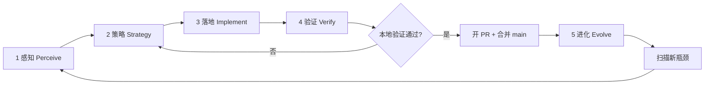

# AGENTS.md

## YiRage 无限优化闭环（Infinite Optimization Loop）

本仓库的持续改进**没有终止条件**。每一轮闭环的目标不是「做完就停」，而是：**感知现状 → 选定瓶颈 → 最小落地 → 用证据验证 → 把结论写回文档与契约 → 进入下一轮**。Cloud Agent 与人类协作者都应把 `AGENTS.md` 当作活文档，每轮验证通过后更新本节或下方 Gotchas。

**不要**为此闭环新增独立编排脚本（例如一键跑完全部阶段的 orchestrator），除非用户明确要求。闭环由 Agent 按层执行现有脚本与测试，并把经验沉淀进文档。

### 核心原则

| 原则 | 含义 |
|------|------|
| **先测后优** | 没有基准与正确性证据，不改 Pass / `cpu_call` / 搜索空间 |
| **同后端评估** | Search、profile、cache、execute 必须在同一 `backend` 上完成（见 [docs/HARDWARE_OPTIMIZATION.md](docs/HARDWARE_OPTIMIZATION.md)） |
| **瓶颈驱动** | 优先修「契约缺口 / 静默错误 / 搜索探索了但执行不支持」类问题，再追求微基准 |
| **最小改动** | 每轮只解决本轮策略选定的 1～2 个瓶颈，避免无关重构 |
| **验证通过再沉淀** | 测试与 bench JSON 通过后再更新 `cpu_support_matrix.yaml`、`AGENTS.md`、设计 doc |
| **框架对齐** | 借鉴 PyTorch / TensorFlow 的 CPU 分层思想：原语委托 host BLAS（MKL/oneDNN），图级做融合与内存/布局优化；**不**在 µGraph 里重造 GEMM 微内核 |
| **执行前价值闸门** | 每轮进入「策略 → 落地」前，必须对照框架目标判断本轮改动是否值得做（见下节）；性能向改动需有 bench / `eval_optimization_value` 证据 |

### 执行前闸门：框架目标与优化价值（每轮必做）

**在勾选检查清单第 2 步「策略」、写代码之前**，Agent 必须先完成本闸门；若结论为「价值不足」，改选 backlog 中更高优先级项，**不得**为凑 Loop 而做低价值微优化。

#### YiRage CPU 框架目标（对齐 PyTorch / TensorFlow 分工）

| 层级 | PyTorch 参考 | TensorFlow / oneDNN 参考 | YiRage CPU 对应 |
|------|----------------|---------------------------|-----------------|
| **原语** | `ATen` → MKL/OpenBLAS；孤立 `matmul` 不自定义微内核 | oneDNN / Eigen 算子库 | P0：`cpu_matmul` / `torch.matmul`；`cpu_rms_matmul` 语义快路径 |
| **图级** | TorchScript / Inductor 融合、算子调度 | XLA / Grappler 融合、布局与 buffer 复用 | µGraph search：融合、tiling、TB customized、减内存流量 |
| **执行** | 线程池 + OpenMP 与 BLAS 协同 | 线程亲和、NCHW/NHWC 布局选择 | `get_cpu_search_config()`、TB interpreter、同 backend profile |
| **验证** | 数值与 reference 对齐 | 图等价 + 回归 | `ProbabilisticVerifier` + `runtime_verify_mugraph` vs torch |

**借鉴要点（非照搬实现）**：

- **原语下沉、融合上浮**：与 PyTorch/TF 一样，重计算 GEMM/conv 交给成熟 BLAS/DNN；YiRage 的搜索价值在**图结构**（例如 rms_norm+matmul 融合、forloop epilogue），而非 beat `torch.matmul` 的单算子微基准。
- **同机同后端评判**：只在目标 CPU 上与 documented MKL 基线比较融合收益（见 [docs/HARDWARE_OPTIMIZATION.md](docs/HARDWARE_OPTIMIZATION.md)）；跨后端对比不能作为主指标。
- **布局与内存**：TF/oneDNN 强调 layout 与 buffer 生命周期；YiRage backlog 中的 concat/split/chunk 等应在「减少拷贝 / 对齐融合」语境下排期，而非孤立加 op。
- **正确性优先于速度**：与框架一致，先契约 tier + value verify，再谈 superoptimize 收益。

#### 四轮自问（策略卡片必填）

在 PR 描述或本轮笔记中**用 1～2 句话**回答：

1. **层级**：本轮改的是原语层还是图级/搜索层？若原语层，是否因契约缺口/静默错误（必须修）？若仅为 beat MKL 孤立 GEMM → **拒绝或降级**。
2. **路径**：是否落在 P0→P1→P2 分层（`HARDWARE_OPTIMIZATION.md`）？与当前 matrix tier / `cpu_search_explore_not_supported()` 是否一致？
3. **收益**：预期收益类型是什么 — 正确性、搜索可探索、融合加速、还是实验路径（MLIR JIT）？性能向须写明对照基线（如 `bench_fused_vs_mkl_baseline --quick`）。
4. **机会成本**：同一轮是否还有更高优先级 backlog（失败测试、explore 与执行不一致、unsupported 常用 op）？

**性能向轮次**在感知阶段额外跑：

```bash
PYTHONPATH=. python3 scripts/eval_optimization_value.py
PYTHONPATH=. python3 scripts/bench_fused_vs_mkl_baseline.py --quick --json
```

若 JSON 显示融合已不慢于 MKL、且本轮仅微调无关热点，**暂停该性能项**，转向契约/搜索 gap。

### 五层结构



---

#### 第 1 层：感知（Perceive）— 我们在哪？

**目标**：弄清当前后端的能力边界、正确性覆盖、性能相对基线的位置，以及搜索空间与执行路径的不一致。

**典型动作**：

- 读契约与硬件文档：`docs/cpu_support_matrix.yaml`（CPU 算子 tiers）、[docs/HARDWARE_OPTIMIZATION.md](docs/HARDWARE_OPTIMIZATION.md)
- 跑认证与全量数值验证（CPU）：
  ```bash
  export LD_LIBRARY_PATH=build/abstract_subexpr/release:build/formal_verifier/release:$LD_LIBRARY_PATH
  export YIRAGE_BACKEND=cpu
  make test-cpu-cert                    # 契约 + superoptimize smoke
  make test-cpu-value-verify            # 逐 KN/TB 算子 vs torch（50+ 项，随 matrix 增长）
  PYTHONPATH=. python3 scripts/cpu_certification.py --json
  PYTHONPATH=. python3 scripts/cpu_verify_all_functions.py
  ```
- 跑性能与优化价值评估：
  ```bash
  PYTHONPATH=. python3 scripts/bench_fused_vs_mkl_baseline.py --quick --json
  PYTHONPATH=. python3 scripts/eval_optimization_value.py
  PYTHONPATH=. python3 scripts/business_capability_walkthrough.py
  ```
- 对照搜索探索列表与执行支持：`cpu_search_explore_not_supported()`（`support_matrix.py`）中的 gap

**产出**：一份简短「现状快照」— 失败测试列表、unsupported/experimental 算子、bench 中 fusion vs MKL 倍率、搜索探索但未实现的 op。

---

#### 第 2 层：策略（Strategy）— 下一步改什么？

**目标**：根据感知结果排序，选定**单一**主攻方向（例如：补齐 TB sigmoid 执行路径、对齐 `GeneratorConfig::get_cpu_search_config()`、扩展 customized-op 契约测试）。

**前置条件**：已完成上文 [执行前闸门](#执行前闸门框架目标与优化价值每轮必做) 的四轮自问；策略卡片须写明「框架层级 + 收益类型 + 为何优于 backlog 其他项」。

**决策参考**：

| 信号 | 优先策略 |
|------|----------|
| `NotImplementedError` / 契约 tier 为 unsupported | 补 `cpu_call` / TB interpreter / Cython builder，并更新 matrix |
| 搜索探索了但执行不支持 | 收窄 CPU 搜索空间或补执行（与 matrix 一致） |
| 正确但慢于 MKL 基线 | 图级融合、`cpu_rms_matmul` 快路径、或（实验）MLIR JIT |
| superoptimize 无收益 | 检查 `resolve_cpu_search_space()`、verifier 配置、MuGraph cache 是否污染计时 |
| 跨后端对比诱人 | **拒绝**作为主指标；只在目标 backend 上评判 |

**文档锚点**：`docs/HARDWARE_OPTIMIZATION.md` 中 P0（host BLAS）→ P1（TB interpreter）→ P2（native / MLIR JIT 实验）分层。

**产出**：本轮「策略卡片」— 1 句话目标、触及文件、预期验证命令（写入 PR 描述即可，无需单独 markdown 文件）。

---

#### 第 3 层：落地（Implement）— 最小正确实现

**目标**：按策略做**最小**代码/配置改动，遵循仓库既有风格（见 user rules：reuse、不 over-engineer）。

**常见落地点**（按历史 CPU 闭环）：

- 执行：`src/kernel/cpu/`、`cpu_call` 分发、`python/yirage/kernel/graph.py`
- 构图：`python/yirage/_cython/`、`KNGraph` / TB API
- 搜索：`include/search/config.h`、`src/search/search_c.cc`、`python/yirage/backends/cpu/config.py`
- 契约：`docs/cpu_support_matrix.yaml` + `tests/integration/test_cpu_op_contract.py`

**禁止**：为「跑闭环」新建 `yirage_optimization_loop.py` 类编排器；用 Makefile 目标串联**已有**脚本即可。

**产出**：可编译、可 import 的增量 patch；Cython 变更后需 `YIRAGE_BACKEND=cpu USE_MLIR=0 pip install -e . --no-build-isolation`。

---

#### 第 4 层：验证（Verify）— 证据链

**目标**：正确性先于速度；速度在同 backend 上与 documented 基线比较。

**两层验证**（搜索期 vs 运行期）：

| 层 | 机制 | 入口 |
|----|------|------|
| Search | `ProbabilisticVerifier`（默认）或 `YIRAGE_FORMAL_VERIFY=1` | `resolve_verifier_config()` |
| Runtime | `runtime_verify_mugraph` vs `torch` | 集成测试、`bench_fused_vs_mkl_baseline.py` JSON 中的 `runtime_verified` |

**CPU 推荐最小验证集**（随 matrix 扩展而扩展）：

```bash
make lint
make test-cpu-cert
make test-cpu-value-verify
make test-cpu-demos
pytest tests/integration/test_cpu_native_gemm.py tests/integration/test_fused_vs_mkl_baseline.py -v
pytest tests/python/test_verifier_config.py -v
```

**产出**：通过的 pytest 摘要、bench `--json` 关键字段（`speedup_*`、`search_verified`、`runtime_verified`）。

**CPU Demo 烟雾（可选，见下节）**：`make test-cpu-demos` — 验证示例脚本在 CPU 上可跑通，作为「用户可复现」证据，**不替代** cert / value-verify。

**合并闸门（Merge gate）**：仅当本节「本地最小验证集」在本机**全部通过**后，Agent 才可合并 PR；不得以「CI 红但本地绿」为借口跳过本地验证。

---

### CPU Demo 测试与优化闭环

Demo 脚本是无限优化闭环的**用户可复现烟雾层**：在契约测试（`test-cpu-cert`）与逐算子 value verify 之外，证明「人类/Agent 能直接 `python demo/...py` 在 CPU 上构图并执行」。Cloud Agent 每轮 Loop 应把 demo 测试纳入**验证层**或**合并后感知**，并把清单维护在 `cpu_demo_loop_manifest()`（`scripts/cpu_cert_utils.py`）。

#### Demo 在五层中的位置

| 闭环层 | Demo 作用 | 典型命令 |
|--------|-----------|----------|
| **感知** | 确认同后端、import、LD_LIBRARY_PATH 对示例子进程可用 | `demo/backend_selection_demo.py` |
| **验证** | 改 `cpu_call`/构图 API 后，示例仍能跑通 | `make test-cpu-demos` |
| **进化** | 新增 CPU 可跑 demo 时，同步 manifest + `test_cpu_demos.py` | 见下方清单 |

Demo **不能**替代：`make test-cpu-value-verify`（110 项）、`bench_fused_vs_mkl_baseline.py`（融合 vs MKL）、`cpu_certification.py`（契约归档）。

#### 维护清单（Loop R60+）

权威列表：`scripts/cpu_cert_utils.py` → `cpu_demo_loop_manifest()`。每项含 `script`、`layer`（perceive/verify/evolve）、`framework_tier`、`pytest`（`tests/integration/test_cpu_demos.py` 中的函数名）。

| id | 脚本 | 层级 | 说明 |
|----|------|------|------|
| `backend_selection` | `demo/backend_selection_demo.py` | 感知 | Linux VM 上 backend=cpu |
| `demo_jit` | `demo/demo_jit.py --device cpu` | 验证 | JIT/构图正确性 |
| `demo_rms_norm` | `demo/demo_rms_norm.py` | 验证 | RMSNorm+matmul 执行（CPU 不 superoptimize） |
| `demo_lora` | `demo/demo_lora.py` | 验证 | LoRA blocked GEMM（CPU 无 superoptimize） |
| `reference_mugraph_rms_norm` | `demo/reference_mugraphs/rms_norm.py --quick` | 验证 | 融合 customized RMS+matmul 参考图 |
| `reference_mugraph_lora` | `demo/reference_mugraphs/lora.py --quick` | 验证 | LoRA blocked GEMM 参考图 |
| `reference_mugraph_gated_mlp` | `demo/reference_mugraphs/gated_mlp.py --quick` | 验证 | Gated MLP (SiLU gate) 参考图 |
| `reference_mugraph_plain_matmul` | `demo/reference_mugraphs/plain_matmul.py --quick` | 验证 | KN plain matmul（P0 cpu_matmul） |
| `reference_mugraph_matmul_chain` | `demo/reference_mugraphs/matmul_chain.py --quick` | 验证 | 双 matmul chain（P0 cpu_matmul_chain） |
| `reference_mugraph_concat_matmul` | `demo/reference_mugraphs/concat_matmul.py --quick` | 验证 | dual-concat matmul（bench concat_matmul） |
| `submission_validate` | `examples/submission.py --validate` | 验证 | 提交示例校验 |
| `llama3b_moe_pytorch` | `demo/llama3b_moe/demo.py --pytorch-only` | 进化 | 小 shape MoE 前向 |
| `llama3b_moe_benchmark` | `benchmark/end-to-end/llama3b_moe_cpu.py --skip-search` | 进化 | e2e bench 烟雾 |

契约测试：`pytest tests/integration/test_cpu_demo_loop.py -v`（manifest 与 `test_cpu_demos.py` 对齐）。

#### 推荐命令（CPU VM / Cloud Agent）

```bash
export LD_LIBRARY_PATH=build/abstract_subexpr/release:build/formal_verifier/release:$LD_LIBRARY_PATH
export YIRAGE_BACKEND=cpu
export PYTHONPATH=.

# 集成烟雾（~1–3 min，视 demo 而定）
make test-cpu-demos

# 每轮 Loop 合并后一键闭合（demos + MLIR 契约 + cert e2e profile，~100s）
make test-cpu-loop-close

# 快速归档 JSON（demos + mlir profile + contract，~40s，跳过 cert e2e）
make test-cpu-loop-close-profile

# Walkthrough 分 stage 耗时（quick tractability）
make test-cpu-cert-walkthrough-profile

# 单 demo 手动复现
python3 demo/backend_selection_demo.py
python3 demo/demo_rms_norm.py
python3 demo/demo_jit.py --device cpu --quiet
```

#### 与 cert / bench 的组合（每轮 Loop 建议）

| 轮次类型 | 最小集 | 含 Demo |
|----------|--------|---------|
| 快速闭合（工具/文档） | `make test-cpu-cert-quick` | 可选跳过 |
| 算子/执行路径改动 | `make test-cpu-cert` + `make test-cpu-value-verify` | **必须** `make test-cpu-demos` |
| 性能/融合改动 | 上列 + `bench_fused_vs_mkl_baseline.py --quick` | 建议 `make test-cpu-demos` |
| 合并后感知 | `make test-cpu-cert-profile` | 建议 `make test-cpu-demos` |
| **Loop 一键闭合** | `make test-cpu-loop-close` | 内含 demos + mlir 契约 + cert e2e |

#### 新增 CPU Demo 的检查项

1. 脚本在 Linux CPU 上可跑（`demo/_device_utils.py`：`ensure_native_ld_library_path`、`configure_device`）
2. 在 `cpu_demo_loop_manifest()` 增加条目
3. 在 `tests/integration/test_cpu_demos.py` 增加 `_run_demo(...)` 子进程测试
4. 在本节表格与「当前轮次笔记」中记录

**禁止**：在 `demo/mps/` 下新增仅 MPS 的 demo 并标为 CPU Loop 必跑项（`require_mps()` 会在 CPU host 上 exit 1）。

---

#### 第 5 层：进化（Evolve）— 写回知识，开启下一轮

**目标**：把本轮结论变成下一 Agent 的默认上下文，避免重复踩坑。

**必须更新的位置（按影响面）**：

1. **`AGENTS.md`** — 本节的「当前轮次笔记」或下方 **Gotchas**（新 env、新命令、新陷阱）
2. **`docs/cpu_support_matrix.yaml`** — tier / fast_path / 探索列表变更
3. **`docs/HARDWARE_OPTIMIZATION.md`** — 架构级路径或评估标准变更
4. **集成测试** — 新算子或新融合模式须有契约或 value verify 用例

**本轮结束时在 PR / 提交信息中写清**：

- 感知到的瓶颈 → 策略选择 → 改动摘要 → 验证命令与结果 → **下一轮建议**（回到第 1 层）

---

### Cloud Agent 自主连续迭代协议（验证后自动合并 → 发现新问题 → 下一轮）

用户未明确喊停时，Cloud Agent **默认连续跑多轮 Loop**，不要在一轮 PR 合并后结束会话。每一轮是：**感知 → 策略 → 落地 → 验证 → 自动合并 → 进化 → 扫描新瓶颈 → 回到感知**。

仍**禁止**新建独立 orchestrator 脚本；连续迭代由 Agent 按本节 checklist **手工串联**现有命令与 git/PR 工具完成。

#### 验证通过后的自动合并

满足**全部**条件时，Agent **必须**自行合并 PR（无需再等用户说「merge」）：

| 条件 | 要求 |
|------|------|
| 本地验证 | 第 4 层「CPU 推荐最小验证集」在本机 exit 0（或本轮 PR 触及的后端等价命令） |
| 分支规范 | `cursor/<descriptive-name>-78f5`，已 push，`base_branch=main` |
| PR 状态 | `mergeable`；若仍为 draft，先 `gh pr ready` |
| 合并方式 | `gh pr merge <n> --merge --delete-branch`（与仓库惯例一致） |
| 合并后 | `git checkout main && git pull origin main`，再开始下一轮感知 |

**不自动合并**（阻塞并修复或向用户说明）：

- 本地验证失败、import/编译失败、Cython 未重装导致的行为异常
- 合并冲突需人工决策
- 用户当轮明确说「先别合并」「只写文档」等

**关于 GitHub Actions**：`main` 上可能存在与本轮改动无关的 CI 失败（如 LLVM submodule、历史 clang-format）。**不以远端 CI 绿作为合并硬门槛**；以**本地 Loop 验证集**为准。合并后在 PR / 「当前轮次笔记」中注明 CI 状态即可。

#### 合并后自动发现「下一轮潜在问题」

合并到 `main` 并 `git pull` 后，**立即**执行感知扫描，产出有序 backlog（写入策略层，选最高优先级 1 项进入下一轮落地）：

```bash
export LD_LIBRARY_PATH=build/abstract_subexpr/release:build/formal_verifier/release:$LD_LIBRARY_PATH
export YIRAGE_BACKEND=cpu

# 1) 契约与全量数值
make test-cpu-value-verify
make test-cpu-cert
PYTHONPATH=. python3 scripts/cpu_certification.py --skip-walkthrough --json

# 2) 搜索 vs 执行一致性
PYTHONPATH=. python3 -c "from yirage.backends.cpu.support_matrix import cpu_search_explore_not_supported; print(cpu_search_explore_not_supported())"

# 3) 性能与同后端价值（快速）
PYTHONPATH=. python3 scripts/bench_fused_vs_mkl_baseline.py --quick --json

# 4) CPU Demo 烟雾（用户可复现）
make test-cpu-demos
```

**从结果中提取候选问题**（优先级从高到低）：

1. **失败测试** / `runtime_verified: false` / `NotImplementedError`
2. **`cpu_search_explore_not_supported()` 非空**（搜索探索了但 matrix 标 unsupported）
3. **matrix `experimental` tier** 且无 value verify 覆盖
4. **matrix `unsupported` 但产品路径常用**（如 `tb_forloop_accum_red_ld_mean_op`）
5. **bench JSON**：融合慢于 MKL 基线、superoptimize 无收益、误差边界逼近 tol
6. **「当前轮次笔记」中的「下一轮感知建议」**（合并前写的条目）

若无失败项且 backlog 为空，仍进入下一轮感知（扩大 shape、walkthrough、或换后端），**不得**宣称「CPU 已完成」。

#### 连续迭代终止条件

仅在以下情况停止自动开下一轮：

- 用户明确停止（「停」「先到这里」「不要合并」等）
- 本地验证无法通过且已尝试合理修复仍失败（向用户报告阻塞项）
- 本轮仅为纯文档且用户未要求继续代码 Loop

默认：**合并 → 感知扫描 → 若有 backlog 则开新分支 `cursor/...-78f5` → 下一轮**。

---

### Cloud Agent 单轮检查清单

复制此清单执行一轮；完成后勾选并更新「进化」项。

```
[ ] 0. 闸门：完成「框架目标与优化价值」四轮自问；性能向已跑 eval_optimization_value / bench --quick
[ ] 1. 感知：跑 cert / value-verify / bench / walkthrough，记录失败与 gap
[ ] 2. 策略：只选 1 个主攻瓶颈，对照 HARDWARE_OPTIMIZATION 分层 + PyTorch/TF 原语 vs 图级分工
[ ] 3. 落地：最小 patch，无 orchestrator 新脚本
[ ] 4. 验证：lint + 相关 pytest + bench JSON；Cython 则重装 editable
[ ] 5. 开 PR：push 分支，create/update PR，base=main
[ ] 6. 自动合并：本地验证全绿 → gh pr ready（若 draft）→ gh pr merge --merge --delete-branch
[ ] 7. 同步 main：git checkout main && git pull
[ ] 8. 进化：更新 AGENTS.md「当前轮次笔记」+ matrix / HARDWARE_OPTIMIZATION（可在合并前 commit，合并后补记合并 SHA）
[ ] 9. 扫描 backlog：cert --json、search gaps、matrix experimental/unsupported、bench JSON
[ ] 10. 下一轮：若有 backlog → 新分支从 main 继续 Loop R{n+1}；否则扩大感知范围后仍继续
```

### 现有工具索引（按层）

| 层 | 工具 / 路径 |
|----|-------------|
| 感知 | `docs/cpu_support_matrix.yaml`, `scripts/cpu_certification.py`, `scripts/cpu_verify_all_functions.py`, `scripts/bench_fused_vs_mkl_baseline.py`, `scripts/eval_optimization_value.py`, `scripts/business_capability_walkthrough.py`, `scripts/bench_ray_search.py` |
| 策略 | `docs/HARDWARE_OPTIMIZATION.md`, `python/yirage/backends/cpu/config.py`, `GeneratorConfig::get_cpu_search_config()`, AccelForge prescreen（walkthrough / RL） |
| 落地 | `src/kernel/cpu/`, `python/yirage/kernel/graph.py`, `src/search/`, MLIR JIT（实验，`USE_MLIR=1`） |
| 验证 | `tests/integration/test_cpu_op_contract.py`, `tests/integration/test_cpu_full_value_verify.py`, `tests/integration/test_fused_vs_mkl_baseline.py`, `runtime_verify_mugraph`, `make test-cpu-cert`, `make test-cpu-value-verify` |
| 进化 | **`AGENTS.md`（本文件）**, matrix yaml, `docs/HARDWARE_OPTIMIZATION.md`, 集成测试与 PR 描述 |

### 当前轮次笔记（由 Agent 持续追加）

> **维护说明**：每合并一轮优化 PR，在此追加 3～5 行：日期、瓶颈、验证命令、下一轮建议。不要删除历史条目，便于追溯闭环演进。

- **CPU 后端基线（main）**：同后端 superoptimize 价值评估、`bench_fused_vs_mkl_baseline.py`、`eval_optimization_value.py`、P0 host BLAS + TB interpreter 路径已文档化于 `HARDWARE_OPTIMIZATION.md`。
- **Loop R1（2026-06-09，CPU 认证落地）**：合并 `cpu_support_matrix.yaml`、`make test-cpu-cert` / `test-cpu-value-verify`（47→49 项）、`get_cpu_search_config()` 搜索对齐、`search_explore_gaps=[]`。感知：`make test-cpu-cert` 26 passed，`bench_fused_vs_mkl_baseline --quick` rms_norm_matmul speedup≈1.01。
- **Loop R2（2026-06-09，forloop accum）**：瓶颈 `tb_forloop_accum_red_ld_sum_op` 解释器误用逐元素 `+=`（应为 last-dim reduce-sum）；补齐 value verify builders；`red_ld_sum` 从 experimental 升为 supported。验证：`make test-cpu-value-verify` **49 passed**，`make test-cpu-cert` 26 passed。
- **Loop R3（2026-06-09，`tb_forloop_accum_red_ld_mean_op`）**：CPU 解释器补齐 mean epilogue（与 CUDA reduce-sum + 末轮 `/n` 一致）；matrix 升为 supported 并加入 search explore；value verify **50 passed**。验证：`make test-cpu-value-verify`、`make test-cpu-cert`。
- **Loop R4（2026-06-09，redtox + max）**：补齐 `tb_forloop_accum_redtox_ld_sum_op`（`reduction_to_dimx` per tile 累加）与 `tb_forloop_accum_max_op`（逐元素 max）；value verify **52 passed**。验证：`make test-cpu-value-verify`、`make test-cpu-cert`。
- **Loop R5（2026-06-09，clamp + mul_scalar）**：`kn_clamp_op` / `tb_clamp_op` / `tb_mul_scalar_op` 升为 supported；C++ JSON 序列化 `min_val`/`max_val`/`scalar`；Cython `get_graph_structure` 暴露参数；`graph.py` CPU 解释器补齐。**根因**：`KNCustomizedOp` 复制 bgraph 时 `TB_CLAMP_OP` 误走 `elementunary(scalar)` 丢失边界，已改为 `elementunary_clamp`。验证：`make test-cpu-value-verify` **53 passed**（+1 tb_clamp），`make test-cpu-cert` 26 passed。
- **Loop R6（2026-06-09，`kn_mul_scalar_op`）**：补齐 KN `Graph::mul_scalar`、`KNElementUnaryOp::scalar` + JSON；Cython/Python API 与 CPU 解释器；matrix 升为 supported。验证：`make test-cpu-value-verify` **54 passed**，`make test-cpu-cert` **27 passed**。
- **Loop R7（2026-06-09，搜索空间对齐）**：`GeneratorConfig::get_cpu_search_config()` 与 `search_cpu_default_explore` 同步；纳入 clamp/mul_scalar、forloop mean/redtox/max；`op_utils` + abstract_expr 补齐；`test_cpu_search_explore_sync.py` 防漂移。验证：`make test-cpu-cert`、`make test-cpu-value-verify`。
- **Loop R8（2026-06-09，搜索扩展 unary/binary）**：CPU 搜索纳入 sigmoid/log/sub、KN reduction；补齐 abstract_expr（Sigmoid/Log/Sub）、symbolic_graph、irange、op_utils。TB reduction 暂缓（irange 未实现）。验证：`make test-cpu-cert`（29 passed）、`make test-cpu-value-verify`（54 passed）。
- **Loop R9（2026-06-09，TB reduction 搜索）**：`irange.cc` 补齐 `TB_REDUCTION_0/1/2` 与 `*_TO_DIMX_*` forward/backward（`extend_dim` + `truncate`，与 KN reduction 同型）；CPU 搜索 explore 纳入 `tb_reduction_0/1/2_op`；`test_cpu_search_explore_sync.py` 防漂移。验证：`make test-cpu-cert`（29 passed，superoptimize ~258s）、`make test-cpu-value-verify`（54 passed）。
- **Loop R10（2026-06-09，TB reduction_to_dimx）**：CPU 搜索 explore 纳入 `tb_reduction_*_to_dimx_op`；`op_utils::is_unary` 补齐；C++ `Graph::reduction_to_dimx(STensor*)` 指针重载 + Cython/Python API；`graph.py` 解释器 + value verify builders（**57 passed**）。验证：`make test-cpu-cert`（29 passed，superoptimize ~400s）、`make test-cpu-value-verify`（57 passed）。
- **Loop R11（2026-06-09，TB reduction_max CPU）**：`graph.py` 补齐 `tb_reduction_*_max_op` 双输出解释器（`ReductionMaxKernel` 语义：跨 forloop 迭代累积 max + diff）；matrix 三档 `supported`；value verify builders（**60 passed**）。搜索暂缓（双输出 + symbolic/irange 未接）。验证：`make test-cpu-cert`（29 passed，~598s）、`make test-cpu-value-verify`（60 passed）。
- **Loop R12（2026-06-09，TB reduction_max 搜索基础设施）**：闸门判定为图级/搜索层（非原语微优）；补齐 symbolic_graph、abstract_expr、irange、`op_utils`、`graph.cc` from_json；**刻意未**将 `tb_reduction_*_max_op` 纳入 explore（双输出 guid 仍会导致 superoptimize abort）。matrix 备注「search infra ready, explore deferred」。验证：`make test-cpu-value-verify`（60 passed）、`make test-cpu-cert`（29 passed，~270s）。
- **Loop R13（2026-06-09，TB reduction_max 纳入搜索 explore）**：闸门：图级搜索层，闭合 R12「infra ready / explore deferred」gap。根因：`irange.cc` 的 `forward_propagate`/`backward_propagate` 对双输出 MAX 仅返回 1 条 range（assert 失败）；`abstract_expr_eval` 未为 `output_tensors[1]` 注册 expr。修复后纳入 `search_cpu_default_explore` + `config.cc`。验证：`make test-cpu-value-verify`（60 passed）、`make test-cpu-cert`（29 passed，superoptimize ~810s）。
- **Loop R14（2026-06-09，TB concat CPU + 搜索输出上界，PR #66 → `9d7904b`）**：闸门：图级布局（TF/oneDNN `torch.cat`）。`graph.py` 补齐 `tb_concat_0/1/2`（含 `tb_concat_first_op_id` 枚举别名）；matrix 三档 `supported`；value verify **63 passed**；`get_cpu_search_config()` 设 `max_num_threadblock_graph_outputs=3`。concat search explore 暂缓（`abstract_expr` 无 Concat 节点）。验证：`make test-cpu-cert`（29 passed，~1233s）。
- **Loop R15（2026-06-09，TB concat search explore，PR #68 → `44b9634`）**：闸门：图级/搜索层（闭合 R14 explore deferred）。`abstract_expr` 新增 `Concat`（egg `(concat lhs rhs dim)`）；`abstract_expr_for_ops` / `op_utils` 补齐三档 `TB_CONCAT_*`；`tbop_to_explore` + matrix + sync test 纳入 explore。验证：`make test-cpu-value-verify`（63 passed）；`make test-cpu-cert`（29 passed，~1189s）。
- **Loop R1（TileKernel baseline，kn_sub_op，PR 待合并）**：闸门：执行层。``KN_SUB_OP`` + ``Graph.sub`` + CPU interpreter；verify **111**。
- **Loop R2（TileKernel baseline，kn_transpose_01_op，PR 待合并）**：闸门：layout 层（``torch.transpose(0,1)``）。``KN_TRANSPOSE_01_OP`` + ``Graph.transpose01`` + search explore；verify **112**。
- **Loop R3（TileKernel baseline，general ML 对齐，PR 待合并）**：闸门：图级/正确性（非孤立 GEMM 微优）。稳定 ``softmax``/``layer_norm``（TB reduction_max 路径）；``gemm_softmax``/``gemm_layernorm`` 对齐 ``F.softmax``/``F.layer_norm``；online softmax rescale accum 解释器；verify **118**（rescale search explore 见 YiRage Loop R6）。
- **Loop R4（YiRage main，runtime shape-aware MuGraph cache，PR 待合并）**：闸门：runtime/P0（搜索价值需动态 shape 命中）。``find_best_mugraph(..., input_shapes=...)`` 优先同 shape 条目；``YIRAGE_MUGraph_REQUIRE_SHAPE_MATCH=1`` 严格模式；``superoptimize`` persistent restore 传入 seed 图 input shapes。
- **Loop R5（YiRage main，MuGraph shape bucket，PR 待合并）**：闸门：runtime/P0（闭合 R4 相邻 bucket 动态 shape）。power-of-two ``bucket_dim``；exact → bucket → global 三级 restore；``YIRAGE_MUGraph_SHAPE_BUCKET=0`` 可关。
- **Loop R6（YiRage main，TB rescale search explore，PR 待合并）**：闸门：图级/搜索层（闭合 R3 matrix「search explore deferred」）。``TB_FORLOOP_ACCUM_*_RESCALE_OP`` 纳入 ``tbop_to_explore``；search 栈（``op_utils``、``abstract_expr``、``symbolic_graph``、``irange``、``formal_verifier``、``config.cc``）；``type.h`` JSON 名对齐 ``tb_forloop_accum_no_red_rescale_op``。验证：``make test-cpu-cert-quick`` **59 passed**；``make test-cpu-value-verify`` **118 passed**；``search_explore_gaps=[]``。
- **Loop R7（YiRage main，kn_conv2d CPU 契约，PR 待合并）**：闸门：执行层（CV 基础算子）。新增 ``KN_CONV2D_OP`` + ``Graph.conv2d``（NCHW/OIHW，stride/padding/dilation JSON）；Cython/Python + ``graph.py`` CPU 解释器（``F.conv2d``）；matrix ``kn_conv2d_op`` supported（search explore 见 R8）。验证：``make test-cpu-cert-quick`` **60 passed**；``make test-cpu-value-verify`` **119 passed**。
- **Loop R8（YiRage main，kn_conv2d search explore，PR 待合并）**：闸门：图级/搜索层（闭合 R7 matrix「search explore deferred」）。``KN_CONV2D_OP`` 纳入 ``knop_to_explore``；search 栈全链路。验证：``make test-cpu-cert-quick`` **60 passed**；``make test-cpu-value-verify`` **119 passed**；``search_explore_gaps=[]``。
- **Loop R9（YiRage main，stable self_attention CPU，PR 待合并）**：闸门：图级/正确性（闭合 COMET ``self_attention`` naive softmax）。``KNGraph.self_attention`` 改用 stable TB 路径；value-verify builder + general ML parity。验证：**120 passed**。
- **Loop R10（YiRage main，scaled self_attention，PR 待合并）**：闸门：图级/正确性（标准 ``1/sqrt(d)``）。``head_dim`` / ``scale`` + ``self_attention_scaled`` builder。验证：**121 passed**。
- **Loop R11（YiRage main，multi-head self_attention 3D，PR #9）**：闸门：图级/正确性（``[H,S,D]`` 多头契约）。``self_attention_multi_head``（chunk → per-head stable softmax → concat）；``_kn_customized_tb_softmax_last_dim`` 支持 ``[1,S,S]`` leading batch；``matmul_chain_shapes_from_cygraph`` 非 2D 安全回退。验证：**122 passed**。
- **Loop R12（YiRage main，batched self_attention 3D，PR #10）**：闸门：图级/正确性（``[B,S,D]`` 批量契约）。``self_attention_batched``（batch chunk → per-item stable softmax → concat）；``rms_matmul_shapes_from_cygraph`` 非 2D 安全回退。``[B,H,S,D]`` 多头批量留 R14+（需 reshape / 4D TB softmax）。验证：**123 passed**。
- **Loop R13（YiRage main，conv2d_bias 复合，PR #11）**：闸门：图级/正确性（CV bias 融合）。``conv2d_bias``（``kn_conv2d_op`` + broadcast ``kn_add_op``，bias ``[1,O,1,1]``）；builder + general ML parity。验证：**124 passed**。
- **Loop R14（YiRage main，kn_conv2d groups，PR #12）**：闸门：执行层（depthwise/grouped CV）。``KN_CONV2D_OP`` JSON + API 增 ``groups``；CPU 解释器 ``F.conv2d(groups=)``；``conv2d_groups`` builder + parity。验证：**125 passed**。
- **Loop R15（YiRage main，conv2d bias+groups 复合，PR #13）**：闸门：图级/正确性（闭合 R13/R14 CV 栈）。``conv2d_depthwise_bias``；``conv2d_bias_groups`` / ``conv2d_depthwise_bias`` builders + parity。验证：**127 passed**。
- **Loop R16（YiRage main，separable conv2d 复合，PR #14）**：闸门：图级/正确性（MobileNet depthwise+pointwise）。``conv2d_separable`` / ``conv2d_separable_bias``；builders + parity。验证：**129 passed**。
- **Loop R17（YiRage main，online rescale self_attention，PR #15）**：闸门：图级/正确性（FlashAttention-style TB forloop）。``self_attention_online``（``reduction_max`` + ``forloop_accum_rescale`` 按 key tile 流式）；builder + parity vs ``self_attention_scaled``。验证：**130 passed**。
- **Loop R18（YiRage main，conv2d_bias_relu 复合，PR #16）**：闸门：图级/正确性（CV 激活融合）。``conv2d_bias_relu``（``conv2d_bias`` + ``kn_relu_op``）；builder + parity vs ``F.relu(F.conv2d(...))``。3D online attention 扩展因 TB forloop 在 ``[1,S,D]`` chunk 切片上输出 shape 未闭合，留 R19+。验证：**131 passed**。
- **Loop R19（YiRage main，conv2d_bias_gelu 复合，PR #17）**：闸门：图级/正确性（CV GELU 融合）。``conv2d_bias_gelu``（``conv2d_bias`` + ``kn_gelu_op``）；builder + parity vs ``F.gelu(F.conv2d(...))``。验证：**132 passed**。
- **Loop R20（YiRage main，depthwise/separable ReLU 复合，PR #18）**：闸门：图级/正确性（MobileNet 激活融合）。``conv2d_depthwise_bias_relu``；``conv2d_separable_bias_relu``；builders + parity。验证：**134 passed**。
- **Loop R21（YiRage main，depthwise/separable GELU 复合，PR #19）**：闸门：图级/正确性（对称 R19/R20）。``conv2d_depthwise_bias_gelu``；``conv2d_separable_bias_gelu``；builders + parity。验证：**136 passed**。
- **Loop R22（YiRage main，gemm_gelu LLM 融合，PR #20）**：闸门：图级/正确性（FFN up-projection）。``gemm_gelu``（``matmul`` + ``kn_gelu_op``）；builder + parity vs ``F.gelu(A @ B)``。验证：**137 passed**。
- **Loop R23（YiRage main，gemm_silu gated MLP 融合，PR #21）**：闸门：图级/正确性（对称 R22）。``gemm_silu``（``matmul`` + ``kn_silu_op``）；builder + parity vs ``F.silu(A @ B)``。验证：**138 passed**。
- **Loop R24（YiRage main，CV SiLU 激活融合，PR #22）**：闸门：图级/正确性（闭合 ReLU/GELU/SiLU 矩阵）。``conv2d_bias_silu``；``conv2d_depthwise_bias_silu``；``conv2d_separable_bias_silu``；builders + parity。验证：**141 passed**。
- **Loop R25（YiRage main，gemm_relu + gated_mlp，PR #23）**：闸门：图级/正确性（GEMM 激活族 + LLM FFN）。``gemm_relu``；``gated_mlp`` builder + parity（``silu(gate)*up @ down``）。验证：**143 passed**。
- **Loop R26（YiRage main，rms_norm_linear LLM 融合，PR #24）**：闸门：图级/正确性（QKV 投影模式）。``rms_norm_linear`` builder + parity；``rms_norm_linear`` 改用 ``self.rms_norm``。验证：**144 passed**。
- **Loop R27（YiRage main，gated_mlp GELU 变体，PR #25）**：闸门：图级/正确性（LLM FFN GELU gate）。``gated_mlp_gelu`` builder + parity（``activation=\"gelu\"``）。3D ``[B,S,D]`` gated_mlp 留 R28+（KN matmul 仅 2D）。验证：**145 passed**。
- **Loop R28（YiRage main，gemm_bias 线性层融合，PR #26）**：闸门：图级/正确性（``matmul + broadcast bias``）。``gemm_bias``；builder + parity。3D gated_mlp 仍受 KN matmul batch 规则阻塞（``[B,S,D]@W`` 需 3D@3D 且 batch 对齐）。验证：**146 passed**。
- **Loop R29（YiRage main，gemm_bias 激活融合，PR #27）**：闸门：图级/正确性（对称 CV bias+act）。``gemm_bias_relu``；``gemm_bias_gelu``；builders + parity。验证：**148 passed**。
- **Loop R30（YiRage main，gemm_bias_silu 线性融合，PR #28）**：闸门：图级/正确性（闭合 GEMM+bias 激活矩阵）。``gemm_bias_silu``；builder + parity vs ``F.silu(A @ B + bias)``。验证：**149 passed**。
- **Loop R31（YiRage main，rms_norm_linear_gelu LLM 融合，PR #29）**：闸门：图级/正确性（QKV/FFN GELU epilogue）。``rms_norm_linear_gelu``；builder + parity vs ``F.gelu(RMSNorm(X) @ W)``。验证：**150 passed**。
- **Loop R32（YiRage main，rms_norm_linear ReLU/SiLU 融合，PR #30）**：闸门：图级/正确性（闭合 rms_norm_linear 激活矩阵）。``rms_norm_linear_relu``；``rms_norm_linear_silu``；builders + parity。验证：**152 passed**。
- **Loop R33（YiRage main，gemm_layernorm 激活融合，PR #31）**：闸门：图级/正确性（闭合 gemm_layernorm 激活矩阵）。``gemm_layernorm_gelu``；``gemm_layernorm_relu``；``gemm_layernorm_silu``；builders + parity。验证：**155 passed**。
- **Loop R34（YiRage main，gated_mlp_batched 3D FFN + cpu_call 3D 修复，PR #32）**：闸门：图级/正确性 + 工具层（``concat_matmul_shapes`` 对 4×3D 输入不再 abort ``cpu_call``）。``gated_mlp_batched``；``gated_mlp_batched_gelu``（``[B,S,D]`` chunk/concat + ``[1,D,D_ff]`` 权重）；builders + parity。验证：**157 passed**。
- **Loop R35（YiRage main，gemm_softmax_scaled 注意力分数融合，PR #33）**：闸门：图级/正确性（``softmax(scale * Q @ K)`` 分数段）。``gemm_softmax_scaled``；builder + parity vs ``softmax(matmul / sqrt(d))``。验证：**158 passed**。
- **Loop R36（YiRage main，gemm_softmax_scaled_batched 3D 分数，PR #34）**：闸门：图级/正确性（``[B,S,D]`` 批量注意力分数）。``gemm_softmax_scaled_batched``；builder + parity（``num_leading_dims=1`` stable softmax）。验证：**159 passed**。
- **Loop R37（YiRage main，KN 3D×2D matmul broadcast + gated_mlp_3d，PR #35）**：闸门：原语/P1 层（``[B,S,D] @ [D,F]`` 共享 2D 权重）。``create_matmul_op`` + ``_validate_kernel_matmul`` 支持 rank+1 broadcast；``kn_matmul_3d_2d_op``；``gated_mlp_3d`` builder + parity。验证：**161 passed**。
- **Loop R38（YiRage main，3D LLM FFN/QKV 契约扩展，PR #36）**：闸门：图级/正确性（R37 broadcast 落地）。``gated_mlp_3d_gelu``；``rms_norm_linear_3d``（``[B,S,D]`` + 2D 权重）；builders + parity。验证：**163 passed**。
- **Loop R39（YiRage main，rms_norm_linear 3D 激活融合，PR #37）**：闸门：图级/正确性（闭合 3D rms_norm_linear 激活矩阵）。``rms_norm_linear_3d_gelu``；``rms_norm_linear_3d_relu``；``rms_norm_linear_3d_silu``；builders + parity。验证：**166 passed**。
- **Loop R40（YiRage main，gemm_bias 3D 线性+bias 融合，PR #38）**：闸门：图级/正确性（R37 3D×2D broadcast 落地 linear+bias）。``gemm_bias_3d``；``gemm_bias_3d_relu``；``gemm_bias_3d_gelu``；``gemm_bias_3d_silu``（``[B,S,K] @ [K,N] + [1,1,N]``，复用现有 ``gemm_bias*``）；builders + parity。验证：**170 passed**。
- **Loop R41（YiRage main，gemm_layernorm 3D 激活融合，PR #39）**：闸门：图级/正确性（对称 R33，3D×2D GEMM + TB LayerNorm）。扩展 ``gemm_layernorm`` 支持 3D 输出（``num_leading_dims=1`` TB + batch chunk/concat）；``gemm_layernorm_3d``；``gemm_layernorm_3d_gelu/relu/silu``；builders + parity。验证：**174 passed**。
- **Loop R42（YiRage main，3D softmax/layernorm + gemm_gelu 3D，PR #40）**：闸门：图级/正确性（R37 3D×2D 注意力/归一化契约）。``_kn_layer_norm_batched_last_dim`` / ``_kn_softmax_batched_last_dim``；扩展 ``layer_norm``、``gemm_softmax``、``gemm_softmax_scaled``；``kn_layer_norm_3d``；``gemm_softmax_3d``；``gemm_softmax_scaled_3d``（``[B,S,D] @ [D,S]``）；``gemm_gelu_3d``（builder-only）。验证：**178 passed**。
- **Loop R43（YiRage main，3D GEMM 激活闭合 + self_attention_3d，PR #41）**：闸门：图级/正确性（共享 2D K/V 的 batched 注意力）。``self_attention_3d``（``[B,S,D]`` + ``[D,S]`` + ``[S,D]``）；``gemm_relu_3d``；``gemm_silu_3d``；``self_attention_scaled_3d``；builders + parity。验证：**182 passed**。
- **Loop R44（YiRage main，3D standalone softmax/RMSNorm，PR #42）**：闸门：图级/正确性（闭合 3D 归一化原语）。扩展 ``softmax`` 3D；``kn_softmax_3d``；``kn_softmax_3d_batch1``；``kn_rms_norm_3d``；``kn_rms_norm_3d_batch1``。验证：**186 passed**。
- **Loop R45（YiRage main，3D batch=1 快路径 builders，PR #43）**：闸门：图级/正确性（对称 R44 batch1 模式）。``kn_layer_norm_3d_batch1``；``gemm_layernorm_3d_batch1``；``gemm_softmax_3d_batch1``；``gemm_bias_3d_batch1``。验证：**190 passed**。
- **Loop R46（YiRage main，3D GEMM 激活 batch=1 闭合，PR #44）**：闸门：图级/正确性（闭合 3D GEMM+激活/bias 矩阵 batch1 快路径）。``gemm_gelu_3d_batch1``；``gemm_relu_3d_batch1``；``gemm_silu_3d_batch1``；``gemm_softmax_scaled_3d_batch1``；builders + parity。验证：**194 passed**。
- **Loop R47（YiRage main，3D LayerNorm/bias 激活 batch=1，PR #45）**：闸门：图级/正确性（闭合 3D layernorm/bias 激活 batch1 矩阵）。``gemm_layernorm_3d_gelu_batch1``；``gemm_layernorm_3d_relu_batch1``；``gemm_layernorm_3d_silu_batch1``；``gemm_bias_3d_relu_batch1``；builders + parity。验证：**198 passed**。
- **Loop R48（YiRage main，3D bias/RMSNorm/attention batch=1，PR #46）**：闸门：图级/正确性（闭合 3D bias 激活 + rms_norm_linear + scaled attention batch1 矩阵）。``gemm_bias_3d_gelu_batch1``；``gemm_bias_3d_silu_batch1``；``rms_norm_linear_3d_batch1``；``self_attention_scaled_3d_batch1``；builders + parity。验证：**202 passed**。
- **Loop R49（YiRage main，3D rms_norm_linear 激活 + attention batch=1，PR 待合并）**：闸门：图级/正确性（闭合 3D rms_norm_linear 激活 batch1 矩阵 + 非 scaled attention batch1）。``rms_norm_linear_3d_gelu_batch1``；``rms_norm_linear_3d_relu_batch1``；``rms_norm_linear_3d_silu_batch1``；``self_attention_3d_batch1``；builders + parity。验证：**206 passed**。
- **Loop R16（2026-06-09，CPU concat_matmul 搜索变换，PR #69 → `7484e59`）**：闸门：图级融合（LoRA 类 concat+matmul 模式）。`get_cpu_search_config()` 调用 `enable_concat_matmul_transformation()`；matrix 注明 `tb_concat_then_matmul_op` 为搜索宏。验证：value verify **63 passed**；cert **29 passed**（~927s）。
- **Loop R17（2026-06-09，KN chunk CPU，PR #70 → `07075eb`）**：闸门：layout 层（`torch.chunk`，对齐 TB concat）。Cython `chunk()` + `graph.py` 解释器；matrix 三档 `supported` + builders。验证：value verify **66 passed**；cert **32 passed**（~927s）。
- **Loop R18（2026-06-09，KN concat CPU，PR #71 → `66cbba9`）**：闸门：layout 层（`torch.cat`）。新增 `KNConcatOp` + Cython/解释器（含 `kn_concat_first_op_id` 别名）；matrix 三档 `supported`。验证：value verify **69 passed**；cert **35 passed**（~927s）。
- **Loop R19（2026-06-09，KN split CPU，PR #72 → `5fd7530`）**：闸门：layout 层（binary `torch.split`，concat 逆）。`KNSplitOp` + Cython/解释器（含 `kn_split_first_op_id`）；matrix 三档 `supported`。验证：value verify **72 passed**；cert **38 passed**（~912s）。
- **Loop R20（2026-06-09，TB split CPU，PR #73 → `c12cb54`）**：闸门：TB layout（binary split，concat 逆）。`TBSplitOp` + smem/customized 路径 + Cython/解释器；matrix 三档 `supported`。验证：value verify **75 passed**；cert **38 passed**（~919s）。
- **Loop R21（2026-06-09，TB split search explore，PR #74 → `5df8f27`）**：闸门：图级/搜索层（对称 R15 concat explore）。`abstract_expr` 新增 `Split`（egg `(split input part dim size)`）；symbolic_graph / irange / formal_verifier / `op_utils` 补齐三档 `TB_SPLIT_*`；`tbop_to_explore` + matrix + sync test。验证：value verify **75 passed**；cert **38 passed**（~933s）。
- **Loop R22（2026-06-09，KN layout search explore，PR #75）**：闸门：图级/搜索层（对称 R21 TB split）。`KN_CONCAT/SPLIT/CHUNK` 纳入 `knop_to_explore`；复用 `Concat`/`Split` abstract expr；`irange`/`symbolic_graph`/`formal_verifier`/`op_utils` 补齐；chunk explore 固定 `num_chunks=2`。验证：value verify **75 passed**；cert **38 passed**（~944s）。
- **Loop R23（2026-06-09，KN concat_matmul 搜索宏，PR #76）**：闸门：图级融合（对称 R16 TB concat_matmul）。新增 `KN_CONCAT_THEN_MATMUL_OP`（`concat+concat+matmul` 展开）；`get_knop_cand()` 在 `enable_concat_matmul_transformation()` 下注入；matrix 注明 `kn_concat_then_matmul_op` 为搜索宏。验证：value verify **75 passed**；cert **38 passed**（~1445s，valid mugraphs **139→143**）。`bench --full` 已启动（含 matmul_chain，搜索较慢）。
- **Loop R24（2026-06-09，bench 搜索可完成性，PR #77 → `996bf52`）**：闸门：感知/工具层（R22/R23 layout explore 后 bench 无法在合理时间完成）。`bench_fused_vs_mkl_baseline.py` 新增 `_apply_bench_search_tractability()`（`YIRAGE_CPU_MAX_*` + `YIRAGE_CPU_BENCH_MINIMAL_EXPLORE=1`）；`search_c.cc` bench 模式仅探索 GEMM/rms_matmul 融合 op。验证：`test_fused_vs_mkl_baseline` **~40s**；`bench --quick --json` plain_matmul **1.09×**、rms_norm_matmul **0.97×**（search **14.5s/21.1s**）。`--full` matmul_chain 仍较慢但可完成（较 R23 前 15M+ states 僵死显著改善）。
- **Loop R25（2026-06-09，LoRA concat_matmul bench + KN layout from_json，PR #78 → `af55020`）**：闸门：感知/契约（闭合 concat 图 JSON 缺口 + LoRA bench）。`graph.cc` 补齐 `KN_CONCAT/SPLIT/CHUNK` from_json；`apply_cpu_search_env` 不覆盖已设 bench env；bench 新增 `--workloads concat_matmul`（unfused interpreter vs MKL **0.18×**，fusion search 待 R26）。验证：`test_fused_vs_mkl_baseline` **2 passed**。
- **Loop R26（2026-06-09，TB concat_matmul abstract_expr，PR #79 → `eb3b1d9`）**：闸门：图级/搜索层（闭合 R25 assert 崩溃）。`abstract_expr_eval` 泛化 concat+matmul 三元组匹配；`YIRAGE_CPU_MAX_TB_GRAPH_INPUTS`；bench `concat_matmul` 重试 `config=lora` superoptimize（无 valid µGraph 则 interpreter 回退）。验证：`test_fused_vs_mkl_baseline` **2 passed**；superoptimize **无 abort**。
- **Loop R27（2026-06-11，KN concat_matmul abstract_expr 规范化，PR #80）**：闸门：图级/搜索层（闭合 R26「0 valid µGraph」）。根因：预处理目标 expr 为 `matmul(concat,concat)` 逐 op 组合，与搜索宏 `KN_CONCAT_THEN_MATMUL_OP` 的 `add(red(mul(...)))` 形式不等价。`abstract_expr_eval` 在 `KN_MATMUL_OP` 上检测双 KN concat（hi/lo dim）并规范化为 fused expr。验证：`bench --quick --workloads concat_matmul` **4 valid µGraphs**，`mugraph_source=fused_search`；`test_fused_vs_mkl_baseline` **2 passed**。
- **Loop R28（2026-06-11，concat_matmul cpu_call BLAS 快路径，PR #81）**：闸门：原语/P0 层（闭合 R27「搜索成功但执行仍慢」）。根因：`cpu_call` 无 concat_matmul 快路径，融合/非融合 µGraph 均走 Python TB 解释器。新增 `cpu_concat_matmul` + `is_production_concat_matmul_mugraph`（unfused 双 concat+matmul 与 fused `kn_customized`）；`YIRAGE_CPU_CONCAT_MATMUL_FAST`（默认开）。验证：`bench --quick --workloads concat_matmul` speedup **1.00×**；`test_cpu_native_gemm` + `test_fused_vs_mkl_baseline` 全绿。
- **Loop R29（2026-06-11，matmul_chain bench + BLAS 快路径，PR #82）**：闸门：感知/原语层（`USE_MLIR=0` 下优先 matmul_chain）。根因：bench `MAX_KN=2` 无法容纳 6-op 种子图；`cpu_call` 无链式 GEMM 快路径。修复：tractability `KN=8/TB=4`、搜索失败 interpreter 回退、`cpu_matmul_chain` + 混合 `kn_matmul+kn_customized` 检测；`test_mlir_jit_availability_smoke`。验证：unit/smoke；`bench --workloads matmul_chain` speedup **~1.04×**。
- **Loop R30（2026-06-11，matmul_chain quick bench 跳过搜索，PR #83）**：闸门：感知/工具层（P0 快路径已 ~1× MKL，90s 搜索无额外价值）。`--quick` 下 `matmul_chain` 若 `is_production_matmul_chain_mugraph` 则跳过 superoptimize（`YIRAGE_CPU_BENCH_SKIP_FUSION_SEARCH=1` 默认）；JSON 增 `fusion_search_skipped`。验证：bench **~4s**（原 ~90s）；`test_bench_matmul_chain_quick_skips_search`。**注**：`USE_MLIR=1` 构建在本 VM 触发 `llvm::DisableABIBreakingChecks` 链接错误，已回退 `USE_MLIR=0`。
- **Loop R31（2026-06-11，concat_matmul quick bench 跳过搜索，PR #84）**：闸门：感知/工具层（对称 R30）。`--quick` 下 `concat_matmul` 若 `is_production_concat_matmul_mugraph` 则跳过 superoptimize。验证：bench **~3s**（原 ~14s）；`test_fused_vs_mkl_baseline` **4 passed**。
- **Loop R32（2026-06-12，`USE_MLIR=1` yirage.core LLVM 链接，PR #84）**：闸门：实验/工具层（闭合 R30 MLIR 构建 import 失败）。根因：`setup.py` 以 `--whole-archive` 链 `libyirage_runtime.a` 时未传递 CMake PUBLIC 的 `libLLVM`/`libMLIR` dylib，加载 `yirage.core` 报 `llvm::DisableABIBreakingChecks` 未定义。修复：`tools/setup_backend_config.cython_mlir_extra_link_args()` 在 `USE_MLIR=ON` 时为 Cython 扩展追加 `-lLLVM-17 -lMLIR` + rpath；`setup.py` 接入；单测 `test_cython_mlir_link_args_*`。验证：`ldd yirage.core` 解析 `libLLVM-17.so`/`libMLIR.so`；`test_cpu_mlir_jit` **18 passed**；`test_fused_vs_mkl_baseline` **4 passed**。
- **Loop R33（2026-06-12，MLIR e2e tractability + bench JIT smoke，PR #85）**：闸门：感知/工具层（闭合 R32 慢 e2e）。根因：`test_mlir_jit_fused_customized_op_correctness` 未设 bench 级搜索上限，superoptimize 探索 15M+ states；bench `--mlir-jit` JSON 误读 `speedup_interp_over_jit` 键。修复：e2e 加 `_apply_rms_matmul_search_tractability()`、清 `_JIT_CACHE`、减 profile iters（**~13s**）；`bench_fused_vs_mkl_baseline.py` 修正 speedup 键；新增 `test_bench_rms_matmul_mlir_jit_quick_smoke`。验证：MLIR e2e + unit **28 passed**；`test_fused_vs_mkl_baseline` **5 passed**（~51s）。
- **Loop R34（2026-06-12，rms_norm_matmul quick bench 跳过搜索，PR #86）**：闸门：感知/工具层（对称 R30/R31）。`--quick` 下 `rms_norm_matmul` 若 `is_production_rms_matmul_mugraph` 则跳过 superoptimize；`test_bench_rms_matmul_quick_skips_search`。验证：bench **~3s**（原 ~12s）；`test_fused_vs_mkl_baseline` **6 passed**。
- **Loop R35（2026-06-12，plain_matmul quick bench 跳过搜索，PR #87）**：闸门：感知/工具层（闭合 R34 最后一项 quick workload）。`--quick` 下 `plain_matmul` 若 `_is_plain_matmul_mugraph` 则跳过 superoptimize；`test_bench_plain_matmul_quick_skips_search`；全量 quick smoke 兼容 `fusion_search_skipped`。验证：bench **~2.5s**（原 ~9s）；`test_fused_vs_mkl_baseline` **7 passed**。
- **Loop R36（2026-06-12，MLIR JIT 多级 emit 回退，PR #88）**：闸门：实验/原语层（闭合 R33 `YIRAGE_CPU_MLIR_JIT_BLAS=0` fused JIT 失败）。根因：fused bgrid tiled hand MLIR 无法被 `CPUJITKernel` 解析，且无 flat 回退。修复：`_rms_matmul_mlir_compile_candidates()` 依次尝试 tiled hand → dialect → lowered → tiled flat → **flat 无 tiling**；dialect 不再被 tiled hand 完全屏蔽。验证：fused e2e `YIRAGE_CPU_MLIR_JIT_BLAS=0` 通过；`test_rms_matmul_compile_candidates_end_with_flat_fallback`。
- **Loop R37（2026-06-12，quick bench P0 跳过搜索文档化，PR #89）**：闸门：感知/工具层（闭合 R30–R35 分散实现）。在 `bench_fused_vs_mkl_baseline.py` 模块 doc、`_bench_skip_fusion_search`、报告输出与 `docs/HARDWARE_OPTIMIZATION.md` 汇总四 workload 跳过谓词与 `YIRAGE_CPU_BENCH_SKIP_FUSION_SEARCH`；新增 `test_bench_fusion_search_skip.py`；quick smoke 断言默认 workload 均 `fusion_search_skipped`。验证：**8 passed**（`test_fused_vs_mkl_baseline` + unit）。
- **Loop R38（2026-06-12，bgrid tiled hand MLIR 解析 + JIT，PR #90）**：闸门：实验/原语层（闭合 R36 flat 回退根因）。根因：tiled emit 将 `yirage.*` 挂在 `%out` memref 参数上（parser `expected ')'`），且 M-tile 循环重复定义 `%c0`/`%cM`；动态 `memref.subview` 在 JIT 管线触发 `unrealized_conversion_cast`。修复：`_yirage_tiling_func_attrs()` 将元数据置于 `func.func` 级；M-grid matmul 用 `%m0 + %mi` 行偏移索引替代 subview；新增 `test_tiled_hand_mlir_compiles_in_jit_kernel`。验证：MLIR unit + e2e **25 passed**；`grid_m=2` hand emit **compile + invoke** 成功。
- **Loop R39（2026-06-12，`--full` bench P0 跳过搜索，PR #91）**：闸门：感知/工具层（闭合 R37「仅 quick 跳过」缺口）。`--full` 仍放大 shape，但 P0 种子图在 `YIRAGE_CPU_BENCH_SKIP_FUSION_SEARCH=1`（默认）下同样跳过 `superoptimize`；`_bench_skip_fusion_search` 不再依赖 `quick` 参数。验证：`test_bench_fusion_search_skip` + `test_bench_plain_matmul_full_skips_search`；`test_fused_vs_mkl_baseline` 全绿。
- **Loop R40（2026-06-12，hand tiled vs dialect 数值对齐，PR #92）**：闸门：实验/验证层（闭合 R38 tiled JIT 与 dialect 路径一致性缺口）。新增 `invoke_rms_matmul_mlir_text`、`compare_hand_tiled_vs_dialect_lowered_jit`（hand emit vs `yirage-cpu-jit-pipeline` lowered）；单测 M-grid synthetic tiling + fused e2e superoptimize 对齐断言。验证：MLIR unit + e2e **26 passed**。
- **Loop R41（2026-06-12，`--full` 强制搜索 tractability，PR #93）**：闸门：感知/工具层（闭合 R39「full 强制搜索 >5min」）。当 `fusion_search_skipped=False` 时，`--quick`/`--full` 均用 `_cap_bench_search_explore()` 单点 grid；`_apply_bench_search_tractability` 对 full 同步 TB cap。验证：`test_bench_rms_matmul_forced_search_tractable`（`--quick`+`SKIP=0`，search **<90s**）；`test_cap_bench_search_explore_single_grid_point`；`test_fused_vs_mkl_baseline` 全绿。注：`--full`+`SKIP=0` 因更大 shape 仍较慢，默认 `SKIP=1` 跳过搜索。
- **Loop R42（2026-06-12，bench `--mlir-jit` hand/dialect 速度 JSON，PR #94）**：闸门：实验/感知层（闭合 R40 数值对齐的速度侧）。新增 `bench_hand_vs_dialect_lowered_jit`、`_hand_and_dialect_lowered_mlir_texts`；bench JSON 增 `hand_mlir_jit_ms`、`dialect_lowered_jit_ms`、`speedup_hand_over_dialect_lowered`、`mlir_hand_dialect_aligned`。验证：MLIR unit + `test_bench_rms_matmul_mlir_jit_quick_smoke`。
- **Loop R43（2026-06-12，layout explore value verify，PR #95）**：闸门：正确性/契约层（闭合 R22 KN/TB layout search explore 后仅单 op 覆盖缺口）。新增 `LAYOUT_EXPLORE_BUILDERS`（KN split↔concat、chunk↔concat、concat→split、dual concat+matmul）与 `TB_LAYOUT_EXPLORE_BUILDERS`（TB split↔concat、concat→split）；`test_cpu_full_value_verify` 增 16 项。验证：value verify **91 passed**（planned **92**）；`cpu_verify_all_functions` **PASS**。
- **Loop R44（2026-06-12，MLIR dialect 候选链优先 lowered，PR #96）**：闸门：实验/原语层（闭合 R42/R40 dialect 路径与 hand tiled 竞争顺序）。`YIRAGE_CPU_MLIR_JIT_DIALECT=1` 时 `_rms_matmul_mlir_compile_candidates()` 先尝试 `yirage-cpu-jit-pipeline` lowered，再 raw dialect，最后 hand tiled/flat 回退。验证：MLIR unit + e2e **28 passed**；`test_dialect_enabled_prioritizes_lowered_before_hand_tiled`。
- **Loop R45（2026-06-12，bench `--mlir-jit` emit 路径 JSON，PR #97）**：闸门：感知/工具层（闭合 R44 dialect 优先后「实际命中哪条 emit」不可见）。`_rms_matmul_mlir_compile_candidates()` 返回带标签的 `(path, mlir)`；`rms_matmul_mlir_emit_path()` + `bench_jit_vs_interpreter` 增 `mlir_jit_emit_path`；bench JSON/报告输出该字段。验证：MLIR unit + `test_bench_rms_matmul_mlir_jit_quick_smoke`。
- **Loop R46（2026-06-12，dialect emit path bench smoke，PR #98）**：闸门：实验/验证层（闭合 R44/R45 dialect 优先链端到端契约）。新增 `test_bench_rms_matmul_mlir_jit_dialect_emit_path_smoke`（`YIRAGE_CPU_MLIR_JIT_DIALECT=1` 断言 `mlir_jit_emit_path=dialect_lowered`）与 `test_rms_matmul_emit_path_is_dialect_lowered_when_dialect_enabled`；抽取 `_run_rms_matmul_mlir_bench_json`。验证：MLIR unit + bench smoke **27 passed**。
- **Loop R47（2026-06-12，KN chunk↔split layout value verify，PR #99）**：闸门：正确性/契约层（闭合 R43 后 chunk 与 split 未组合验证）。新增 `kn_layout_chunk_split_first`（chunk→concat→split）与 `kn_layout_split_chunk_first`（split→chunk）三档 dim；TB 无 chunk op 仍跳过。验证：value verify **97 passed**（planned **98**）。
- **Loop R48（2026-06-12，fused hand_bgrid_tiled emit smoke，PR #100）**：闸门：实验/验证层（对称 R46 dialect_lowered）。抽取 `_superoptimize_rms_matmul_fused`；新增 `test_superoptimized_rms_matmul_emit_path_is_hand_bgrid_tiled`（无 `YIRAGE_CPU_MLIR_JIT_DIALECT` 时 superoptimize 融合图命中 `hand_bgrid_tiled`）。验证：MLIR e2e + unit。
- **Loop R49（2026-06-12，bench `--mlir-jit-fused` emit 路径，PR #101）**：闸门：感知/工具层（闭合 R48 e2e 与 bench 脱节）。`bench_fused_vs_mkl_baseline.py` 新增 `--mlir-jit-fused`（固定 `grid_m=2`/`forloop_k=2` superoptimize）；JSON 增 `mlir_jit_fused_seed`；`test_bench_rms_matmul_mlir_jit_fused_emit_path_smoke` 断言 `hand_bgrid_tiled`。
- **Loop R50（2026-06-12，fused dialect_lowered bench smoke，PR #102）**：闸门：实验/验证层（闭合 R49 hand_bgrid_tiled 与 R46 dialect 在融合种子上的组合）。新增 `test_bench_rms_matmul_mlir_jit_fused_dialect_emit_path_smoke`（`DIALECT=1` + `--mlir-jit-fused`）与 `test_superoptimized_rms_matmul_emit_path_is_dialect_lowered_when_dialect_enabled`。
- **Loop R51（2026-06-12，MLIR JIT bench JSON 联合文档，PR #103）**：闸门：感知/文档层（闭合 R46–R50 emit 契约分散）。`mlir_jit_bench_json_field_guide()` + `MUGRAPH_SOURCE_VALUES`/`MLIR_JIT_EMIT_PATH_VALUES`；bench 模块 doc、`HARDWARE_OPTIMIZATION.md` 表；`test_mlir_jit_bench_json_field_guide_contract`。
- **Loop R52（2026-06-12，TB chunk 契约占位，PR #104）**：闸门：契约/文档层（闭合 KN chunk layout 后 TB 对称缺口）。matrix 增 `tb_chunk_*` tier `unsupported`；`TB_LAYOUT_CHUNK_DEFERRED_PATTERNS`（9 项未来 value-verify 名）；`test_cpu_tb_chunk_deferred` 断言未纳入 search explore。
- **Loop R53（2026-06-12，layout explore chunk gap 表，PR #105）**：闸门：契约/文档层（闭合 R52 占位与 KN explore/value 覆盖的可审计缺口）。`layout_explore_gaps`（yaml）+ `cpu_layout_explore_gap_table()` / `cpu_layout_explore_gap_meta()`；`test_cpu_search_explore_sync` 增 KN chunk explore vs TB deferred 对齐断言；`cpu_verify_all_functions` / `cpu_certification` inventory 增 gap 字段；`HARDWARE_OPTIMIZATION.md` 文档化。验证：`test_cpu_search_explore_sync` + `test_cpu_tb_chunk_deferred`。
- **Loop R54（2026-06-12，TB chunk CPU + search explore，PR #106）**：闸门：layout 层（兑现 R52/R53 占位）。`TB_CHUNK_*` enum + `TBChunkOp` + Cython/解释器；search 栈（`op_utils`、`abstract_expr_*`、`symbolic_graph`、`irange`、`formal_verifier`、`config.cc`）；matrix/search explore 纳入 `tb_chunk_*`；`TB_LAYOUT_EXPLORE_BUILDERS` 增 9 项 chunk 组合；value verify **planned +12**（3 单 op + 9 layout）。验证：`test_cpu_search_explore_sync` + `test_cpu_tb_chunk_deferred` + `make test-cpu-value-verify`。
- **Loop R55（2026-06-13，TB layout concat_matmul value verify，PR #107）**：闸门：正确性/契约层（闭合 R54 后 KN 有 `kn_layout_concat_matmul`、TB layout explore 缺对称项）。新增 `tb_layout_concat_matmul` builder；`test_cpu_search_explore_sync` 增 KN/TB 对称断言。验证：value verify **planned +1**（**110** total planned）。
- **Loop R56（2026-06-13，formal_verifier 修复 + cert 快速路径 + inventory 110，PR #108）**：闸门：工具/契约层（闭合 VM 无法 `pip install -e` 与 R54/R55 实数未对齐）。修复 `formal_verifier` `concat_split` egg rewrite（`=>` → `<=>`）；修复 `cpu_layout_explore_gap_table` `NameError`；`cpu_inventory.planned_value_verify_count()` + `test_cpu_inventory_planned`；`cpu_certification.py --quick`；`make test-cpu-cert-quick`。验证：`test_cpu_inventory_planned` + `make test-cpu-cert-quick`；`make test-cpu-value-verify` **110 passed**（111 collected，1 skipped）。
- **Loop R57（2026-06-13，cert profile 归档 + superoptimize smoke 可完成性，PR #109）**：闸门：感知/工具层（闭合 R56「无 profile 归档」与 cert superoptimize smoke VM 超时）。新增 `cpu_cert_utils.py`（`parse_pytest_summary`、`cert_inventory_summary`）；`cpu_certification.py` 增 `mode`/`inventory`/`profile`（`value_verify_aligned`）；`--quick` 跳过 walkthrough、superoptimize smoke、native_gemm superoptimize；`cpu_verify_all_functions.py` 对齐 profile 字段；`test_cpu_superoptimize_value.py` 加 plain_matmul tractability（单点 grid、`BENCH_MINIMAL_EXPLORE`）；`make test-cpu-cert-profile`。验证：`test_cpu_superoptimize_value` **~1.5s**；`make test-cpu-cert-quick` **48 passed**；`make test-cpu-cert-profile` **110 passed / planned 110**（quick **~7s**）。
- **Loop R58（2026-06-13，native_gemm RMS tractability + cert 耗时基线，PR #110）**：闸门：感知/工具层（闭合 R57「quick 跳过 native_gemm」与 fused RMS 14M+ states 失败）。`cpu_cert_utils.py` 统一 `apply_plain_matmul_search_tractability` / `apply_rms_matmul_search_tractability`；`test_cpu_native_gemm` 三处 superoptimize 对齐 R33 e2e（单点 grid、缩小 shape）；`--quick` 恢复 native_gemm；`HARDWARE_OPTIMIZATION.md` cert 耗时基线表。验证：`native_gemm`（excl. near_mkl）**~25s**；`make test-cpu-cert-profile` **~32s**，`value_verify_aligned: true`。
- **Loop R59（2026-06-13，全量 cert stage 耗时归档，PR #111）**：闸门：感知/工具层（闭合 R58「full cert 仅 minutes 占位」）。`cert_profile_from_stages()` 增 `stage_elapsed_s`/`stages_run`/`stages_ok`；`make test-cpu-cert-full-profile`（`--skip-walkthrough` 全量）；`HARDWARE_OPTIMIZATION.md` 分 stage 基线。验证：full profile **~35s**（vv **2.8s** + contract **2.6s** + native_gemm **27s** + superoptimize **3s**），`value_verify_aligned: true`。
- **Loop R60（2026-06-13，CPU Demo 优化闭环 AGENTS + manifest，PR #112）**：闸门：文档/契约层（用户要求 demo 测试纳入 Loop）。`AGENTS.md` 增「CPU Demo 测试与优化闭环」；`cpu_demo_loop_manifest()`；`make test-cpu-demos`；`test_cpu_demo_loop.py` manifest 契约。验证：`make test-cpu-demos` + `make test-cpu-cert-quick`。
- **Loop R61（2026-06-13，walkthrough cert profile + demo_lora，PR #113）**：闸门：感知/工具层（闭合 R60 建议 walkthrough 耗时 + LoRA demo）。`business_capability_walkthrough.py` `--json`/`--quick` + `build_walkthrough_report`；cert `profile.walkthrough_substage_elapsed_s`；`make test-cpu-cert-walkthrough-profile`；`demo_lora` CPU 烟雾 + manifest。验证：`make test-cpu-demos` **11 passed**；walkthrough profile **~214s**（Ray **~197s**）。
- **Loop R62（2026-06-13，Ray walkthrough quick tractability + reference_mugraphs，PR #114）**：闸门：感知/工具层（闭合 R61 Ray 占 197s + reference demo 缺口）。quick 跳过 seq/ray 双 benchmark、单点 grid + tractability；`reference_mugraphs/rms_norm.py --quick` + manifest。验证：`make test-cpu-demos` **12 passed**；walkthrough profile **~27s**（Ray **~14s**，原 **~197s**）。
- **Loop R63（2026-06-13，MLIR bench 契约 + reference lora + cert e2e，PR #115）**：闸门：感知/契约层（闭合 R62 建议）。`validate_mlir_jit_bench_row` + `mlir_jit_bench_json_timing_contract`；`make test-cpu-mlir-bench-contract`；`reference_mugraphs/lora.py --quick`；`make test-cpu-cert-e2e-profile`（full + walkthrough quick）。验证：`make test-cpu-demos` **13 passed**；`make test-cpu-mlir-bench-contract` **4 passed**；e2e profile **~67s**。
- **Loop R64（2026-06-13，MLIR bench 归档 + concat 契约 + gated_mlp reference，PR #116）**：闸门：感知/契约层（闭合 R63 建议）。`cpu_mlir_bench_utils.py` + `cpu_mlir_bench_profile.py`（`YIRAGE_MLIR_BENCH_PROFILE_JSON_*`）；`validate_concat_matmul_bench_row` + `mlir_jit_applicable`；`reference_mugraphs/gated_mlp.py --quick`；`make test-cpu-mlir-bench-profile`。验证：`make test-cpu-demos` **14 passed**；`make test-cpu-mlir-bench-contract` **10 passed**；mlir bench profile concat 契约 **PASS**（`USE_MLIR=0` 时 rms 契约 `contract_skipped`）。
- **Loop R65（2026-06-13，reference plain/chain + cert e2e mlir profile，PR #117）**：闸门：感知/契约层（闭合 R64 建议）。`reference_mugraphs/plain_matmul.py` + `matmul_chain.py --quick`；`run_mlir_bench_profile()` 纳入 `cpu_certification.py` full 模式；cert `profile.mlir_bench_profile_*`。验证：`make test-cpu-demos` **16 passed**；`make test-cpu-mlir-bench-contract`（含 e2e smoke）；e2e profile 含 mlir stage。
- **Loop R66（2026-06-13，loop-close 聚合 + concat reference + bench 四 workload 对齐，PR #118）**：闸门：文档/契约层（闭合 R65 建议）。`make test-cpu-loop-close`；`cpu_loop_close_manifest()` + `cpu_bench_workload_reference_map()`；`reference_mugraphs/concat_matmul.py --quick`；MLIR 可用时 rms `contract_ok` 必过（`contract_skipped=False`）。验证：`make test-cpu-demos` **19 passed**；`make test-cpu-loop-close` 全绿。
- **Loop R67（2026-06-13，loop-close JSON 归档 + shape 契约 + MLIR CI job，PR #119）**：闸门：感知/工具层（闭合 R66 建议）。`scripts/cpu_loop_close.py`（`YIRAGE_CPU_LOOP_CLOSE_JSON_*`）；`cpu_bench_reference_shape_contract()`；`make test-cpu-loop-close-profile`；`.github/workflows/cpu-mlir-jit-contract.yml`（`USE_MLIR=1` rms timing）。验证：`make test-cpu-demos` **21 passed**；`make test-cpu-loop-close-profile` **~40s**。
- **Loop R68（2026-06-13，共享 shape 常量 + nightly archive + MLIR dialect CI，PR #120）**：闸门：感知/工具层（闭合 R67 建议）。`scripts/cpu_bench_shapes.py`；reference demos import `reference_quick_dims`；`make test-cpu-loop-close-archive`；`.github/workflows/cpu-loop-close-nightly.yml`；MLIR CI `test-cpu-mlir-dialect-smoke`。验证：`make test-cpu-demos` **22 passed**；`test_cpu_bench_shapes` + profile。
- **Loop R69（2026-06-13，bench 单源 shape + nightly artifact + fused dialect smoke，PR #121）**：闸门：感知/工具层（闭合 R68 建议）。`bench_fused_vs_mkl_baseline._workloads` → `bench_shape_tuple()`；`cpu_loop_close.py --output` + nightly artifact upload；`test-cpu-mlir-dialect-smoke` 覆盖 unfused+fused `dialect_emit_path_smoke`。验证：`test_cpu_bench_shapes` **6 passed**；`make test-cpu-demos` **22 passed**。
- **Loop R70（2026-06-13，full shape 契约 + archive 解析回归 + MLIR profile artifact，PR #122）**：闸门：感知/工具层（闭合 R69 建议）。`test_bench_workloads_use_shared_full_shapes`；`validate_loop_close_archive` + `parse_loop_close_json`；`cpu_mlir_bench_profile.py --output`；MLIR CI 上传 bench profile JSON。验证：`test_cpu_bench_shapes` **8 passed**；`make test-cpu-demos` **27 passed**。
- **Loop R71（2026-06-13，archive 校验 + bench shapes 字段契约 + MLIR CI bundle，PR #123）**：闸门：感知/工具层（闭合 R70 建议）。nightly `validate_loop_close_archive`（`report.ok` 必 true）；`bench_shape_label` + `validate_bench_json_row_shapes` 纳入 MLIR profile；`validate_loop_close_archive.py` CLI；MLIR CI 单 artifact bundle（dialect log + profile JSON + manifest）；`make validate-cpu-loop-close-archive`。验证：`test_cpu_bench_shapes`；`make test-cpu-mlir-bench-contract`；`make test-cpu-loop-close-profile`。
- **Loop R72（2026-06-13，archive 回归 + bench shape CI gate + MLIR bundle 解析，PR #124）**：闸门：感知/工具层（闭合 R71 建议）。`validate_loop_close_archive` 校验归档 `mlir_bench_profile.rows` shape；nightly 模拟下载后二次 validate；`validate_mlir_bench_profile_archive` + `validate_mlir_ci_bundle` CLI；MLIR CI bundle 上传前 gate。验证：`test_cpu_mlir_ci_bundle`；`make test-cpu-demos`；`make test-cpu-loop-close-profile`。
- **Loop R73（2026-06-13，PR archive validate + full shape gate + shape_validation_errors 回归，PR #125）**：闸门：感知/工具层（闭合 R72 建议）。`.github/workflows/cpu-loop-close-pr.yml` quick archive + validate；full archive `run_mlir_bench_profile(quick=False)` + validate `bench_quick=False`；`shape_validation_errors` 字段一致性；MLIR CI / Makefile `test-cpu-loop-close-profile-validate`。验证：`test_cpu_loop_close` + `test_cpu_mlir_ci_bundle`；`make test-cpu-loop-close-profile-validate`。
- **Loop R74（2026-06-13，artifact 元数据 bench_quick + PR archive 上传 + 耗时基线，PR #126）**：闸门：感知/文档层（闭合 R73 建议）。`loop_close_archive_metadata` + `validate_loop_close_archive.py --metadata-output`；nightly/PR 上传 `.meta.json` sidecar；`HARDWARE_OPTIMIZATION.md` full archive stage 耗时表。验证：`test_cpu_loop_close` metadata tests；`make test-cpu-loop-close-profile-validate`。
- **Loop R75（2026-06-13，metadata schema + full stage 超时 + MLIR manifest bench_quick，PR #127）**：闸门：感知/工具层（闭合 R74 建议）。`validate_loop_close_archive_metadata` CLI + schema 单测；nightly 下载回归读 meta + `--check-stage-timeouts`；MLIR bundle manifest `bench_quick` 与 profile 对齐。验证：`test_cpu_loop_close` + `test_cpu_mlir_ci_bundle`；`make test-cpu-mlir-ci-bundle`。
- **Loop R76（2026-06-13，PR meta 下载回归 + soft-warning + archive 哈希，PR #128）**：闸门：感知/工具层（闭合 R75 建议）。PR workflow 模拟下载 validate meta + hash；`stage_timeout_warnings` 写入 meta sidecar；`archive_sha256` 校验。验证：`test_cpu_loop_close` hash/warning tests；`make test-cpu-loop-close-profile-validate`。
- **Loop R77（2026-06-13，soft limit 单源 + timeout alert 占位 + MLIR profile digest，PR #129）**：闸门：感知/工具层（闭合 R76 建议）。`loop_close_timing_contract()` 单源 soft/ceiling；`emit_loop_close_timeout_alert.py` nightly 占位；MLIR bundle `profile_sha256`。验证：`test_cpu_loop_close` timing/alert；`test_cpu_mlir_ci_bundle` digest。
- **Loop R78（2026-06-13，docs timing sync + PR alert + MLIR manifest v2，PR #130）**：闸门：感知/文档层（闭合 R77 建议）。`test_hardware_optimization_timing_contract_sync`；PR workflow emit timeout alert；`mlir_ci_bundle_manifest_v2` schema 单测。验证：`make test-cpu-mlir-ci-bundle`；`make test-cpu-demos`。
- **Loop R79（2026-06-13，meta warning count + timing doc render + MLIR manifest v3 shape 摘要，PR #131）**：闸门：感知/工具层（闭合 R78 建议）。`stage_timeout_warning_count` + `emit_loop_close_timeout_alert.py --annotate-metadata`；`loop_close_timing_markdown_table()` + `render_loop_close_timing_doc.py`；`mlir_ci_bundle_manifest_v3` 含 `shape_validation_errors_summary`。验证：`make test-cpu-mlir-ci-bundle` **16 passed**；`make test-cpu-demos` **43 passed**。
- **Loop R80（2026-06-13，metadata v2 post-alert + timing doc --write + MLIR bundle 下载回归，PR #132）**：闸门：感知/工具层（闭合 R79 建议）。`loop_close_artifact_metadata_v2` + `--require-alert-annotation`；`render_loop_close_timing_doc.py --write`；MLIR CI 模拟下载 validate shape 摘要。验证：`make test-cpu-mlir-ci-bundle` **19 passed**；`make test-cpu-demos` **44 passed**。
- **Loop R81（2026-06-13，timeout_alert_pending + Makefile timing doc + MLIR nightly 下载回归，PR #133）**：闸门：感知/工具层（闭合 R80 建议）。metadata 预置 `timeout_alert_pending`；`make check/render-loop-close-timing-doc`；`.github/workflows/cpu-mlir-ci-nightly.yml` 下载回归 validate shape 摘要。验证：`make test-cpu-mlir-ci-bundle` **21 passed**；`make test-cpu-demos` **44 passed**。
- **Loop R82（2026-06-13，共享 MLIR bundle 脚本 + metadata docs 契约 + PR timing gate，PR #136）**：闸门：感知/工具层（闭合 R81 建议）。`build_mlir_ci_bundle.py` + `regression_validate_mlir_ci_bundle.py`；`test_loop_close_metadata_doc_contract`；PR `make check-loop-close-timing-doc`。验证：`make test-cpu-mlir-ci-bundle` **26 passed**；`make test-cpu-demos` **44 passed**。
- **Loop R83（2026-06-13，Makefile build-mlir + loop-close regression 脚本 + metadata 字段表，PR #137）**：闸门：感知/工具层（闭合 R82 建议）。`make build-mlir-ci-bundle`；`regression_validate_loop_close_archive.py` nightly/PR；`render_loop_close_metadata_doc.py` 字段表单源。验证：`make test-cpu-mlir-ci-bundle` **30 passed**；`make test-cpu-demos` **44 passed**。
- **Loop R84（2026-06-13，合并 docs check + PR gate + Makefile MLIR/regression，PR #138）**：闸门：感知/文档层（闭合 R83 建议）。`make check-loop-close-docs`；PR workflow docs gate；MLIR/nightly/loop-close workflow 统一 Makefile 构建与 regression。验证：`make test-cpu-mlir-ci-bundle` **31 passed**；`make test-cpu-demos` **44 passed**。
- **Loop R85（2026-06-13，MLIR/nightly docs gate + manifest-only smoke，PR #139）**：闸门：感知/文档层（闭合 R84 建议）。MLIR PR + loop-close nightly `make check-loop-close-docs`；`make smoke-build-mlir-ci-bundle-manifest`。验证：`make test-cpu-mlir-ci-bundle` **33 passed**；`make test-cpu-demos` **44 passed**。
- **Loop R86（2026-06-13，MLIR nightly docs + post-alert Makefile regression + MANIFEST_ONLY 文档，PR #140）**：闸门：感知/文档层（闭合 R85 建议）。MLIR nightly docs gate；nightly/PR post-alert `REQUIRE_ALERT_ANNOTATION=1` regression；`smoke-build-mlir-ci-bundle-manifest` → `MANIFEST_ONLY=1` 别名 + docs 表。验证：`make test-cpu-mlir-ci-bundle` **34 passed**；`make test-cpu-demos` **44 passed**。
- **Loop R87（2026-06-13，post-alert artifact 上传 + MLIR PR manifest smoke + post-alert Makefile 别名，PR #141）**：闸门：感知/工具层（闭合 R86 建议）。loop-close nightly 上传 `downloaded-regression-post-alert/`；MLIR PR `smoke-build-mlir-ci-bundle-manifest` CI smoke；`validate-loop-close-metadata-post-alert` Makefile 别名。验证：`make test-cpu-mlir-ci-bundle` **35 passed**；`make test-cpu-demos` **44 passed**。
- **Loop R88（2026-06-13，PR post-alert artifact + MLIR nightly manifest smoke + PR 路径触发，PR #142）**：闸门：感知/工具层（闭合 R87 建议）。loop-close PR 上传 `downloaded-regression-post-alert/`；MLIR nightly manifest-only smoke；PR workflow 路径触发 post-alert 契约相关文件。验证：`make test-cpu-mlir-ci-bundle` **38 passed**；`make test-cpu-demos` **44 passed**。
- **Loop R89（2026-06-13，pre-alert artifact 上传 + MLIR nightly 路径触发 + workflow 契约文档，PR #143）**：闸门：感知/工具层（闭合 R88 建议）。loop-close PR/nightly 上传 `downloaded-regression/`；`cpu-mlir-ci-nightly.yml` pull_request 路径含 manifest smoke 相关文件；`HARDWARE_OPTIMIZATION.md` 记录 `test-cpu-mlir-ci-bundle` workflow 契约测试。验证：`make test-cpu-mlir-ci-bundle` **41 passed**；`make test-cpu-demos` **44 passed**。
- **Loop R90（2026-06-13，MLIR regression 独立 artifact + pre-alert Makefile 别名 + nightly 路径对称，PR #144）**：闸门：感知/工具层（闭合 R89 建议）。MLIR PR/nightly 独立上传 `downloaded-regression-mlir/`；`validate-loop-close-metadata-pre-alert`；loop-close nightly pull_request 路径与 PR 对称。验证：`make test-cpu-mlir-ci-bundle` **45 passed**；`make test-cpu-demos` **44 passed**。
- **Loop R91（2026-06-13，MLIR download 别名 + nightly push 路径 + artifact 名称契约，PR #145）**：闸门：感知/工具层（闭合 R90 建议）。`validate-mlir-ci-metadata-download`；loop-close nightly `push` main 路径与 PR 对称；MLIR workflow 契约测试断言独立 artifact 名称。验证：`make test-cpu-mlir-ci-bundle` **47 passed**；`make test-cpu-demos` **44 passed**。
- **Loop R92（2026-06-13，MLIR nightly push/PR 路径对称 + artifact 文档表 + download smoke，PR #146）**：闸门：感知/文档层（闭合 R91 建议）。`cpu-mlir-ci-nightly.yml` push/PR 路径与 MLIR JIT contract 对称；`HARDWARE_OPTIMIZATION.md` CI artifact 名称表；`test_cpu_mlir_ci_bundle` download alias 端到端 smoke。验证：`make test-cpu-mlir-ci-bundle` **51 passed**；`make test-cpu-demos` **44 passed**。
- **Loop R93（2026-06-13，JIT push paths + artifact manifest 单源 + workflow make 对齐，PR #147）**：闸门：感知/文档层（闭合 R92 建议）。`cpu-mlir-jit-contract.yml` push paths；`cpu_ci_artifact_manifest()` + `cpu_ci_workflow_make_target_manifest()`；workflow/Makefile 对齐契约测试。验证：`make test-cpu-mlir-ci-bundle` **57 passed**；`make test-cpu-demos` **44 passed**。
- **Loop R94（2026-06-13，CI artifact render + workflow/make 映射表 + check-loop-close-docs，PR #148）**：闸门：感知/文档层（闭合 R93 建议）。`render_loop_close_ci_artifact_doc.py --check/--write` 并入 `check-loop-close-docs`；MLIR+loop-close artifact 标记块渲染；workflow 步骤 human name ↔ make target 文档表。验证：`make test-cpu-mlir-ci-bundle` **61 passed**；`make test-cpu-demos` **44 passed**。
- **Loop R95（2026-06-13，CI artifact intro 单源 + PR push paths + marker 契约，PR #149）**：闸门：感知/文档层（闭合 R94 建议）。`render_loop_close_ci_artifact_doc.py --write` 同步 intro 行；PR/nightly push paths 含 render 脚本；intro/marker 契约测试。验证：`make test-cpu-mlir-ci-bundle` **64 passed**；`make test-cpu-demos` **44 passed**。
- **Loop R96（2026-06-13，timing/metadata intro 单源 + PR push 对称 + CI render 幂等，PR #150）**：闸门：感知/文档层（闭合 R95 建议）。timing/metadata intro 行单源 + render `--check/--write`；`cpu-loop-close-pr` push 与 pull_request 完全对称；CI artifact render 幂等单测。验证：`make test-cpu-mlir-ci-bundle` **70 passed**；`make test-cpu-demos` **44 passed**。
- **Loop R97（2026-06-13，render 幂等 helper + intro 单源统一测试 + helpers 表，PR #151）**：闸门：感知/文档层（闭合 R96 建议）。`loop_close_doc_render_write_specs()` + `loop_close_doc_intro_line_specs()` 统一三份 render 脚本 intro+table 契约测试；`cpu-mlir-jit-contract` push/pull_request 路径对称（已有契约）；`HARDWARE_OPTIMIZATION.md` helpers 表记录 render/intro 单源。验证：`make test-cpu-mlir-ci-bundle` **66 passed**；`make test-cpu-demos` **44 passed**。
- **Loop R98（2026-06-13，bundle 契约文档表 + render smoke 合并 + nightly 路径对称，PR #152）**：闸门：感知/文档层（闭合 R97 建议）。`cpu_mlir_ci_bundle_test_contract_manifest()` + docs 表；`make smoke-check-loop-close-docs` 合并三份 render ``--check``；`cpu-mlir-ci-nightly` push/pull_request 完全对称断言。验证：`make test-cpu-mlir-ci-bundle` **65 passed**；`make test-cpu-demos` **44 passed**。
- **Loop R99（2026-06-13，smoke 步骤契约 + render check 路径触发 + JIT docs gate，PR #153）**：闸门：感知/文档层（闭合 R98 建议）。`loop_close_docs_smoke_make_target()` 单源 + workflow docs gate 契约测试；`loop_close_doc_render_check_specs()` 纳入 CI path 触发断言；MLIR JIT contract docs gate smoke 同步测试。验证：`make test-cpu-mlir-ci-bundle` **68 passed**；`make test-cpu-demos` **44 passed**。
- **Loop R100（2026-06-13，docs gate 工作流文档 + Makefile 路径触发 + JIT push 对称，PR #154）**：闸门：感知/文档层（闭合 R99 建议）。`loop_close_ci_docs_gate_workflows()` + `loop_close_docs_smoke_path_triggers()` 纳入 bundle 契约表；CI path 含 Makefile smoke 片段断言；`cpu-mlir-jit-contract` push 与 `cpu-mlir-ci-nightly` pull_request 路径对称。验证：`make test-cpu-mlir-ci-bundle` **70 passed**；`make test-cpu-demos` **44 passed**。
- **Loop R101（2026-06-13，统一路径触发 + MLIR 对称文档表 + docs gate 步骤名，PR #155）**：闸门：感知/文档层（闭合 R100 建议）。`loop_close_ci_doc_render_path_triggers()` 合并 smoke/write 路径单测；`cpu_mlir_ci_workflow_path_symmetry_doc_rows()` 文档表；`loop_close_ci_docs_gate_step_names()` 单源 + workflow 契约。验证：`make test-cpu-mlir-ci-bundle` **69 passed**；`make test-cpu-demos` **44 passed**。
- **Loop R102（2026-06-13，path symmetry render 块 + loop-close 对称扩展 + make intro，PR #156）**：闸门：感知/文档层（闭合 R101 建议）。`cpu_ci_workflow_path_symmetry_doc_rows()` 纳入 ``render_loop_close_ci_artifact_doc`` marker 块；loop-close PR/nightly 路径对称行；workflow/make intro 引用 ``loop_close_ci_docs_gate_step_names()``。验证：`make test-cpu-mlir-ci-bundle` **72 passed**；`make test-cpu-demos` **44 passed**。
- **Loop R103（2026-06-13，path symmetry intro 统一 + PR push 对称行 + render 幂等，PR #157）**：闸门：感知/文档层（闭合 R102 建议）。path symmetry 纳入 ``loop_close_doc_intro_line_specs``；``cpu-loop-close-pr`` push ↔ nightly pull_request 文档/契约行；``cpu_ci_path_symmetry_doc_markdown_table()`` 幂等单测。验证：`make test-cpu-mlir-ci-bundle` **74 passed**；`make test-cpu-demos` **44 passed**。
- **Loop R104（2026-06-13，render write 子块断言 + nightly push 对称行 + Loop 编号同步，PR #158）**：闸门：感知/文档层（闭合 R103 建议）。``loop_close_doc_render_write_block_specs()`` 含 path symmetry 子块；nightly push ↔ PR pull_request 文档行；``loop_close_doc_bundle_loop_revision()`` 同步 intro/契约表。验证：`make test-cpu-mlir-ci-bundle` **74 passed**；`make test-cpu-demos` **44 passed**。
- **Loop R105（2026-06-13，bundle 契约 render 块 + 交叉对称 pytest 文档 + Loop R105 intro，PR #159）**：闸门：感知/文档层（闭合 R104 建议）。``loop_close_doc_render_write_block_specs()`` 含 bundle 契约 + render write block 子块；PR push ↔ nightly pull_request 交叉对称 contract 含 pytest 名；``render_loop_close_ci_artifact_doc`` 同步 bundle/render 表；marker 标签不含 HTML 注释避免嵌套误匹配。验证：`make test-cpu-mlir-ci-bundle` **81 passed**；`make test-cpu-demos` **44 passed**。
- **Loop R106（2026-06-13，revision 扩展 timing/metadata + paired marker 查找 + helpers 范围，PR #160）**：闸门：感知/文档层（闭合 R105 建议）。``loop_close_doc_bundle_loop_revision()`` → R106 驱动全部 intro（含 timing/metadata）；``find_loop_close_doc_marker_span`` / ``replace_loop_close_doc_marker_block`` paired 查找；Makefile helpers 表 ``loop_close_doc_makefile_helpers_loop_range()``。验证：`make test-cpu-mlir-ci-bundle` **84 passed**；`make test-cpu-demos` **44 passed**。
- **Loop R107（2026-06-13，helpers intro render + timing marker 解析 + bundle 契约，PR #161）**：闸门：感知/文档层（闭合 R106 建议）。``loop_close_doc_makefile_helpers_loop_range()`` 纳入 bundle 契约表；``render_loop_close_ci_artifact_doc`` 同步 Makefile helpers intro（``LOOP_CLOSE_MAKEFILE_HELPERS_TABLE`` marker）；``parse_hardware_optimization_timing_table`` 改用 marker 块提取。验证：`make test-cpu-mlir-ci-bundle` **87 passed**；`make test-cpu-demos` **44 passed**。
- **Loop R108（2026-06-13，metadata marker 解析 + helpers render 块 + intro 注册表，PR #162）**：闸门：感知/文档层（闭合 R107 建议）。``parse_hardware_optimization_metadata_doc_table`` marker 块提取；Makefile helpers 表纳入 ``loop_close_doc_render_write_block_specs`` + 单源 ``loop_close_doc_makefile_helpers_doc_rows()``；``LOOP_CLOSE_DOC_INTRO_LINE_TABLE`` 文档化 ``loop_close_doc_intro_line_specs()``（含 ``loop_close_doc_makefile_helpers_loop_range()``）。验证：`make test-cpu-mlir-ci-bundle` **90 passed**；`make test-cpu-demos` **44 passed**。
- **Loop R109（2026-06-13，metadata fields marker 段 + helpers parse 契约 + intro 幂等，PR #163）**：闸门：感知/文档层（闭合 R108 建议）。``parse_hardware_optimization_metadata_doc_fields`` 仅解析 metadata marker 段（schema 在 intro）；``parse_hardware_optimization_makefile_helpers_table`` 纳入 bundle 契约；intro line registry 纳入 render write 幂等子块断言。验证：`make test-cpu-mlir-ci-bundle` **93 passed**；`make test-cpu-demos` **44 passed**。
- **Loop R110（2026-06-13，intro schema 列 + metadata marker section 契约 + paired render，PR #164）**：闸门：感知/文档层（闭合 R109 建议）。``loop_close_metadata_doc_marker_section()`` 纳入 bundle 契约；intro line 表增加 Schema 列（metadata 行 ``LOOP_CLOSE_METADATA_DOC_SCHEMA``）；``render_loop_close_ci_artifact_doc`` 改用 ``replace_loop_close_doc_marker_block`` paired 查找。验证：`make test-cpu-mlir-ci-bundle` **95 passed**；`make test-cpu-demos` **44 passed**。
- **Loop R111（2026-06-13，intro marker section cross-ref + render write replace_fn 列 + schema 解析契约，PR #165）**：闸门：感知/文档层（闭合 R110 建议）。``loop_close_doc_intro_line_doc_rows()`` 增加 Marker section 列（metadata → ``loop_close_metadata_doc_marker_section()``）；render write 子块表增加 Replace function 列（ci_artifact → ``replace_loop_close_doc_marker_block()``）；intro 表 schema 列 marker 块专用 parse 单测。验证：`make test-cpu-mlir-ci-bundle` **97 passed**；`make test-cpu-demos` **44 passed**。
- **Loop R112（2026-06-13，replace_fn dispatch + intro marker_section manifest + render write parse 契约，PR #166）**：闸门：感知/文档层（闭合 R111 建议）。``resolve_loop_close_doc_render_write_block_replace_fn`` / ``apply_loop_close_doc_render_write_block_replace`` 单源 dispatch；``render_loop_close_ci_artifact_doc.replace_marker_block`` 按 spec 路由；bundle 契约增加 intro parse + render write parse + dispatch 行；3/4 列 render write parse decoy 单测。验证：`make test-cpu-mlir-ci-bundle` **101 passed**；`make test-cpu-demos` **44 passed**。
- **Loop R113（2026-06-13，write/apply e2e + marker_section decoy + manifest row count 闸门，PR #167）**：闸门：感知/文档层（闭合 R112 建议）。``loop_close_doc_render_write_specs()`` 各 write 与 ``apply_loop_close_doc_render_write_block_replace`` 端到端；intro ``marker_section_fn`` decoy 单测；``cpu_mlir_ci_bundle_test_contract_manifest_row_count()`` bundle 行数 sync 闸门。验证：`make test-cpu-mlir-ci-bundle` **104 passed**；`make test-cpu-demos` **44 passed**。
- **Loop R114（2026-06-13，check/write cross-ref + helpers row count + intro/bundle parity，PR #168）**：闸门：感知/文档层（闭合 R113 建议）。``loop_close_doc_render_check_write_crossref_rows()`` 文档化 check↔write↔replace_fn；Makefile helpers 表纳入 manifest row count + smoke cross-ref；``loop_close_doc_intro_line_doc_row_count()`` intro/bundle 行数 parity 单测。验证：`make test-cpu-mlir-ci-bundle` **108 passed**；`make test-cpu-demos` **44 passed**。
- **Loop R115（2026-06-13，crossref doc 表 + helpers intro row count + path trigger parity，PR #169）**：闸门：感知/文档层（闭合 R114 建议）。``LOOP_CLOSE_DOC_RENDER_CHECK_WRITE_CROSSREF_TABLE`` 独立 doc 表 + render write 子块；Makefile helpers ``loop_close_doc_intro_line_doc_row_count()`` cross-ref；``loop_close_ci_doc_render_path_triggers_crossref_scripts()`` parity 单测。验证：`make test-cpu-mlir-ci-bundle` **111 passed**；`make test-cpu-demos` **44 passed**。
- **Loop R116（2026-06-13，crossref decoy parse + bundle intro row count + block_count parity，PR #170）**：闸门：感知/文档层（闭合 R115 建议）。crossref marker 块 decoy parse；bundle intro 含 ``loop_close_doc_intro_line_doc_row_count()``；``loop_close_doc_render_check_write_crossref_block_count_parity()`` 与 render write 子块 block_count 对齐。验证：`make test-cpu-mlir-ci-bundle` **114 passed**；`make test-cpu-demos` **44 passed**。
- **Loop R117（2026-06-13，crossref block counts intro + sync gate + 5-col parse，PR #171）**：闸门：感知/文档层（闭合 R116 建议）。crossref intro 含 ``loop_close_doc_render_write_block_counts_by_write_spec()``；``cpu_mlir_ci_bundle_contract_doc_sync_gate_ok()`` 联合闸门；crossref parse 5/6 列向后兼容。验证：`make test-cpu-mlir-ci-bundle` **117 passed**；`make test-cpu-demos` **44 passed**。
- **Loop R118（2026-06-13，helpers sync gate + blocks summary parity + intro manifest 文案，PR #172）**：闸门：感知/文档层（闭合 R117 建议）。Makefile helpers ``test-cpu-mlir-ci-bundle`` 含 sync gate + intro row count；``loop_close_doc_render_check_write_crossref_blocks_summary_parity()``；manifest 联合 sync gate 文案含 intro row count。验证：`make test-cpu-mlir-ci-bundle` **118 passed**；`make test-cpu-demos` **44 passed**。
- **Loop R119（2026-06-13，crossref parity intro + check sync gate + manifest/blocks 联合闸门，PR #173）**：闸门：感知/文档层（闭合 R118 建议）。crossref intro 含 ``blocks_summary_parity``；``check-loop-close-docs`` helpers 含 sync gate；``cpu_mlir_ci_bundle_contract_manifest_and_blocks_summary_sync_ok()`` 联合单测。验证：`make test-cpu-mlir-ci-bundle` **119 passed**；`make test-cpu-demos` **44 passed**。
- **Loop R120（2026-06-13，helpers manifest/blocks sync + crossref decoy/parity 联合 + render check 钩子，PR #174）**：闸门：感知/文档层（闭合 R119 建议）。Makefile helpers ``check-loop-close-docs`` / ``test-cpu-mlir-ci-bundle`` 含 ``cpu_mlir_ci_bundle_contract_manifest_and_blocks_summary_sync_ok()``；crossref marker decoy + ``blocks_summary_parity`` 联合单测；``loop_close_ci_artifact_doc_bundle_sync_gate_check()`` 纳入 manifest + ``render_loop_close_ci_artifact_doc.py`` ``--check``。验证：`make test-cpu-mlir-ci-bundle` **120 passed**；`make test-cpu-demos` **44 passed**。
- **Loop R121（2026-06-13，smoke sync gate cross-ref + manifest decoy + render --check subprocess，PR #175）**：闸门：感知/文档层（闭合 R120 建议）。Makefile helpers smoke 行 + helpers intro 含 ``loop_close_ci_artifact_doc_bundle_sync_gate_check()``；bundle manifest marker decoy parse；``render_loop_close_ci_artifact_doc.py`` ``--doc-path`` + sync gate 失败 subprocess 契约；helpers/bundle intro render check 钩子 parity。验证：`make test-cpu-mlir-ci-bundle` **124 passed**；`make test-cpu-demos` **44 passed**。
- **Loop R122（2026-06-13，timing/metadata --doc-path + smoke stderr + crossref intro parity，PR #176）**：闸门：感知/文档层（闭合 R121 建议）。timing/metadata render ``--doc-path`` parity；``loop_close_ci_artifact_doc_bundle_sync_gate_check_failure_snippet()`` + smoke subprocess 三脚本输出断言；manifest decoy + sync gate 全文档联合单测；crossref intro 与 helpers smoke 行 render check 钩子 parity。验证：`make test-cpu-mlir-ci-bundle` **129 passed**；`make test-cpu-demos` **44 passed**。
- **Loop R123（2026-06-13，failure snippet manifest + --doc-path helpers + smoke stderr，PR #177）**：闸门：感知/文档层（闭合 R122 建议）。manifest 新增 ``loop_close_ci_artifact_doc_bundle_sync_gate_check_failure_snippet()``；Makefile helpers timing/metadata/ci_artifact ``--doc-path`` cross-ref；smoke 三脚本序列 + sync gate stderr capsys/subprocess；helpers/bundle/crossref 三向 intro parity。验证：`make test-cpu-mlir-ci-bundle` **132 passed**；`make test-cpu-demos` **44 passed**。
- **Loop R124（2026-06-13，crossref failure snippet + Check script --doc-path + make smoke 失败，PR #178）**：闸门：感知/文档层（闭合 R123 建议）。crossref intro 含 failure snippet；``loop_close_doc_render_check_script_doc_crossref()`` Check script 列 ``--doc-path``；``make check-loop-close-docs`` bad doc 端到端失败 subprocess；manifest 行数与 helpers intro ``--doc-path`` parity。验证：`make test-cpu-mlir-ci-bundle` **133 passed**；`make test-cpu-demos` **44 passed**。
- **Loop R125（2026-06-13，crossref script manifest + parse suffix compat + smoke snippet，PR #179）**：闸门：感知/文档层（闭合 R124 建议）。manifest ``loop_close_doc_render_check_script_doc_crossref()``；``normalize_loop_close_doc_render_check_script_doc_label()`` parse backward compat；helpers smoke failure snippet cross-ref；``make check-loop-close-docs`` force-fail env 断言 stderr snippet。验证：`make test-cpu-mlir-ci-bundle` **134 passed**；`make test-cpu-demos` **44 passed**。
- **Loop R126（2026-06-13，force-fail env manifest/helpers + crossref decoy normalize，PR #180）**：闸门：感知/文档层（闭合 R125 建议）。manifest ``loop_close_ci_artifact_doc_bundle_sync_gate_check_force_fail_env()`` + ``force_fail_enabled()``；helpers check/smoke/crossref intro force-fail cross-ref；crossref decoy + legacy normalize 联合单测；smoke 成功路径 assert env 未设置。验证：`make test-cpu-mlir-ci-bundle` **135 passed**；`make test-cpu-demos` **44 passed**。
- **Loop R127（2026-06-13，force-fail doc crossref manifest + helpers unset parity + make check success，PR #181）**：闸门：感知/文档层（闭合 R126 建议）。manifest ``loop_close_ci_artifact_doc_bundle_sync_gate_check_force_fail_env_doc_crossref()``；helpers intro ``must be unset on smoke`` parity；crossref legacy+suffix 双路径 decoy；``make check-loop-close-docs`` 成功 subprocess assert env 未继承。验证：`make test-cpu-mlir-ci-bundle` **137 passed**；`make test-cpu-demos` **44 passed**。
- **Loop R128（2026-06-13，crossref doc crossref intro + check unset parity + mixed parse sync gate + dual subprocess，PR #182）**：闸门：感知/文档层（闭合 R127 建议）。crossref intro 显式 ``loop_close_ci_artifact_doc_bundle_sync_gate_check_force_fail_env_doc_crossref()`` ``= {doc_crossref()}``；``check-loop-close-docs`` helpers 行 ``must be unset on smoke`` parity；mixed legacy/suffix parse 与 doc 表 sync gate 联合单测；smoke+check 成功 subprocess 双断言 force-fail env。验证：`make test-cpu-mlir-ci-bundle` **139 passed**；`make test-cpu-demos` **44 passed**。
- **Loop R129（2026-06-13，force-fail parity helper + stripped subprocess env + mixed parse subprocess，PR #183）**：闸门：感知/文档层（闭合 R128 建议）。``loop_close_doc_force_fail_crossref_and_check_row_parity_ok()`` + fragment helpers 合并 crossref intro/check 行 parity；``loop_close_doc_force_fail_env_stripped_subprocess_env()`` 共享 smoke/check 成功 subprocess 契约；``loop_close_doc_render_check_write_crossref_mixed_legacy_suffix_markdown_table()`` + 全文档 sync gate 端到端 subprocess。验证：`make test-cpu-mlir-ci-bundle` **142 passed**；`make test-cpu-demos` **44 passed**。
- **Loop R130（2026-06-13，manifest helpers cross-ref + mixed check full chain + three-way intro parity，PR #184）**：闸门：感知/文档层（闭合 R129 建议）。``loop_close_doc_makefile_helpers_manifest_new_helpers_crossref_ok()`` Makefile helpers test 行 cross-ref R129 manifest；mixed parse ``loop_close_doc_render_check_subprocess_argv_chain()`` ``make check-loop-close-docs`` 全链路 subprocess；``loop_close_doc_force_fail_three_way_intro_parity_ok()`` bundle intro 三向 force-fail parity。验证：`make test-cpu-mlir-ci-bundle` **145 passed**；`make test-cpu-demos` **44 passed**。
- **Loop R131（2026-06-13，manifest helpers parity merge + smoke subprocess + intro registry parity gate，PR #185）**：闸门：感知/文档层（闭合 R130 建议）。``loop_close_doc_makefile_helpers_manifest_helpers_parity_ok()`` 合并 manifest/helpers 表 parity 单测；mixed check full chain 扩展 ``loop_close_docs_smoke_check_make_subprocess_argv()`` smoke subprocess；intro line registry 新增 Intro parity gate 列 + ``loop_close_doc_intro_line_three_way_parity_ok()``。验证：`make test-cpu-mlir-ci-bundle` **146 passed**；`make test-cpu-demos` **44 passed**。
- **Loop R132（2026-06-13，intro parity decoy parse + bundle manifest parity merge + mixed smoke argv helper，PR #186）**：闸门：感知/文档层（闭合 R131 建议）。intro line registry 6 列 Intro parity gate decoy parse 单测；``loop_close_doc_manifest_helpers_and_bundle_intro_parity_ok()`` 合并 manifest/helpers 与 bundle intro cross-ref；``loop_close_doc_mixed_parse_check_and_smoke_subprocess_argv()`` 共享 argv chain + smoke subprocess。验证：`make test-cpu-mlir-ci-bundle` **149 passed**；`make test-cpu-demos` **44 passed**。
- **Loop R133（2026-06-13，intro manifest parity column + doc patch helper + purpose fragment subprocess，PR #187）**：闸门：感知/文档层（闭合 R132 建议）。intro registry 新增 Manifest parity gate 列 + ``loop_close_doc_intro_line_bundle_manifest_parity_ok()``；``loop_close_doc_render_check_write_crossref_mixed_legacy_suffix_patched_doc_text()`` 共享 doc patch；``loop_close_doc_makefile_helpers_test_row_manifest_parity_doc_parity_ok()`` purpose fragment 端到端 subprocess。验证：`make test-cpu-mlir-ci-bundle` **154 passed**；`make test-cpu-demos` **44 passed**。
- **Loop R134（2026-06-13，7-col intro decoy + manifest parity three-way + mixed subprocess plan，PR #188）**：闸门：感知/文档层（闭合 R133 建议）。7 列 intro registry parity gates decoy parse + 6 列 backward compat；``loop_close_doc_manifest_parity_three_way_ok()`` 合并 manifest parity gate 与 bundle intro fragment；``loop_close_doc_mixed_parse_patched_doc_and_manifest_parity_subprocess_plan()`` 联合 patched doc + purpose fragment subprocess。验证：`make test-cpu-mlir-ci-bundle` **156 passed**；`make test-cpu-demos` **44 passed**。
- **Loop R135（2026-06-13，intro three-way manifest gate + check make subprocess + combined decoy，PR #189）**：闸门：感知/文档层（闭合 R134 建议）。intro registry Manifest parity gate 列改为 ``loop_close_doc_manifest_parity_three_way_ok()``；``loop_close_doc_check_loop_close_docs_make_subprocess_argv()`` + mixed plan 扩展 canonical ``make check-loop-close-docs`` 断言；7 列 parity gates 与 marker section decoy 联合 parse 单测。验证：`make test-cpu-mlir-ci-bundle` **156 passed**；`make test-cpu-demos` **44 passed**。
- **Loop R136（2026-06-13，merged manifest three-way + full smoke/check argv + triple decoy，PR #190）**：闸门：感知/文档层（闭合 R135 建议）。``loop_close_doc_intro_registry_and_bundle_manifest_parity_three_way_ok()`` 合并 intro registry manifest gate 与 bundle intro 三向断言；``loop_close_doc_mixed_parse_full_smoke_and_check_subprocess_argv_batches()`` + mixed plan ``full_argv_batches`` 全链路 smoke+check subprocess；7 列 + marker section + schema 三 decoy 联合 parse。验证：`make test-cpu-mlir-ci-bundle` **157 passed**；`make test-cpu-demos` **44 passed**。
- **Loop R137 感知建议**：merged manifest helper 纳入 intro doc intro 单行断言 helper；mixed plan canonical doc ``--doc-path`` check subprocess；intro registry 8 列 backward compat parse。
- **协议（2026-06-09）**：本地验证通过后 Agent **自动合并** PR，合并后立即感知扫描 backlog 并开下一轮。
- **协议（2026-06-09，框架对齐）**：每轮策略前必过 [执行前闸门](#执行前闸门框架目标与优化价值每轮必做) — 借鉴 PyTorch/TensorFlow CPU 分层（原语→BLAS、图级→融合），用四轮自问 + 可选 `eval_optimization_value` 避免低价值微优化。

---

## Cursor Cloud specific instructions

YiRage is a **library** (Python + native C++/Cython), not a long-running web app. There is no dev server to start for normal work.

### One-time / VM image assumptions

These are **not** in the startup update script; install via apt if missing:

- `python3-dev`, `libboost-all-dev`, `libz3-dev` (needed to compile `yirage.core`)
- Rust **stable ≥ 1.85** (`rustup default stable`) — older Cargo cannot build `abstract_subexpr` / `formal_verifier`

### After `git pull` (dependency refresh)

Standard flow from the repo root:

```bash
git submodule update --init --recursive
export PATH="$HOME/.local/bin:/usr/local/cargo/bin:$PATH"
export LD_LIBRARY_PATH="/workspace/build/abstract_subexpr/release:/workspace/build/formal_verifier/release:${LD_LIBRARY_PATH:-}"

python3 -m pip install z3-solver numpy graphviz tqdm accelforge "ray>=2.55"
python3 -m pip install torch --index-url https://download.pytorch.org/whl/cpu
YIRAGE_BACKEND=cpu python3 -m pip install -e ".[dev]" --no-build-isolation
```

If linking fails with missing `libabstract_subexpr.so` / `libformal_verifier.so`, build Rust helpers once:

```bash
(cd src/search/abstract_expr/abstract_subexpr && \
  cargo build --release --target-dir ../../../../build/abstract_subexpr)
(cd src/search/verification/formal_verifier_equiv && \
  cargo build --release --target-dir ../../../../build/formal_verifier)
```

(`pip install` usually triggers this via `setup.py` when Cargo is new enough.)

### Lint / test / run

| Task | Command |
|------|---------|
| Lint | `make lint` (flake8/mypy; many mypy findings are pre-existing) |
| Default tests | `make test` — set `LD_LIBRARY_PATH` as above |
| Fast E2E | `make test-e2e-fast` |
| C++ tests | `make build` then `make test-cpp` |
| Verify import | `python3 -c "import yirage as yr; print(yr.__version__, yr.get_available_backends())"` |

On this Linux VM without a GPU, expect **`cpu`** as the only available backend; CUDA/MPS-marked tests skip.

### Gotchas

- **`LD_LIBRARY_PATH`**: `tests/python/conftest.py` prepends `build/abstract_subexpr/release` and `build/formal_verifier/release` at session start when those dirs exist. For manual shells, export them before `import yirage`.
- **RL test shim**: `tests/python/test_rl/conftest.py` only installs the bare `yirage` namespace stub when `yirage.core` is **not** built; otherwise integration tests get the real package (see `_prefer_real_yirage_over_rl_shim` autouse fixture).
- **`z3-solver` before editable install**: `setup.py` imports `z3` during metadata generation; install `z3-solver` first if `pip install -e` fails with `No module named 'z3'`.
- **PyTorch**: `yirage.core` imports `torch` at load time; CPU wheels from the PyTorch CPU index are enough for non-GPU development.
- **Ray**: Used in-process by tests (`ray.init` in fixtures); no separate Ray cluster is required for default pytest.
- **Ray on CPU (no GPU)**: Set `gpus_per_worker=0` in `GPUPlacementConfig` when using `RayDistributedEngine`; default `gpus_per_worker=1` times out on GPU-less hosts (PR #36 auto-falls back to CPU-only placement when CUDA is absent). For `graph.superoptimize(..., backend="cpu", use_ray=True)`, Ray partitions `griddims` across workers — use a small custom `griddims`/`blockdims` in tests to keep runtime short. CPU Ray smoke: `pytest tests/integration/test_ray_cpu_e2e.py tests/python/test_ray_availability.py -v`.
- **MuGraph persistent cache**: `superoptimize(..., use_persistent_cache=True)` saves optimized graphs under `~/.yirage/mugraphs/` (with `graph_json` for restore). A later run with the same graph hash + search config skips search when `graph_json` is present. Ray workers use per-partition checkpoint files (`*.ray0`, `*.ray1`, …) when `use_cached_graphs=True`. Tests: `pytest tests/integration/test_mugraph_persistent_reuse.py -v`.
- **CPU execution (P0/P1)**: Default `cpu_call` uses host BLAS — `cpu_matmul`, semantic `rms_norm+matmul` (unfused or fused `kn_customized_op`) via `cpu_rms_matmul` (`YIRAGE_CPU_RMS_MATMUL_FAST=1`, default). Other fused graphs fall back to TB interpreter. **Do not** set `YIRAGE_CPU_MLIR_JIT` for production CPU runs.
- **CPU certification**: `docs/cpu_support_matrix.yaml` is the op contract; `make test-cpu-cert` or `PYTHONPATH=. python3 scripts/cpu_certification.py` runs op contract + superoptimize smoke (+ optional walkthrough). **Fast path**: `make test-cpu-cert-quick` or `cpu_certification.py --quick` (skips superoptimize smoke + walkthrough). **Full per-function value verify**: `make test-cpu-value-verify` or `PYTHONPATH=. python3 scripts/cpu_verify_all_functions.py` (every supported KN/TB op vs torch; planned **110** via `tests/integration/cpu_inventory.py`). Unsupported KN/TB ops raise `NotImplementedError` (no silent passthrough). CPU search uses `GeneratorConfig::get_cpu_search_config()` (no clamp in explore). Rebuild after Cython changes: `YIRAGE_BACKEND=cpu USE_MLIR=0 pip install -e . --no-build-isolation`.
- **CPU native rms_matmul (P2, opt-in)**: One-time apt: `libopenblas-dev` (or `libblas-dev`). CMake links OpenBLAS/cblas into `yirage_runtime`; `setup.py` adds `-lblas` when needed. Runtime: `YIRAGE_CPU_RMS_MATMUL_NATIVE=1` (default off — PyTorch/MKL is faster on typical builds). Symbol: `yirage.core.cpu_rms_matmul_f32`.
- **CPU MLIR JIT (`USE_MLIR=1`, experimental)**: System packages (one-time apt): `llvm-17-dev libmlir-17-dev mlir-17-tools lld-17 ninja-build libzstd-dev` plus `pip install pybind11`. Build: `export MLIR_DIR=/usr/lib/llvm-17/lib/cmake/mlir LLVM_DIR=/usr/lib/llvm-17/lib/cmake/llvm YIRAGE_LLVM_SOURCE=system USE_MLIR=1 YIRAGE_BACKEND=cpu`; `pip install -e . --no-build-isolation` (setup links `libLLVM`/`libMLIR` into `yirage.core` when `USE_MLIR=ON`); rebuild `(cd build && cmake --build . --target _yirage_mlir yirage-cpu-opt)` if needed. Runtime JIT in `cpu_call` requires **`YIRAGE_CPU_MLIR_JIT=1` and `YIRAGE_CPU_MLIR_JIT_EXPERIMENTAL=1`**; also `LD_LIBRARY_PATH=/usr/lib/llvm-17/lib:...`. Hand emit uses f32 accumulators and optional bgraph tiling attrs; dialect path via `YIRAGE_CPU_MLIR_JIT_DIALECT=1`. Tests: `pytest tests/python/test_cpu_mlir_jit.py tests/integration/test_cpu_mlir_jit_e2e.py -v`. Bench JIT: `scripts/bench_fused_vs_mkl_baseline.py --mlir-jit` (sets both env vars).
- **Optional Ray dashboard demo** (`demo/mps/ray_dashboard_demo.py`): HTTP on port **8265** — only when explicitly running that script.
- **Ray vs sequential benchmark** (`scripts/bench_ray_search.py`): isolates MuGraph cache via temp `HOME`; use `use_persistent_cache=False` for fair timing. On CPU VMs Ray is often slower than sequential (Ray startup + OpenMP oversubscription); value shows up with larger `griddims` on multi-node GPU hosts.
- **E2E capability walkthrough** (`scripts/business_capability_walkthrough.py`): YiRage → Ray search → AccelForge prescreen → RL FINISH metrics; reports prescreen `rejections` explicitly.
- **RL AccelForge graph JSON**: `ConstrainedGraphEnv` seeds `kernel_graph_json` from `HierarchicalEnvConfig.target_graph_json` on `reset()`; FINISH step adds `info["accelforge_metrics"]`.
- **Same-backend optimization**: Search, profile, cache, and execute use one backend per deployment (CPU on CPU, CUDA on GPU). See [docs/HARDWARE_OPTIMIZATION.md](docs/HARDWARE_OPTIMIZATION.md). **CPU P0 path**: `cpu_matmul` / `cpu_rms_matmul` → host BLAS; fused graphs → TB interpreter; `YIRAGE_CPU_NATIVE=1` for experimental C++ SIMD only. **Search verification**: default fast fingerprint; `YIRAGE_FORMAL_VERIFY=1` / `--formal-verify` for formal path. **CPU MLIR JIT** (research): both `YIRAGE_CPU_MLIR_JIT=1` and `YIRAGE_CPU_MLIR_JIT_EXPERIMENTAL=1`. **Fusion vs MKL bench**: `PYTHONPATH=. python3 scripts/bench_fused_vs_mkl_baseline.py` (`--quick` default; P0 seeds skip `superoptimize` when `YIRAGE_CPU_BENCH_SKIP_FUSION_SEARCH=1` — see bench module doc / `docs/HARDWARE_OPTIMIZATION.md`; `--mlir-jit` for experimental JIT). Integration: `pytest tests/integration/test_fused_vs_mkl_baseline.py tests/python/test_bench_fusion_search_skip.py -v`.
- **持续优化闭环**：所有后端改进按本文 [无限优化闭环](#yirage-无限优化闭环infinite-optimization-loop) 五层执行；本地验证通过后 Agent **自动合并** PR，合并后立即感知扫描 backlog 并进入下一轮（见「自主连续迭代协议」），勿新建独立 Loop 编排脚本。

See [README.md](README.md) and [docs/INSTALLATION.md](docs/INSTALLATION.md) for backend-specific (CUDA, MPS, Ascend, etc.) setup.

### Running demos as scripts

- Set `PYTHONPATH` to the repo root (or run from repo root after `pip install -e .`).
- MPS-only demos under `demo/mps/` call `require_mps()` and exit with code 1 on Linux/CPU hosts.
- Shared helpers: `demo/_device_utils.py` (`configure_device`, `ensure_native_ld_library_path`, `require_mps`).
- **CPU optimize loop demos**: see [CPU Demo 测试与优化闭环](#cpu-demo-测试与优化闭环); manifest in `cpu_demo_loop_manifest()`.
- CPU integration smoke tests: `make test-cpu-demos` or `pytest tests/integration/test_cpu_demos.py tests/integration/test_cpu_demo_loop.py tests/integration/test_cpu_loop_close.py -v`.
- **Loop close (merge gate)**: `make test-cpu-loop-close` — demos + MLIR bench contract + cert e2e profile (~100s).
- **Loop close archive**: `make test-cpu-loop-close-profile` — emits `YIRAGE_CPU_LOOP_CLOSE_JSON_*` (~40s). Full: `make test-cpu-loop-close-archive` (nightly workflow).
- **MLIR JIT CI**: `.github/workflows/cpu-mlir-jit-contract.yml` — `USE_MLIR=1` build + rms timing + dialect smoke + **mlir bench profile JSON artifact** (`--output`).
- **Loop close nightly**: `.github/workflows/cpu-loop-close-nightly.yml` — daily `test-cpu-loop-close-archive` + JSON artifact upload (`--output`).
