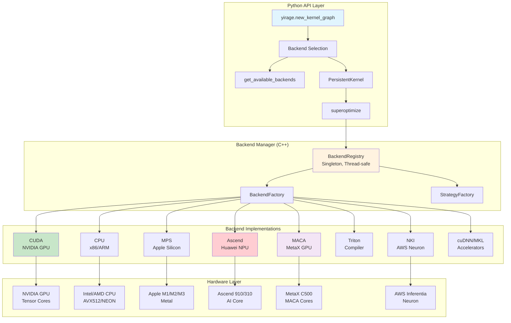
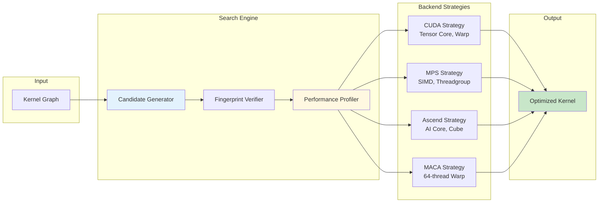

# YiRage - Yield Revolutionary AGile Engine

<div align="center">

**Multi-Backend LLM Inference Optimization**

[](LICENSE)
[](https://www.python.org/)
[](https://github.com/chenxingqiang/YiRage)

*Based on [Mirage](https://github.com/mirage-project/mirage) by CMU*

</div>

---

## 🎯 About YiRage

[](https://deepwiki.com/chenxingqiang/YiRage)

**YiRage** (Yield Revolutionary AGile Engine) extends Mirage with comprehensive **multi-backend support**, enabling LLM inference optimization across diverse hardware platforms.

### YiRage = Mirage + Multi-Backend Architecture

- **Original Mirage** (CMU): Superoptimizer framework for tensor programs
- **YiRage Extensions** (Chen Xingqiang, 2025): Multi-backend support with hardware-aware optimizations

---

## 🏗️ Architecture



### Three-Layer Design

**Layer 1: Python API**
- Backend query and selection (`get_available_backends()`)
- Kernel graph creation (`new_kernel_graph()`)
- Hardware-specific optimizers
- Search strategy access (`superoptimize()`)

**Layer 2: Backend Manager (C++)**
- BackendRegistry (singleton, thread-safe)
- Factory patterns for backends and strategies
- Automatic initialization on import

**Layer 3: Backend Implementations**
- 9 complete backends with hardware-specific optimizations
- Each backend includes optimizer and search strategy
- Direct hardware mapping for maximum performance

---

## ✨ Key Features

### 🚀 9 Complete Backend Implementations

| Backend | Hardware | Key Features | Status |
|---------|----------|--------------|--------|
| **CUDA** | NVIDIA GPU | Tensor Core, Warp, Bank Conflict Avoidance | ✅ |
| **CPU** | x86/ARM | SIMD (AVX512), Cache Blocking, OpenMP | ✅ |
| **MPS** | Apple Silicon | Metal, Threadgroup, Unified Memory | ✅ |
| **Ascend** | Huawei NPU | AI Core, Cube Unit, L1 Buffer, BiSheng | ✅ |
| **MACA** | MetaX GPU | CUDA-compat, Tensor Core, MCCL | ✅ NEW |
| **Triton** | Compiler | Auto-tuning, Pipelining, Split-K | ✅ |
| **NKI** | AWS Neuron | SBUF, DMA, BF16 Native | ✅ |
| **cuDNN** | CUDA Accel | Algorithm Selection, Tensor Op | ✅ |
| **MKL** | Intel Accel | Threading, BLAS, Fast MM | ✅ |

### 🎯 Hardware-Aware Kernel Optimizers

- **42+ Optimization Methods** across all backends
- **Automatic Configuration** based on hardware capabilities
- **Performance Modeling** for each backend

#### Example: CUDA Optimizer
```python
from yirage.kernel.cuda import CUDAOptimizer, CUDAKernelConfig

config = CUDAKernelConfig()
CUDAOptimizer.optimize_grid_block_dims(1024, 1024, 1024, 
                                        compute_capability=80, 
                                        config=config)
# Auto-configured: Tensor Core, Warps, Shared Memory, Occupancy
```

#### Example: MPS Optimizer (Apple Silicon)
```python
from yirage.kernel.mps import MPSOptimizer, MPSKernelConfig

config = MPSKernelConfig()
MPSOptimizer.optimize_for_apple_silicon(1024, 1024, 1024, config)
# Auto-detects: M1/M2/M3, GPU cores, Threadgroup size
```

#### Example: Ascend Optimizer (Huawei NPU)
```python
import yirage as yr

# Create and optimize for Ascend NPU
graph = yr.new_kernel_graph()
X = graph.new_input(dims=(8, 4096), dtype=yr.float16)
W = graph.new_input(dims=(4096, 4096), dtype=yr.float16)
O = graph.matmul(X, W)
graph.mark_output(O)

# Optimize using Ascend backend (via BiSheng + Triton)
optimized = graph.superoptimize(backend='ascend')
# Auto-configures: AI Core blocks, Cube unit tiles, L1 buffer
```

#### Example: MACA Optimizer (MetaX GPU) 🆕
```python
import yirage as yr

# Create and optimize for MetaX MACA GPU
graph = yr.new_kernel_graph()
X = graph.new_input(dims=(8, 4096), dtype=yr.float16)
W = graph.new_input(dims=(4096, 4096), dtype=yr.float16)
O = graph.matmul(X, W)
graph.mark_output(O)

# Optimize using MACA backend (CUDA-compatible)
optimized = graph.superoptimize(backend='maca')
# Auto-configures: Tensor cores, tile sizes, shared memory

# MACA uses CUDA-compatible programming model
# Environment: export MACA_HOME=/opt/maca
```

### 🔍 Backend-Specific Search Strategies



- **5 Independent Search Strategies** with hardware-specific optimization
- **15 Candidate Generation Dimensions**
- **13 Performance Evaluation Metrics**
- Auto-tuning and performance modeling

---

## 🚀 Quick Start

### Installation

#### Standard Installation (CUDA/CPU/MPS)

```bash
# From GitHub
git clone https://github.com/chenxingqiang/YiRage.git
cd YiRage
pip install -e .
export YIRAGE_HOME=$(pwd)
```

#### Huawei Ascend NPU Installation

For Ascend NPU systems, follow the complete installation guide:

📖 **[Ascend Installation Guide](docs/ascend_installation_guide.md)**

Quick steps:
```bash
# 1. Load Ascend environment
export LD_LIBRARY_PATH=/usr/local/Ascend/driver/lib64:/usr/local/Ascend/driver/lib64/driver:$LD_LIBRARY_PATH
source /usr/local/Ascend/ascend-toolkit/set_env.sh

# 2. Install dependencies
pip install triton-ascend z3-solver

# 3. Build and install
cp config.ascend.cmake config.cmake
mkdir build && cd build
cmake .. -DCMAKE_BUILD_TYPE=Release
make -j$(nproc)
cd .. && pip install -e .

# 4. Verify
python tests/ascend/test_triton_integration.py
```

### Basic Usage

```python
import yirage as yr

# Query available backends
backends = yr.get_available_backends()
print(f"Available backends: {backends}")
# Output: ['cuda', 'cpu', 'mps']  # depends on your hardware

# Check specific backend
if yr.is_backend_available('mps'):
    print("Apple Silicon GPU ready!")

# Create kernel with backend selection
mpk = yr.PersistentKernel(
    mode="decode",
    backend="mps",              # Specify backend
    fallback_backends=["cpu"],  # Auto fallback
    world_size=1,
    mpi_rank=0,
    # ... other parameters
)
```

### Using Hardware-Specific Optimizers

```python
# CUDA optimization
from yirage.kernel.cuda import CUDAOptimizer, CUDAKernelConfig

cuda_config = CUDAKernelConfig()
CUDAOptimizer.optimize_grid_block_dims(m=1024, n=1024, k=1024, 
                                        compute_capability=80, 
                                        config=cuda_config)

# CPU optimization
from yirage.kernel.cpu import CPUOptimizer, CPUKernelConfig

cpu_config = CPUKernelConfig()
CPUOptimizer.optimize_for_cpu(m=1024, n=1024, k=1024, config=cpu_config)
# Auto-detects: SIMD type, CPU cores, cache sizes

# MPS optimization (Apple Silicon)
from yirage.kernel.mps import MPSOptimizer, MPSKernelConfig

mps_config = MPSKernelConfig()
MPSOptimizer.optimize_for_apple_silicon(m=1024, n=1024, k=1024, config=mps_config)
# Auto-detects: GPU family (M1/M2/M3), cores, memory
```

---

## 📊 Performance

### M3 Mac Benchmarks

| Benchmark | MPS (ms) | CPU (ms) |
|-----------|----------|----------|
| gated_mlp | 0.677 | 1.268 |
| rms_norm | 0.463 | 0.115 |
| lora | 0.637 | 0.590 |
| gqa | 0.554 | - |
| norm_transformer | 1.195 | - |

*All benchmarks support CUDA, MPS, and CPU backends*

---

## 📚 Documentation

- **[Quick Start](docs/quickstart.md)** - Get started in 5 minutes
- **[API Reference](docs/api.md)** - Complete API documentation
- **[Backend Guide](docs/mpk/backend_usage.md)** - Backend usage and configuration
- **[Architecture Design](docs/mpk/multi_backend_design.md)** - System design

### Hardware-Specific Guides

| Platform | Guide | Description |
|----------|-------|-------------|
| **Huawei Ascend NPU** | [Installation Guide](docs/ascend_installation_guide.md) | Complete setup, build, and test instructions |
| **Huawei Ascend NPU** | [Quick Start](docs/ascend_quick_start.md) | Quick API usage examples |
| **MetaX MACA GPU** | [Quick Start](docs/maca_quick_start.md) | MetaX GPU integration 🆕 |

- **[Contributing](CONTRIBUTING.md)** - Contribution guidelines

---

## 🎓 Examples

### Run Benchmarks

```bash
# MPS backend (Apple Silicon)
python benchmark/baselines/pytorch/gated_mlp.py -b 8 --backend mps

# CUDA backend (NVIDIA GPU)
python benchmark/baselines/pytorch/gated_mlp.py -b 8 --backend cuda

# CPU backend
python benchmark/baselines/pytorch/gated_mlp.py -b 8 --backend cpu

# Ascend backend (Huawei NPU) - requires CANN + torch_npu
python benchmark/baselines/pytorch/gated_mlp.py -b 8 --backend ascend

# MACA backend (MetaX GPU) - requires MACA SDK
python benchmark/baselines/pytorch/gated_mlp.py -b 8 --backend maca
```

### Backend Selection

```python
import yirage as yr

# Method 1: Direct specification
mpk = yr.PersistentKernel(backend="mps", ...)

# Method 2: With fallback
mpk = yr.PersistentKernel(
    backend="cuda",
    fallback_backends=["mps", "cpu"],  # Auto fallback
    ...
)

# Method 3: Query and select
backends = yr.get_available_backends()
best_backend = backends[0]  # Use first available
```

---

## 🤝 Contributing

We welcome contributions! Please see [CONTRIBUTING.md](CONTRIBUTING.md) for guidelines.

### Adding a New Backend

1. Implement `BackendInterface`
2. Create `{Backend}KernelConfig`
3. Implement `{Backend}Optimizer`
4. Create `{Backend}SearchStrategy` (optional)
5. Update CMake configuration

See [Ascend Implementation Guide](docs/ascend_implementation_guide.md) for a complete example.

---

## 📄 License

YiRage is licensed under the Apache License 2.0.

**Copyright**:
- YiRage Multi-Backend Extensions: Copyright 2025 Chen Xingqiang
- Original Mirage: Copyright 2023-2024 Carnegie Mellon University

See [LICENSE](LICENSE), [NOTICE](NOTICE), and [ATTRIBUTION](status/ATTRIBUTION.md) for details.

---

## 📚 Citation

```bibtex
@software{yirage2025,
  title={YiRage: Yield Revolutionary AGile Engine for Multi-Backend LLM Inference},
  author={Chen, Xingqiang},
  year={2025},
  note={A derivative work based on Mirage},
  url={https://github.com/chenxingqiang/YiRage}
}

@inproceedings{wu2024mirage,
  title={Mirage: A Multi-Level Superoptimizer for Tensor Programs}, 
  author={Mengdi Wu and Xinhao Cheng and Shengyu Liu and others},
  booktitle={OSDI 2025},
  year={2025}
}
```

---

## 🙏 Acknowledgments

YiRage builds upon the excellent work of the Mirage team at Carnegie Mellon University.

---

## 📞 Contact

- **Issues**: [GitHub Issues](https://github.com/chenxingqiang/YiRage/issues)
- **Author**: Chen Xingqiang
- **Email**: joy6677@outlook.com

---

**YiRage** - Yielding Maximum Performance Across All Hardware 🚀

Copyright 2025 Chen Xingqiang | Based on Mirage (CMU) | Apache License 2.0
