# YiRage Architecture Documentation

This document provides comprehensive architecture diagrams for the YiRage multi-backend LLM inference optimization framework.

## System Overview

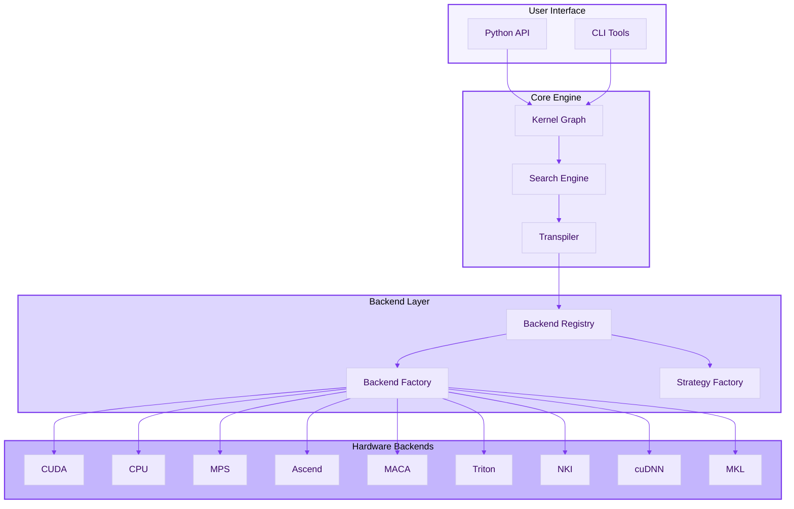

## Backend Architecture

### Multi-Backend Support

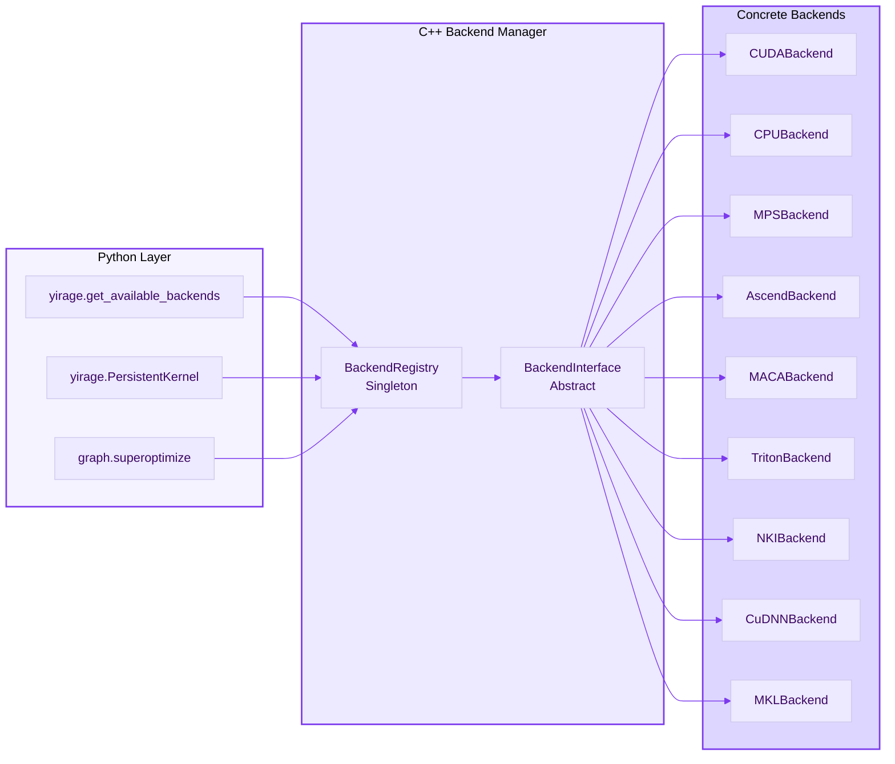

### Backend Selection Flow

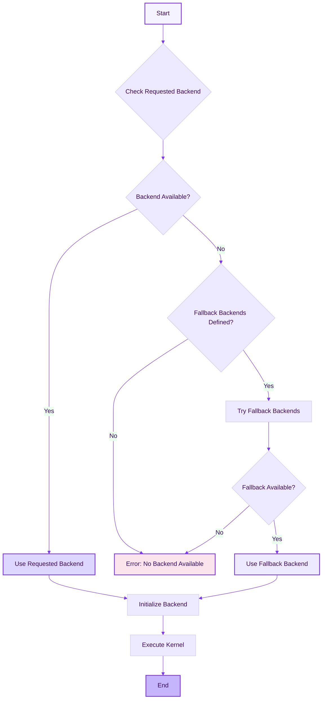

## Search Engine Architecture

### Superoptimization Pipeline

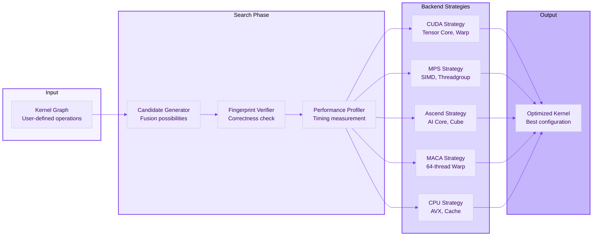

### Fingerprint Verification

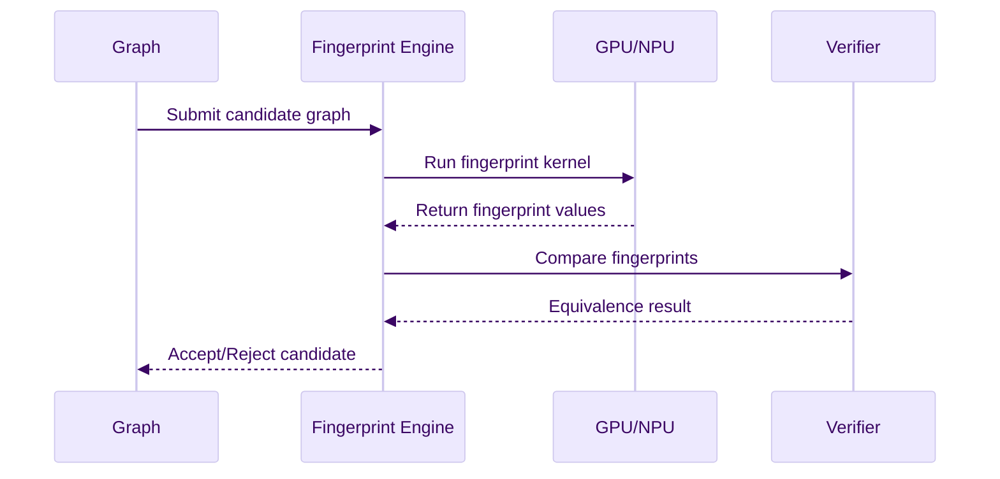

## Hardware Backend Details

### CUDA Backend

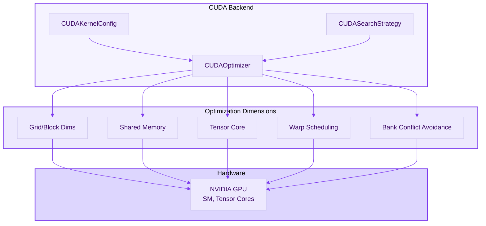

### Ascend Backend

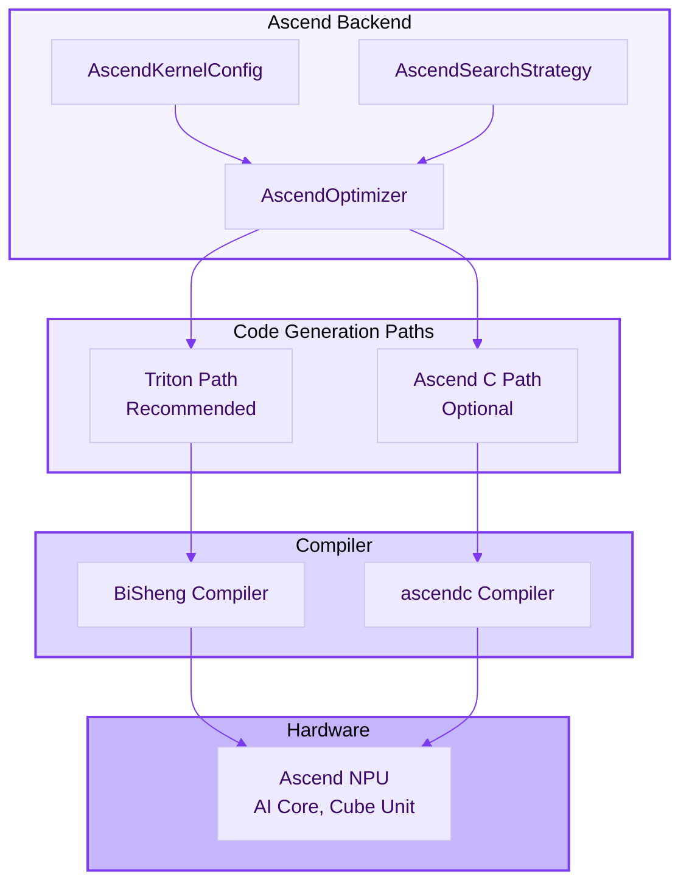

### MACA Backend

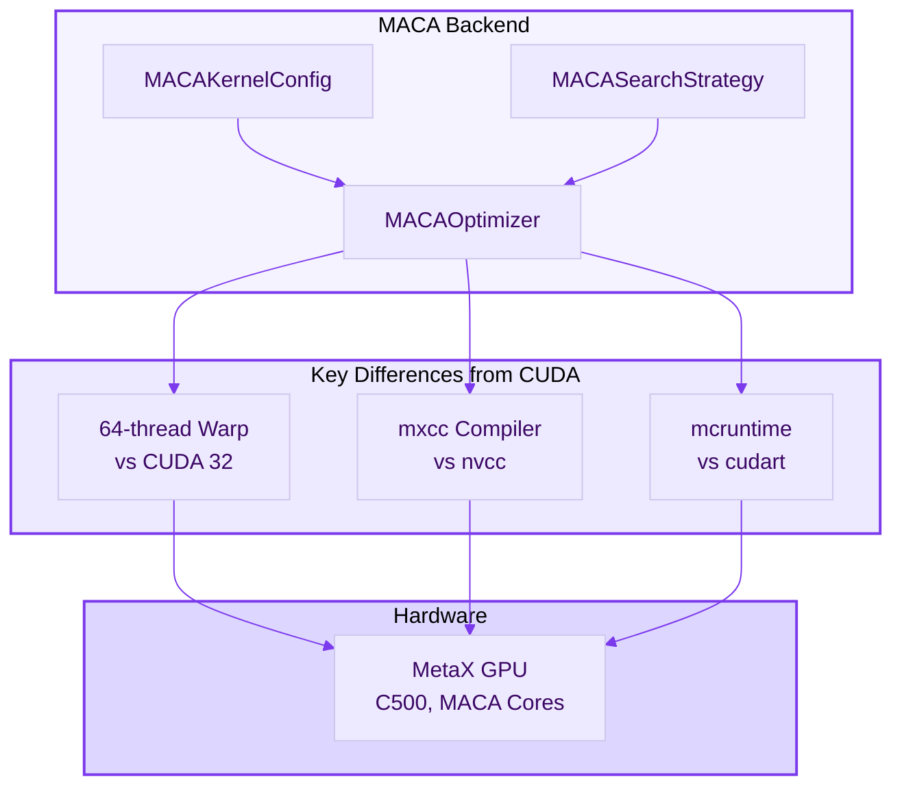

### MPS Backend (Apple Silicon)

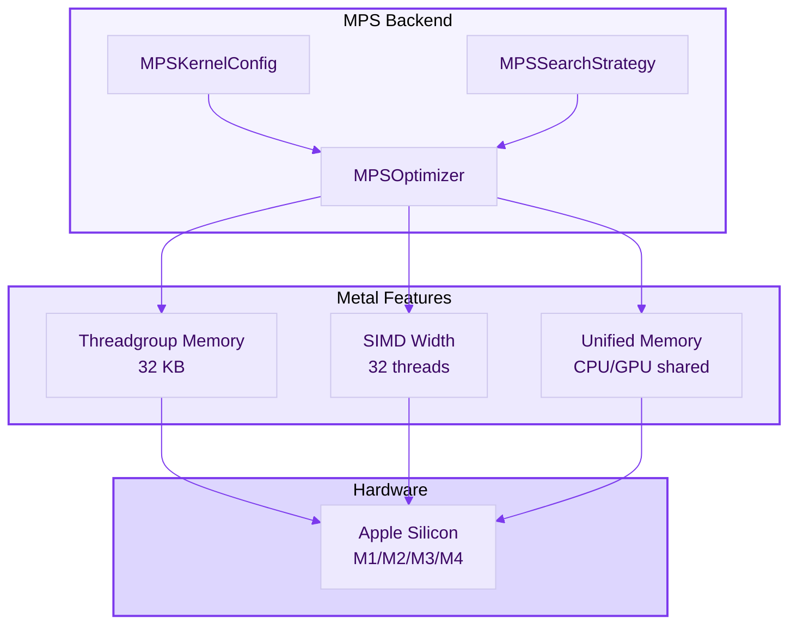

## Memory Hierarchy

### GPU Memory Model

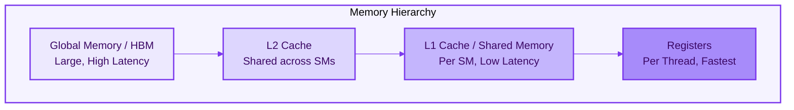

### Backend Memory Configuration

| Backend | Device Memory | Shared/Local Memory | Notes |
|---------|--------------|---------------------|-------|
| CUDA | 2-80 GB HBM | 96 KB (Ampere+) | Tensor Cores |
| MPS | 8-192 GB Unified | 32 KB Threadgroup | Apple Silicon |
| Ascend | 32-64 GB HBM | 512 KB L1 Buffer | AI Core |
| MACA | 16-64 GB HBM | 64 KB Shared | CUDA-compatible |
| CPU | System RAM | L1/L2/L3 Cache | SIMD |

## Transpiler Architecture

### Code Generation Flow

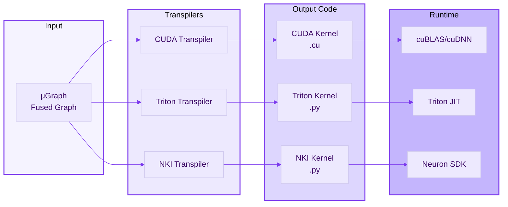

## API Layer

### Python API Structure

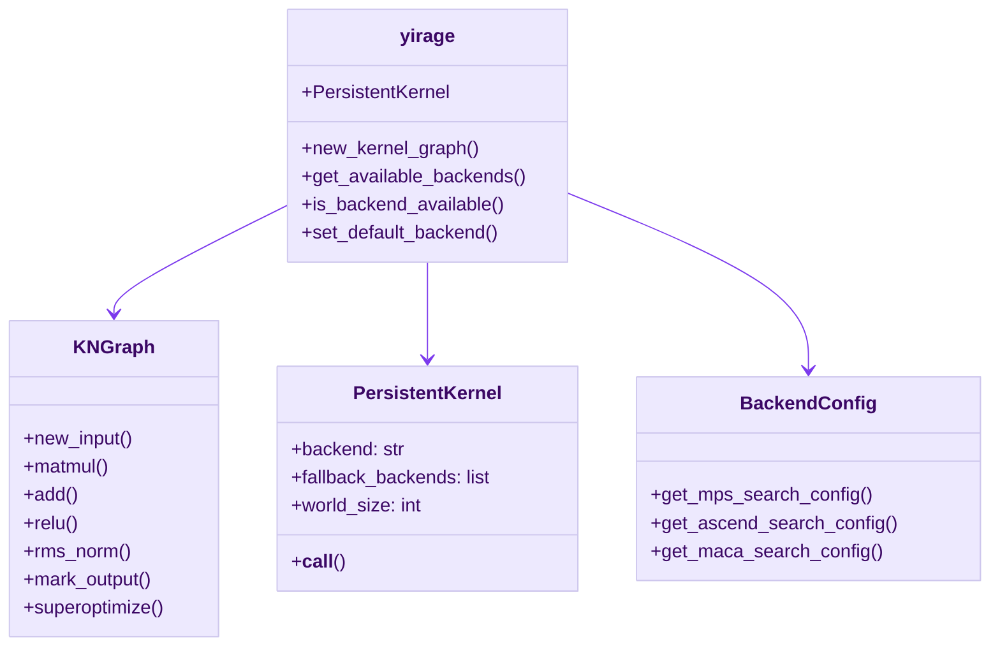

## Performance Optimization Flow

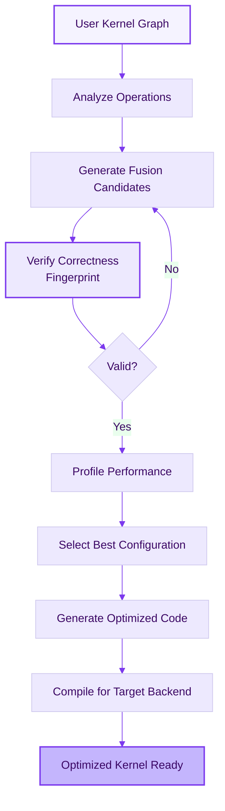

---

## References

- [YiRage GitHub Repository](https://github.com/chenxingqiang/YiRage)
- [Mirage Paper (OSDI 2025)](https://github.com/mirage-project/mirage)
- [CUDA Programming Guide](https://docs.nvidia.com/cuda/)
- [Metal Programming Guide](https://developer.apple.com/metal/)
- [Ascend CANN Documentation](https://www.hiascend.com/document)
- [MACA SDK Documentation](https://www.metax-tech.com/)

---

*Document Version: 2025-12-18*  
*YiRage Project: https://github.com/chenxingqiang/YiRage*
