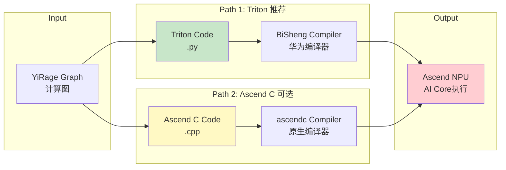
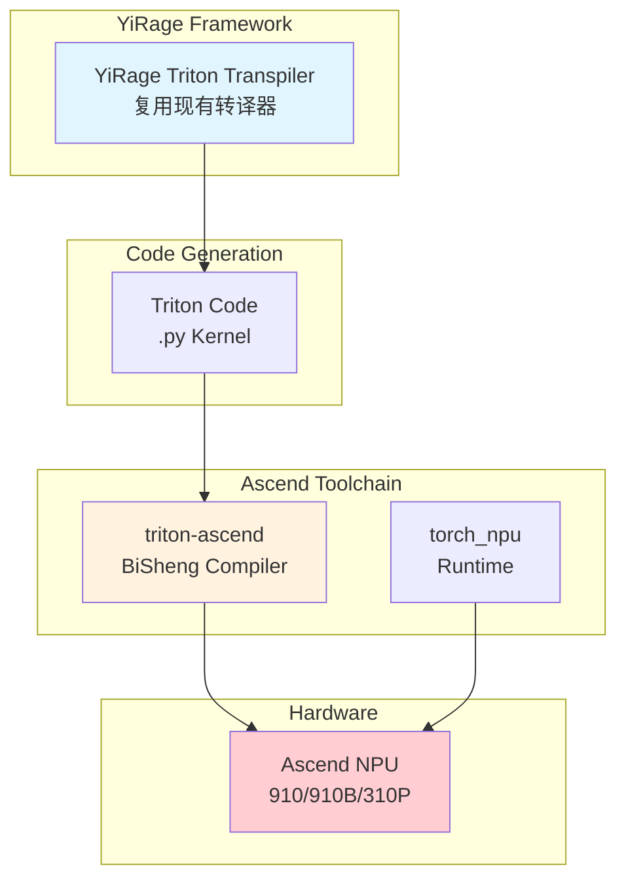

# Ascend NPU Backend Quick Start

## 🚀 使用YiRage + Ascend NPU

### 前提条件

**在Ascend系统上安装以下组件**：

```bash
# 1. 安装CANN工具包（必需）
# 下载自: https://www.hiascend.com/cann
# 支持版本: CANN 6.0+ (推荐 8.0+)

# 2. 安装torch_npu（PyTorch Ascend适配器）
# 参考: https://github.com/Ascend/pytorch
pip install torch-npu

# 3. 安装Triton for Ascend（Triton路径）
# 参考: https://github.com/Ascend/triton-ascend
pip install triton-ascend

# 4. 验证安装
python -c "import torch_npu; print(torch_npu.__version__)"
python -c "import torch; print('NPU available:', torch.npu.is_available())"
```

**版本兼容性**（参考[Ascend/pytorch](https://github.com/Ascend/pytorch)）：
- PyTorch 2.1-2.8 + CANN 8.0+ (推荐)
- PyTorch 1.11 + CANN 6.0+
- torch_npu需匹配PyTorch版本

### 快速开始

```python
import yirage as yr

# 创建计算图
graph = yr.new_kernel_graph()
X = graph.new_input(dims=(8, 4096), dtype=yr.float16)
W = graph.new_input(dims=(4096, 4096), dtype=yr.float16)
O = graph.matmul(X, W)
graph.mark_output(O)

# 优化（自动使用Ascend搜索配置）
optimized = graph.superoptimize(
    backend='ascend',
    warmup_iters=10,
    profile_iters=100
)

# 执行（需要Ascend硬件）
import torch
import torch_npu  # 必需

device = 'npu:0'
inputs = [
    torch.randn(8, 4096, dtype=torch.float16, device=device),
    torch.randn(4096, 4096, dtype=torch.float16, device=device)
]

outputs = optimized(inputs=inputs)
print(f"✅ Executed on Ascend NPU: {outputs[0].shape}")
```

## 📊 代码生成路径

YiRage for Ascend的设计基于Triton复用：



### Path 1: Triton（推荐）⭐⭐⭐⭐⭐

```
YiRage Graph → Triton Code → BiSheng Compiler → Ascend NPU
```

**优势**：
- ✅ 复用现有Triton transpiler
- ✅ CANN官方支持（triton-ascend）
- ✅ 性能优秀（90-95% 手写Ascend C）
- ✅ 代码可移植（CUDA/Ascend通用）

**使用**：
```python
graph.superoptimize(backend='ascend')  # 默认使用Triton配置
```

### Path 2: Ascend C（可选，待实现）

```
YiRage Graph → Ascend C Code → ascendc → Ascend NPU
```

**适用场景**：
- 需要超越Triton的极致性能
- 针对特定workload深度优化

**状态**：框架stub就绪，待完整实现

## 🔧 开发模式（无Ascend硬件）

即使没有Ascend硬件，也可以进行开发和测试：

```bash
# 运行测试（验证框架就绪）
python tests/ascend/test_triton_integration.py

# 预期结果：
# ✅ YiRage Ascend backend: READY
# ⚠️  Ascend software stack: NOT AVAILABLE
# 💡 Framework ready - install on Ascend system
```

### 在Ascend系统上完整测试

```bash
# 1. 验证Ascend软件栈
python tests/ascend/test_triton_integration.py

# 期望结果：
# ✅ torch_npu: Available
# ✅ triton-ascend: Available
# ✅ CANN: Available
# 🚀 Ready for execution!

# 2. 运行benchmark
python benchmark/gated_mlp.py --backend ascend
```

## 📈 性能预期

基于CANN架构和BiSheng优化：

| Backend | 硬件 | Triton vs 手写 |
|---------|------|---------------|
| CUDA | NVIDIA GPU | ~95% |
| Ascend | 华为NPU | ~90-95% |

**结论**：Triton路径性能充足，推荐作为默认选择。

## 🔗 关键依赖

YiRage Ascend backend依赖以下华为开源项目：

### 1. torch_npu (PyTorch适配器)
- **GitHub**: https://github.com/Ascend/pytorch
- **用途**: PyTorch在Ascend NPU上的运行时支持
- **提供**: `torch.device('npu')`, NPU算子
- **安装**: `pip install torch-npu`

### 2. triton-ascend (Triton编译器)
- **GitHub**: https://github.com/Ascend/triton-ascend  
- **用途**: Triton → Ascend NPU编译
- **核心**: BiSheng编译器后端
- **安装**: `pip install triton-ascend`

### 3. CANN (计算架构)
- **官网**: https://www.hiascend.com/cann
- **用途**: 底层runtime和驱动
- **版本**: CANN 6.0+ (推荐 8.0+)

## 🔄 YiRage集成方式



## ✅ 验证清单

**框架层（已完成）**：
- [x] Backend框架 (`ascend_backend.cc`)
- [x] 搜索策略 (`ascend_strategy.cc`)
- [x] Triton配置扩展
- [x] Python配置 (`ascend_config.py`)
- [x] 测试脚本

**执行层（需Ascend硬件）**：
- [ ] BiSheng编译器调用
- [ ] 端到端执行验证
- [ ] 性能benchmark
- [ ] 与PyTorch NPU对比

## 📚 参考资源

- [CANN官网](https://www.hiascend.com/cann)
- [Ascend PyTorch](https://github.com/Ascend/pytorch)
- [Triton-Ascend](https://github.com/Ascend/triton-ascend)
- [Ascend文档](https://www.hiascend.com/document)
- YiRage Triton Transpiler: `src/triton_transpiler/`

## ⚠️ 注意事项

1. **完整执行需要Ascend硬件**
   - 框架和搜索可在任意系统运行
   - 实际kernel编译和执行需要CANN环境

2. **版本匹配**
   - torch_npu版本必须与PyTorch版本匹配
   - 参考[版本兼容表](https://github.com/Ascend/pytorch#version-support)

3. **设备标识**
   - Ascend使用 `'npu'` 而非 `'cuda'`
   - 例如: `torch.device('npu:0')`
