# Ascend NPU Backend Quick Start

## 🚀 Using YiRage with Ascend NPU

### Prerequisites

**Install the following components on Ascend system**:

```bash
# 1. Install CANN toolkit (required)
# Download from: https://www.hiascend.com/cann
# Supported versions: CANN 6.0+ (8.0+ recommended)

# 2. Install torch_npu (PyTorch Ascend adapter)
# Reference: https://github.com/Ascend/pytorch
pip install torch-npu

# 3. Install Triton for Ascend (Triton path)
# Reference: https://github.com/Ascend/triton-ascend
pip install triton-ascend

# 4. Verify installation
python -c "import torch_npu; print(torch_npu.__version__)"
python -c "import torch; print('NPU available:', torch.npu.is_available())"
```

**Version Compatibility** (refer to [Ascend/pytorch](https://github.com/Ascend/pytorch)):
- PyTorch 2.1-2.8 + CANN 8.0+ (recommended)
- PyTorch 1.11 + CANN 6.0+
- torch_npu must match PyTorch version

### Quick Start

```python
import yirage as yr

# Create computation graph
graph = yr.new_kernel_graph()
X = graph.new_input(dims=(8, 4096), dtype=yr.float16)
W = graph.new_input(dims=(4096, 4096), dtype=yr.float16)
O = graph.matmul(X, W)
graph.mark_output(O)

# Optimize (automatically uses Ascend search configuration)
optimized = graph.superoptimize(
    backend='ascend',
    warmup_iters=10,
    profile_iters=100
)

# Execute (requires Ascend hardware)
import torch
import torch_npu  # Required

device = 'npu:0'
inputs = [
    torch.randn(8, 4096, dtype=torch.float16, device=device),
    torch.randn(4096, 4096, dtype=torch.float16, device=device)
]

outputs = optimized(inputs=inputs)
print(f"✅ Executed on Ascend NPU: {outputs[0].shape}")
```

## 📊 Code Generation Paths

YiRage for Ascend is designed based on Triton reuse:


### Path 1: Triton (Recommended) ⭐⭐⭐⭐⭐

```
YiRage Graph → Triton Code → BiSheng Compiler → Ascend NPU
```

**Advantages**:
- ✅ Reuses existing Triton transpiler
- ✅ Official CANN support (triton-ascend)
- ✅ Excellent performance (90-95% of hand-written Ascend C)
- ✅ Portable code (CUDA/Ascend compatible)

**Usage**:
```python
graph.superoptimize(backend='ascend')  # Uses Triton configuration by default
```

### Path 2: Ascend C (Optional, pending implementation)

```
YiRage Graph → Ascend C Code → ascendc → Ascend NPU
```

**Use Cases**:
- Need ultimate performance beyond Triton
- Deep optimization for specific workloads

**Status**: Framework stub ready, pending full implementation

## 🔧 Development Mode (Without Ascend Hardware)

Even without Ascend hardware, you can develop and test:

```bash
# Run tests (verify framework readiness)
python tests/ascend/test_triton_integration.py

# Expected results:
# ✅ YiRage Ascend backend: READY
# ⚠️  Ascend software stack: NOT AVAILABLE
# 💡 Framework ready - install on Ascend system
```

### Full Testing on Ascend System

```bash
# 1. Verify Ascend software stack
python tests/ascend/test_triton_integration.py

# Expected results:
# ✅ torch_npu: Available
# ✅ triton-ascend: Available
# ✅ CANN: Available
# 🚀 Ready for execution!

# 2. Run benchmark
python benchmark/gated_mlp.py --backend ascend
```

## 📈 Performance Expectations

Based on CANN architecture and BiSheng optimization:

| Backend | Hardware | Triton vs Hand-written |
|---------|----------|------------------------|
| CUDA | NVIDIA GPU | ~95% |
| Ascend | Huawei NPU | ~90-95% |

**Conclusion**: Triton path provides sufficient performance, recommended as default choice.

## 🔗 Key Dependencies

YiRage Ascend backend depends on the following Huawei open-source projects:

### 1. torch_npu (PyTorch Adapter)
- **GitHub**: https://github.com/Ascend/pytorch
- **Purpose**: PyTorch runtime support on Ascend NPU
- **Provides**: `torch.device('npu')`, NPU operators
- **Installation**: `pip install torch-npu`

### 2. triton-ascend (Triton Compiler)
- **GitHub**: https://github.com/Ascend/triton-ascend  
- **Purpose**: Triton → Ascend NPU compilation
- **Core**: BiSheng compiler backend
- **Installation**: `pip install triton-ascend`

### 3. CANN (Compute Architecture)
- **Website**: https://www.hiascend.com/cann
- **Purpose**: Low-level runtime and drivers
- **Version**: CANN 6.0+ (8.0+ recommended)

## 🔄 YiRage Integration Flow

```mermaid
%%{init: {'theme': 'base', 'themeVariables': { 'primaryColor': '#e3f2fd', 'lineColor': '#42a5f5'}}}%%
flowchart TB
    subgraph YIRAGE["🔷 YiRage Framework"]
        A["<b>Triton Transpiler</b><br/><i>Code Reuse ✓</i>"]
    end

    subgraph CODEGEN["📝 Code Generation"]
        B["Triton Kernel<br/><code>.py</code>"]
    end

    subgraph ASCEND["🔶 Ascend Toolchain"]
        C["<b>triton-ascend</b><br/><i>BiSheng Compiler</i>"]
        D["<b>torch_npu</b><br/><i>PyTorch Runtime</i>"]
    end

    subgraph HW["🖥️ Hardware"]
        E["<b>Ascend NPU</b><br/>910 / 910B / 310P"]
    end

    A --> B --> C --> E
    D --> E

    style YIRAGE fill:#e3f2fd,stroke:#1976d2,stroke-width:2px
    style CODEGEN fill:#f3e5f5,stroke:#7b1fa2,stroke-width:2px
    style ASCEND fill:#fff8e1,stroke:#ffa000,stroke-width:2px
    style HW fill:#fce4ec,stroke:#c2185b,stroke-width:2px
```



## ✅ Verification Checklist

**Framework Layer (Completed)**:
- [x] Backend framework (`ascend_backend.cc`)
- [x] Search strategy (`ascend_strategy.cc`)
- [x] Triton configuration extension
- [x] Python configuration (`ascend_config.py`)
- [x] Test scripts

**Execution Layer (Requires Ascend Hardware)**:
- [ ] BiSheng compiler invocation
- [ ] End-to-end execution verification
- [ ] Performance benchmark
- [ ] Comparison with PyTorch NPU

## 📚 Reference Resources

- [CANN Website](https://www.hiascend.com/cann)
- [Ascend PyTorch](https://github.com/Ascend/pytorch)
- [Triton-Ascend](https://github.com/Ascend/triton-ascend)
- [Ascend Documentation](https://www.hiascend.com/document)
- YiRage Triton Transpiler: `src/triton_transpiler/`

## ⚠️ Important Notes

1. **Full execution requires Ascend hardware**
   - Framework and search can run on any system
   - Actual kernel compilation and execution require CANN environment

2. **Version matching**
   - torch_npu version must match PyTorch version
   - Refer to [version compatibility table](https://github.com/Ascend/pytorch#version-support)

3. **Device identifier**
   - Ascend uses `'npu'` instead of `'cuda'`
   - Example: `torch.device('npu:0')`

---

*Document Version: 2025-12-18*  
*YiRage Project: https://github.com/chenxingqiang/YiRage*
