# Backend Configuration Mechanism Comparison: CUDA vs MPS vs CPU vs Ascend

## Architecture Overview

```mermaid
%%{init: {'theme': 'base', 'themeVariables': { 'primaryColor': '#e3f2fd', 'lineColor': '#546e7a'}}}%%
graph TB
    subgraph ENGINE["🔍 YiRage Search Engine"]
        A["<b>Kernel Optimizer</b><br/><i>Configuration Manager</i>"]
    end

    subgraph METHODS["⚙️ Configuration Retrieval Methods"]
        B["<b>CUDA</b><br/>Dynamic Runtime Query"]
        C["<b>MPS</b><br/>Static Config File"]
        D["<b>CPU</b><br/>Cache-based Static"]
        E["<b>Ascend</b><br/>Static + npu-smi"]
    end

    subgraph SOURCES["📊 Hardware Information Sources"]
        F["cudaDeviceProp<br/><i>NVIDIA API</i>"]
        G["Apple Docs<br/><i>Metal Feature Set</i>"]
        H["Architecture Specs<br/><i>Cache Hierarchy</i>"]
        I["CANN + npu-smi<br/><i>Huawei Specs</i>"]
    end

    A --> B & C & D & E
    B --> F
    C --> G
    D --> H
    E --> I

    style ENGINE fill:#e3f2fd,stroke:#1976d2,stroke-width:2px
    style METHODS fill:#fff8e1,stroke:#ffa000,stroke-width:2px
    style SOURCES fill:#f3e5f5,stroke:#7b1fa2,stroke-width:2px
    style B fill:#c8e6c9,stroke:#2e7d32,stroke-width:2px
    style C fill:#ffe0b2,stroke:#ef6c00,stroke-width:2px
    style D fill:#bbdefb,stroke:#1565c0,stroke-width:2px
    style E fill:#f8bbd9,stroke:#ad1457,stroke-width:2px
```



## Why Do We Need These Configuration Parameters?

These configuration parameters are the **core of kernel optimization search space**, directly determining:

1. **Parallelism** (Grid/Block Dimensions)
   - Grid dimensions: Determines how many thread blocks to launch
   - Block dimensions: How many threads per block
   - Directly affects GPU/CPU utilization and performance

2. **Memory Access Patterns** (Shared Memory Configuration)
   - Each backend has different shared memory sizes
   - Affects data caching strategies and memory access efficiency

3. **Loop Optimization** (Forloop Ranges)
   - Loop unrolling degree
   - Affects instruction-level parallelism and register usage

4. **Search Efficiency** (Search Threads)
   - Multi-threaded parallel search for optimal configuration
   - Balances search time and quality

---

## CUDA Backend: Dynamic Runtime Query

### 🔍 Information Retrieval Method

CUDA uses **runtime API to dynamically query GPU hardware**:

```c++
// src/utils/cuda_helper.cu
size_t get_max_shared_mem() {
  int device;
  cudaGetDevice(&device);
  cudaDeviceProp deviceProps;
  cudaGetDeviceProperties(&deviceProps, device);
  return deviceProps.sharedMemPerBlock;
}
```

```python
# python/yirage/utils.py
def get_configurations_from_gpu(rank):
    props = torch.cuda.get_device_properties(rank)
    sm_cnt = props.multi_processor_count  # Query SM count
    # Dynamically determine worker and scheduler config based on SM count
    if sm_cnt >= 160:
        worker = 144
    elif sm_cnt >= 132:
        worker = 128
    # ...
```

### 📊 Hardware Information Available via CUDA

Through `cudaDeviceProp`:

| Property | Description | Example (RTX 3090) |
|----------|-------------|-------------------|
| `multiProcessorCount` | SM count | 82 |
| `sharedMemPerBlock` | Shared memory per block | 48 KB |
| `maxThreadsPerBlock` | Max threads per block | 1024 |
| `maxThreadsDim[3]` | Block dimension limits | (1024, 1024, 64) |
| `maxGridSize[3]` | Grid dimension limits | (2³¹-1, 65535, 65535) |
| `warpSize` | Warp size | 32 |
| `computeCapability` | Compute capability | 8.6 |
| `hasTensorCores` | Has Tensor Cores | Yes |
| `memoryBusWidth` | Memory bus width | 384-bit |

### 🎯 CUDA Configuration Generation Strategy

```cpp
// src/search/backend_strategies/cuda_strategy.cc
CUDASearchStrategy::CUDASearchStrategy(int compute_capability)
    : compute_capability_(compute_capability),
      has_tensor_cores_(compute_capability >= 70) {}  // ← Based on compute capability

std::vector<CandidateConfig>
CUDASearchStrategy::generate_candidates(kernel::Graph const &graph) {
  // Dynamically generate warp configurations
  auto warp_configs = generate_warp_configs(m * n);
  
  // If Tensor Cores available, generate Tensor Core configs
  if (has_tensor_cores_) {
    tc_configs = generate_tensor_core_configs(m, n, k);
  }
  
  // Dynamically generate grid/block configs
  auto grid_block_configs = generate_grid_block_configs(m, n);
  
  // Try different shared memory layouts
  for (auto layout : {ROW_MAJOR, SWIZZLED}) {
    // ...
  }
}
```

### 📐 CUDA Dynamic Configuration Logic

```cpp
// src/kernel/cuda/cuda_optimizer.cc
if (config.use_tensor_core) {
    // Tensor Core configuration (Ampere architecture)
    int tile_m = config.mma_m * 4; // 64
    int tile_n = config.mma_n * 4; // 32
    int tile_k = config.mma_k * 2; // 32
    
    config.block_dim_x = 32;  // Warp size
    config.block_dim_y = 4;   // 4 warps
    config.num_warps = 4;
} else {
    // Traditional CUDA cores configuration
    int block_size = 256;
    int tile_size = 32;
    config.block_dim_x = block_size;
    config.num_warps = (block_size + 31) / 32;
}
```

### 🔧 CUDA Static Constants Configuration

```cpp
// include/yirage/config.h
#ifdef YIRAGE_BACKEND_CUDA_ENABLED
namespace cuda {
size_t const MAX_DMEM_SIZE = (size_t)2 * 1024 * 1024 * 1024;    // 2 GB
size_t const MAX_SMEM_SIZE = 96 * 1024;                         // 96 KB (Ampere+)
}
#endif

// Common constants
size_t const MAX_NUM_THREADBLOCKS_PER_KERNEL = 4096;
int const NUM_THREADS_PER_WARP = 32;
int const MAX_NUM_WARP_GROUPS = 4;
```

---

## MPS Backend: Static Configuration File

### 🔍 Information Retrieval Method

MPS uses **static configuration file** (`python/yirage/mps_config.py`):

```python
def get_mps_search_config():
    # Dynamically get CPU core count (for search parallelism)
    cpu_count = multiprocessing.cpu_count()
    search_threads = max(4, int(cpu_count * 0.75))
    
    return {
        # Statically defined hardware limits
        "max_num_threadblock_graph_op": 6,
        "max_num_kernel_graph_op": 4,
        
        # Statically defined search space
        "grid_dims_to_explore": [
            (32, 1, 1),   # SIMD-aligned
            (64, 1, 1),
            (128, 1, 1),
            # ...
        ],
        
        "block_dims_to_explore": [
            (32, 1, 1),   # 1 SIMD group
            (64, 1, 1),   # 2 SIMD groups
            # ...
        ],
    }
```

### ⚠️ MPS Limitations and Solutions

**MPS cannot fully query GPU hardware info**, reasons:

1. **Metal API limitations**: Metal doesn't have a direct API like `cudaDeviceProp`
2. **Permission issues**: Requires `MTLDevice` object, but Python layer doesn't directly expose it
3. **Version differences**: M1/M2/M3 specs differ, but Metal API returns limited info

**But system memory size can be queried**:

```python
# python/yirage/mps_config.py
def get_system_memory_size():
    # Get via sysctl command
    result = subprocess.run(['sysctl', '-n', 'hw.memsize'], ...)
    return int(result.stdout.strip())  # Returns bytes

def get_mps_memory_config():
    total_mem = get_system_memory_size()
    # Use 75% of memory, reserve space for system
    return int(total_mem * 0.75)
```

**Memory configurations for different Mac models**:

| Model | Memory Options |
|-------|---------------|
| M1/M2/M3 | 8GB, 16GB, 24GB |
| M1/M2/M3 Pro | 16GB, 18GB, 32GB, 36GB |
| M1/M2/M3 Max | 32GB, 48GB, 64GB, 96GB, 128GB |
| M1/M2/M3 Ultra | 64GB, 128GB, 192GB, 512GB |

### 🛠 Information MPS Can Obtain Indirectly

```python
# Via system_profiler (macOS command-line tool)
def get_apple_gpu_info():
    result = subprocess.run(
        ['system_profiler', 'SPDisplaysDataType'],
        capture_output=True, text=True
    )
    # Parse output to determine M1/M2/M3 and Pro/Max variants
```

However, this approach:
- ❌ Not reliable enough (depends on system commands)
- ❌ Limited info (can only determine chip model)
- ❌ Cannot get real-time GPU status

### 📐 MPS Static Configuration Basis

Based on Apple official documentation hardware specs:

| Spec | All M-series Common | Source |
|------|---------------------|--------|
| Threadgroup memory | 32 KB | Metal Feature Set Tables |
| SIMD width | 32 | Metal Programming Guide |
| Max threads/threadgroup | 1024 | Metal Programming Guide |
| Unified memory | Yes | Apple Silicon architecture |

```cpp
// include/yirage/config.h
#ifdef YIRAGE_BACKEND_MPS_ENABLED
namespace mps {
size_t const MAX_DMEM_SIZE = (size_t)16 * 1024 * 1024 * 1024;   // 16 GB (unified memory)
size_t const MAX_SMEM_SIZE = 64 * 1024;                         // 64 KB (threadgroup)
                                                                 // ↑ Configured as 64KB, but actual is 32KB!
}
#endif
```

**⚠️ Issue Found**: `MAX_SMEM_SIZE = 64KB` in `config.h` doesn't match actual specs!

---

## CPU Backend: Cache-based Static Configuration

### 🔍 Information Retrieval Method

CPU also uses **static configuration**, but based on general CPU architecture characteristics:

```python
def get_cpu_search_config():
    cpu_count = multiprocessing.cpu_count()
    search_threads = max(4, int(cpu_count * 0.75))
    
    return {
        # CPU-specific configuration
        "max_num_threadblock_graph_op": 5,
        "max_num_kernel_graph_op": 3,
        
        # Cache hierarchy-based configuration
        "grid_dims_to_explore": [
            (8, 1, 1),    # L1 cache friendly
            (16, 1, 1),   # L2 cache friendly
            (32, 1, 1),   # Cache line aligned
            (64, 1, 1),
        ],
    }
```

### 📊 CPU Configuration Design Basis

```cpp
#ifdef YIRAGE_BACKEND_CPU_ENABLED
namespace cpu {
size_t const MAX_DMEM_SIZE = (size_t)64 * 1024 * 1024 * 1024;   // 64 GB (system RAM)
size_t const MAX_SMEM_SIZE = (size_t)32 * 1024 * 1024;          // 32 MB (L3 cache)
}
#endif
```

Based on common CPU architecture:
- **L1 Cache**: 32-64 KB (per core)
- **L2 Cache**: 256 KB - 1 MB (per core)
- **L3 Cache**: 8-64 MB (shared)
- **Cache Line**: 64 bytes
- **Vector Width**: AVX2 (256-bit), AVX-512 (512-bit), NEON (128-bit)

---

## Ascend Backend: Static Configuration + Device Detection

### 🔍 Information Retrieval Method

Ascend uses **static configuration** + **npu-smi detection**:

```python
# python/yirage/ascend_config.py
def get_ascend_search_config():
    cpu_count = multiprocessing.cpu_count()
    search_threads = max(4, int(cpu_count * 0.75))
    
    return {
        # Ascend architecture-based static configuration
        "max_num_threadblock_graph_op": 8,
        "max_num_kernel_graph_op": 5,
        
        # Grid dimensions (AI Core blocks)
        "grid_dims_to_explore": [
            (1, 1, 1),    # Single block
            (8, 1, 1),    # 8 blocks
            (32, 1, 1),   # 32 blocks (full 910/910B)
            # ...
        ],
        
        # Block dimensions
        "block_dims_to_explore": [
            (1, 1, 1),    # 1 AI Core
            (8, 1, 1),    # 8 AI Cores
            (32, 1, 1),   # 32 AI Cores
        ],
        
        # Forloop ranges - Cube operation optimization
        "franges_to_explore": [4, 8, 16],
    }
```

### 📊 Ascend Hardware Detection

```python
# python/yirage/ascend_config.py
def get_ascend_device_info():
    """Detect device type via npu-smi"""
    try:
        result = subprocess.run(
            ['npu-smi', 'info'],
            capture_output=True,
            text=True,
            timeout=2
        )
        
        if result.returncode == 0:
            output = result.stdout
            
            if 'Ascend 910B' in output:
                return {
                    'device_type': 'Ascend 910B',
                    'ai_cores': 32,
                    'hbm_gb': 64,
                    'l1_kb': 512
                }
            elif 'Ascend 910' in output:
                return {
                    'device_type': 'Ascend 910',
                    'ai_cores': 32,
                    'hbm_gb': 32,
                    'l1_kb': 256
                }
            elif 'Ascend 310P' in output:
                return {
                    'device_type': 'Ascend 310P',
                    'ai_cores': 8,
                    'hbm_gb': 8,
                    'l1_kb': 128
                }
    except:
        pass
    return None
```

### 📐 Ascend Configuration Constants

```cpp
// include/yirage/config.h
#ifdef YIRAGE_BACKEND_ASCEND_ENABLED
namespace ascend {
// Ascend 910B: 64GB HBM2e
size_t const MAX_DMEM_SIZE = (size_t)64 * 1024 * 1024 * 1024;  // 64 GB
// AI Core L1 Buffer
size_t const MAX_SMEM_SIZE = 512 * 1024;                        // 512 KB
}
#endif
```

### 📊 Ascend Hardware Specifications Comparison

| Model | AI Cores | HBM | L1 Buffer | Use Case |
|-------|----------|-----|-----------|----------|
| **Ascend 910** | 32 | 32GB | 256KB | Training |
| **Ascend 910B** | 32 | 64GB | 512KB | Training/Inference |
| **Ascend 310P** | 8 | 8GB | 128KB | Inference |

### 🎯 Ascend Configuration Characteristics

1. **Cube Unit Optimization**
   - Native 16x16 matrix multiplication
   - Grid/Block configuration based on AI Core count
   - Forloop range optimized for multiples of 16

2. **L1 Buffer Management**
   - 256KB-512KB per AI Core
   - Tile size limited by L1
   - Automatic data movement optimization

3. **Device Detection**
   - Detection via npu-smi command
   - Supports 910/910B/310P auto-detection
   - Uses default configuration when no device available

---

## Four Backend Configuration Comparison Summary

| Dimension | CUDA | MPS | CPU | Ascend |
|-----------|------|-----|-----|--------|
| **Configuration Method** | 🟢 Dynamic query + Static constants | 🟡 Static config | 🟡 Static config | 🟡 Static config + npu-smi |
| **Hardware Awareness** | 🟢 Full awareness (Runtime API) | 🔴 Limited awareness (No direct API) | 🟢 Partial awareness (CPU core count) | 🟡 Via npu-smi detection |
| **Configuration Generation** | 🟢 Dynamically generated candidates | 🟡 Predefined config space | 🟡 Predefined config space | 🟡 Predefined config space |
| **Adaptability** | 🟢 Strong (Auto-adapts to different GPUs) | 🟡 Medium (Based on CPU cores) | 🟡 Medium (Based on CPU cores) | 🟡 Medium (910/910B/310P adaptation) |
| **Information Source** | `cudaDeviceProp` API | Apple docs + Experience | CPU architecture knowledge | CANN docs + npu-smi |
| **Accuracy** | 🟢 100% accurate | 🟢 Based on official specs | 🟢 Based on common architecture | 🟢 Based on Huawei specs |
| **Flexibility** | 🟢 High (Tensor Core detection, etc.) | 🔴 Low (Fixed config) | 🔴 Low (Fixed config) | 🟡 Medium (Cube/Vector selection) |

---

## Why Can CUDA Query Dynamically While MPS Cannot?

### CUDA Advantages

1. **Mature Ecosystem**
   - CUDA has been developing for 15+ years, very complete API
   - `cudaDeviceProp` provides 40+ hardware properties
   - Extensive documentation, mature community

2. **Unified Hardware Abstraction**
   - All NVIDIA GPUs follow the same programming model
   - SM, Warp, Shared Memory concepts are unified
   - Different generations mainly differ in scale

3. **Runtime Queryable**
   ```c++
   cudaGetDeviceProperties(&props, device);
   // Immediately get all hardware info
   ```

### MPS Limitations

1. **Different Metal API Design Philosophy**
   - Metal is lower-level, closer to hardware
   - Assumes programmers know the target hardware
   - Doesn't provide comprehensive "self-describing" API

2. **Smaller Apple Hardware Diversity**
   - M1/M2/M3 have different performance but similar architecture
   - Apple can assume developers optimize for specific chips
   - Doesn't need to support hundreds of GPUs like CUDA

3. **Requires MTLDevice Query**
   ```objc
   // Objective-C/Swift code
   let device = MTLCreateSystemDefaultDevice()
   device.maxThreadsPerThreadgroup  // Can query some info
   ```
   But this info is not easily accessible in Python layer

---

## Practical Impact of Configuration Parameters

### Example: Grid/Block Dimensions Selection

#### CUDA Scenario (RTX 3090)
```python
# CUDA auto-generates based on problem size and GPU capability
- SM count: 82
- Max blocks per SM: 16
- Theoretical max parallel blocks: 82 * 16 = 1312

# Auto-selected:
- Grid: (256, 1, 1) → 256 blocks
- Block: (256, 1, 1) → 256 threads/block
- Total threads: 65536 parallel
```

#### MPS Scenario (M3 Max)
```python
# Static configuration, based on experience:
- GPU cores: 40 (M3 Max)
- SIMD width: 32

# Predefined selection:
- Grid: (128, 1, 1) → 128 threadgroups
- Block: (256, 1, 1) → 256 threads (8 SIMD groups)
- Total threads: 32768 parallel
```

### Example: Shared Memory Usage

#### CUDA
```c++
// Runtime query, dynamic allocation
size_t smem = get_max_shared_mem();  // 96 KB (Ampere)
if (smem >= 96*1024) {
    // Use large tile
    tile_size = 128;
} else {
    // Use small tile
    tile_size = 64;
}
```

#### MPS
```python
# Static assumption
# Known that all M-series have 32KB threadgroup memory
# Code directly uses fixed tile size
tile_size = 64  # Conservative choice
```

---

## Improvement Recommendations

### 1. Fix MPS Configuration in config.h

```cpp
#ifdef YIRAGE_BACKEND_MPS_ENABLED
namespace mps {
// Compile-time upper limit: 64GB (covers most Mac configurations)
// Should dynamically query system memory at runtime
size_t const MAX_DMEM_SIZE = (size_t)64 * 1024 * 1024 * 1024;   // 64 GB (upper limit)
size_t const MAX_SMEM_SIZE = 32 * 1024;  // ← Fixed to 32 KB
}
#endif
```

**Design Decisions**:
- **Compile-time constant**: Set to 64GB, covers most Mac configurations
- **Runtime check**: Python layer dynamically queries actual memory size
- **Safety strategy**: Use 75% of system memory, reserve space for OS and other processes

### 2. Add Runtime Detection for MPS (Optional)

To implement CUDA-like dynamic query:

```python
# Call Metal API via PyObjC
import Metal
device = Metal.MTLCreateSystemDefaultDevice()

# Queryable info
info = {
    'name': device.name,  # "Apple M3 Max"
    'max_threads_per_threadgroup': device.maxThreadsPerThreadgroup.width,
    'threadgroup_memory_length': device.maxThreadgroupMemoryLength,
    'recommended_max_working_set_size': device.recommendedMaxWorkingSetSize,
}
```

But this requires:
- Adding PyObjC dependency
- Handling compatibility with different macOS versions
- Current static configuration is already good enough

### 3. Unified Configuration Interface

```python
# Unified configuration retrieval interface
def get_backend_config(backend: str) -> dict:
    if backend == "cuda":
        return get_cuda_config_from_runtime()  # Dynamic query
    elif backend == "mps":
        return get_mps_search_config()  # Static config
    elif backend == "cpu":
        return get_cpu_search_config()  # Static config
```

---

## Conclusion

### Why Do We Need These Configurations?

1. **Define search space** - Determine which kernel configurations are worth trying
2. **Ensure correctness** - Don't exceed hardware limits (memory, thread count, etc.)
3. **Improve efficiency** - Reduce search of invalid configurations, speed up optimization
4. **Cross-platform adaptation** - Different hardware architectures need different optimization strategies

### Key Differences Between CUDA and MPS

| Feature | CUDA | MPS |
|---------|------|-----|
| **Information retrieval** | Runtime API query | Static config based on official specs |
| **Adaptability** | Auto-adapts to all NVIDIA GPUs | Manual customization for M-series |
| **Complexity** | High (handles various GPUs) | Low (M-series hardware is unified) |
| **Accuracy** | 100% (direct hardware read) | High (based on official docs) |

### Current MPS Configuration Advantages

✅ **Simple and reliable** - Based on Apple official specs, no complex runtime query  
✅ **Accurate enough** - M-series chip architecture is unified, static config works well  
✅ **Easy to maintain** - Configuration is clear, easy to understand and modify  
✅ **Cross-version compatible** - Works for M1/M2/M3 and future M-series

### Issues to Fix

#### 1. ✅ Threadgroup Memory (Fixed)

```cpp
// include/yirage/config.h line 61
size_t const MAX_SMEM_SIZE = 64 * 1024;  // ❌ Wrong: should be 32KB
// Changed to:
size_t const MAX_SMEM_SIZE = 32 * 1024;  // ✅ Correct
```

#### 2. ✅ Device Memory Configuration (Optimized)

**Problem**: Hard-coded 16GB doesn't adapt to all Mac configurations

**Solution**: Two-layer design

**C++ compile-time (config.h)**:
```cpp
// Set larger upper limit, covers most configurations
size_t const MAX_DMEM_SIZE = (size_t)64 * 1024 * 1024 * 1024;  // 64 GB
```

**Python runtime (mps_config.py)**:
```python
def get_mps_memory_config():
    """Dynamically query system memory, use 75% as safe value"""
    total_mem = get_system_memory_size()  # Query via sysctl
    return int(total_mem * 0.75)  # Reserve 25% for system
```

**Memory configuration comparison**:

| Mac Model | System Memory | Available (75%) | Old Config (16GB) | Improvement |
|-----------|---------------|-----------------|-------------------|-------------|
| M1 (8GB) | 8 GB | 6 GB | ❌ Exceeds | ✅ Correct |
| M1 (16GB) | 16 GB | 12 GB | ✅ Correct | ✅ Correct |
| M1 Pro (32GB) | 32 GB | 24 GB | ❌ Limited | ✅ Full utilization |
| M1 Max (64GB) | 64 GB | 48 GB | ❌ Severely limited | ✅ Full utilization |
| M2 Ultra (192GB) | 192 GB | 144 GB | ❌ Severely limited | ✅ Full utilization |
| M3 Max (128GB) | 128 GB | 96 GB | ❌ Severely limited | ✅ Full utilization |

**Why use 75%?**

- ✅ Reserve memory for macOS system processes
- ✅ Reserve space for other applications  
- ✅ Prevent allocation failures due to memory fragmentation
- ✅ Maintain system responsiveness

**Overall Assessment**: Current MPS configuration design is reasonable, matches Apple Silicon reality, achieves true hardware adaptation through dynamic memory query.

---

*Document Version: 2025-12-18*  
*YiRage Project: https://github.com/chenxingqiang/YiRage*
