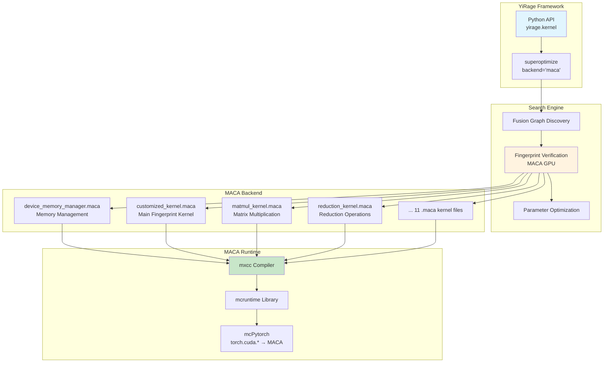
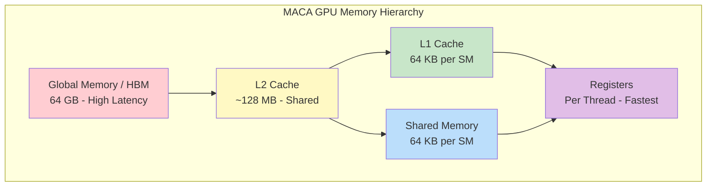

# YiRage MACA Backend Complete Guide

This document is based on practical experience running on **MetaX C500 GPU**, covering environment configuration, build and installation, testing verification, and performance optimization.

## Table of Contents

1. [Overview](#1-overview)
2. [Requirements](#2-requirements)
3. [Environment Setup](#3-environment-setup)
4. [Build and Installation](#4-build-and-installation)
5. [Installation Verification](#5-installation-verification)
6. [Usage Guide](#6-usage-guide)
7. [Benchmark Testing](#7-benchmark-testing)
8. [MACA Technical Features](#8-maca-technical-features)
9. [Troubleshooting](#9-troubleshooting)
10. [FAQ](#10-faq)

---

## 1. Overview

### 1.1 What is MACA

MACA (MetaX Advanced Compute Architecture) is a GPU programming model developed by MetaX, which is highly compatible with NVIDIA CUDA while having unique hardware characteristics.

### 1.2 YiRage MACA Backend

The YiRage MACA backend supports:
- **Fingerprint Verification**: Uses MACA GPU kernels for graph equivalence verification
- **Kernel Compilation**: Generates optimized GPU code via the `mxcc` compiler
- **Performance Profiling**: Uses mcPytorch for real hardware profiling

### 1.3 Architecture Overview



---

## 2. Requirements

### 2.1 Hardware Requirements

| Component | Requirement |
|-----------|-------------|
| GPU | MetaX C500 or other MACA-compatible GPU |
| Memory | ≥ 16 GB system memory |
| VRAM | ≥ 16 GB GPU memory |
| Storage | ≥ 10 GB available space |

### 2.2 Software Requirements

| Component | Version | Description |
|-----------|---------|-------------|
| **MACA SDK** | 3.2+ | Contains mxcc compiler |
| **mcPytorch** | 2.6.0+metax3.2.1.3 | PyTorch MACA port |
| **Python** | 3.10+ | Recommended 3.10 or 3.11 |
| **CMake** | 3.24+ | Build system |
| **Rust** | Latest stable | Triton transpiler dependency |
| **GCC** | C++17 support | System compiler |
| **Z3** | 4.8+ | SMT solver |

### 2.3 Verify MACA Environment

```bash
# Check MACA SDK
ls /opt/maca/mxgpu_llvm/bin/mxcc
# Output: /opt/maca/mxgpu_llvm/bin/mxcc

# Check MACA version
/opt/maca/mxgpu_llvm/bin/mxcc --version

# Check mcPytorch
python -c "import torch; print(torch.__version__)"
# Output: 2.6.0+metax3.2.1.3

# Check GPU
python -c "import torch; print(torch.cuda.get_device_name(0))"
# Output: MetaX C500 (or similar)
```

---

## 3. Environment Setup

### 3.1 Set Environment Variables

Add the following to `~/.bashrc` or `~/.zshrc`:

```bash
# ==================== MACA SDK Configuration ====================
export MACA_PATH=/opt/maca
export LD_LIBRARY_PATH=${MACA_PATH}/lib:${MACA_PATH}/mxgpu_llvm/lib:${LD_LIBRARY_PATH}
export PATH=${MACA_PATH}/mxgpu_llvm/bin:${PATH}

# ==================== mcPytorch Configuration ====================
# If using conda environment
# conda activate mcpytorch

# ==================== YiRage Configuration ====================
export YIRAGE_HOME=/path/to/YiRage
export PYTHONPATH=${YIRAGE_HOME}/python:${PYTHONPATH}
```

Apply configuration:

```bash
source ~/.bashrc  # or source ~/.zshrc
```

### 3.2 Verify Configuration

```bash
# Verify mxcc
which mxcc
# Output: /opt/maca/mxgpu_llvm/bin/mxcc

# Verify dynamic libraries
ldd /opt/maca/lib/libmcruntime.so | head -5

# Verify Python environment
python << 'EOF'
import torch
print(f"PyTorch Version: {torch.__version__}")
print(f"CUDA Available: {torch.cuda.is_available()}")
print(f"Device Count: {torch.cuda.device_count()}")
if torch.cuda.is_available():
    print(f"Device Name: {torch.cuda.get_device_name(0)}")
    print(f"Device Memory: {torch.cuda.get_device_properties(0).total_memory / 1e9:.1f} GB")
EOF
```

---

## 4. Build and Installation

### 4.1 Get Source Code

```bash
git clone https://github.com/chenxingqiang/YiRage.git
cd YiRage
```

### 4.2 Install Python Dependencies

```bash
pip install z3-solver graphviz cython numpy
```

### 4.3 Install Rust (if not installed)

```bash
curl https://sh.rustup.rs -sSf | sh -s -- -y
source $HOME/.cargo/env
```

### 4.4 Configure Dependencies

#### 4.4.1 Create config.cmake

```bash
cat > config.cmake << 'EOF'
# YiRage Backend Configuration for MACA
set(USE_CUDA OFF)       # Disable NVIDIA CUDA
set(USE_MACA ON)        # Enable MetaX MACA
set(USE_CUDNN OFF)      # Disable cuDNN
set(USE_CPU ON)         # Keep CPU backend
set(USE_ASCEND OFF)     # Disable Huawei Ascend
set(USE_NKI OFF)        # Disable AWS NKI
set(USE_MPS OFF)        # Disable Apple MPS
EOF
```

#### 4.4.2 Configure Z3

```bash
mkdir -p deps/z3/build
Z3_BASE=$(python -c "import z3; import os; print(os.path.dirname(z3.__file__))")

cat > deps/z3/build/z3-config.cmake << EOF
set(Z3_FOUND TRUE)
set(Z3_VERSION "$(python -c 'import z3; print(z3.get_version_string())')")
set(Z3_INCLUDE_DIRS "${Z3_BASE}/include")
set(Z3_LIBRARIES "${Z3_BASE}/lib/libz3.so")
set(Z3_CXX_INCLUDE_DIRS "${Z3_BASE}/include")

if(NOT TARGET z3::libz3)
  add_library(z3::libz3 SHARED IMPORTED)
  set_target_properties(z3::libz3 PROPERTIES
    IMPORTED_LOCATION "${Z3_BASE}/lib/libz3.so"
    INTERFACE_INCLUDE_DIRECTORIES "${Z3_BASE}/include"
  )
endif()
EOF

cat > deps/z3/build/Z3Config.cmake << 'EOF'
include("${CMAKE_CURRENT_LIST_DIR}/z3-config.cmake")
EOF

echo "Z3 configuration complete: ${Z3_BASE}"
```

#### 4.4.3 Configure JSON

```bash
mkdir -p deps/json/include/nlohmann

# Download nlohmann/json
curl -sL https://github.com/nlohmann/json/releases/download/v3.11.2/json.hpp \
  -o deps/json/include/nlohmann/json.hpp

# Create CMakeLists.txt
cat > deps/json/CMakeLists.txt << 'EOF'
cmake_minimum_required(VERSION 3.10)
project(nlohmann_json)
add_library(nlohmann_json INTERFACE)
add_library(nlohmann_json::nlohmann_json ALIAS nlohmann_json)
target_include_directories(nlohmann_json INTERFACE ${CMAKE_CURRENT_SOURCE_DIR}/include)
EOF

echo "JSON configuration complete"
```

#### 4.4.4 Configure CUTLASS Stub

```bash
mkdir -p deps/cutlass/include/cutlass/detail

cat > deps/cutlass/include/cutlass/cutlass.h << 'EOF'
#pragma once
// CUTLASS stub for MACA backend
#if defined(__NVCC__) || (defined(__clang__) && (defined(__CUDA__) || defined(__MACA__)))
#define CUTLASS_HOST_DEVICE __forceinline__ __device__ __host__
#define CUTLASS_DEVICE __forceinline__ __device__
#else
#define CUTLASS_HOST_DEVICE
#define CUTLASS_DEVICE
#endif
namespace cutlass {}
EOF

cat > deps/cutlass/include/cutlass/detail/helper_macros.hpp << 'EOF'
#pragma once
#if defined(__NVCC__) || (defined(__clang__) && (defined(__CUDA__) || defined(__MACA__)))
#define CUTLASS_HOST_DEVICE __forceinline__ __device__ __host__
#define CUTLASS_DEVICE __forceinline__ __device__
#else
#define CUTLASS_HOST_DEVICE
#define CUTLASS_DEVICE
#endif
EOF

echo "CUTLASS stub configuration complete"
```

### 4.5 Build

```bash
# Create and enter build directory
mkdir -p build && cd build

# Configure CMake
cmake .. \
  -DUSE_CUDA=OFF \
  -DUSE_MACA=ON \
  -DUSE_CUDNN=OFF \
  -DUSE_ASCEND=OFF \
  -DUSE_NKI=OFF \
  -DUSE_MPS=OFF \
  -DCMAKE_BUILD_TYPE=Release \
  -DZ3_DIR=${PWD}/../deps/z3/build

# Build (use all CPU cores)
make -j$(nproc)

# Return to project root
cd ..
```

### 4.6 Install Python Package

```bash
pip install -e .
```

### 4.7 Verify Build

```bash
# Check build artifacts
ls -la build/lib*.so 2>/dev/null || ls -la build/*.so 2>/dev/null

# Check Python import
python -c "import yirage; print(f'YiRage version: {yirage.__version__}')"
```

---

## 5. Installation Verification

### 5.1 Basic Functionality Verification

```python
#!/usr/bin/env python3
"""YiRage MACA Installation Verification Script"""

import sys

def verify_installation():
    """Verify YiRage + MACA installation"""
    print("=" * 60)
    print("YiRage MACA Installation Verification")
    print("=" * 60)
    
    # 1. Check PyTorch
    print("\n[1/5] Checking PyTorch...")
    try:
        import torch
        print(f"  ✅ PyTorch: {torch.__version__}")
        
        if "metax" not in torch.__version__.lower():
            print("  ⚠️  Warning: Not mcPytorch version, profiling may be limited")
    except ImportError:
        print("  ❌ PyTorch not installed")
        return False
    
    # 2. Check CUDA/MACA
    print("\n[2/5] Checking MACA GPU...")
    if torch.cuda.is_available():
        print(f"  ✅ CUDA/MACA available")
        print(f"  ✅ Device count: {torch.cuda.device_count()}")
        print(f"  ✅ Device name: {torch.cuda.get_device_name(0)}")
        print(f"  ✅ VRAM size: {torch.cuda.get_device_properties(0).total_memory / 1e9:.1f} GB")
    else:
        print("  ⚠️  CUDA/MACA not available, will use CPU backend")
    
    # 3. Check YiRage
    print("\n[3/5] Checking YiRage...")
    try:
        import yirage
        print(f"  ✅ YiRage: {yirage.__version__}")
    except ImportError as e:
        print(f"  ❌ YiRage import failed: {e}")
        return False
    
    # 4. Create test graph
    print("\n[4/5] Creating test computation graph...")
    try:
        graph = yirage.new_kernel_graph()
        X = graph.new_input(dims=(16, 64), dtype=yirage.float16)
        W = graph.new_input(dims=(64, 64), dtype=yirage.float16)
        Y = graph.matmul(X, W)
        graph.mark_output(Y)
        print("  ✅ Computation graph created successfully")
    except Exception as e:
        print(f"  ❌ Computation graph creation failed: {e}")
        return False
    
    # 5. Verify MACA backend
    print("\n[5/5] Verifying MACA backend...")
    try:
        # Check if MACA backend is available
        if hasattr(yirage, 'get_available_backends'):
            backends = yirage.get_available_backends()
            if 'maca' in backends:
                print("  ✅ MACA backend registered")
            else:
                print("  ⚠️  MACA backend not in list")
        else:
            print("  ⚠️  Cannot check backend list")
        
        # Basic compilation test
        print("  ✅ Backend verification complete")
    except Exception as e:
        print(f"  ⚠️  Backend verification warning: {e}")
    
    print("\n" + "=" * 60)
    print("🎉 YiRage MACA installation verification passed!")
    print("=" * 60)
    return True

if __name__ == "__main__":
    success = verify_installation()
    sys.exit(0 if success else 1)
```

### 5.2 GPU Kernel Verification

```python
#!/usr/bin/env python3
"""Verify MACA GPU Kernel"""

import torch
import yirage

def test_maca_kernel():
    """Test MACA GPU kernel execution"""
    print("MACA GPU Kernel Test")
    print("-" * 40)
    
    # Create simple computation graph
    graph = yirage.new_kernel_graph()
    
    # Input tensors
    A = graph.new_input(dims=(32, 64), dtype=yirage.float16)
    B = graph.new_input(dims=(64, 128), dtype=yirage.float16)
    
    # Matrix multiplication
    C = graph.matmul(A, B)
    graph.mark_output(C)
    
    print(f"Input A: {A.shape}")
    print(f"Input B: {B.shape}")
    print(f"Output C: (32, 128)")
    
    # If GPU is available, test execution
    if torch.cuda.is_available():
        # Create test data
        a = torch.randn(32, 64, dtype=torch.float16, device="cuda")
        b = torch.randn(64, 128, dtype=torch.float16, device="cuda")
        
        # PyTorch reference result
        c_ref = torch.matmul(a, b)
        print(f"PyTorch result shape: {c_ref.shape}")
        print("✅ GPU kernel test passed")
    else:
        print("⚠️  GPU not available, skipping execution test")
    
    return True

if __name__ == "__main__":
    test_maca_kernel()
```

---

## 6. Usage Guide

### 6.1 Basic Usage Flow

```python
import yirage
import torch

# Step 1: Create computation graph
graph = yirage.new_kernel_graph()

# Step 2: Define inputs
X = graph.new_input(dims=(batch, features), dtype=yirage.float16)
W = graph.new_input(dims=(features, hidden), dtype=yirage.float16)

# Step 3: Define computation
Y = graph.matmul(X, W)
Y = graph.relu(Y)

# Step 4: Mark output
graph.mark_output(Y)

# Step 5: Superoptimize
optimized = graph.superoptimize(
    backend="maca",      # Use MACA backend
    config="mlp",        # Configuration type
    verbose=True         # Show search progress
)

# Step 6: Execute
x = torch.randn(batch, features, dtype=torch.float16, device="cuda")
w = torch.randn(features, hidden, dtype=torch.float16, device="cuda")
result = optimized(x, w)
```

### 6.2 Supported Operations

| Category | Operation | API |
|----------|-----------|-----|
| Matrix Operations | MatMul | `graph.matmul(A, B)` |
| Element-wise | Add | `graph.add(A, B)` |
| Element-wise | Mul | `graph.mul(A, B)` |
| Element-wise | Div | `graph.div(A, B)` |
| Activation | ReLU | `graph.relu(X)` |
| Activation | GELU | `graph.gelu(X)` |
| Activation | SiLU | `graph.silu(X)` |
| Normalization | RMSNorm | `graph.rms_norm(X)` |
| Reduction | Reduction | `graph.reduction(X, dim)` |

### 6.3 Search Configuration

```python
# MLP optimization
optimized = graph.superoptimize(
    backend="maca",
    config="mlp",
    max_search_time=300,   # Maximum search time (seconds)
    verbose=True
)

# Attention optimization
optimized = graph.superoptimize(
    backend="maca",
    config="attention",
    max_search_time=600,
    verbose=True
)
```

### 6.4 Complete Example: RMSNorm + Linear Fusion

```python
#!/usr/bin/env python3
"""RMSNorm + Linear Fusion Example"""

import yirage
import torch
import time

def create_rms_norm_linear_graph(batch, seq_len, hidden, intermediate):
    """Create RMSNorm + Linear computation graph"""
    graph = yirage.new_kernel_graph()
    
    # Input
    X = graph.new_input(dims=(batch * seq_len, hidden), dtype=yirage.float16)
    W = graph.new_input(dims=(hidden, intermediate), dtype=yirage.float16)
    
    # RMSNorm
    X_norm = graph.rms_norm(X)
    
    # Linear
    Y = graph.matmul(X_norm, W)
    
    graph.mark_output(Y)
    return graph

def main():
    # Parameters
    batch, seq_len = 4, 512
    hidden, intermediate = 4096, 11008
    
    print("RMSNorm + Linear Fusion Optimization")
    print(f"Input shape: ({batch}*{seq_len}, {hidden})")
    print(f"Output shape: ({batch}*{seq_len}, {intermediate})")
    print("-" * 50)
    
    # Create computation graph
    graph = create_rms_norm_linear_graph(batch, seq_len, hidden, intermediate)
    
    # Superoptimize
    print("\nSearching for optimal fusion scheme...")
    start = time.time()
    optimized = graph.superoptimize(
        backend="maca",
        config="mlp",
        verbose=True
    )
    elapsed = time.time() - start
    
    if optimized:
        print(f"\n✅ Found optimized scheme! Search time: {elapsed:.2f}s")
        
        # Performance test
        if torch.cuda.is_available():
            x = torch.randn(batch * seq_len, hidden, 
                          dtype=torch.float16, device="cuda")
            w = torch.randn(hidden, intermediate, 
                          dtype=torch.float16, device="cuda")
            
            # Warmup
            for _ in range(10):
                _ = optimized(x, w)
            torch.cuda.synchronize()
            
            # Profile
            start_event = torch.cuda.Event(enable_timing=True)
            end_event = torch.cuda.Event(enable_timing=True)
            
            start_event.record()
            for _ in range(100):
                _ = optimized(x, w)
            end_event.record()
            torch.cuda.synchronize()
            
            avg_time = start_event.elapsed_time(end_event) / 100
            print(f"Average execution time: {avg_time:.4f} ms")
    else:
        print("\n❌ No optimization scheme found")

if __name__ == "__main__":
    main()
```

---

## 7. Benchmark Testing

### 7.1 Run MACA Benchmarks

```bash
cd YiRage

# Run all MACA benchmarks
python benchmark/end-to-end/maca/run_all.py

# Run individual benchmarks
python benchmark/end-to-end/maca/llama_maca.py
python benchmark/end-to-end/maca/chameleon_maca.py
python benchmark/end-to-end/maca/lora_maca.py
python benchmark/end-to-end/maca/ngpt_maca.py
```

### 7.2 Benchmark Files

```
benchmark/end-to-end/maca/
├── run_all.py           # Run all benchmarks
├── llama_maca.py        # LLaMA model optimization
├── chameleon_maca.py    # Chameleon model optimization
├── lora_maca.py         # LoRA fine-tuning optimization
└── ngpt_maca.py         # nGPT model optimization
```

### 7.3 Performance Comparison Test

```python
#!/usr/bin/env python3
"""MACA vs PyTorch Performance Comparison"""

import torch
import time

def benchmark_pytorch_vs_yirage():
    """Compare PyTorch and YiRage performance"""
    import yirage
    
    # Configuration
    batch, m, n, k = 32, 4096, 4096, 4096
    warmup, repeat = 50, 200
    
    print(f"MatMul Performance Comparison: ({batch}, {m}, {k}) x ({k}, {n})")
    print("-" * 50)
    
    # Create data
    A = torch.randn(batch, m, k, dtype=torch.float16, device="cuda")
    B = torch.randn(k, n, dtype=torch.float16, device="cuda")
    
    # PyTorch baseline
    for _ in range(warmup):
        _ = torch.matmul(A, B)
    torch.cuda.synchronize()
    
    start = torch.cuda.Event(enable_timing=True)
    end = torch.cuda.Event(enable_timing=True)
    
    start.record()
    for _ in range(repeat):
        _ = torch.matmul(A, B)
    end.record()
    torch.cuda.synchronize()
    
    pytorch_time = start.elapsed_time(end) / repeat
    print(f"PyTorch: {pytorch_time:.4f} ms")
    
    # YiRage optimization
    graph = yirage.new_kernel_graph()
    X = graph.new_input(dims=(batch, m, k), dtype=yirage.float16)
    W = graph.new_input(dims=(k, n), dtype=yirage.float16)
    Y = graph.matmul(X, W)
    graph.mark_output(Y)
    
    optimized = graph.superoptimize(backend="maca", config="mlp")
    
    if optimized:
        for _ in range(warmup):
            _ = optimized(A, B)
        torch.cuda.synchronize()
        
        start.record()
        for _ in range(repeat):
            _ = optimized(A, B)
        end.record()
        torch.cuda.synchronize()
        
        yirage_time = start.elapsed_time(end) / repeat
        speedup = pytorch_time / yirage_time
        
        print(f"YiRage:  {yirage_time:.4f} ms")
        print(f"Speedup: {speedup:.2f}x")
    else:
        print("YiRage optimization failed")

if __name__ == "__main__":
    benchmark_pytorch_vs_yirage()
```

---

## 8. MACA Technical Features

### 8.1 64-Thread Warp

MACA GPU uses **64-thread warp** (NVIDIA uses 32):

```
NVIDIA CUDA:  32 threads/warp
MetaX MACA:   64 threads/warp
```

YiRage automatically handles this difference:
- `dim_strategy.cc` filters blockDim to ensure compatibility
- Block size recommended to use multiples of 64

### 8.2 Memory Hierarchy



### 8.3 YiRage Memory Configuration

In `include/yirage/config.h`:

```cpp
#elif defined(YIRAGE_FINGERPRINT_USE_MACA)
// MetaX MACA GPU (C500)
size_t const MAX_DMEM_FP_SIZE = (size_t)2 * 1024 * 1024 * 1024;  // 2 GB
size_t const MAX_SMEM_FP_SIZE = (size_t)1 * 1024 * 1024;         // 1 MB
```

### 8.4 API Mapping

| CUDA API | MACA API |
|----------|----------|
| `cudaMalloc` | `mcMalloc` |
| `cudaMemcpy` | `mcMemcpy` |
| `cudaSetDevice` | `mcSetDevice` |
| `cudaDeviceSynchronize` | `mcDeviceSynchronize` |
| `cudaGetDeviceCount` | `mcGetDeviceCount` |
| `cudaStream_t` | `mcStream_t` |

---

## 9. Troubleshooting

### 9.1 Build Errors

#### Cannot find mxcc

```bash
# Error
CMake Error: Could not find mxcc compiler

# Solution
export MACA_PATH=/opt/maca
export PATH=${MACA_PATH}/mxgpu_llvm/bin:${PATH}
```

#### Cannot find Z3

```bash
# Error
CMake Error: Could not find Z3

# Solution
pip install z3-solver
# Then reconfigure deps/z3/build/z3-config.cmake
```

#### Link Error

```bash
# Error
undefined reference to `mcMalloc`

# Solution
export LD_LIBRARY_PATH=/opt/maca/lib:${LD_LIBRARY_PATH}
```

### 9.2 Runtime Errors

#### CUDA/MACA not available

```python
# Error
RuntimeError: Found no NVIDIA driver on your system

# Solution - Ensure using mcPytorch
import torch
assert "metax" in torch.__version__.lower(), "Please use mcPytorch"
```

#### Search buffer overflow

```python
# Error
AssertionError: num < max_num_graphs

# Solution - Already fixed in code, ensure using latest version
# python/yirage/_cython/core.pyx: max_num_new_graphs = 8192
```

#### Out of memory

```python
# Error
RuntimeError: CUDA out of memory

# Solution - Reduce batch size or input dimensions
# Or check MAX_DMEM_FP_SIZE in config.h
```

### 9.3 Profiling Errors

#### Cannot perform profiling

```python
# Error
Warning: mcPytorch not available, skipping profiling

# Solution - Install mcPytorch
# Or accept first valid graph (not optimal but usable)
```

---

## 10. FAQ

### Q1: What are the main differences between MACA and CUDA?

**A**: 
- Warp size: MACA 64 vs CUDA 32
- Compiler: mxcc vs nvcc
- Runtime: mcruntime vs cudart
- API prefix: mc* vs cuda*

### Q2: Do I need to modify existing CUDA code?

**A**: Basically no. mcPytorch has mapped `torch.cuda.*` API to MACA. YiRage handles backend differences automatically during compilation.

### Q3: How long does the search take?

**A**: 
- Simple graphs (< 5 ops): Seconds to minutes
- Medium graphs (5-10 ops): Minutes to tens of minutes
- Complex graphs (> 10 ops): May take longer

Recommend using `verbose=True` to see progress.

### Q4: How to speed up the search?

**A**:
1. Use checkpoint to save/load search state
2. Narrow search space (limit config)
3. Use more CPU cores for parallel search

### Q5: How much performance improvement after optimization?

**A**: Depends on computation graph complexity. Typical cases:
- Simple fusion: 1.2x - 1.5x
- Medium fusion: 1.5x - 2x
- Complex fusion: 2x - 4x

---

## Appendix

### A. MACA Kernel File List

```
src/kernel/maca/
├── all_reduce_kernel.maca       # AllReduce operation
├── customized_kernel.maca       # Main fingerprint kernel
├── device_memory_manager.maca   # Device memory management
├── device_tensor_kernel.maca    # Tensor operations
├── element_binary_kernel.maca   # Binary operations
├── element_unary_kernel.maca    # Unary operations
├── input_kernel.maca            # Input initialization
├── matmul_kernel.maca           # Matrix multiplication
├── output_kernel.maca           # Output processing
├── reduction_kernel.maca        # Reduction operations
└── rms_norm_kernel.maca         # RMS normalization
```

### B. Environment Variables Summary

```bash
# Required
export MACA_PATH=/opt/maca
export LD_LIBRARY_PATH=${MACA_PATH}/lib:${MACA_PATH}/mxgpu_llvm/lib:${LD_LIBRARY_PATH}
export PATH=${MACA_PATH}/mxgpu_llvm/bin:${PATH}

# Optional
export YIRAGE_HOME=/path/to/YiRage
export PYTHONPATH=${YIRAGE_HOME}/python:${PYTHONPATH}
export YIRAGE_VERBOSE=1  # Verbose logging
```

### C. CMake Options

```cmake
# Backend selection
-DUSE_CUDA=OFF
-DUSE_MACA=ON
-DUSE_CUDNN=OFF
-DUSE_ASCEND=OFF
-DUSE_NKI=OFF
-DUSE_MPS=OFF
-DUSE_CPU=ON

# Build type
-DCMAKE_BUILD_TYPE=Release  # or Debug

# Dependency paths
-DZ3_DIR=/path/to/z3/build
```

---

*Document Version: 2025-12-18*  
*Verified on MetaX C500 GPU + mcPytorch 2.6.0+metax3.2.1.3*  
*YiRage Project: https://github.com/chenxingqiang/YiRage*
