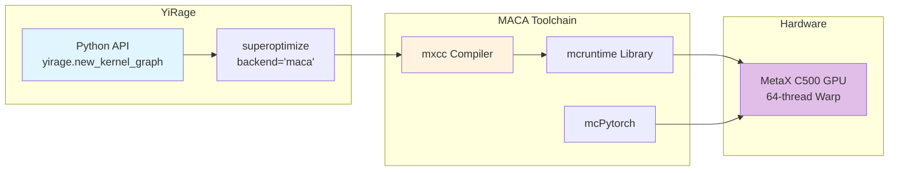

# YiRage MACA Backend Quick Start Guide

This document is based on practical experience running on **MetaX C500 GPU**.

## Architecture Overview



## 1. Requirements

### Hardware
- MetaX C500 GPU (or other MACA-compatible GPU)

### Software
- **MACA SDK**: `/opt/maca` (contains `mxcc` compiler)
- **mcPytorch**: PyTorch 2.6.0+metax3.2.1.3 or compatible version
- **Python**: 3.10+
- **CMake**: 3.24+
- **Rust**: Latest stable version
- **GCC**: C++17 support

## 2. Environment Setup

### 2.1 Set Environment Variables

```bash
# MACA SDK path
export MACA_PATH=/opt/maca
export LD_LIBRARY_PATH=${MACA_PATH}/lib:${MACA_PATH}/mxgpu_llvm/lib:${LD_LIBRARY_PATH}

# Optional: Add mxcc to PATH
export PATH=${MACA_PATH}/mxgpu_llvm/bin:$PATH
```

### 2.2 Verify mcPytorch

```python
import torch
print(f"PyTorch: {torch.__version__}")  # Should show 2.6.0+metax3.2.1.3
print(f"CUDA available: {torch.cuda.is_available()}")  # True
print(f"Device: {torch.cuda.get_device_name(0)}")  # MetaX C500
```

### 2.3 Verify MACA Compiler

```bash
which mxcc
# Should output: /opt/maca/mxgpu_llvm/bin/mxcc
```

## 3. Build YiRage

### 3.1 Install Dependencies

```bash
# Python dependencies
pip install z3-solver graphviz cython

# Rust (if not installed)
curl https://sh.rustup.rs -sSf | sh -s -- -y
source $HOME/.cargo/env

# CMake (if version is too old)
pip install "cmake>=3.24"
```

### 3.2 Configure config.cmake

Create `config.cmake` file:

```cmake
set(USE_CUDA OFF)
set(USE_MACA ON)
set(USE_CUDNN OFF)
set(USE_CPU ON)
set(USE_ASCEND OFF)
set(USE_NKI OFF)
set(USE_MPS OFF)
```

### 3.3 Setup Dependencies

```bash
cd YiRage

# Z3 configuration (using pip-installed z3)
mkdir -p deps/z3/build
Z3_BASE=$(python -c "import z3; import os; print(os.path.dirname(z3.__file__))")

cat > deps/z3/build/z3-config.cmake << EOF
set(Z3_FOUND TRUE)
set(Z3_VERSION "4.15.4")
set(Z3_INCLUDE_DIRS "${Z3_BASE}/include")
set(Z3_LIBRARIES "${Z3_BASE}/lib/libz3.so")
set(Z3_CXX_INCLUDE_DIRS "${Z3_BASE}/include")

if(NOT TARGET z3::libz3)
  add_library(z3::libz3 SHARED IMPORTED)
  set_target_properties(z3::libz3 PROPERTIES
    IMPORTED_LOCATION "${Z3_BASE}/lib/libz3.so"
    INTERFACE_INCLUDE_DIRECTORIES "${Z3_BASE}/include"
  )
endif()
EOF

cat > deps/z3/build/Z3Config.cmake << EOF
include("\${CMAKE_CURRENT_LIST_DIR}/z3-config.cmake")
EOF

# JSON configuration (if deps/json is empty)
mkdir -p deps/json/include/nlohmann
curl -sL https://github.com/nlohmann/json/releases/download/v3.11.2/json.hpp \
  -o deps/json/include/nlohmann/json.hpp

cat > deps/json/CMakeLists.txt << EOF
cmake_minimum_required(VERSION 3.10)
project(nlohmann_json)
add_library(nlohmann_json INTERFACE)
add_library(nlohmann_json::nlohmann_json ALIAS nlohmann_json)
target_include_directories(nlohmann_json INTERFACE \${CMAKE_CURRENT_SOURCE_DIR}/include)
EOF

# CUTLASS stub (if deps/cutlass is empty)
mkdir -p deps/cutlass/include/cutlass/detail
cat > deps/cutlass/include/cutlass/cutlass.h << 'EOF'
#pragma once
#if defined(__NVCC__) || (defined(__clang__) && (defined(__CUDA__) || defined(__MACA__)))
#define CUTLASS_HOST_DEVICE __forceinline__ __device__ __host__
#define CUTLASS_DEVICE __forceinline__ __device__
#else
#define CUTLASS_HOST_DEVICE
#define CUTLASS_DEVICE
#endif
namespace cutlass {}
EOF

cat > deps/cutlass/include/cutlass/detail/helper_macros.hpp << 'EOF'
#pragma once
#if defined(__NVCC__) || (defined(__clang__) && (defined(__CUDA__) || defined(__MACA__)))
#define CUTLASS_HOST_DEVICE __forceinline__ __device__ __host__
#define CUTLASS_DEVICE __forceinline__ __device__
#else
#define CUTLASS_HOST_DEVICE
#define CUTLASS_DEVICE
#endif
EOF
```

### 3.4 Build

```bash
mkdir -p build && cd build

cmake .. \
  -DUSE_CUDA=OFF \
  -DUSE_MACA=ON \
  -DUSE_CUDNN=OFF \
  -DUSE_ASCEND=OFF \
  -DUSE_NKI=OFF \
  -DUSE_MPS=OFF \
  -DCMAKE_BUILD_TYPE=Release \
  -DZ3_DIR=${PWD}/../deps/z3/build

make -j$(nproc)
```

### 3.5 Install Python Package

```bash
cd ..
pip install -e .
```

## 4. Verify Installation

```python
import yirage
import torch

print(f"YiRage: {yirage.__version__}")
print(f"Device: {torch.cuda.get_device_name(0)}")

# Create simple graph
graph = yirage.new_kernel_graph()
X = graph.new_input(dims=(16, 64), dtype=yirage.float16)
W = graph.new_input(dims=(64, 64), dtype=yirage.float16)
Y = graph.matmul(X, W)
graph.mark_output(Y)

print("✅ YiRage + MACA ready!")
```

## 5. Usage Examples

### 5.1 Basic Optimization

```python
import yirage
import torch

# Create computation graph
graph = yirage.new_kernel_graph()
X = graph.new_input(dims=(32, 64), dtype=yirage.float16)
W = graph.new_input(dims=(64, 64), dtype=yirage.float16)
B = graph.new_input(dims=(32, 64), dtype=yirage.float16)

# Define operation: Y = ReLU(X @ W + B)
XW = graph.matmul(X, W)
XWB = graph.add(XW, B)
Y = graph.relu(XWB)
graph.mark_output(Y)

# Search for optimal fusion scheme (first run takes a few minutes)
print("Searching for optimal fusion...")
optimized = graph.superoptimize(
    backend="maca",    # Use MACA backend
    config="mlp",      # MLP configuration
    verbose=False      # Set to True to see search progress
)

if optimized:
    print(f"Found optimized graph!")
    
    # Prepare inputs
    x = torch.randn(32, 64, dtype=torch.float16, device="cuda")
    w = torch.randn(64, 64, dtype=torch.float16, device="cuda")
    b = torch.randn(32, 64, dtype=torch.float16, device="cuda")
    
    # Run optimized graph
    result = optimized(x, w, b)
    print(f"Output shape: {result.shape}")
```

### 5.2 Performance Comparison

```python
import torch
import time

# PyTorch baseline
def pytorch_mlp(x, w, b):
    return torch.relu(torch.matmul(x, w) + b)

# Prepare data
x = torch.randn(64, 128, dtype=torch.float16, device="cuda")
w = torch.randn(128, 128, dtype=torch.float16, device="cuda")
b = torch.randn(64, 128, dtype=torch.float16, device="cuda")

# Use CUDA events for precise timing
def profile(func, warmup=20, repeat=100):
    for _ in range(warmup):
        func()
    torch.cuda.synchronize()
    
    start = torch.cuda.Event(enable_timing=True)
    end = torch.cuda.Event(enable_timing=True)
    
    start.record()
    for _ in range(repeat):
        func()
    end.record()
    torch.cuda.synchronize()
    
    return start.elapsed_time(end) / repeat

pytorch_time = profile(lambda: pytorch_mlp(x, w, b))
print(f"PyTorch time: {pytorch_time:.4f} ms")

# YiRage optimized (assuming optimized is already created)
# yirage_time = profile(lambda: optimized(x, w, b))
# print(f"YiRage time: {yirage_time:.4f} ms")
# print(f"Speedup: {pytorch_time / yirage_time:.2f}x")
```

## 6. MACA Features

### 6.1 64-Thread Warp

MACA GPU uses **64-thread warp** (NVIDIA uses 32). YiRage handles this automatically:

```python
# Search configuration automatically adapts to 64-thread warp
optimized = graph.superoptimize(backend="maca", ...)
```

### 6.2 Search Time

- **First search**: Takes a few minutes (searching fusion schemes)
- **Subsequent runs**: Can use checkpoint to accelerate
- **Search status**: Use `verbose=True` to see progress

### 6.3 Supported Operations

- MatMul (matrix multiplication)
- Add, Sub, Mul, Div (element-wise operations)
- ReLU, GELU, SiLU (activation functions)
- RMSNorm, LayerNorm (normalization)
- Reduction (reduction operations)

## 7. Troubleshooting

### 7.1 Cannot find mcruntime

```bash
export LD_LIBRARY_PATH=/opt/maca/lib:$LD_LIBRARY_PATH
```

### 7.2 mxcc compilation error

Ensure MACA SDK version is compatible with mcPytorch.

### 7.3 Search buffer overflow

If you see `num < max_num_graphs` error, the search found too many graphs. This usually doesn't affect results.

### 7.4 Profiling failure

Ensure using mcPytorch (not standard PyTorch):
```python
import torch
assert "metax" in torch.__version__.lower()
```

## 8. References

- [MACA SDK Documentation](https://www.metax-tech.com/)
- [YiRage GitHub](https://github.com/chenxingqiang/YiRage)
- [mcPytorch Documentation](https://www.metax-tech.com/pytorch)

---

*Document Version: 2025-12-18*  
*Verified on MetaX C500 GPU*
